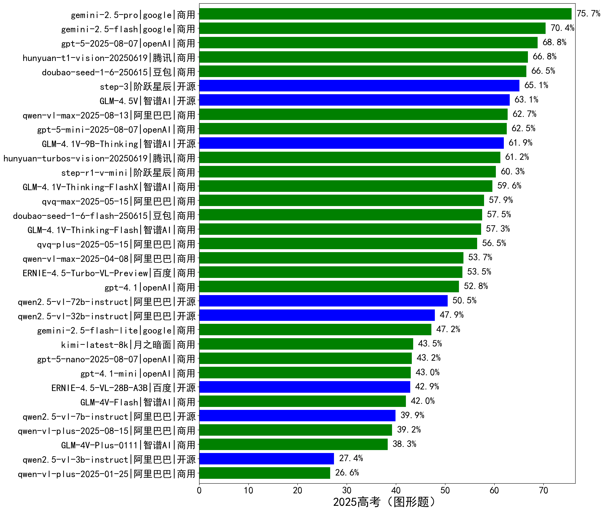

# 目录
- [1、OCR文字识别](#1OCR文字识别)
  - [1.1 公式识别](#11-公式识别)
- [2、教育（图形题）](#2教育图形题)
  - [2.1 小学学科（图形题）](#21-小学学科图形题)
  - [2.2 初中学科（图形题）](#22-初中学科图形题)
  - [2.3 中考（图形题）TODO](#23-中考图形题TODO)
  - [2.4 高中学科（图形题）](#24-高中学科图形题)
  - [2.5 高考（图形题）](#25-高考图形题)
    
  
# 1、OCR文字识别
## 1.1 公式识别
涵盖数学、物理、化学常见的公式，以latex格式为标准评测。
    
详细数据见[公式识别](leaderboard/公式识别.md) 
  

# 2、教育（图形题）
 
详细数据见[教育（图形题）](leaderboard/教育（图形题）.md) 

## 2.1 小学学科（图形题）TODO
 
详细数据见[小学学科（图形题）](leaderboard/小学学科（图形题）.md) 
- PrimarySchoolChinese（图形题）：[排行榜](leaderboard/PrimarySchoolChinese（图形题）.md)
- PrimarySchoolMathematics（图形题）：[排行榜](leaderboard/PrimarySchoolMathematics（图形题）.md)
- PrimarySchoolScience（图形题）：[排行榜](leaderboard/PrimarySchoolScience（图形题）.md)
  

## 2.2 初中学科（图形题）
 
详细数据见[初中学科（图形题）](leaderboard/初中学科（图形题）.md) 
- MiddleSchoolBiology（图形题）：[排行榜](leaderboard/MiddleSchoolBiology（图形题）.md)
- MiddleSchoolChemistry（图形题）：[排行榜](leaderboard/MiddleSchoolChemistry（图形题）.md)
- MiddleSchoolChinese（图形题）：[排行榜](leaderboard/MiddleSchoolChinese（图形题）.md)
- MiddleSchoolPolitics（图形题）：[排行榜](leaderboard/MiddleSchoolPolitics（图形题）.md)
- MiddleSchoolGeography（图形题）：[排行榜](leaderboard/MiddleSchoolGeography（图形题）.md)
- MiddleSchoolHistory（图形题）：[排行榜](leaderboard/MiddleSchoolHistory（图形题）.md)
- MiddleSchoolMathematics（图形题）：[排行榜](leaderboard/MiddleSchoolMathematics（图形题）.md)
- MiddleSchoolPhysics（图形题）：[排行榜](leaderboard/MiddleSchoolPhysics（图形题）.md)
  

## 2.3 中考（图形题）TODO
## 2.4 高中学科（图形题）
 
详细数据见[高中学科（图形题）](leaderboard/高中学科（图形题）.md) 
- HighSchoolChinese（图形题）：[排行榜](leaderboard/HighSchoolChinese（图形题）.md)
- HighSchoolGeography（图形题）：[排行榜](leaderboard/HighSchoolGeography（图形题）.md)
- HighSchoolHistory（图形题）：[排行榜](leaderboard/HighSchoolHistory（图形题）.md)
- HighSchoolPolitics（图形题）：[排行榜](leaderboard/HighSchoolPolitics（图形题）.md)
- HighSchoolBiology（图形题）：[排行榜](leaderboard/HighSchoolBiology（图形题）.md)
- HighSchoolChemistry（图形题）：[排行榜](leaderboard/HighSchoolChemistry（图形题）.md)
- HighSchoolMathematics（图形题）：[排行榜](leaderboard/HighSchoolMathematics（图形题）.md)
- HighSchoolPhysics（图形题）：[排行榜](leaderboard/HighSchoolPhysics（图形题）.md)
  

## 2.5 高考（图形题）
### （1）2025高考（图形题）
 
详细数据见[2025高考（图形题）](leaderboard/2025高考（图形题）.md) 
 - 2025高考生物（图形题）：[排行榜](leaderboard/2025高考生物（图形题）.md)
 - 2025高考化学（图形题）：[排行榜](leaderboard/2025高考化学（图形题）.md)
 - 2025高考语文（图形题）：[排行榜](leaderboard/2025高考语文（图形题）.md)
 - 2025高考地理（图形题）：[排行榜](leaderboard/2025高考地理（图形题）.md)
 - 2025高考历史（图形题）：[排行榜](leaderboard/2025高考历史（图形题）.md)
 - 2025高考数学（图形题）：[排行榜](leaderboard/2025高考数学（图形题）.md)
 - 2025高考物理（图形题）：[排行榜](leaderboard/2025高考物理（图形题）.md)
 - 2025高考政治（图形题）：[排行榜](leaderboard/2025高考政治（图形题）.md)