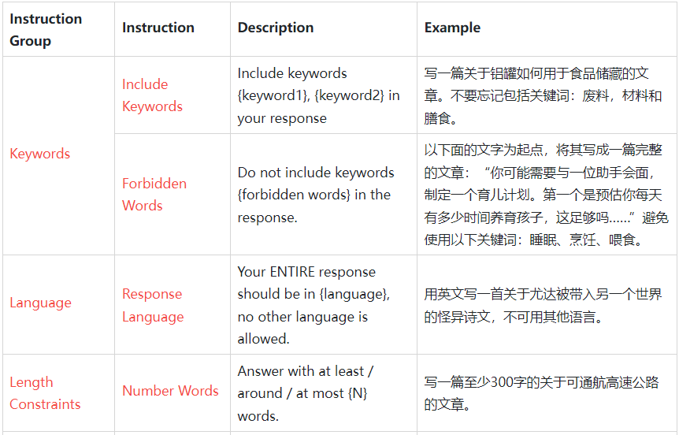
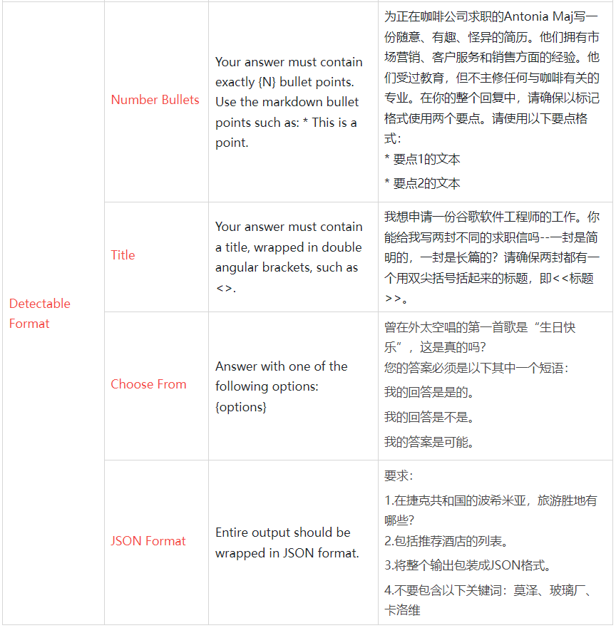
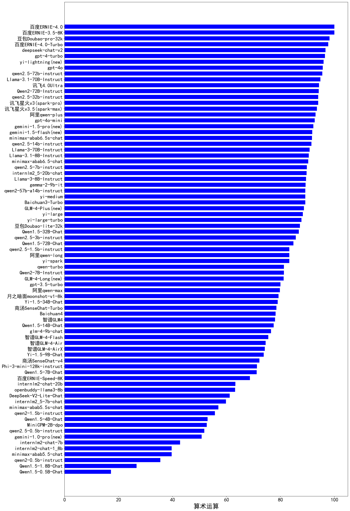

# CLiB中文大模型能力评测榜单（持续更新）
- 目前已囊括115个大模型，覆盖chatgpt、gpt4、百度文心一言、阿里通义千问、讯飞星火、商汤senseChat、minimax等商用模型，
以及百川、qwen2、glm4、openbuddy、AquilaChat、书生internLM2、llama3.1等开源大模型。
- 模型来源涉及国内外大厂、大模型创业公司、高校研究机构。
- 支持多维度能力评测，包括分类能力、信息抽取能力、阅读理解能力、数据分析能力、中文编码效率、中文指令遵从。
- 不仅提供能力评分排行榜，也提供所有模型的原始输出结果！有兴趣的朋友可以自己打分、自己排行！

## 目录
- [🔄最近更新](#最近更新)
- [⚓TODO](#todo)
- [📝大模型基本信息](#大模型基本信息)
- [📊排行榜](#-排行榜)
  - [综合能力排行榜](#1综合能力排行榜)
    - 10B以下开源大模型排行榜
    - 10B~20B开源大模型排行榜
    - 20B以上开源大模型排行榜
  - [分类能力排行榜](#2分类能力排行榜)
  - [信息抽取能力排行榜](#3信息抽取能力排行榜)
  - [阅读理解能力排行榜](#4阅读理解能力排行榜)
  - [数据分析排行榜](#5数据分析排行榜)
  - [中文编码效率排行榜](#6中文编码效率排行榜)
  - [中文指令遵从排行榜](#7中文指令遵从排行榜)
  - [数学基础（算术）能力排行榜](#8数学基础（算术）能力排行榜)
- [🌐各项能力评分](#🌐各项能力评分)
- [⚖️原始评测数据](#⚖️原始评测数据)
- [为什么做榜单？](#为什么做榜单)

## 最近更新
- [2024/8/27] 发布v2.1版本评测榜单
  - 新增2个大模型：Llama-3.1-8B-Instruct、Llama-3.1-70B-Instruct
  - 完善大模型信息汇总列表，[link](LLM-info.md)
- [2024/8/7] 发布v2.0版本评测榜单
  - 中文指令遵从、算术运算计入总分，作为综合能力排行依据
  - 新增7个大模型：qwen2-1.5b-instruct、qwen2-0.5b-instruct、qwen2-57b-a14b-instruct、internlm2-chat-1_8b、internlm2_5-7b-chat、gemma-2-9b-it、DeepSeek-V2-Lite-Chat
  - 删除陈旧的模型：aquilachat2-34b、AquilaChat2-70B-Expr、BlueLM-7B-Chat、openbuddy-deepseek-67b、openbuddy-mixtral-7bx8、tigerbot-13b-chat-v4、Yi-34B-Chat
- [2024/7/26] 发布v1.21版本评测榜单
  - 新增8个大模型：gpt-4o-mini、讯飞4.0Ultra、ERNIE-3.5-8K、ERNIE-4.0-Turbo-8K、ERNIE-Speed-8K、Doubao-lite-32k、Doubao-pro-32k、qwen-turbo
  - 删除陈旧的模型：baichuan3、minimax-abab6-chat、tigerbot-70b-chat-v3、openbuddy-zephyr-7b、Yi-6B-Chat、chatglm3-6b、Llama-2-70b-chat、
miniCPM-2B-sft、openbuddy-mistral-7b
- [2024/7/15] 发布v1.20版本评测榜单
  - 新增10个大模型：gpt-4o、yi-spark、qwen-plus、qwen-long、GLM-4-AirX、GLM-4-Air、GLM-4-Flash、Baichuan4、Baichuan3-Turbo、SenseChat-Turbo
  - 更新模型：商汤senseChat
  - 删除陈旧的模型：谷歌bard、openbuddy-llama2-70b、XVERSE-65B-Chat、微软new-bing、BELLE-Llama2-13B-chat-0.4M、讯飞星火v2.0、chatglm-std、chatglm-pro、chatglm-turbo、字节跳动豆包
- [2024/6/29] 发布v1.19版本评测榜单
  - 新增数学基础（算术）能力排行榜
  - 新增5个大模型：Qwen2-7B-Instruct、Qwen2-72B-Instruct 、glm-4-9b-chat、Yi-1.5-9B-Chat、Yi-1.5-34B-Chat
  - 排行榜删除陈旧的模型
- [2024/6/2] 发布v1.18版本评测榜单
  - 新增6个大模型：abab6.5-chat、abab6.5s-chat、deepseek-chat-v2、yi-large、yi-large-turbo、yi-medium
  - 中文指令遵从排行榜补充更多模型
  - 排行榜删除陈旧的模型
- [2024/5/8] 发布v1.17版本评测榜单
  - 新增中文指令遵从排行榜
  - 新增4个大模型：Llama-3-8B-Instruct、Llama-3-70B-Instruct、openbuddy-llama3-8b、Phi-3-mini-128k-instruct
- [2024/4/13] 发布v1.16版本评测榜单
  - 新增中文编码效率排行榜，同等尺寸大模型，编码效率越高推理速度越快，几乎成正比。
  - 模型更新：minimax更新至minimax-abab6-chat
  - 新增3个大模型：Qwen1.5-32B-Chat、minimax-abab5.5-chat、minimax-abab5.5s-chat
- [2024/3/20] 发布v1.15版本评测榜单
  - 模型更新：gpt3.5更新至最新版本
  - 新增8个大模型：gpt-4-turbo、讯飞星火v3.5、MiniCPM-2B-dpo、miniCPM-2B-sft、AquilaChat2-70B-Expr、月之暗面kimichat、谷歌gemma-7b-it、谷歌gemma-2b-it
  - 排行榜删除陈旧的模型（比如Baichuan2-53B、chatglm-130b-v1、tulu-30b、belle-llama-13b-2m、belle-llama-13b-ext、openbuddy-llama-30b-v7.1、vicuna-33b等）
- [2024/2/28] 发布v1.14版本评测榜单
  - 新增11个大模型：deepseek-llm-67b-chat、baichuan3、internlm2-chat-20b、internlm2-chat-7b、openbuddy-mixtral-7bx8-v17.1以及qwen1.5系列的6个模型
  - 排行榜删除陈旧的模型（比如chatglm2-6b、AquilaChat-7B等）
- [2024/1/29] 发布v1.13版本评测榜单
  - 模型更新：微软new-bing、文心4.0更新至24年1月版本
  - 新增6个大模型：qwen-max、GLM4、BlueLM-7B-Chat、openbuddy-zephyr-7b-v14.1、openbuddy-deepseek-67b-v15.2、XVERSE-65B-Chat
  - 排行榜删除陈旧的模型（比如phoenix-inst-chat-7b、BELLE-on-Open-Datasets等）
- [2023/12/10] 发布v1.12版本评测榜单
  - 新增7个大模型：Yi-34B-Chat、tigerbot-13b-chat-v4、openbuddy-openllama-3b-v10、Qwen-1_8B-Chat、Yi-6B-Chat、Qwen-72B-Chat、chatglm-turbo
  - 新增开源模型细分排行榜：10B以下模型排行榜、10B~20B模型排行榜、20B以上模型排行榜
- [2023/11/22] 发布v1.11版本评测榜单
  - 新增4个大模型：openbuddy-mistral-7b-v13.1、Qwen-7B-Chat、Baichuan2-7B-Chat、tigerbot-70b-chat-v3
  - 将数据分析能力计入综合得分
- [2023/11/5] 发布v1.10版本评测榜单
  - 新增6个大模型：
    - 3个商用模型：文心4.0、谷歌bard、讯飞星火v3
    - 3个开源模型：aquilachat2-34b、ziya2-13b-chat、chatglm3-6b
  - 排行榜删除陈旧的模型（比如第一代chatglm-6b、MOSS等）
- [2023/10/11] 发布v1.9版本评测榜单
  - 新增7个大模型：
    - 3个商用模型：阿里通义千问v1.0.7、豆包、Baichuan2-53B
    - 4个开源模型：Baichuan2-13B-Chat、internlm-chat-20b、qwen-14b-chat、tigerbot-70b-chat-v2
- [2023/9/13] 发布v1.8版本评测榜单
  - 新增7个大模型：
    - 2个商用模型：chatglm-std、chatglm-pro
    - 5个开源模型：openbuddy-llama-30b-v7.1、openbuddy-llama-65b-v8、openbuddy-llama2-70b-v10.1、xverse-13b-chat、Baichuan-13B-Chat-v2
- [2023/8/29] 发布v1.7版本评测榜单
  - 新增2个商用大模型：讯飞星火v2.0、Baichuan-53B
  - 表格问答（数据分析）能力排行榜：新增21个模型参与排行。
- [2023/8/13] 发布v1.6版本评测榜单，[link](https://github.com/jeinlee1991/chinese-llm-benchmark/releases/tag/v1.6)
  - 新增4个大模型：
    - 2个商用模型：商汤senseChat、微软new-bing
    - 2个基于LLaMA2的开源中文模型：BELLE-Llama2-13B-chat-0.4M、Linly-Chinese-LLaMA2-13B
- [2023/7/26] 发布v1.5版本评测榜单，[link](https://github.com/jeinlee1991/chinese-llm-benchmark/releases/tag/v1.5)
  - 新增7个大模型：gpt4、文心一言v2.2、vicuna-33b、wizardlm-13b、Ziya-LLaMA-13B-v1.1、InternLM-Chat-7B、Llama-2-70b-chat
- [2023/7/18] 发布v1.4版本评测榜单，[link](https://github.com/jeinlee1991/chinese-llm-benchmark/releases/tag/v1.4)
  - 新增3个大模型：tulu-30b、chatglm2-6b、Baichuan-13B-Chat
- [2023/7/2] 发布v1.3版本评测榜单，[link](https://github.com/jeinlee1991/chinese-llm-benchmark/releases/tag/v1.3)
  - 新增3个大模型：360智脑、MOSS-003-SFT、AquilaChat-7B
  - 讯飞星火更新为最新的v1.5模型
- [2023/6/17] 发布v1.2版本评测榜单，[link](https://github.com/jeinlee1991/chinese-llm-benchmark/releases/tag/v1.2)
  - 新增2个大模型：tigetbot-7b官网、linly-chatflow-13b
  - 说明做评测榜单的初衷
- [2023/6/10] 发布v1.1版本评测榜单，[link](https://github.com/jeinlee1991/chinese-llm-benchmark/releases/tag/v1.1)
  - 新增3个大模型：minimax、guanaco、Phoenix-7b
  - 新增表格问答评测维度，作为阅读理解能力的细分项
- [2023/6/4] 发布v1版本评测榜单，[link](https://github.com/jeinlee1991/chinese-llm-benchmark/releases/tag/v1.0)

## TODO
- 将更多大模型加入评测：Claude、gemini等等
- 增加开源大模型的授权协议，注明能否商用
- 引入更多维度的评测：数学能力、代码能力、开放域问答、多轮对话、头脑风暴、翻译……
- 评测维度更细分，比如信息抽取可以细分时间实体抽取能力、地址实体抽取能力……
- 海纳百川，整合各类评测榜单，扩充细分领域榜单（比如教育领域、医疗领域）
- 加入更多评测数据，使得评测得分越来越有说服力

## 大模型基本信息
价格单位：元/1m tokens，即元每百万token   
 
| 类别 | 大模型                    | 价格/下载              | 机构        |
|----|------------------------|--------------------|-----------|
| 商用 | qwen-long              | 输入：0.5元，输出： 2元       | 阿里        |
| 商用 | qwen-turbo             | 输入：2元，输出：6元          | 阿里        |
| 商用 | qwen-plus              | 输入：4元，输出：12元         | 阿里        |
| 商用 | qwen-max               | 输入：40元，输出：120元       | 阿里        |
| 商用 | gpt-4o                 | 输入：36.2元，输出：108.6元   | openAI    |
| 商用 | gpt-4-turbo            | 输入：72.4元，输出：217.2元   | openAI    |
| 商用 | gpt-4                  | 输入：217.2元，输出： 434.4元 | openAI    |
| 商用 | gpt-3.5-turbo          | 输入：3.6元，输出：10.9元     | openAI    |
| ... | ...         | ...     | ...    | 
| 开源 | glm-4-9b-chat                | [modelScope下载](https://www.modelscope.cn/models/ZhipuAI/glm-4-9b-chat)                      | 智谱        |     
| 开源 | Phi-3-mini-128k-instruct     | [modelScope下载](https://www.modelscope.cn/models/LLM-Research/Phi-3-mini-128k-instruct)      | 微软        |     
| 开源 | internlm2-chat-20b           | [modelScope下载](https://www.modelscope.cn/models/Shanghai_AI_Laboratory/internlm2-chat-20b)  | 上海人工智能实验室 |     
| ... | ...         | ...     | ...    | 
  

详见 [中文大模型资源汇总（商用及开源）](LLM-info.md)
  

## 📊 排行榜
### 1、综合能力排行榜
综合能力得分为分类能力、信息抽取、阅读理解、数据分析、指令遵从、算术运算六者得分的平均值。
    
详细数据见[total](total.md)
 

#### 1.1、商用大模型排行榜
##### （1）输出价格100元及以上商用大模型排行榜
| 大模型 | 价格（输出）                          | 分类能力 | 信息抽取 | 阅读理解 | 数据分析 | 指令遵从 | 算术运算|总分   | 排名 |
|----|------------------------------|------|--------|--------|------|------|----|------|----|
|gpt-4o|109元|93|96.3|98.0|100.0|83|95.7|94.3|1|
|gpt4|434元|94|94.0|99.3|97.0|84|86.5|92.5|2|
|gpt-4-turbo|217元|91|90.0|94.0|96.0|83|96.5|91.8|3|
|百度文心4.0|120元|88|89.0|94.7|94.0|79|100.0|90.8|4|
|讯飞4.0Ultra|100元|88|84.4|96.0|92.7|80|94.3|89.2|5|
|智谱GLM4|100元|86|90.0|97.3|96.0|77|78.0|87.4|6|
|Baichuan4|100元|86|94.1|93.3|95.3|75|78.2|87.0|7|
|阿里qwen-max|120元|86|82.0|95.3|91.3|77|79.8|85.2|8|

 

##### （2）输出价格10~100元商用大模型排行榜
| 大模型 | 价格（输出）                          | 分类能力 | 信息抽取 | 阅读理解 | 数据分析 | 指令遵从 | 算术运算|总分   | 排名 |
|----|------------------------------|------|--------|--------|------|------|----|------|----|
|百度ERNIE-3.5-8K|12元|89|89.6|96.7|97.3|72|100.0|90.8|1|
|百度ERNIE-4.0-Turbo|60元|90|88.9|96.0|93.3|78|97.7|90.7|2|
|minimax-abab6.5-chat|30元|89|87.0|89.3|95.3|76|90.3|87.8|3|
|Baichuan3-Turbo|12元|88|86.7|94.7|90.7|75|89.2|87.4|4|
|yi-large|20元|85|91.0|90.0|92.7|77|88.3|87.3|5|
|minimax-abab6.5s-chat|10元|87|88.0|88.7|88.0|80|91.7|87.2|6|
|讯飞星火v3.5(spark-max)|30元|87|92.0|89.3|87.3|74|93.5|87.2|7|
|智谱GLM-4-AirX|10元|89|91.9|92.7|88.0|83|74.2|86.5|8|
|阿里qwen-plus|12元|88|89.6|90.0|84.0|73|93.0|86.3|9|
|yi-large-turbo|12元|82|90.0|88.7|86.7|78|87.8|85.5|10|
|讯飞星火v3(spark-pro)|30元|87|82.0|88.0|86.0|74|94.0|85.2|11|
|gpt-3.5-turbo|11元|81|83.0|92.7|91.3|77|80.0|84.2|12|
|月之暗面moonshot-v1-8k|12元|92|85.0|84.0|89.3|72|79.3|83.6|13|
|商汤SenseChat-v4|12元|89|78.5|88.0|86.7|71|72.2|80.9|14|
|minimax-abab5.5-chat|15元|83|79.0|86.7|72.7|76|39.7|72.8|15|

 

##### （3）输出价格10元以下商用大模型排行榜
| 大模型 | 价格（输出）                          | 分类能力 | 信息抽取 | 阅读理解 | 数据分析 | 指令遵从 | 算术运算|总分   | 排名 |
|----|------------------------------|------|--------|--------|------|------|----|------|----|
|gpt-4o-mini|4.3元|90|93.3|89.3|100.0|83|92.7|91.4|1|
|deepseek-chat-v2|2元|93|88.0|94.0|96.0|76|96.7|90.6|2|
|豆包Doubao-pro-32k|2元|86|88.1|96.7|86.7|85|98.2|90.1|3|
|yi-medium|2.5元|86|93.0|89.3|94.0|76|89.2|87.9|4|
|智谱GLM-4-Air|1元|89|91.9|92.7|88.0|83|74.5|86.5|5|
|阿里qwen-long|2元|89|85.9|90.0|86.7|75|83.3|85.0|6|
|智谱GLM-4-Flash|0.1元|89|80.0|86.0|82.0|79|75.5|81.9|7|
|yi-spark|1元|82|88.9|88.0|76.0|72|83.3|81.7|8|
|百度ERNIE-Speed-8K|0元|88|88.1|88.0|89.3|68|68.7|81.7|9|
|qwen-turbo|6元|83|85.2|88.0|76.0|66|81.3|79.9|10|
|商汤SenseChat-Turbo|5元|81|77.8|76.7|86.0|72|78.5|78.7|11|
|豆包Doubao-lite-32k|0.6元|77|86.7|88.7|64.7|62|87.2|77.7|12|
|minimax-abab5.5s-chat|5元|58|57.0|70.7|56.0|49|57.0|58.0|13|

 

#### 1.2、开源大模型排行榜
##### （1）10B以下开源大模型排行榜
| 类别 | 大模型                        | 分类能力 | 信息抽取 | 阅读理解 | 数据分析 | 指令遵从 | 算术运算|总分   | 排名 |
|----|----------------------------|------|--------|--------|------|------|----|------|----|
|开源|gemma-2-9b-it|85|82.2|88.7|87.3|81|89.3|85.6|1|
|开源|glm-4-9b-chat|90|82.2|90.0|82.0|79|76.5|83.3|2|
|开源|Qwen2-7B-Instruct|89|83.7|86.7|75.3|77|81.3|82.2|3|
|开源|Llama-3-8B-Instruct|86|74.0|80.0|90.0|63|89.5|80.4|4|
|开源|internlm2_5-7b-chat|86|84.4|90.0|83.3|79|59.8|80.4|5|
|开源|Yi-1.5-9B-Chat|82|83.0|84.7|80.0|72|73.8|79.2|6|
|开源|Llama-3.1-8B-Instruct|63|85.2|82.0|84.0|69|90.5|79.0|7|
|开源|openbuddy-llama3-8b|78|86.0|81.3|79.0|70|63.2|76.2|8|
|开源|Qwen1.5-7B-Chat|80|76.0|76.0|70.7|67|71.2|73.5|9|
|开源|internlm2-chat-7b|86|81.0|72.7|82.7|64|42.8|71.5|10|
|开源|Phi-3-mini-128k-instruct|74|63.0|65.3|73.0|75|71.3|70.3|11|
|开源|Baichuan2-7B-Chat|88|76.0|83.3|69.0|68|34.8|69.8|12|
|开源|谷歌gemma-7b-it|72|79.0|74.0|76.0|66|38.5|67.6|13|
|开源|MiniCPM-2B-dpo|79|77.0|74.0|66.0|55|52.7|67.3|14|
|开源|Qwen1.5-4B-Chat|75|65.0|79.3|63.0|56|53.0|65.2|15|
|开源|qwen2-1.5b-instruct|73|74.1|68.0|50.7|54|55.7|62.6|16|
|开源|internlm2-chat-1_8b|69|60.7|63.3|46.0|45|39.7|54.0|17|
|开源|谷歌gemma-2b-it|56|60.0|60.0|43.3|61|26.3|51.1|18|
|开源|Qwen1.5-1.8B-Chat|57|58.0|52.7|48.0|46|26.7|48.1|19|
|开源|qwen2-0.5b-instruct|49|53.3|62.0|36.7|48|35.5|47.4|20|
|开源|Qwen1.5-0.5B-Chat|44|40.0|60.0|34.7|42|17.2|39.6|21|

 

##### （2）10B~20B开源大模型排行榜
| 类别 | 大模型                        | 分类能力 | 信息抽取 | 阅读理解 | 数据分析 | 指令遵从 | 算术运算|总分   | 排名 |
|----|----------------------------|------|--------|--------|------|------|----|------|----|
|开源|Qwen1.5-14B-Chat|89|79.0|90.7|90.7|66|77.5|82.2|1|
|开源|internlm2-chat-20b|93|80.0|86.0|88.0|68|63.3|79.7|2|
|开源|Baichuan2-13B-Chat|83|83.0|74.7|77.0|75|54.8|74.6|3|
|开源|DeepSeek-V2-Lite-Chat|81|76.3|81.3|73.3|69|61.2|73.7|4|

 

##### （3）30B以上开源大模型排行榜
| 类别 | 大模型                        | 分类能力 | 信息抽取 | 阅读理解 | 数据分析 | 指令遵从 | 算术运算|总分   | 排名 |
|----|----------------------------|------|--------|--------|------|------|----|------|----|
|开源|Qwen2-72B-Instruct|87|91.1|94.7|90.0|86|94.2|90.5|1|
|开源|Llama-3.1-70B-Instruct|87|88.9|92.0|90.7|79|94.8|88.7|2|
|开源|Llama-3-70B-Instruct|88|87.0|96.0|95.0|70|90.8|87.8|3|
|开源|qwen2-57b-a14b-instruct|85|88.1|89.3|87.3|77|89.2|86.0|4|
|开源|Qwen1.5-32B-Chat|91|86.0|92.7|87.3|72|86.8|86.0|5|
|开源|Qwen1.5-72B-Chat|89|84.0|88.0|87.3|70|84.8|83.8|6|
|开源|deepseek-llm-67b-chat|87|81.0|86.7|92.0|74|72.7|82.2|7|
|开源|Yi-1.5-34B-Chat|90|83.0|82.7|83.3|74|79.0|82.0|8|

 

### 2、分类能力排行榜
评测样本举例：
> 将下列单词按词性分类。    
> 狗，追，跑，大人，高兴，树

详细数据见[classification](classification.md)
  

### 3、信息抽取能力排行榜
评测样本举例：  
> “中信银行3亿元，交通银行增长约2.7亿元，光大银行约1亿元。”    
> 提取出以上文本中的所有组织机构名称

详细数据见[extract](info-extract.md)
  

### 4、阅读理解能力排行榜
阅读理解能力是一种符合能力，考查针对给定信息的理解能力。
依据给定信息的种类，可以细分为：文章问答、表格问答、对话问答……    
评测样本举例：
> 牙医：好的，让我们看看你的牙齿。从你的描述和我们的检查结果来看，你可能有一些牙齦疾病，导致牙齿的神经受到刺激，引起了敏感。此外，这些黑色斑点可能是蛀牙。  
病人：哦，真的吗？那我该怎么办？   
牙医：别担心，我们可以为你制定一个治疗计划。我们需要首先治疗牙龈疾病，然后清除蛀牙并填充牙洞。在此过程中，我们将确保您感到舒适，并使用先进的技术和材料来实现最佳效果。   
病人：好的，谢谢您，医生。那么我什么时候可以开始治疗？   
牙医：让我们为您安排一个约会。您的治疗将在两天后开始。在此期间，请继续刷牙，使用牙线，并避免吃过于甜腻和酸性的食物和饮料。   
病人：好的，我会的。再次感谢您，医生。   
牙医：不用谢，我们会尽最大的努力帮助您恢复健康的牙齿。   
基于以上对话回答：病人在检查中发现的牙齿问题有哪些？
> 

详细数据见[mrc](mrc.md)
  

### 5、数据分析排行榜
专门考查大模型对表格的理解分析能力，常用于数据分析。    
评测样本举例：
> 姓名,年龄,性别,国籍,身高(cm),体重(kg),学历   
张三,28,男,中国,180,70,本科   
Lisa,33,女,美国,165,58,硕士   
Paulo,41,男,巴西,175,80,博士   
Miyuki,25,女,日本,160,50,大专   
Ahmed,30,男,埃及,175,68,本科   
Maria,29,女,墨西哥,170,65,硕士   
Antonio,36,男,西班牙,182,75,博士  
基于这个表格回答：学历最低的是哪国人？
> 

详细数据见[tableqa](table-qa.md)
  

### 6、中文编码效率排行榜
暂不计入综合能力评分。
专门考查大模型编码中文字符的效率，同等尺寸大模型，编码效率越高推理速度越快，几乎成正比。
中文编码效率相当于大模型生成的每个token解码后对应的中文平均字数
（大模型每次生成一个token，然后解码成真正可见的字符，比如中文、英文、标点符号等）。
比如baichuan2、llama2的中文中文编码效率分别为1.67、0.61，意味着在同尺寸模型下，baichuan2的运行速度是llama2的2.7倍（1.67/0.61）。

  

### 7、中文指令遵从排行榜
参考谷歌IFEval，并将其翻译和适配到中文，精选9类25种指令，说明如下：

排行榜：

 详细数据见[IFEval](IFEval.md)
  

### 8、数学基础（算术）能力排行榜
考查大模型的数学基础能力之算数能力，测试题目为1000以内的整数加减法、不超过2位有效数字的浮点数加减乘除。
举例：166 + 215 + 53 = ？，0.97 + 0.4 / 4.51 = ？

 详细数据见[math](math.md)
  

## 🌐各项能力评分
评分方法：从各个维度给大模型打分，每个维度都对应一个评测数据集，包含若干道题。
每道题依据大模型回复质量给1~5分，将评测集内所有题的得分累加并归一化为100分制，即作为最终得分。

| 类别 | 大模型                          | 分类能力 | 信息抽取 | 阅读理解 | 数据分析 | 指令遵从|算术运算|综合能力 |
|----|------------------------------|------|--------|--------|--------|------|--------|------|
|商用|gpt-4o|93|96.3|98.0|100.0|83|95.7|94.3|1|
|商用|gpt4|94|94.0|99.3|97.0|84|86.5|92.5|2|
|商用|gpt-4-turbo|91|90.0|94.0|96.0|83|96.5|91.8|3|
|商用|gpt-4o-mini|90|93.3|89.3|100.0|83|92.7|91.4|4|
|商用|百度文心4.0|88|89.0|94.7|94.0|79|100.0|90.8|5|
|商用|百度ERNIE-3.5-8K|89|89.6|96.7|97.3|72|100.0|90.8|6|
|商用|百度ERNIE-4.0-Turbo|90|88.9|96.0|93.3|78|97.7|90.7|7|
|商用|deepseek-chat-v2|93|88.0|94.0|96.0|76|96.7|90.6|8|
|开源|Qwen2-72B-Instruct|87|91.1|94.7|90.0|86|94.2|90.5|9|
|商用|豆包Doubao-pro-32k|86|88.1|96.7|86.7|85|98.2|90.1|10|
|商用|讯飞4.0Ultra|88|84.4|96.0|92.7|80|94.3|89.2|11|
|开源|Llama-3.1-70B-Instruct|87|88.9|92.0|90.7|79|94.8|88.7|12|
|商用|yi-medium|86|93.0|89.3|94.0|76|89.2|87.9|13|
|商用|minimax-abab6.5-chat|89|87.0|89.3|95.3|76|90.3|87.8|14|
|开源|Llama-3-70B-Instruct|88|87.0|96.0|95.0|70|90.8|87.8|15|
|商用|Baichuan3-Turbo|88|86.7|94.7|90.7|75|89.2|87.4|16|
|商用|智谱GLM4|86|90.0|97.3|96.0|77|78.0|87.4|17|
|商用|yi-large|85|91.0|90.0|92.7|77|88.3|87.3|18|
|商用|minimax-abab6.5s-chat|87|88.0|88.7|88.0|80|91.7|87.2|19|
|商用|讯飞星火v3.5(spark-max)|87|92.0|89.3|87.3|74|93.5|87.2|20|
|商用|Baichuan4|86|94.1|93.3|95.3|75|78.2|87.0|21|
|商用|智谱GLM-4-Air|89|91.9|92.7|88.0|83|74.5|86.5|22|
|商用|智谱GLM-4-AirX|89|91.9|92.7|88.0|83|74.2|86.5|23|
|商用|阿里qwen-plus|88|89.6|90.0|84.0|73|93.0|86.3|24|
|开源|qwen2-57b-a14b-instruct|85|88.1|89.3|87.3|77|89.2|86.0|25|
|开源|Qwen1.5-32B-Chat|91|86.0|92.7|87.3|72|86.8|86.0|26|
|开源|gemma-2-9b-it|85|82.2|88.7|87.3|81|89.3|85.6|27|
|商用|yi-large-turbo|82|90.0|88.7|86.7|78|87.8|85.5|28|
|商用|阿里qwen-max|86|82.0|95.3|91.3|77|79.8|85.2|29|
|商用|讯飞星火v3(spark-pro)|87|82.0|88.0|86.0|74|94.0|85.2|30|
|商用|阿里qwen-long|89|85.9|90.0|86.7|75|83.3|85.0|31|
|商用|gpt-3.5-turbo|81|83.0|92.7|91.3|77|80.0|84.2|32|
|开源|Qwen1.5-72B-Chat|89|84.0|88.0|87.3|70|84.8|83.8|33|
|商用|月之暗面moonshot-v1-8k|92|85.0|84.0|89.3|72|79.3|83.6|34|
|开源|glm-4-9b-chat|90|82.2|90.0|82.0|79|76.5|83.3|35|
|开源|deepseek-llm-67b-chat|87|81.0|86.7|92.0|74|72.7|82.2|36|
|开源|Qwen2-7B-Instruct|89|83.7|86.7|75.3|77|81.3|82.2|37|
|开源|Qwen1.5-14B-Chat|89|79.0|90.7|90.7|66|77.5|82.2|38|
|开源|Yi-1.5-34B-Chat|90|83.0|82.7|83.3|74|79.0|82.0|39|
|商用|智谱GLM-4-Flash|89|80.0|86.0|82.0|79|75.5|81.9|40|
|商用|yi-spark|82|88.9|88.0|76.0|72|83.3|81.7|41|
|商用|百度ERNIE-Speed-8K|88|88.1|88.0|89.3|68|68.7|81.7|42|
|商用|商汤SenseChat-v4|89|78.5|88.0|86.7|71|72.2|80.9|43|
|开源|Llama-3-8B-Instruct|86|74.0|80.0|90.0|63|89.5|80.4|44|
|开源|internlm2_5-7b-chat|86|84.4|90.0|83.3|79|59.8|80.4|45|
|商用|qwen-turbo|83|85.2|88.0|76.0|66|81.3|79.9|46|
|开源|internlm2-chat-20b|93|80.0|86.0|88.0|68|63.3|79.7|47|
|开源|Yi-1.5-9B-Chat|82|83.0|84.7|80.0|72|73.8|79.2|48|
|开源|Llama-3.1-8B-Instruct|63|85.2|82.0|84.0|69|90.5|79.0|49|
|商用|商汤SenseChat-Turbo|81|77.8|76.7|86.0|72|78.5|78.7|50|
|商用|豆包Doubao-lite-32k|77|86.7|88.7|64.7|62|87.2|77.7|51|
|开源|openbuddy-llama3-8b|78|86.0|81.3|79.0|70|63.2|76.2|52|
|开源|Baichuan2-13B-Chat|83|83.0|74.7|77.0|75|54.8|74.6|53|
|开源|DeepSeek-V2-Lite-Chat|81|76.3|81.3|73.3|69|61.2|73.7|54|
|开源|Qwen1.5-7B-Chat|80|76.0|76.0|70.7|67|71.2|73.5|55|
|商用|minimax-abab5.5-chat|83|79.0|86.7|72.7|76|39.7|72.8|56|
|开源|internlm2-chat-7b|86|81.0|72.7|82.7|64|42.8|71.5|57|
|开源|Phi-3-mini-128k-instruct|74|63.0|65.3|73.0|75|71.3|70.3|58|
|开源|Baichuan2-7B-Chat|88|76.0|83.3|69.0|68|34.8|69.8|59|
|开源|谷歌gemma-7b-it|72|79.0|74.0|76.0|66|38.5|67.6|60|
|开源|MiniCPM-2B-dpo|79|77.0|74.0|66.0|55|52.7|67.3|61|
|开源|Qwen1.5-4B-Chat|75|65.0|79.3|63.0|56|53.0|65.2|62|
|开源|qwen2-1.5b-instruct|73|74.1|68.0|50.7|54|55.7|62.6|63|
|商用|minimax-abab5.5s-chat|58|57.0|70.7|56.0|49|57.0|58.0|64|
|开源|internlm2-chat-1_8b|69|60.7|63.3|46.0|45|39.7|54.0|65|
|开源|谷歌gemma-2b-it|56|60.0|60.0|43.3|61|26.3|51.1|66|
|开源|Qwen1.5-1.8B-Chat|57|58.0|52.7|48.0|46|26.7|48.1|67|
|开源|qwen2-0.5b-instruct|49|53.3|62.0|36.7|48|35.5|47.4|68|
|开源|Qwen1.5-0.5B-Chat|44|40.0|60.0|34.7|42|17.2|39.6|69|

 

## ⚖️原始评测数据
包含各维度评测集以及大模型输出结果，详见本项目的[eval文件目录](eval)

## 为什么做榜单？
- 大模型百花齐放，也参差不齐。不少媒体的宣传往往夸大其词，避重就轻，容易混淆视听；而某些公司为了PR，也过分标榜自己大模型的能力，动不动就“达到chatgpt水平”，动不动就“国内第一”。
所谓“外行看热闹，内行看门道”，业界急需一股气流，摒弃浮躁，静下心来打磨前沿技术，真真正正用技术实力说话。这就少不了一个公开、公正、公平的大模型评测系统，把各类大模型的优点、不足一一展示出来。
如此，大家既能把握当下的发展水平、与国外顶尖技术的差距，也能更加清晰地看明白未来的努力方向，而不被资本热潮、舆论热潮所裹挟。
- 对于产业界来说，特别是对于不具备大模型研发能力的公司，熟悉大模型的技术边界、高效有针对性地做大模型技术选型，在现如今显得尤为重要。
而一个公开、公正、公平的大模型评测系统，恰好能够提供应有的助力，避免重复造轮子，避免因技术栈不同而导致不必要的争论，避免“鸡同鸭讲”。
- 对于大模型研发人员，包括对大模型技术感兴趣的人、学术界看中实践的人，各类大模型的效果对比，反应出了背后不同技术路线、技术方法的有效性，这就提供了非常好的参考意义。
不同大模型的相互参考、借鉴，帮忙大家躲过不必要的坑、避免重复实验带来的资源浪费，有助于整个大模型生态圈的良性高效发展。

