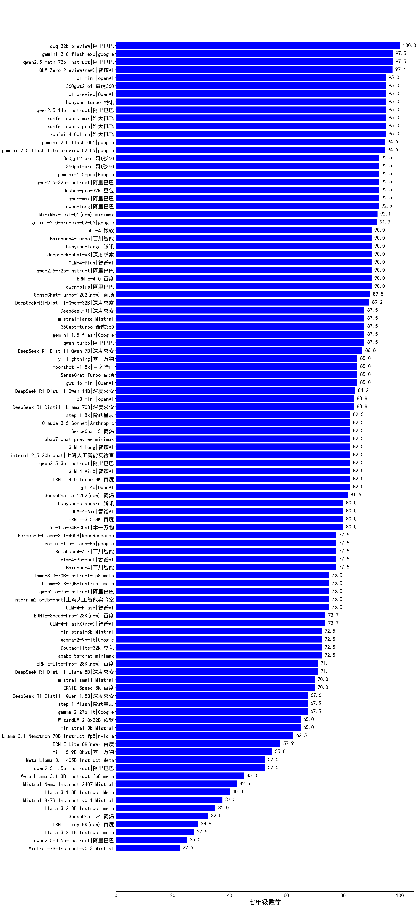
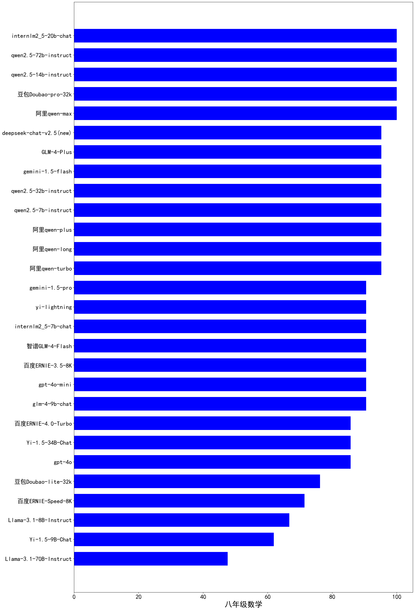
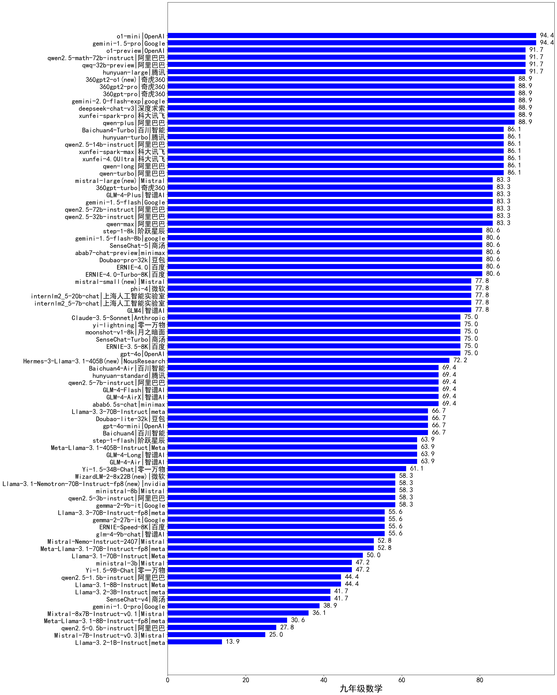

# CLiB中文大模型能力评测榜单（持续更新）
- 目前已囊括134个大模型，覆盖chatgpt、gpt-4o、谷歌gemini、百度文心一言、阿里通义千问、百川、讯飞星火、商汤senseChat、minimax等商用模型，
以及deepseek-v3、qwen2.5、llama3.1、glm4、书生internLM2.5、openbuddy、AquilaChat等开源大模型。
- 模型来源涉及国内外大厂、大模型创业公司、高校研究机构。
- 支持多维度能力评测，包括分类能力、信息抽取、阅读理解、数据分析、指令遵从、算术运算、初中数学、BBH符号推理、中文编码效率。
- 不仅提供能力评分排行榜，也提供所有模型的原始输出结果！有兴趣的朋友可以自己打分、自己排行！

## 目录
- [🔄最近更新](#最近更新)
- [⚓TODO](#todo)
- [📝大模型基本信息](#大模型基本信息)
- [📊排行榜](#-排行榜)
  - [综合能力排行榜](#1综合能力排行榜)
    - 商用大模型排行榜（含开源模型的付费API）
      - 输出价格30元及以上
      - 输出价格5~30元
      - 输出价格1~5元
      - 输出价格1元以下
    - 开源大模型排行榜
      - 5B以下
      - 5B~10B
      - 10B~20B
      - 20B以上
  - [初中数学排行榜](#2初中数学排行榜)
  - [BBH符号推理排行榜](#3BBH排行榜)
  - [分类能力排行榜](#4分类能力排行榜)
  - [信息抽取能力排行榜](#5信息抽取能力排行榜)
  - [阅读理解能力排行榜](#6阅读理解能力排行榜)
  - [数据分析排行榜](#7数据分析排行榜)
  - [中文指令遵从排行榜](#8中文指令遵从排行榜)
  - [算术能力排行榜](#9算术能力排行榜)
  - [中文编码效率排行榜](#10中文编码效率排行榜)
- [🌐各项能力评分](#🌐各项能力评分)
- [⚖️原始评测数据](#⚖️原始评测数据)
- [为什么做榜单？](#为什么做榜单)

## 最近更新
- [2024/12/28] 发布v2.6版本评测榜单
  - 新增BBH（学术界常用符号推理评测集）榜单，并计入总分
  - 将初中数学（七/八/九年级）成绩计入总分
  - 删除陈旧的模型：deepseek-chat-v2、Llama-3-70B-Instruct、Llama-3-8B-Instruct、MiniCPM-2B-dpo、minimax-abab6.5-chat、DeepSeek-V2-Lite-Chat、internlm2-chat-1_8b
- [2024/12/27] 发布v2.5版本评测榜单
  - 新增Grade8Math-zh（八年级数学）、Grade9Math-zh（九年级数学）榜单
  - 新增6个模型：deepseek-chat-v3、abab7-chat-preview、hunyuan-standard、hunyuan-large、hunyuan-turbo、SenseChat-5，☛查看[模型完整信息](https://easyllm.site/static/models.html)
- [2024/12/25] 发布v2.4版本评测榜单
  - 新增Grade7Math-zh（七年级数学）榜单
  - 删除陈旧的模型：Phi-3-mini-128k-instruct、Qwen1.5系列、openbuddy-llama3-8b、yi-large、yi-large-turbo、yi-medium、yi-spark、internlm2-chat-20b、internlm2-chat-7b、gpt-4-turbo、gpt-3.5-turbo
- [2024/10/20] 发布v2.3版本评测榜单
  - 新增6个模型：yi-lightning、gemini-1.5-flash、gemini-1.0-pro、gemini-1.5-pro、GLM-4-Long、GLM-4-Plus
  - 更新4个模型：GLM4、qwen-max、ERNIE-4.0-Turbo-8K、ERNIE-3.5-8K
  - 删除陈旧的模型：Baichuan2-13B-Chat、Baichuan2-7B-Chat、deepseek-llm-67b-chat、gpt4、gemma-2b-it、gemma-7b-it
- [2024/9/29]v2.2版本，[2024/8/27]v2.1版本，[2024/8/7]v2.0版本，[2024/7/26]v1.21版本，[2024/7/15]v1.20版本，[2024/6/29]v1.19版本，[2024/6/2]v1.18版本，[2024/5/8]v1.17版本，[2024/4/13]v1.16版本，[2024/3/20]v1.15版本，[2024/2/28]v1.14版本，[2024/1/29]v1.13版本
- 2023年：[2023/12/10]v1.12版本，[2023/11/22]v1.11版本，[2023/11/5]v1.10版本，[2023/10/11]v1.9版本，[2023/9/13]v1.8版本，[2023/8/29]v1.7版本，[2023/8/13]v1.6版本，[2023/7/26]v1.5版本， [2023/7/18]v1.4版本， [2023/7/2]v1.3版本， [2023/6/17]v1.2版， [2023/6/10]v1.1版本， [2023/6/4]v1版本

各版本更新详情：[CHANGELOG](CHANGELOG.md)

## TODO
- 将更多大模型加入评测：Claude等等
- 增加开源大模型的授权协议，注明能否商用
- 引入更多维度的评测：数学能力、代码能力、开放域问答、多轮对话、头脑风暴、翻译……
- 评测维度更细分，比如信息抽取可以细分时间实体抽取能力、地址实体抽取能力……
- 海纳百川，整合各类评测榜单，扩充细分领域榜单（比如教育领域、医疗领域）
- 加入更多评测数据，使得评测得分越来越有说服力

## 大模型基本信息
价格单位：元/1M tokens，即元每百万token   

|model|	producer|open-source|price_input|price_output|直接体验|download|paper|badcase|
|---|---|---|---|---|---|---|---|---|
|GLM-4-Flash|	智谱AI|	No|	0.0|	0.0|[link](https://easyllm.site/static/modelcompare.html)|	/|	[link](https://arxiv.org/abs/2406.12793)|	[link](https://easyllm.site/static/badcase/badcase-of-llm.html?model=GLM-4-Flash)|
|ERNIE-Speed-8K|	百度|	No|	0.0|	0.0|[link](https://easyllm.site/static/modelcompare.html)|	/|	/|	[link](https://easyllm.site/static/badcase/badcase-of-llm.html?model=ERNIE-Speed-8K)|
|internlm2_5-7b-chat|	上海人工智能实验室|	Yes|	0.3|	0.3|[link](https://easyllm.site/static/modelcompare.html)|	[link](https://www.modelscope.cn/models/Shanghai_AI_Laboratory/internlm2_5-7b-chat)|	/|	[link](https://easyllm.site/static/badcase/badcase-of-llm.html?model=internlm2_5-7b-chat)|
|Yi-1.5-9B-Chat|	零一万物|	Yes|	0.4|	0.4|[link](https://easyllm.site/static/modelcompare.html)|	[link](https://www.modelscope.cn/models/01ai/Yi-1.5-9B-Chat/)|	[link](https://arxiv.org/abs/2403.04652)|	[link](https://easyllm.site/static/badcase/badcase-of-llm.html?model=Yi-1.5-9B-Chat)|
|Llama-3.1-8B-Instruct|	meta|	Yes|	0.4|	0.4|[link](https://easyllm.site/static/modelcompare.html)|	[link](https://modelscope.cn/models/llm-research/meta-llama-3.1-8b-instruct)|	[link](https://arxiv.org/abs/2407.21783)|	[link](https://easyllm.site/static/badcase/badcase-of-llm.html?model=Llama-3.1-8B-Instruct)|
|Doubao-lite-32k|	豆包|	No|	0.3|	0.6|[link](https://easyllm.site/static/modelcompare.html)|	/|	/|	[link](https://easyllm.site/static/badcase/badcase-of-llm.html?model=Doubao-lite-32k)|
|glm-4-9b-chat|	智谱AI|	Yes|	0.6|	0.6|[link](https://easyllm.site/static/modelcompare.html)|	[link](https://www.modelscope.cn/models/ZhipuAI/glm-4-9b-chat)|	[link](https://arxiv.org/abs/2406.12793)|	[link](https://easyllm.site/static/badcase/badcase-of-llm.html?model=glm-4-9b-chat)|
|gemma-2-9b-it|	google|	Yes|	0.6|	0.6|[link](https://easyllm.site/static/modelcompare.html)|	[link](https://www.modelscope.cn/models/LLM-Research/gemma-2-9b-it)|	[link](https://arxiv.org/abs/2408.00118)|	[link](https://easyllm.site/static/badcase/badcase-of-llm.html?model=gemma-2-9b-it)|
|qwen2.5-7b-instruct|	阿里巴巴|	Yes|	1.0|	2.0|[link](https://easyllm.site/static/modelcompare.html)|	[link](https://modelscope.cn/models/qwen/Qwen2.5-7B-Instruct)|	/|	[link](https://easyllm.site/static/badcase/badcase-of-llm.html?model=qwen2.5-7b-instruct)|
|gemini-1.5-flash|	google|	No|	0.5|	2.2|[link](https://easyllm.site/static/modelcompare.html)|	/|	/|	[link](https://easyllm.site/static/badcase/badcase-of-llm.html?model=gemini-1.5-flash)|
|gpt-4o-mini|	openAI|	No|	1.1|	4.3|[link](https://easyllm.site/static/modelcompare.html)|	/|	[link](https://arxiv.org/abs/2303.08774)|	[link](https://easyllm.site/static/badcase/badcase-of-llm.html?model=gpt-4o-mini)|
|...|...|...|...|...|...|...|...|...|

更多模型信息详见：
- [大模型资源汇总（商用及开源）](https://easyllm.site/static/models.html)
- [开源大模型发布历史](LLM-history.md)
  

## 📊 排行榜
### 1、综合能力排行榜
综合能力得分为分类能力、信息抽取、阅读理解、数据分析、指令遵从、算术运算、初中数学、BBH符号推理 八者得分的平均值。
    
详细数据见[total](leaderboard/total.md)
 

#### 1.1、商用大模型排行榜（含开源模型的付费API）
##### （1）输出价格30元及以上商用大模型排行榜
| 类别 | 大模型                        | 分类能力 | 信息抽取 | 阅读理解 | 数据分析 | 指令遵从 | 算术运算 |初中数学|BBH|总分   | 排名 |
|----|----------------------------|------|--------|--------|------|------|----|------|----|---|----|
|hunyuan-turbo(new)☛[去体验](https://easyllm.site/static/modelcompare.html?type=proprietary)|50元|93.0|85.2|93.3|97.3|78.0|99.5|93.7|83.2|90.4|1|
|百度ERNIE-4.0-Turbo☛[去体验](https://easyllm.site/static/modelcompare.html?type=proprietary)|60元|90.0|94.8|96.0|98.7|78.0|97.7|82.9|82.8|90.1|2|
|gpt-4o☛[去体验](https://easyllm.site/static/modelcompare.html?type=proprietary)|72.4元|93.0|96.3|98.0|100.0|83.0|95.7|81.1|72.8|90.0|3|
|GLM-4-Plus☛[去体验](https://easyllm.site/static/modelcompare.html?type=proprietary)|50元|87.0|91.9|95.3|99.3|81.0|88.7|89.5|87.0|90.0|4|
|百度ERNIE-4.0☛[去体验](https://easyllm.site/static/modelcompare.html?type=proprietary)|90元|88.0|89.0|94.7|94.0|79.0|100.0|88.6|82.8|89.5|5|
|gemini-1.5-pro☛[去体验](https://easyllm.site/static/modelcompare.html?type=proprietary)|36元|87.0|90.4|93.3|99.3|75.0|92.2|92.5|85.9|89.5|6|
|讯飞4.0Ultra☛[去体验](https://easyllm.site/static/modelcompare.html?type=proprietary)|100元|88.0|84.4|96.0|92.7|80.0|94.3|93.7|81.9|88.9|7|
|SenseChat-5(new)☛[去体验](https://easyllm.site/static/modelcompare.html?type=proprietary)|100元|93.0|90.4|89.3|97.3|82.0|85.0|82.9|86.2|88.3|8|
|阿里qwen-max☛[去体验](https://easyllm.site/static/modelcompare.html?type=proprietary)|60元|92.0|88.9|94.7|99.3|77.0|79.8|91.9|74.5|87.3|9|
|讯飞星火v3.5(spark-max)☛[去体验](https://easyllm.site/static/modelcompare.html?type=proprietary)|30元|87.0|92.0|89.3|87.3|74.0|93.5|93.7|72.5|86.2|10|
|智谱GLM4☛[去体验](https://easyllm.site/static/modelcompare.html?type=proprietary)|100元|92.0|86.7|90.0|98.0|77.0|78.0|84.3|77.0|85.4|11|
|Baichuan4☛[去体验](https://easyllm.site/static/modelcompare.html?type=proprietary)|100元|86.0|94.1|93.3|95.3|75.0|78.2|75.1|82.3|84.9|12|
|讯飞星火v3(spark-pro)☛[去体验](https://easyllm.site/static/modelcompare.html?type=proprietary)|30元|87.0|82.0|88.0|86.0|74.0|94.0|94.6|35.0|80.1|13|

 

##### （2）输出价格5~30元商用大模型排行榜
| 类别 | 大模型                        | 分类能力 | 信息抽取 | 阅读理解 | 数据分析 | 指令遵从 | 算术运算 |初中数学|BBH|总分   | 排名 |
|----|----------------------------|------|--------|--------|------|------|----|------|----|---|----|
|hunyuan-large(new)☛[去体验](https://easyllm.site/static/modelcompare.html?type=proprietary)|12元|91.0|88.9|92.7|96.7|79.0|93.0|93.9|88.9|90.5|1|
|abab7-chat-preview(new)☛[去体验](https://easyllm.site/static/modelcompare.html?type=proprietary)|10元|89.0|96.3|94.7|97.3|83.0|94.2|86.1|82.4|90.4|2|
|qwen2.5-72b-instruct☛[去体验](https://easyllm.site/static/modelcompare.html?type=proprietary)|12元|92.0|87.4|92.0|92.7|83.0|95.5|91.1|85.8|89.9|3|
|qwen2.5-32b-instruct☛[去体验](https://easyllm.site/static/modelcompare.html?type=proprietary)|7元|91.0|94.1|96.0|91.3|83.0|94.0|90.3|66.6|88.3|4|
|qwen2-72b-instruct☛[去体验](https://easyllm.site/static/modelcompare.html?type=proprietary)|12元|87.0|91.1|94.7|90.0|86.0|94.2|82.5|79.0|88.1|5|
|qwen2.5-14b-instruct☛[去体验](https://easyllm.site/static/modelcompare.html?type=proprietary)|6元|89.0|90.4|94.0|98.0|81.0|91.5|93.7|54.4|86.5|6|
|Baichuan3-Turbo☛[去体验](https://easyllm.site/static/modelcompare.html?type=proprietary)|12元|88.0|86.7|94.7|90.7|75.0|89.2|80.1|68.9|84.2|7|
|qwen2-57b-a14b-instruct☛[去体验](https://easyllm.site/static/modelcompare.html?type=proprietary)|7元|85.0|88.1|89.3|87.3|77.0|89.2|74.3|71.7|82.7|8|
|智谱GLM-4-AirX☛[去体验](https://easyllm.site/static/modelcompare.html?type=proprietary)|10元|89.0|91.9|92.7|88.0|83.0|74.2|84.0|57.7|82.6|9|
|月之暗面moonshot-v1-8k☛[去体验](https://easyllm.site/static/modelcompare.html?type=proprietary)|12元|92.0|85.0|84.0|89.3|72.0|79.3|85.1|66.7|81.7|10|
|商汤SenseChat-Turbo☛[去体验](https://easyllm.site/static/modelcompare.html?type=proprietary)|5元|81.0|77.8|76.7|86.0|72.0|78.5|81.9|74.1|78.5|11|
|gemini-1.0-pro☛[去体验](https://easyllm.site/static/modelcompare.html?type=proprietary)|10.8元|84.0|89.6|92.7|99.3|76.0|50.8|40.6|75.0|76.0|12|
|商汤SenseChat-v4☛[去体验](https://easyllm.site/static/modelcompare.html?type=proprietary)|12元|89.0|78.5|88.0|86.7|71.0|72.2|39.0|70.7|74.4|13|
|minimax-abab5.5-chat☛[去体验](https://easyllm.site/static/modelcompare.html?type=proprietary)|15元|83.0|79.0|86.7|72.7|76.0|39.7|38.8|64.2|67.5|14|
|minimax-abab5.5s-chat☛[去体验](https://easyllm.site/static/modelcompare.html?type=proprietary)|5元|58.0|57.0|70.7|56.0|49.0|57.0|26.4|8.6|47.8|15|

 

##### （3）输出价格1~5元商用大模型排行榜
| 类别 | 大模型                        | 分类能力 | 信息抽取 | 阅读理解 | 数据分析 | 指令遵从 | 算术运算 |初中数学|BBH|总分   | 排名 |
|----|----------------------------|------|--------|--------|------|------|----|------|----|---|----|
|deepseek-chat-v3(new)☛[去体验](https://easyllm.site/static/modelcompare.html?type=proprietary)|2元|93.0|97.0|94.7|100.0|84.0|99.0|91.4|90.5|93.7|1|
|豆包Doubao-pro-32k☛[去体验](https://easyllm.site/static/modelcompare.html?type=proprietary)|2元|86.0|88.1|96.7|86.7|85.0|98.2|91.0|84.3|89.5|2|
|gemini-1.5-flash☛[去体验](https://easyllm.site/static/modelcompare.html?type=proprietary)|2.2元|91.0|87.4|92.7|97.3|77.0|91.8|88.7|83.3|88.7|3|
|百度ERNIE-3.5-8K☛[去体验](https://easyllm.site/static/modelcompare.html?type=proprietary)|2元|94.0|89.6|98.0|100.0|72.0|100.0|81.8|68.8|88.0|4|
|gpt-4o-mini☛[去体验](https://easyllm.site/static/modelcompare.html?type=proprietary)|4.3元|90.0|93.3|89.3|100.0|83.0|92.7|80.7|65.6|86.8|5|
|阿里qwen-plus☛[去体验](https://easyllm.site/static/modelcompare.html?type=proprietary)|2元|88.0|89.6|90.0|84.0|73.0|93.0|91.4|67.7|84.6|6|
|qwen2.5-7b-instruct☛[去体验](https://easyllm.site/static/modelcompare.html?type=proprietary)|2元|85.0|88.1|93.3|91.3|77.0|89.8|79.9|61.7|83.3|7|
|阿里qwen-long☛[去体验](https://easyllm.site/static/modelcompare.html?type=proprietary)|2元|89.0|85.9|90.0|86.7|75.0|83.3|91.3|64.6|83.2|8|
|Llama-3.1-70B-Instruct☛[去体验](https://easyllm.site/static/modelcompare.html?type=proprietary)|4.1元|87.0|88.9|92.0|90.7|79.0|94.8|49.2|84.0|83.2|9|
|hunyuan-standard(new)☛[去体验](https://easyllm.site/static/modelcompare.html?type=proprietary)|2元|87.0|89.6|93.3|85.3|74.0|83.0|80.0|72.3|83.1|10|
|Yi-1.5-34B-Chat☛[去体验](https://easyllm.site/static/modelcompare.html?type=proprietary)|1.3元|90.0|83.0|82.7|83.3|74.0|79.0|75.6|77.2|80.6|11|
|Qwen2-7B-Instruct☛[去体验](https://easyllm.site/static/modelcompare.html?type=proprietary)|2元|89.0|83.7|86.7|75.3|77.0|81.3|69.2|60.5|77.8|12|

 

##### （4）输出价格1元以下商用大模型排行榜
| 类别 | 大模型                        | 分类能力 | 信息抽取 | 阅读理解 | 数据分析 | 指令遵从 | 算术运算 |初中数学|BBH|总分   | 排名 |
|----|----------------------------|------|--------|--------|------|------|----|------|----|---|----|
|yi-lightning☛[去体验](https://easyllm.site/static/modelcompare.html?type=proprietary)|0.99元|94.0|90.4|95.3|100.0|82.0|96.0|83.5|82.4|90.5|1|
|internlm2_5-20b-chat☛[去体验](https://easyllm.site/static/modelcompare.html?type=proprietary)|1元|86.0|90.4|86.0|97.3|75.0|89.7|86.8|78.7|86.2|2|
|GLM-4-Long☛[去体验](https://easyllm.site/static/modelcompare.html?type=proprietary)|1元|85.0|93.3|89.3|96.7|80.0|81.2|79.0|81.2|85.7|3|
|minimax-abab6.5s-chat☛[去体验](https://easyllm.site/static/modelcompare.html?type=proprietary)|1元|87.0|88.0|88.7|88.0|80.0|91.7|75.9|75.8|84.4|4|
|智谱GLM-4-Air☛[去体验](https://easyllm.site/static/modelcompare.html?type=proprietary)|1元|89.0|91.9|92.7|88.0|83.0|74.5|78.1|56.8|81.8|5|
|gemma-2-9b-it☛[去体验](https://easyllm.site/static/modelcompare.html?type=proprietary)|0.6元|85.0|82.2|88.7|87.3|81.0|89.3|67.4|59.9|80.1|6|
|internlm2_5-7b-chat☛[去体验](https://easyllm.site/static/modelcompare.html?type=proprietary)|0.4元|86.0|84.4|90.0|83.3|79.0|59.8|81.1|73.5|79.6|7|
|阿里qwen-turbo☛[去体验](https://easyllm.site/static/modelcompare.html?type=proprietary)|0.6元|83.0|85.2|88.0|76.0|66.0|81.3|89.6|64.4|79.2|8|
|智谱GLM-4-Flash☛[去体验](https://easyllm.site/static/modelcompare.html?type=proprietary)|0元|89.0|80.0|86.0|82.0|79.0|75.5|78.3|61.7|78.9|9|
|百度ERNIE-Speed-8K☛[去体验](https://easyllm.site/static/modelcompare.html?type=proprietary)|0元|88.0|88.1|88.0|89.3|68.0|68.7|65.7|54.1|76.2|10|
|Yi-1.5-9B-Chat☛[去体验](https://easyllm.site/static/modelcompare.html?type=proprietary)|0.4元|82.0|83.0|84.7|80.0|72.0|73.8|54.7|70.8|75.1|11|
|豆包Doubao-lite-32k☛[去体验](https://easyllm.site/static/modelcompare.html?type=proprietary)|0.6元|77.0|86.7|88.7|64.7|62.0|87.2|71.8|52.3|73.8|12|
|Llama-3.1-8B-Instruct☛[去体验](https://easyllm.site/static/modelcompare.html?type=proprietary)|0.4元|63.0|85.2|82.0|84.0|69.0|90.5|50.4|65.7|73.7|13|

 

旗舰商用模型badcase: [gpt-4o](http://easyllm.site/static/badcase/badcase-of-llm.html?model=gpt-4o) | 
[moonshot-v1-8k](http://easyllm.site/static/badcase/badcase-of-llm.html?model=moonshot-v1-8k) |
[deepseek-chat-v2](http://easyllm.site/static/badcase/badcase-of-llm.html?model=deepseek-chat-v2) |
[yi-large](http://easyllm.site/static/badcase/badcase-of-llm.html?model=yi-large) |
[更多](http://easyllm.site/static/badcase.html)
  

#### 1.2、开源大模型排行榜
##### （1）5B以下开源大模型排行榜
| 类别 | 大模型                        | 分类能力 | 信息抽取 | 阅读理解 | 数据分析 | 指令遵从 | 算术运算 |初中数学|BBH|总分   | 排名 |
|----|----------------------------|------|--------|--------|------|------|----|------|----|---|----|
|开源|qwen2.5-3b-instruct☛[去体验](https://easyllm.site/static/modelcompare.html?type=open-source)|81.0|75.6|78.7|83.3|77.0|85.7|75.5|43.5|75.0|1|
|开源|qwen2.5-1.5b-instruct☛[去体验](https://easyllm.site/static/modelcompare.html?type=open-source)|70.0|71.9|72.7|63.3|62.0|83.3|56.1|34.0|64.2|2|
|开源|qwen2-1.5b-instruct☛[去体验](https://easyllm.site/static/modelcompare.html?type=open-source)|73.0|74.1|68.0|50.7|54.0|55.7|37.3|31.9|55.6|3|
|开源|qwen2.5-0.5b-instruct☛[去体验](https://easyllm.site/static/modelcompare.html?type=open-source)|52.0|53.3|63.3|46.0|58.0|51.8|36.6|15.7|47.1|4|
|开源|qwen2-0.5b-instruct☛[去体验](https://easyllm.site/static/modelcompare.html?type=open-source)|49.0|53.3|62.0|36.7|48.0|35.5|19.1|22.6|40.8|5|

 

##### （2）5B~10B开源大模型排行榜
| 类别 | 大模型                        | 分类能力 | 信息抽取 | 阅读理解 | 数据分析 | 指令遵从 | 算术运算 |初中数学|BBH|总分   | 排名 |
|----|----------------------------|------|--------|--------|------|------|----|------|----|---|----|
|开源|qwen2.5-7b-instruct☛[去体验](https://easyllm.site/static/modelcompare.html?type=open-source)|85.0|88.1|93.3|91.3|77.0|89.8|79.9|61.7|83.3|1|
|开源|gemma-2-9b-it☛[去体验](https://easyllm.site/static/modelcompare.html?type=open-source)|85.0|82.2|88.7|87.3|81.0|89.3|67.4|59.9|80.1|2|
|开源|internlm2_5-7b-chat☛[去体验](https://easyllm.site/static/modelcompare.html?type=open-source)|86.0|84.4|90.0|83.3|79.0|59.8|81.1|73.5|79.6|3|
|开源|glm-4-9b-chat☛[去体验](https://easyllm.site/static/modelcompare.html?type=open-source)|90.0|82.2|90.0|82.0|79.0|76.5|74.5|62.4|79.6|4|
|开源|Qwen2-7B-Instruct☛[去体验](https://easyllm.site/static/modelcompare.html?type=open-source)|89.0|83.7|86.7|75.3|77.0|81.3|69.2|60.5|77.8|5|
|开源|Yi-1.5-9B-Chat☛[去体验](https://easyllm.site/static/modelcompare.html?type=open-source)|82.0|83.0|84.7|80.0|72.0|73.8|54.7|70.8|75.1|6|
|开源|Llama-3.1-8B-Instruct☛[去体验](https://easyllm.site/static/modelcompare.html?type=open-source)|63.0|85.2|82.0|84.0|69.0|90.5|50.4|65.7|73.7|7|

 

##### （3）10B~20B开源大模型排行榜
| 类别 | 大模型                        | 分类能力 | 信息抽取 | 阅读理解 | 数据分析 | 指令遵从 | 算术运算 |初中数学|BBH|总分   | 排名 |
|----|----------------------------|------|--------|--------|------|------|----|------|----|---|----|
|开源|qwen2.5-14b-instruct☛[去体验](https://easyllm.site/static/modelcompare.html?type=open-source)|89.0|90.4|94.0|98.0|81.0|91.5|93.7|54.4|86.5|1|
|开源|internlm2_5-20b-chat☛[去体验](https://easyllm.site/static/modelcompare.html?type=open-source)|86.0|90.4|86.0|97.3|75.0|89.7|86.8|78.7|86.2|2|

 

##### （4）30B以上开源大模型排行榜
| 类别 | 大模型                        | 分类能力 | 信息抽取 | 阅读理解 | 数据分析 | 指令遵从 | 算术运算 |初中数学|BBH|总分   | 排名 |
|----|----------------------------|------|--------|--------|------|------|----|------|----|---|----|
|开源|deepseek-chat-v3(new)☛[去体验](https://easyllm.site/static/modelcompare.html?type=open-source)|93.0|97.0|94.7|100.0|84.0|99.0|91.4|90.5|93.7|1|
|开源|qwen2.5-72b-instruct☛[去体验](https://easyllm.site/static/modelcompare.html?type=open-source)|92.0|87.4|92.0|92.7|83.0|95.5|91.1|85.8|89.9|2|
|开源|qwen2.5-32b-instruct☛[去体验](https://easyllm.site/static/modelcompare.html?type=open-source)|91.0|94.1|96.0|91.3|83.0|94.0|90.3|66.6|88.3|3|
|开源|qwen2-72b-instruct☛[去体验](https://easyllm.site/static/modelcompare.html?type=open-source)|87.0|91.1|94.7|90.0|86.0|94.2|82.5|79.0|88.1|4|
|开源|Llama-3.1-70B-Instruct☛[去体验](https://easyllm.site/static/modelcompare.html?type=open-source)|87.0|88.9|92.0|90.7|79.0|94.8|49.2|84.0|83.2|5|
|开源|qwen2-57b-a14b-instruct☛[去体验](https://easyllm.site/static/modelcompare.html?type=open-source)|85.0|88.1|89.3|87.3|77.0|89.2|74.3|71.7|82.7|6|
|开源|Yi-1.5-34B-Chat☛[去体验](https://easyllm.site/static/modelcompare.html?type=open-source)|90.0|83.0|82.7|83.3|74.0|79.0|75.6|77.2|80.6|7|

  

### 2、初中数学排行榜
七/八/九年级的平均分计入总分。 
评分标准：七、八、九年级分别有40道题、21道题、36道题，所有题目都只判断对错（没有中间分数）。对于任何题目，只有模型response完全正确才给分，部分正确或错误都不得分。 
评测样本举例：
> 因式分解：3x^2y-12xy+12y

☛查看[七年级数学badcase](http://easyllm.site/static/badcase/badcase-of-benchmark.html?benchmark=Grade7Math-zh)

☛查看[八年级数学badcase](http://easyllm.site/static/badcase/badcase-of-benchmark.html?benchmark=Grade8Math-zh)

☛查看[九年级数学badcase](http://easyllm.site/static/badcase/badcase-of-benchmark.html?benchmark=Grade9Math-zh)
  

### 3、BBH
学术界最常用的符号推理评测集，包含23个子任务，详细介绍见[BBH](https://easyllm.site/static/benchmarks.html)。
评测样本举例：
> Task description: Answer questions about which times certain events could have occurred.  
Q: Today, Emily went to the museum. Between what times could they have gone?   
We know that:   
Emily woke up at 1pm.   
Elizabeth saw Emily reading at the library from 2pm to 4pm.   
Jessica saw Emily watching a movie at the theater from 4pm to 5pm.    
Leslie saw Emily waiting at the airport from 5pm to 6pm.   
William saw Emily buying clothes at the mall from 6pm to 7pm.   
The museum was closed after 7pm.   
Between what times could Emily have gone to the museum?   
Options:   
(A) 1pm to 2pm   
(B) 6pm to 7pm   
(C) 5pm to 6pm   
(D) 2pm to 4pm   
A:    
> 

完整排行榜见[BBH](leaderboard/bbh.md) 
☛查看[BBH符号推理badcase](http://easyllm.site/static/badcase/badcase-of-benchmark.html?benchmark=BBH)
  

### 4、分类能力排行榜
评测样本举例：
> 将下列单词按词性分类。    
> 狗，追，跑，大人，高兴，树

完整排行榜见[classification](leaderboard/classification.md) 
☛查看[分类能力badcase](http://easyllm.site/static/badcase/badcase-of-benchmark.html?benchmark=classification)
  

### 5、信息抽取能力排行榜
评测样本举例：  
> “中信银行3亿元，交通银行增长约2.7亿元，光大银行约1亿元。”    
> 提取出以上文本中的所有组织机构名称

完整排行榜见[extract](leaderboard/info-extract.md) 
☛查看[信息抽取能力badcase](http://easyllm.site/static/badcase/badcase-of-benchmark.html?benchmark=extract)
  

### 6、阅读理解能力排行榜
阅读理解能力是一种符合能力，考查针对给定信息的理解能力。
依据给定信息的种类，可以细分为：文章问答、表格问答、对话问答……    
评测样本举例：
> 牙医：好的，让我们看看你的牙齿。从你的描述和我们的检查结果来看，你可能有一些牙齦疾病，导致牙齿的神经受到刺激，引起了敏感。此外，这些黑色斑点可能是蛀牙。  
病人：哦，真的吗？那我该怎么办？   
牙医：别担心，我们可以为你制定一个治疗计划。我们需要首先治疗牙龈疾病，然后清除蛀牙并填充牙洞。在此过程中，我们将确保您感到舒适，并使用先进的技术和材料来实现最佳效果。   
病人：好的，谢谢您，医生。那么我什么时候可以开始治疗？   
牙医：让我们为您安排一个约会。您的治疗将在两天后开始。在此期间，请继续刷牙，使用牙线，并避免吃过于甜腻和酸性的食物和饮料。   
病人：好的，我会的。再次感谢您，医生。   
牙医：不用谢，我们会尽最大的努力帮助您恢复健康的牙齿。   
基于以上对话回答：病人在检查中发现的牙齿问题有哪些？
> 

完整排行榜见[mrc](leaderboard/mrc.md) 
☛查看[阅读理解能力badcase](http://easyllm.site/static/badcase/badcase-of-benchmark.html?benchmark=mrc)
  

### 7、数据分析排行榜
专门考查大模型对表格的理解分析能力，常用于数据分析。    
评测样本举例：
> 姓名,年龄,性别,国籍,身高(cm),体重(kg),学历   
张三,28,男,中国,180,70,本科   
Lisa,33,女,美国,165,58,硕士   
Paulo,41,男,巴西,175,80,博士   
Miyuki,25,女,日本,160,50,大专   
Ahmed,30,男,埃及,175,68,本科   
Maria,29,女,墨西哥,170,65,硕士   
Antonio,36,男,西班牙,182,75,博士  
基于这个表格回答：学历最低的是哪国人？
> 

完整排行榜见[tableqa](leaderboard/table-qa.md) 
☛查看[数据分析badcase](http://easyllm.site/static/badcase/badcase-of-benchmark.html?benchmark=tableqa)
  

### 8、中文指令遵从排行榜
参考谷歌IFEval，并将其翻译和适配到中文，精选9类25种指令，说明如下：

完整排行榜见[IFEval](leaderboard/IFEval.md) 
☛查看[中文指令遵从badcase](http://easyllm.site/static/badcase/badcase-of-benchmark.html?benchmark=IFEval-zh)
  

### 9、算术能力排行榜
考查大模型的数学基础能力之算数能力，测试题目为1000以内的整数加减法、不超过2位有效数字的浮点数加减乘除。
举例：166 + 215 + 53 = ？，0.97 + 0.4 / 4.51 = ？

完整排行榜见[arithmetic](leaderboard/arithmetic.md) 
☛查看[算术能力badcase](http://easyllm.site/static/badcase/badcase-of-benchmark.html?benchmark=arithmetic)
  

### 10、中文编码效率排行榜
暂不计入综合能力评分。
专门考查大模型编码中文字符的效率，同等尺寸大模型，编码效率越高推理速度越快，几乎成正比。
中文编码效率相当于大模型生成的每个token解码后对应的中文平均字数
（大模型每次生成一个token，然后解码成真正可见的字符，比如中文、英文、标点符号等）。
比如baichuan2、llama2的中文中文编码效率分别为1.67、0.61，意味着在同尺寸模型下，baichuan2的运行速度是llama2的2.7倍（1.67/0.61）。

  

## 🌐各项能力评分
评分方法：从各个维度给大模型打分，每个维度都对应一个评测数据集，包含若干道题。
每道题依据大模型回复质量给1~5分，将评测集内所有题的得分累加并归一化为100分制，即作为最终得分。

所有评分数据详见[alldata](leaderboard/alldata.md)
 

## ⚖️原始评测数据
包含各维度评测集以及大模型输出结果，详见本项目的[eval文件目录](eval)

## 为什么做榜单？
- 大模型百花齐放，也参差不齐。不少媒体的宣传往往夸大其词，避重就轻，容易混淆视听；而某些公司为了PR，也过分标榜自己大模型的能力，动不动就“达到chatgpt水平”，动不动就“国内第一”。
所谓“外行看热闹，内行看门道”，业界急需一股气流，摒弃浮躁，静下心来打磨前沿技术，真真正正用技术实力说话。这就少不了一个公开、公正、公平的大模型评测系统，把各类大模型的优点、不足一一展示出来。
如此，大家既能把握当下的发展水平、与国外顶尖技术的差距，也能更加清晰地看明白未来的努力方向，而不被资本热潮、舆论热潮所裹挟。
- 对于产业界来说，特别是对于不具备大模型研发能力的公司，熟悉大模型的技术边界、高效有针对性地做大模型技术选型，在现如今显得尤为重要。
而一个公开、公正、公平的大模型评测系统，恰好能够提供应有的助力，避免重复造轮子，避免因技术栈不同而导致不必要的争论，避免“鸡同鸭讲”。
- 对于大模型研发人员，包括对大模型技术感兴趣的人、学术界看中实践的人，各类大模型的效果对比，反应出了背后不同技术路线、技术方法的有效性，这就提供了非常好的参考意义。
不同大模型的相互参考、借鉴，帮忙大家躲过不必要的坑、避免重复实验带来的资源浪费，有助于整个大模型生态圈的良性高效发展。

## 大模型选型及评测交流群
先加小编微信，后拉入群

