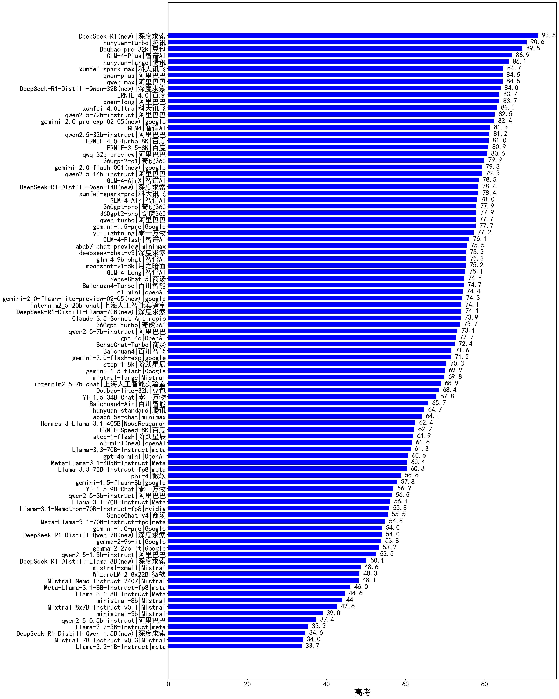
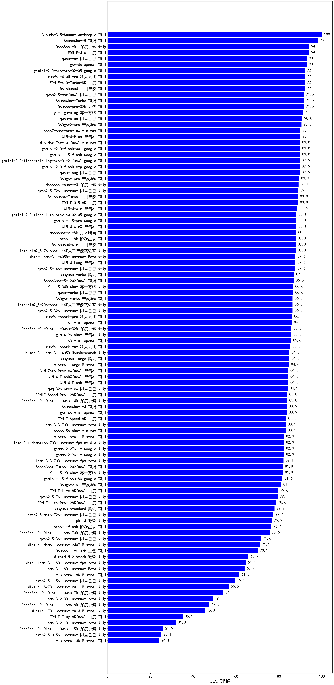
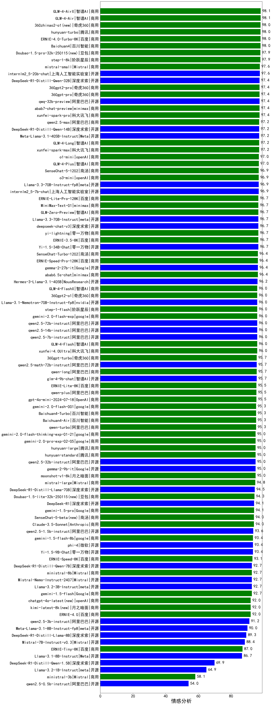
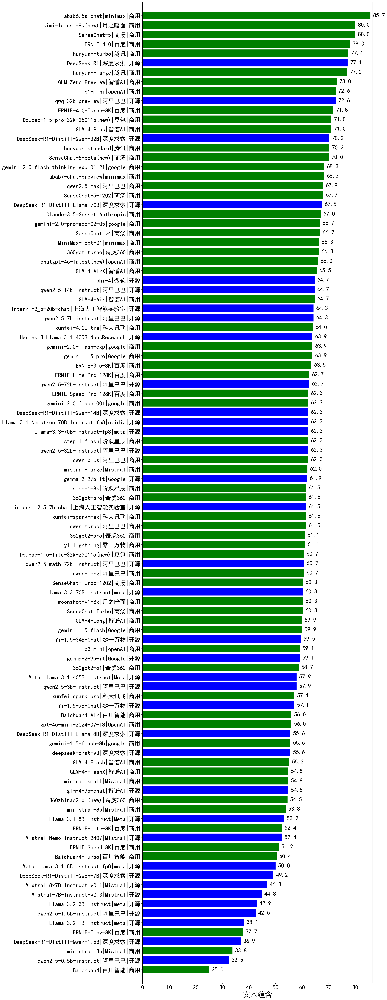
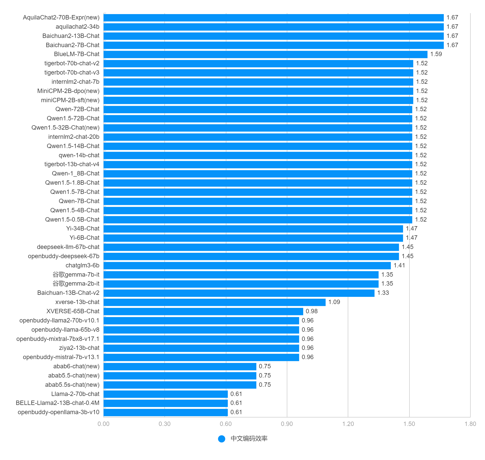

# CLiB中文大模型能力评测榜单（持续更新）
- 目前已囊括187个大模型，覆盖chatgpt、gpt-4o、o3-mini、谷歌gemini、Claude3.5、智谱GLM-Zero、文心一言、qwen-max、百川、讯飞星火、商汤senseChat、minimax等商用模型，
以及DeepSeek-R1、deepseek-v3、qwen2.5、llama3.3、phi-4、glm4、书生internLM2.5等开源大模型。
- 模型来源涉及国内外大厂、大模型创业公司、高校研究机构。
- 支持多维度能力评测，包括分类能力、信息抽取、阅读理解、数据分析、指令遵从、算术运算、初中数学、符号推理BBH、代词理解CLUEWSC、诗词匹配CCPM、公务员考试、律师资格考试、高考、常识推理、文本蕴含、成语理解、情感分析、中文编码效率。
- 不仅提供能力评分排行榜，也提供所有模型的原始输出结果！有兴趣的朋友可以自己打分、自己排行！

## 目录
- [🔄最近更新](#最近更新)
- [⚓TODO](#todo)
- [📝大模型基本信息](#大模型基本信息)
- [📊排行榜](#-排行榜)
  - [综合能力排行榜](#1、综合能力排行榜)
    - 商用大模型排行榜（含开源模型的付费API）
      - 输出价格30元及以上
      - 输出价格5~30元
      - 输出价格1~5元
      - 输出价格1元以下
    - 开源大模型排行榜
      - 5B以下
      - 5B~20B
      - 20B以上
  - [【学科知识】高考排行榜](#2、【学科知识】高考排行榜)
  - [【推理】常识推理排行榜](#3、【推理】常识推理排行榜)
  - [【推理】公务员考试排行榜](#4、【推理】公务员考试排行榜)
  - [【推理】律师资格考试排行榜](#5、【推理】律师资格考试排行榜)
  - [【推理】符号推理BBH排行榜](#6、【推理】符号推理BBH排行榜)
  - [【数学计算】初中数学排行榜](#7、【数学计算】初中数学排行榜)
  - [【数学计算】算术能力排行榜](#8、【数学计算】算术能力排行榜)
  - [【语言理解】成语理解排行榜](#9、【语言理解】成语理解排行榜)
  - [【语言理解】情感分析排行榜](#10、【语言理解】情感分析排行榜)  
  - [【语言理解】文本蕴含排行榜](#11、【语言理解】文本蕴含排行榜)
  - [【语言理解】分类能力排行榜](#12、【语言理解】分类能力排行榜)
  - [【语言理解】信息抽取能力排行榜](#13、【语言理解】信息抽取能力排行榜)
  - [【语言理解】阅读理解能力排行榜](#14、【语言理解】阅读理解能力排行榜)
  - [【语言理解】代词理解CLUEWSC排行榜](#15、【语言理解】代词理解CLUEWSC排行榜)
  - [【语言理解】诗词匹配CCPM排行榜](#16、【语言理解】诗词匹配CCPM排行榜)
  - [【数据分析】表格问答排行榜](#17、【数据分析】表格问答排行榜)
  - [中文指令遵从排行榜](#18、中文指令遵从排行榜)
  - [中文编码效率排行榜](#19、中文编码效率排行榜)
- [🌐各项能力评分](#🌐各项能力评分)
- [⚖️原始评测数据](#⚖️原始评测数据)
- [为什么做榜单？](#为什么做榜单)

## 最近更新
- [2025/2/14] 发布v2.17版本评测榜单
  - 新增10个模型：GLM-Zero-Preview、MiniMax-Text-01、SenseChat-5-1202、SenseChat-Turbo-1202、GLM-4-FlashX、ERNIE-Lite-8K、ERNIE-Tiny-8K、ERNIE-Lite-Pro-128K、ERNIE-Speed-Pro-128K、qwen2.5-math-72b-instruct，☛查看[模型完整信息](https://easyllm.site/static/models.html)
  - 删除陈旧的模型：GLM4、gemini-1.0-pro、Llama-3.1-70B-Instruct、Meta-Llama-3.1-70B-Instruct-fp8
- [2025/2/13] 发布v2.16版本评测榜单
  - 新增6个模型：qwq-32b-preview、o1-mini、o3-mini、gemini-2.0-pro-exp-02-05、gemini-2.0-flash-lite-preview-02-05、gemini-2.0-flash-001，☛查看[模型完整信息](https://easyllm.site/static/models.html)
- [2025/2/12] 发布v2.15版本评测榜单
  - 新增成语理解排行榜、情感分析排行榜，并计入总分
- [2025/2/10] 发布v2.14版本评测榜单
  - 新增7个模型：DeepSeek-R1、DeepSeek-R1-Distill-Qwen-1.5B、DeepSeek-R1-Distill-Qwen-7B、DeepSeek-R1-Distill-Llama-8B、DeepSeek-R1-Distill-Qwen-14B、DeepSeek-R1-Distill-Qwen-32B、DeepSeek-R1-Distill-Llama-70B，☛查看[模型完整信息](https://easyllm.site/static/models.html)
- [2025/1/29] 发布v2.13版本评测榜单
  - 新增常识推理排行榜、文本蕴含（语言理解）排行榜，并计入总分
  - 阅读理解评测样本增加至600多个，并更新各模型评分
- [2025/1/25] 发布v2.12版本评测榜单
  - 新增高考榜单及各学科细分榜单（生物、化学、语文、地理、历史、数学、物理），并以各科平均分（100分制）计入总分
- [2025/1/23] 发布v2.11版本评测榜单
  - 公务员考试kaogong、律师资格考试JEC-QA开始计入总分
  - 新增4个模型：mistral-small、Hermes-3-Llama-3.1-405B、mistral-large、360gpt2-o1，☛查看[模型完整信息](https://easyllm.site/static/models.html)
- [2025/1/22] 发布v2.10版本评测榜单
  - 新增律师资格考试JEC-QA榜单，暂不计入总分
  - 新增7个模型：ministral-3b、Mistral-7B-Instruct-v0.3、Mistral-Nemo-Instruct-2407、ministral-8b、Mixtral-8x7B-Instruct-v0.1、Llama-3.1-Nemotron-70B-Instruct-fp8、WizardLM-2-8x22B，☛查看[模型完整信息](https://easyllm.site/static/models.html)
- [2025/1/20] 发布v2.9版本评测榜单
  - 新增公务员考试kaogong榜单，暂不计入总分
  - 新增5个模型：Llama-3.2-1B-Instruct、Llama-3.2-3B-Instruct、Llama-3.1-8B-Instruct-fp8、Llama-3.3-70B-Instruct-fp8、Llama-3.1-70B-Instruct-fp8，☛查看[模型完整信息](https://easyllm.site/static/models.html)
- [2025/1/17] 发布v2.8版本评测榜单
  - 新增9个模型：gemini-2.0-flash-exp、phi-4、gemini-1.5-flash-8b、360gpt-turbo、step-1-flash、Llama-3.3-70B-Instruct、360gpt-pro、360gpt2-pro、step-1-8k，☛查看[模型完整信息](https://easyllm.site/static/models.html)
  - 新增o1-mini、o1-preview的初中数学成绩
  - 删除陈旧的模型：abab5.5-chat、abab5.5s-chat
- [2025/1/7] 发布v2.7版本评测榜单
  - 新增代词理解CLUEWSC榜单（比如“他”是指谁）、诗词匹配CCPM榜单
  - 新增5个模型：Claude-3.5-Sonnet、gemma-2-27b-it、Llama-3.1-405B-Instruct、Baichuan4-Air、Baichuan4-Turbo，☛查看[模型完整信息](https://easyllm.site/static/models.html)
  - 删除陈旧的模型：Baichuan3-Turbo、qwen2-72b-instruct、Qwen2-7B-Instruct、qwen2-1.5b-instruct、qwen2-0.5b-instruct、qwen2-57b-a14b-instruct
- [2024/12/28] 发布v2.6版本评测榜单
  - 新增BBH（学术界常用符号推理评测集）榜单，并计入总分
  - 将初中数学（七/八/九年级）成绩计入总分
  - 删除陈旧的模型：deepseek-chat-v2、Llama-3-70B-Instruct、Llama-3-8B-Instruct、MiniCPM-2B-dpo、minimax-abab6.5-chat、DeepSeek-V2-Lite-Chat、internlm2-chat-1_8b
- [2024/12/27] 发布v2.5版本评测榜单
  - 新增Grade8Math-zh（八年级数学）、Grade9Math-zh（九年级数学）榜单
  - 新增6个模型：deepseek-chat-v3、abab7-chat-preview、hunyuan-standard、hunyuan-large、hunyuan-turbo、SenseChat-5，☛查看[模型完整信息](https://easyllm.site/static/models.html)
- [2024/12/25] 发布v2.4版本评测榜单
  - 新增Grade7Math-zh（七年级数学）榜单
  - 删除陈旧的模型：Phi-3-mini-128k-instruct、Qwen1.5系列、openbuddy-llama3-8b、yi-large、yi-large-turbo、yi-medium、yi-spark、internlm2-chat-20b、internlm2-chat-7b、gpt-4-turbo、gpt-3.5-turbo
- [2024/10/20] 发布v2.3版本评测榜单
  - 新增6个模型：yi-lightning、gemini-1.5-flash、gemini-1.0-pro、gemini-1.5-pro、GLM-4-Long、GLM-4-Plus
  - 更新4个模型：GLM4、qwen-max、ERNIE-4.0-Turbo-8K、ERNIE-3.5-8K
  - 删除陈旧的模型：Baichuan2-13B-Chat、Baichuan2-7B-Chat、deepseek-llm-67b-chat、gpt4、gemma-2b-it、gemma-7b-it
- [2024/9/29]v2.2版本，[2024/8/27]v2.1版本，[2024/8/7]v2.0版本，[2024/7/26]v1.21版本，[2024/7/15]v1.20版本，[2024/6/29]v1.19版本，[2024/6/2]v1.18版本，[2024/5/8]v1.17版本，[2024/4/13]v1.16版本，[2024/3/20]v1.15版本，[2024/2/28]v1.14版本，[2024/1/29]v1.13版本
- 2023年：[2023/12/10]v1.12版本，[2023/11/22]v1.11版本，[2023/11/5]v1.10版本，[2023/10/11]v1.9版本，[2023/9/13]v1.8版本，[2023/8/29]v1.7版本，[2023/8/13]v1.6版本，[2023/7/26]v1.5版本， [2023/7/18]v1.4版本， [2023/7/2]v1.3版本， [2023/6/17]v1.2版， [2023/6/10]v1.1版本， [2023/6/4]v1版本

各版本更新详情：[CHANGELOG](CHANGELOG.md)

## TODO
- 引入更多维度的评测：代码能力、开放域问答、多轮对话、头脑风暴、翻译……
- 评测维度更细分，比如信息抽取可以细分时间实体抽取能力、地址实体抽取能力……
- 海纳百川，整合各类评测榜单，扩充细分领域榜单（比如教育领域、医疗领域）
- 加入更多评测数据，使得评测得分越来越有说服力

## 大模型基本信息
价格单位：元/1M tokens，即元每百万token   

|model|	producer|open-source|price_input|price_output|直接体验|download|paper|badcase|
|---|---|---|---|---|---|---|---|---|
|GLM-4-Flash|	智谱AI|	No|	0.0|	0.0|[link](https://easyllm.site/static/modelcompare.html)|	/|	[link](https://arxiv.org/abs/2406.12793)|	[link](https://easyllm.site/static/badcase/badcase-of-llm.html?model=GLM-4-Flash)|
|ERNIE-Speed-8K|	百度|	No|	0.0|	0.0|[link](https://easyllm.site/static/modelcompare.html)|	/|	/|	[link](https://easyllm.site/static/badcase/badcase-of-llm.html?model=ERNIE-Speed-8K)|
|internlm2_5-7b-chat|	上海人工智能实验室|	Yes|	0.3|	0.3|[link](https://easyllm.site/static/modelcompare.html)|	[link](https://www.modelscope.cn/models/Shanghai_AI_Laboratory/internlm2_5-7b-chat)|	/|	[link](https://easyllm.site/static/badcase/badcase-of-llm.html?model=internlm2_5-7b-chat)|
|Yi-1.5-9B-Chat|	零一万物|	Yes|	0.4|	0.4|[link](https://easyllm.site/static/modelcompare.html)|	[link](https://www.modelscope.cn/models/01ai/Yi-1.5-9B-Chat/)|	[link](https://arxiv.org/abs/2403.04652)|	[link](https://easyllm.site/static/badcase/badcase-of-llm.html?model=Yi-1.5-9B-Chat)|
|Llama-3.1-8B-Instruct|	meta|	Yes|	0.4|	0.4|[link](https://easyllm.site/static/modelcompare.html)|	[link](https://modelscope.cn/models/llm-research/meta-llama-3.1-8b-instruct)|	[link](https://arxiv.org/abs/2407.21783)|	[link](https://easyllm.site/static/badcase/badcase-of-llm.html?model=Llama-3.1-8B-Instruct)|
|Doubao-lite-32k|	豆包|	No|	0.3|	0.6|[link](https://easyllm.site/static/modelcompare.html)|	/|	/|	[link](https://easyllm.site/static/badcase/badcase-of-llm.html?model=Doubao-lite-32k)|
|glm-4-9b-chat|	智谱AI|	Yes|	0.6|	0.6|[link](https://easyllm.site/static/modelcompare.html)|	[link](https://www.modelscope.cn/models/ZhipuAI/glm-4-9b-chat)|	[link](https://arxiv.org/abs/2406.12793)|	[link](https://easyllm.site/static/badcase/badcase-of-llm.html?model=glm-4-9b-chat)|
|gemma-2-9b-it|	google|	Yes|	0.6|	0.6|[link](https://easyllm.site/static/modelcompare.html)|	[link](https://www.modelscope.cn/models/LLM-Research/gemma-2-9b-it)|	[link](https://arxiv.org/abs/2408.00118)|	[link](https://easyllm.site/static/badcase/badcase-of-llm.html?model=gemma-2-9b-it)|
|qwen2.5-7b-instruct|	阿里巴巴|	Yes|	1.0|	2.0|[link](https://easyllm.site/static/modelcompare.html)|	[link](https://modelscope.cn/models/qwen/Qwen2.5-7B-Instruct)|	/|	[link](https://easyllm.site/static/badcase/badcase-of-llm.html?model=qwen2.5-7b-instruct)|
|gemini-1.5-flash|	google|	No|	0.5|	2.2|[link](https://easyllm.site/static/modelcompare.html)|	/|	/|	[link](https://easyllm.site/static/badcase/badcase-of-llm.html?model=gemini-1.5-flash)|
|gpt-4o-mini|	openAI|	No|	1.1|	4.3|[link](https://easyllm.site/static/modelcompare.html)|	/|	[link](https://arxiv.org/abs/2303.08774)|	[link](https://easyllm.site/static/badcase/badcase-of-llm.html?model=gpt-4o-mini)|
|...|...|...|...|...|...|...|...|...|

更多模型信息详见：
- [大模型资源汇总（商用及开源）](https://easyllm.site/static/models.html)
- [开源大模型发布历史](LLM-history.md)
  

## 📊 排行榜
### 1、综合能力排行榜
综合能力得分为分类能力、信息抽取、阅读理解、数据分析、指令遵从、算术运算、初中数学、符号推理BBH、代词理解CLUEWSC、诗词匹配CCPM、公务员考试kaogong、律师资格考试JEC-QA、高考、常识推理、文本蕴含、成语理解、情感分析等17项得分的平均值。
    
详细数据见[total](leaderboard/total.md)
 

#### 1.1、商用大模型排行榜（含开源模型的付费API）
##### （1）输出价格30元及以上商用大模型排行榜
完整排行榜见[30元及以上商用大模型](leaderboard/commerce1.md) 

##### （2）输出价格5~30元商用大模型排行榜
完整排行榜见[5~30元商用大模型](leaderboard/commerce2.md) 

##### （3）输出价格1~5元商用大模型排行榜
完整排行榜见[1~5元商用大模型](leaderboard/commerce3.md) 

##### （4）输出价格1元以下商用大模型排行榜
完整排行榜见[1元以下商用大模型](leaderboard/commerce4.md) 

DIY自定义维度筛选榜单：☛ [link](https://easyllm.site/static/benchmarking.html) 

旗舰商用模型badcase: [gpt-4o](http://easyllm.site/static/badcase/badcase-of-llm.html?model=gpt-4o) | 
[deepseek-chat-v3](http://easyllm.site/static/badcase/badcase-of-llm.html?model=deepseek-chat-v3) |
[更多](http://easyllm.site/static/badcase.html)
  

#### 1.2、开源大模型排行榜
##### （1）5B以下开源大模型排行榜
完整排行榜见[5B以下开源大模型](leaderboard/opensource1.md) 

##### （2）5B~20B开源大模型排行榜
完整排行榜见[5B~20B开源大模型](leaderboard/opensource2.md) 

##### （3）20B以上开源大模型排行榜
完整排行榜见[20B以上开源大模型](leaderboard/opensource3.md) 

DIY自定义维度筛选榜单：☛[link](https://easyllm.site/static/benchmarking.html)
  

### 2、【学科知识】高考排行榜
历年高考题，共1500多道，绝大部分为选择题，少部分为填空题，参考[AGIEval](https://github.com/ruixiangcui/AGIEval)

 
#### （1）高考生物
评测样本举例：
> 已知(1)酶、(2)抗体、(3)激素、(4)糖原、(5)脂肪、(6)核酸都是人体内有重要作用的物质。下列说法正确的 是    
(A)(1)(2)(3)都是由氨基酸通过肽键连接而成的   
(B)(3)(4)(5)都是生物大分子, 都以碳链为骨架   
(C)(1)(2)(6)都是由含氮的单体连接成的多聚体   
(D)(4)(5)(6)都是人体细胞内的主要能源物质   
>     

完整排行榜见[高考生物](leaderboard/gaokao-biology.md) 
☛查看[高考生物badcase](http://easyllm.site/static/badcase/badcase-of-benchmark.html?benchmark=gaokao-biology)
  

#### （2）高考化学
评测样本举例：
> 以下是中华民族为人类文明进步做出巨大贡献的几个事例, 运用化学知识对其 进行的分析不合理的是 ( )   
(A)四千余年前用谷物酿造出酒和酯, 酿造过程中只发生水解反应   
(B)商代后期铸造出工艺精湛的后（司）母戊鼎, 该鼎属于铜合金制品   
(C)汉代烧制出“明如镜、声如磬”的瓷器，其主要原料为黏土   
(D)屠呦呦用乙醚从青蒿中提取出对治疗疘疾有特效的青高素, 该过程包括萃取操作    
>    

完整排行榜见[高考化学](leaderboard/gaokao-chemistry.md) 
☛查看[高考化学badcase](http://easyllm.site/static/badcase/badcase-of-benchmark.html?benchmark=gaokao-chemistry)
  

#### （3）高考语文
评测样本举例：
> 下列各句中，没有语病的一句是   
(A)根据本报和部分出版机构联合开展的调查显示，儿童的阅读启蒙集中在1~2岁之间，并且阅读时长是随着年龄的增长而增加的。   
(B)为了培养学生关心他人的美德，我们学校决定组织开展义工服务活动，三个月内要求每名学生完成20个小时的义工服务。   
(C)在互联网时代，各领域发展都需要速度更快、成本更低的信息网络，网络提速降费能够推动“互联网+”快速发展和企业广泛收益。   
(D)面对经济全球化带来的机遇和挑战，正确的选择是，充分利用一切机遇，合作一切挑战，引导好经济全球化走向。  
>   

完整排行榜见[高考语文](leaderboard/gaokao-chinese.md) 
☛查看[高考语文badcase](http://easyllm.site/static/badcase/badcase-of-benchmark.html?benchmark=gaokao-chinese)
  

#### （4）高考地理
评测样本举例：
> 农业生产中地膜覆盖对土壤理化性状的主要作用是（）   
①保持土壤温度  ②减少水肥流失  ③增加土壤厚度  ④改善土壤质地     
(A)①②    
(B)①④   
(C)②③   
(D)③④   
>    

完整排行榜见[高考地理](leaderboard/gaokao-geography.md) 
☛查看[高考地理badcase](http://easyllm.site/static/badcase/badcase-of-benchmark.html?benchmark=gaokao-geography)
  

#### （5）高考历史
评测样本举例：
> “一万年农业，五千年文明，两千年大一统”指的是  
(A)中华文明  
(B)埃及文明  
(C)印度文明  
(D)希腊文明   
>  

完整排行榜见[高考历史](leaderboard/gaokao-history.md) 
☛查看[高考历史badcase](http://easyllm.site/static/badcase/badcase-of-benchmark.html?benchmark=gaokao-history)
  

#### （6）高考数学
评测样本举例：
> 已知 a ∈ R, (1+a*i)i=3+i, (i为虚数单位), 则 a=()  
(A)-1 (B)1 (C)-3 (D)3    

完整排行榜见[高考数学](leaderboard/gaokao-math.md) 
☛查看[高考数学badcase](http://easyllm.site/static/badcase/badcase-of-benchmark.html?benchmark=gaokao-math)
  

#### （7）高考物理
评测样本举例：
> 20 世纪 60 年代, 我国以国防为主的尖端科技取得了突破性的发展。1964 年, 我国第一颗原子弹试爆成 功； 1967 年, 我国第一颗氢弹试爆成功。关于原子弹和氢弹, 下列说法正确的是（ ）    
(A)原子弹和氢弹都是根据核裂变原理研制的   
(B)原子弹和氢弹都是根据核聚变原理研制的   
(C)原子弹是根据核裂变原理研制的，氢弹是根据核聚变原理研制的   
(D)原子弹是根据核聚变原理研制的，氢弹是根据核裂变原理研制的   
>     

完整排行榜见[高考物理](leaderboard/gaokao-physics.md) 
☛查看[高考物理badcase](http://easyllm.site/static/badcase/badcase-of-benchmark.html?benchmark=gaokao-physics)
   

### 3、【推理】常识推理排行榜
常识推理选择题，共99道，参考[ISP](https://arxiv.org/abs/2306.09479)。

评测样本举例：
> 以下是关于常识的选择题。   
问题：当某人把土豆放到篝火边的余烬中，此时余烬并没有在   
A、释放热量  
B、吸收热量   
>      

☛查看[常识推理badcase](http://easyllm.site/static/badcase/badcase-of-benchmark.html?benchmark=commonsense)
   

### 4、【逻辑推理】公务员考试排行榜
公务员考试行测选择题，共651道，参考[AGIEval](https://github.com/ruixiangcui/AGIEval)。
评测样本举例：
> 某乡镇进行新区规划，决定以市民公园为中心，在东南西北分别建设一个特色社区。这四个社区分别定为，文化区、休闲区、商业区和行政服务区。已知行政服务区在文化区的西南方向，文化区在休闲区的东南方向。   
根据以上陈述，可以得出以下哪项？   
(A)市民公园在行政服务区的北面    
(B)休闲区在文化区的西南   
(C)文化区在商业区的东北   
(D)商业区在休闲区的东南   
>  

完整排行榜见[公务员考试](leaderboard/kaogong.md) 
☛查看[公务员考试badcase](http://easyllm.site/static/badcase/badcase-of-benchmark.html?benchmark=kaogong)
   

### 5、【推理】律师资格考试排行榜
律师资格考试选择题，共2000道，参考[AGIEval](https://github.com/ruixiangcui/AGIEval)。
评测样本举例：
> 中国商务部决定对原产于马来西亚等八国的橡胶制品展开反补贴调查。根据我国《反补贴条例》以及相关法律法规，下列关于此次反补贴调查的哪项判断是正确的?（请选择一个或多个选项）    
(A)我国商务部在确定进口橡胶制品是否存在补贴时必须证明出国(地区)政府直接向出口商提供了现金形式的财政资助   
(B)在反补贴调查期间，该八国政府或橡胶制品的出口经营者，可以向中国商务部作出承诺，取消、限制补贴或改变价格    
(C)如果我国商务部终局裁定决定对该八国进口橡胶制品征收反补贴税，该反补贴税的征收期限不得超过10年   
(D)如果中国橡胶制品进口商对商务部征收反补贴税的终局裁定不服，必须首先向商务部请求行政复审，对行政复审决定还不服，才能向中国有管辖权的法院起诉    
> 

完整排行榜见[律师资格考试](leaderboard/law.md) 
☛查看[律师资格考试（一）badcase](http://easyllm.site/static/badcase/badcase-of-benchmark.html?benchmark=JEC-QA-KD)
☛查看[律师资格考试（二）badcase](http://easyllm.site/static/badcase/badcase-of-benchmark.html?benchmark=JEC-QA-CA)
   

### 6、【推理】符号推理BBH排行榜
学术界最常用的符号推理评测集，包含23个子任务，详细介绍见[BBH](https://easyllm.site/static/benchmarks.html)。
评测样本举例：
> Task description: Answer questions about which times certain events could have occurred.  
Q: Today, Emily went to the museum. Between what times could they have gone?   
We know that:   
Emily woke up at 1pm.   
Elizabeth saw Emily reading at the library from 2pm to 4pm.   
Jessica saw Emily watching a movie at the theater from 4pm to 5pm.    
Leslie saw Emily waiting at the airport from 5pm to 6pm.   
William saw Emily buying clothes at the mall from 6pm to 7pm.   
The museum was closed after 7pm.   
Between what times could Emily have gone to the museum?   
Options:   
(A) 1pm to 2pm   
(B) 6pm to 7pm   
(C) 5pm to 6pm   
(D) 2pm to 4pm   
A:    
> 

完整排行榜见[BBH](leaderboard/bbh.md) 
☛查看[BBH符号推理badcase](http://easyllm.site/static/badcase/badcase-of-benchmark.html?benchmark=BBH)
   

### 7、【数学计算】初中数学排行榜
七/八/九年级的平均分计入总分。 
评分标准：七、八、九年级分别有40道题、21道题、36道题，所有题目都只判断对错（没有中间分数）。对于任何题目，只有模型response完全正确才给分，部分正确或错误都不得分。 
评测样本举例：
> 因式分解：3x^2y-12xy+12y

完整排行榜见[初中数学](leaderboard/middle-school-math.md) 
☛查看[七年级数学badcase](http://easyllm.site/static/badcase/badcase-of-benchmark.html?benchmark=Grade7Math-zh)
☛查看[八年级数学badcase](http://easyllm.site/static/badcase/badcase-of-benchmark.html?benchmark=Grade8Math-zh)
☛查看[九年级数学badcase](http://easyllm.site/static/badcase/badcase-of-benchmark.html?benchmark=Grade9Math-zh)
   

### 8、【数学计算】算术能力排行榜
考查大模型的数学基础能力之算数能力，测试题目为1000以内的整数加减法、不超过2位有效数字的浮点数加减乘除。
举例：166 + 215 + 53 = ？，0.97 + 0.4 / 4.51 = ？

完整排行榜见[arithmetic](leaderboard/arithmetic.md) 
☛查看[算术能力badcase](http://easyllm.site/static/badcase/badcase-of-benchmark.html?benchmark=arithmetic)
   

### 9、【语言理解】成语理解排行榜
给定上下文，选择最匹配的成语。

评测样本举例：
> 说完作品的优点,咱们再来聊聊为何说它最后的结局____,片子本身提出的话题观点很尖锐,“扶弟魔”也成为众多当代年轻人婚姻里的不定因素,所以对于这种过于敏感的东西,片子的结局仅仅只是以弟弟的可爱化解了姐姐的心结,最后选择陪伴照顾...   
给上文空格处选择最合适的成语或俗语：   
(A) 有条有理   
(B) 偏听偏信   
(C) 狗尾续貂   
(D) 半壁江山   
(E) 身家性命   
(F) 胆小如鼠   
(G) 独善其身    
> 

☛查看[成语理解badcase](http://easyllm.site/static/badcase/badcase-of-benchmark.html?benchmark=idiom)
   

### 10、【语言理解】情感分析排行榜
分析用户评论的情感属性，消极或积极。

评测样本举例：
> 用了几天，发现很多问题，无线网容易掉线，屏幕容易刮花，打开网页容易死掉，不值的买   
以上用户评论是正面还是负面？    
(A) 负面   
(B) 正面   
>    
 

☛查看[情感分析badcase](http://easyllm.site/static/badcase/badcase-of-benchmark.html?benchmark=sentiment)
   

### 11、【语言理解】文本蕴含排行榜
文本蕴含，判断两个句子之间的语义关系：蕴含、中立、矛盾，参考[OCNLI](https://arxiv.org/abs/2010.05444)。

评测样本举例：
> 句子一：农机具购置补贴覆盖到全国所有农牧业县(场),中央财政拟安排资金130亿元,比上年增加90亿元   
句子二：按农民人数发放补贴  
以上两个句子是什么关系？   
(A)蕴含  
(B)中立  
(C)矛盾   
>   

☛查看[文本蕴含badcase](http://easyllm.site/static/badcase/badcase-of-benchmark.html?benchmark=textEntail)
   

### 12、【语言理解】分类能力排行榜
评测样本举例：
> 将下列单词按词性分类。    
> 狗，追，跑，大人，高兴，树

完整排行榜见[classification](leaderboard/classification.md) 
☛查看[分类能力badcase](http://easyllm.site/static/badcase/badcase-of-benchmark.html?benchmark=classification)
   

### 13、【语言理解】信息抽取能力排行榜
评测样本举例：  
> “中信银行3亿元，交通银行增长约2.7亿元，光大银行约1亿元。”    
> 提取出以上文本中的所有组织机构名称

完整排行榜见[extract](leaderboard/info-extract.md) 
☛查看[信息抽取能力badcase](http://easyllm.site/static/badcase/badcase-of-benchmark.html?benchmark=extract)
   

### 14、【语言理解】阅读理解能力排行榜
阅读理解能力是一种符合能力，考查针对给定信息的理解能力。
依据给定信息的种类，可以细分为：文章问答、表格问答、对话问答……    
评测样本举例：
> 牙医：好的，让我们看看你的牙齿。从你的描述和我们的检查结果来看，你可能有一些牙齦疾病，导致牙齿的神经受到刺激，引起了敏感。此外，这些黑色斑点可能是蛀牙。  
病人：哦，真的吗？那我该怎么办？   
牙医：别担心，我们可以为你制定一个治疗计划。我们需要首先治疗牙龈疾病，然后清除蛀牙并填充牙洞。在此过程中，我们将确保您感到舒适，并使用先进的技术和材料来实现最佳效果。   
病人：好的，谢谢您，医生。那么我什么时候可以开始治疗？   
牙医：让我们为您安排一个约会。您的治疗将在两天后开始。在此期间，请继续刷牙，使用牙线，并避免吃过于甜腻和酸性的食物和饮料。   
病人：好的，我会的。再次感谢您，医生。   
牙医：不用谢，我们会尽最大的努力帮助您恢复健康的牙齿。   
基于以上对话回答：病人在检查中发现的牙齿问题有哪些？
> 

完整排行榜见[mrc](leaderboard/mrc.md) 
☛查看[阅读理解能力badcase](http://easyllm.site/static/badcase/badcase-of-benchmark.html?benchmark=mrc)
   

### 15、【语言理解】代词理解CLUEWSC排行榜
中文指代消解任务，参考[CLUEWSC2020](https://github.com/CLUEbenchmark/CLUEWSC2020)。
评测样本举例：
> 少平仍然不知道怎样给奶奶说清他姐夫的事，就只好随口说：“他犯了点错误，人家让他劳教！”  
上述文本中的“他犯了点错误”中的“他”是指少平吗？   
选项：(A)是   
(B)否      
>    

完整排行榜见[CLUEWSC](leaderboard/CLUEWSC.md) 
☛查看[代词理解CLUEWSC badcase](http://easyllm.site/static/badcase/badcase-of-benchmark.html?benchmark=CLUEWSC)
   

### 16、【语言理解】诗词匹配CCPM排行榜
中国古典诗歌匹配，给定中国古典诗歌的现代问描述，要求从候选的四句诗中选出与现代文描述语义匹配的那一句。
利用古典诗歌和现代文翻译的平行语料构建正确选项，并利用正确选项从古代诗歌语料库中利用相似检索构造出错误候选。
参考[CCPM](https://github.com/THUNLP-AIPoet/CCPM)。
评测样本举例：
> 昏暗的灯熄灭了又被重新点亮。   
上述文本最匹配下面哪句诗：   
(A)渔灯灭复明   
(B)残灯灭又然   
(C)残灯暗复明   
(D)残灯灭又明   
>    

完整排行榜见[CCPM](leaderboard/CCPM.md) 
☛查看[诗词匹配CCPM badcase](http://easyllm.site/static/badcase/badcase-of-benchmark.html?benchmark=CCPM)
   

### 17、【数据分析】表格问答排行榜
专门考查大模型对表格的理解分析能力，常用于数据分析。    
评测样本举例：
> 姓名,年龄,性别,国籍,身高(cm),体重(kg),学历   
张三,28,男,中国,180,70,本科   
Lisa,33,女,美国,165,58,硕士   
Paulo,41,男,巴西,175,80,博士   
Miyuki,25,女,日本,160,50,大专   
Ahmed,30,男,埃及,175,68,本科   
Maria,29,女,墨西哥,170,65,硕士   
Antonio,36,男,西班牙,182,75,博士  
基于这个表格回答：学历最低的是哪国人？
> 

完整排行榜见[tableqa](leaderboard/table-qa.md) 
☛查看[数据分析badcase](http://easyllm.site/static/badcase/badcase-of-benchmark.html?benchmark=tableqa)
   

### 18、中文指令遵从排行榜
参考谷歌IFEval，并将其翻译和适配到中文，精选9类25种指令，说明如下：

完整排行榜见[IFEval](leaderboard/IFEval.md) 
☛查看[中文指令遵从badcase](http://easyllm.site/static/badcase/badcase-of-benchmark.html?benchmark=IFEval-zh)
   

### 19、中文编码效率排行榜
暂不计入综合能力评分。
专门考查大模型编码中文字符的效率，同等尺寸大模型，编码效率越高推理速度越快，几乎成正比。
中文编码效率相当于大模型生成的每个token解码后对应的中文平均字数
（大模型每次生成一个token，然后解码成真正可见的字符，比如中文、英文、标点符号等）。
比如baichuan2、llama2的中文中文编码效率分别为1.67、0.61，意味着在同尺寸模型下，baichuan2的运行速度是llama2的2.7倍（1.67/0.61）。

   

## 🌐各项能力评分
评分方法：从各个维度给大模型打分，每个维度都对应一个评测数据集，包含若干道题。
每道题依据大模型回复质量给1~5分，将评测集内所有题的得分累加并归一化为100分制，即作为最终得分。

所有评分数据详见[alldata](leaderboard/alldata.md)
  

## ⚖️原始评测数据
包含各维度评测集以及大模型输出结果，详见本项目的[eval文件目录](eval)
  

## 为什么做榜单？
- 大模型百花齐放，也参差不齐。不少媒体的宣传往往夸大其词，避重就轻，容易混淆视听；而某些公司为了PR，也过分标榜自己大模型的能力，动不动就“达到chatgpt水平”，动不动就“国内第一”。
所谓“外行看热闹，内行看门道”，业界急需一股气流，摒弃浮躁，静下心来打磨前沿技术，真真正正用技术实力说话。这就少不了一个公开、公正、公平的大模型评测系统，把各类大模型的优点、不足一一展示出来。
如此，大家既能把握当下的发展水平、与国外顶尖技术的差距，也能更加清晰地看明白未来的努力方向，而不被资本热潮、舆论热潮所裹挟。
- 对于产业界来说，特别是对于不具备大模型研发能力的公司，熟悉大模型的技术边界、高效有针对性地做大模型技术选型，在现如今显得尤为重要。
而一个公开、公正、公平的大模型评测系统，恰好能够提供应有的助力，避免重复造轮子，避免因技术栈不同而导致不必要的争论，避免“鸡同鸭讲”。
- 对于大模型研发人员，包括对大模型技术感兴趣的人、学术界看中实践的人，各类大模型的效果对比，反应出了背后不同技术路线、技术方法的有效性，这就提供了非常好的参考意义。
不同大模型的相互参考、借鉴，帮忙大家躲过不必要的坑、避免重复实验带来的资源浪费，有助于整个大模型生态圈的良性高效发展。

## 大模型选型及评测交流群
先加小编微信，后拉入群，备注“加群” 

    
关注大模型评测微信公众号，及时获取最新评测信息 

