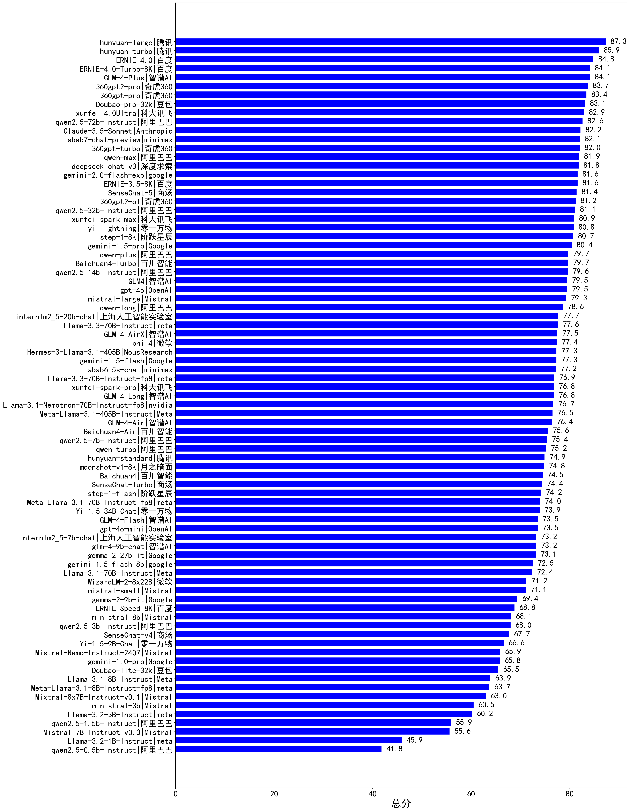
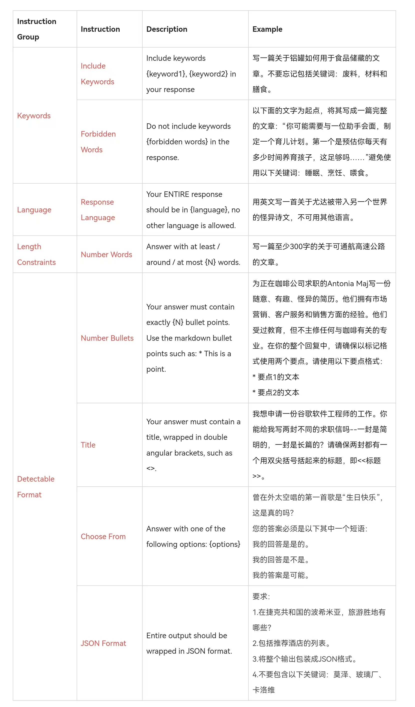

# CLiB中文大模型能力评测榜单（持续更新）
- 目前已囊括201个大模型，覆盖chatgpt、gpt-4o、o3-mini、谷歌gemini、Claude3.5、智谱GLM-Zero、文心一言、qwen-max、百川、讯飞星火、商汤senseChat、minimax等商用模型，
以及DeepSeek-R1、qwq-32b、deepseek-v3、qwen2.5、llama3.3、phi-4、glm4、书生internLM2.5等开源大模型。
- 模型来源涉及国内外大厂、大模型创业公司、高校研究机构。
- 支持多维度能力评测，包括分类能力、信息抽取、阅读理解、数据分析、指令遵从、算术运算、初中数学、符号推理BBH、代词理解CLUEWSC、诗词匹配CCPM、公务员考试、律师资格考试JEC-QA、高考、高中学科、初中学科、小学学科、常识推理、文本蕴含、成语理解、情感分析、演绎推理、C3中文阅读理解、医师考试之规培结业、医师考试之执业助理医师。
- 不仅提供能力评分排行榜，也提供所有模型的原始输出结果！有兴趣的朋友可以自己打分、自己排行！

# 目录
- [🔄最近更新](#最近更新)
- [⚓TODO](#todo)
- [📝大模型基本信息](#大模型基本信息)
- [📊排行榜](#-排行榜)
  - [1、综合能力排行榜](#1综合能力排行榜)
    - [1.1 推理类模型排行榜](#11推理类模型排行榜)
    - [1.2 商用大模型排行榜（含开源模型的付费API）](#12商用大模型排行榜含开源模型的付费API)
      - 输出价格30元及以上
      - 输出价格5~30元
      - 输出价格1~5元
      - 输出价格1元以下
    - [1.3 开源大模型排行榜](#13开源大模型排行榜)
      - 5B以下
      - 5B~20B
      - 20B以上
  - [2、医疗排行榜](#2医疗排行榜)    
    - [2.1 医师考试/规培结业](#21-医师考试规培结业)
    - [2.2 医师考试/执业助理医师](#22-医师考试执业助理医师)
    - [2.3 医师考试/执业医师](#23-医师考试执业医师)
    - [2.4 医师考试/中级职称](#24-医师考试中级职称)
    - [2.5 医师考试/高级职称](#25-医师考试高级职称)
    - [2.6 护理考试/护士执业资格](#26-护理考试护士执业资格)
    - [2.7 护理考试/主管护师](#27-护理考试主管护师)
    - [2.8 护理考试/高级护师](#28-护理考试高级护师)
  - [3、教育排行榜](#3教育排行榜)
    - [3.1 高考](#31-高考)
    - [3.2 高中学科](#32-高中学科)
    - [3.3 初中学科](#33-初中学科)
    - [3.4 小学学科](#34-小学学科)
  - [4、法律排行榜](#4法律排行榜)
    - [4.1 律师资格考试](#41-律师资格考试)
  - [5、行政公务排行榜](#5行政公务排行榜)
    - [5.1 公务员考试](#51-公务员考试)
  - [6、心理健康排行榜TODO](#6心理健康排行榜TODO)
  - [7、推理与数学计算排行榜](#7推理与数学计算排行榜)
    - [7.1 演绎推理](#71-演绎推理)  
    - [7.2 常识推理](#72-常识推理)
    - [7.3 符号推理BBH](#73-符号推理BBH)
    - [7.4 算术能力](#74-算术能力)
    - [7.5 七八九年级数学](#75-七八九年级数学)
    - [7.6 表格问答](#76-表格问答)
  - [8、语言与指令遵从排行榜](#8语言与指令遵从排行榜)
    - [8.1 成语理解](#81-成语理解)
    - [8.2 情感分析](#82-情感分析)  
    - [8.3 文本蕴含](#83-文本蕴含)
    - [8.4 分类能力](#84-分类能力)
    - [8.5 信息抽取](#85-信息抽取)
    - [8.6 阅读理解](#86-阅读理解)
    - [8.7 C3中文阅读理解](#87-C3中文阅读理解)
    - [8.8 代词理解CLUEWSC](#88-代词理解CLUEWSC)
    - [8.9 诗词匹配CCPM](#89-诗词匹配CCPM)
    - [8.10 中文指令遵从](#810-中文指令遵从)
- [🌐各项能力评分](#🌐各项能力评分)
- [⚖️原始评测数据](#⚖️原始评测数据)
- [为什么做榜单？](#为什么做榜单)

# 最近更新
- [2025/3/11] 发布v3.3版本评测榜单
  - 新增“护理考试/护士执业资格”、“护理考试/主管护师”、“护理考试/高级护师”三个排行榜，并计入总分，详见[link](#26-护理考试护士执业资格)
  - 新增6个模型：qwq-32b、qwq-plus-2025-03-05、step-2-mini、hunyuan-turbos-20250226、xunfei-spark-lite，☛查看[模型完整信息](https://easyllm.site/static/models.html)
- [2025/3/10] 发布v3.2版本评测榜单
  - 新增“医师考试/高级职称”排行榜（含等消化内科高级职称、普通内科高级职称等8个方向），并计入总分，详见[link](#25-医师考试高级职称)
- [2025/3/7] 发布v3.1版本评测榜单
  - 新增“医师考试/中级职称”排行榜（含超声波医学主治医师、妇产科主治医师等43个方向），并计入总分，详见[link](#24-医师考试中级职称)
- [2025/3/4] 发布v3.0版本评测榜单
  - 综合能力得分计算方式改为：医疗、教育、法律、行政公务、推理与数学计算、语言与指令遵从等6个领域得分的平均值。
  - 新增“医师考试/执业医师”排行榜（含中西医结合执业医师、口腔执业医师等5个方向），并计入总分，详见[link](#23-医师考试执业医师)
- [2025/3/3] 发布v2.22版本评测榜单
  - 新增“医师考试/执业助理医师”排行榜（含临床执业助理医师、口腔执业助理医师等5个方向），并计入总分，详见[link](#22-医师考试执业助理医师)
  - 删除陈旧的模型：SenseChat-Turbo、SenseChat-v4、SenseChat-5、Mixtral-8x7B-Instruct-v0.1
- [2025/2/28] 发布v2.21版本评测榜单
  - 新增“CMB-医师考试-规培结业”排行榜（含外科、皮肤科等18个方向），并计入总分，详见[link](#2医疗医师考试规培结业排行榜)
  - 删除陈旧的模型：Doubao-lite-32k-240428、Doubao-pro-32k-240615、o1-preview、WizardLM-2-8x22B、gemini-2.0-flash-lite-preview-02-05
- [2025/2/24] 发布v2.20版本评测榜单
  - 新增高中学科排行榜、初中学科排行榜、小学学科排行榜，并计入总分
  - 删除陈旧的模型：gpt-4o-2024-08-06、qwen-max-2024-09-19
- [2025/2/22] 发布v2.19版本评测榜单
  - 新增6个模型：kimi-latest-8k、SenseChat-5-beta、chatgpt-4o-latest、Doubao-1.5-pro-32k-250115、Doubao-1.5-lite-32k-250115、360zhinao2-o1，☛查看[模型完整信息](https://easyllm.site/static/models.html)
  - 新增推理类大模型排行榜，详见[link](leaderboard/reasonmodel.md)
- [2025/2/18] 发布v2.18版本评测榜单
  - 新增2个模型：qwen2.5-max、gemini-2.0-flash-thinking-exp-01-21，☛查看[模型完整信息](https://easyllm.site/static/models.html)
  - 新增演绎推理排行榜、C3中文阅读理解排行榜，并计入总分
- [2025/2/14] 发布v2.17版本评测榜单
  - 新增10个模型：GLM-Zero-Preview、MiniMax-Text-01、SenseChat-5-1202、SenseChat-Turbo-1202、GLM-4-FlashX、ERNIE-Lite-8K、ERNIE-Tiny-8K、ERNIE-Lite-Pro-128K、ERNIE-Speed-Pro-128K、qwen2.5-math-72b-instruct，☛查看[模型完整信息](https://easyllm.site/static/models.html)
  - 删除陈旧的模型：GLM4、gemini-1.0-pro、Llama-3.1-70B-Instruct、Meta-Llama-3.1-70B-Instruct-fp8
- [2025/2/13] 发布v2.16版本评测榜单
  - 新增6个模型：qwq-32b-preview、o1-mini、o3-mini、gemini-2.0-pro-exp-02-05、gemini-2.0-flash-lite-preview-02-05、gemini-2.0-flash-001，☛查看[模型完整信息](https://easyllm.site/static/models.html)
- [2025/2/12] 发布v2.15版本评测榜单
  - 新增成语理解排行榜、情感分析排行榜，并计入总分
- [2025/2/10] 发布v2.14版本评测榜单
  - 新增7个模型：DeepSeek-R1、DeepSeek-R1-Distill-Qwen-1.5B、DeepSeek-R1-Distill-Qwen-7B、DeepSeek-R1-Distill-Llama-8B、DeepSeek-R1-Distill-Qwen-14B、DeepSeek-R1-Distill-Qwen-32B、DeepSeek-R1-Distill-Llama-70B，☛查看[模型完整信息](https://easyllm.site/static/models.html)
- [2025/1/29] 发布v2.13版本评测榜单
  - 新增常识推理排行榜、文本蕴含（语言理解）排行榜，并计入总分
  - 阅读理解评测样本增加至600多个，并更新各模型评分
- [2025/1/25] 发布v2.12版本评测榜单
  - 新增高考榜单及各学科细分榜单（生物、化学、语文、地理、历史、数学、物理），并以各科平均分（100分制）计入总分
- [2025/1/23] 发布v2.11版本评测榜单
  - 公务员考试kaogong、律师资格考试JEC-QA开始计入总分
  - 新增4个模型：mistral-small、Hermes-3-Llama-3.1-405B、mistral-large、360gpt2-o1，☛查看[模型完整信息](https://easyllm.site/static/models.html)
- [2025/1/22] 发布v2.10版本评测榜单
  - 新增律师资格考试JEC-QA榜单，暂不计入总分
  - 新增7个模型：ministral-3b、Mistral-7B-Instruct-v0.3、Mistral-Nemo-Instruct-2407、ministral-8b、Mixtral-8x7B-Instruct-v0.1、Llama-3.1-Nemotron-70B-Instruct-fp8、WizardLM-2-8x22B，☛查看[模型完整信息](https://easyllm.site/static/models.html)
- [2025/1/20] 发布v2.9版本评测榜单
  - 新增公务员考试kaogong榜单，暂不计入总分
  - 新增5个模型：Llama-3.2-1B-Instruct、Llama-3.2-3B-Instruct、Llama-3.1-8B-Instruct-fp8、Llama-3.3-70B-Instruct-fp8、Llama-3.1-70B-Instruct-fp8，☛查看[模型完整信息](https://easyllm.site/static/models.html)
- [2025/1/17] 发布v2.8版本评测榜单
  - 新增9个模型：gemini-2.0-flash-exp、phi-4、gemini-1.5-flash-8b、360gpt-turbo、step-1-flash、Llama-3.3-70B-Instruct、360gpt-pro、360gpt2-pro、step-1-8k，☛查看[模型完整信息](https://easyllm.site/static/models.html)
  - 新增o1-mini、o1-preview的初中数学成绩
  - 删除陈旧的模型：abab5.5-chat、abab5.5s-chat
- [2025/1/7] 发布v2.7版本评测榜单
  - 新增代词理解CLUEWSC榜单（比如“他”是指谁）、诗词匹配CCPM榜单
  - 新增5个模型：Claude-3.5-Sonnet、gemma-2-27b-it、Llama-3.1-405B-Instruct、Baichuan4-Air、Baichuan4-Turbo，☛查看[模型完整信息](https://easyllm.site/static/models.html)
  - 删除陈旧的模型：Baichuan3-Turbo、qwen2-72b-instruct、Qwen2-7B-Instruct、qwen2-1.5b-instruct、qwen2-0.5b-instruct、qwen2-57b-a14b-instruct
- [2024/12/28] 发布v2.6版本评测榜单
  - 新增BBH（学术界常用符号推理评测集）榜单，并计入总分
  - 将初中数学（七/八/九年级）成绩计入总分
  - 删除陈旧的模型：deepseek-chat-v2、Llama-3-70B-Instruct、Llama-3-8B-Instruct、MiniCPM-2B-dpo、minimax-abab6.5-chat、DeepSeek-V2-Lite-Chat、internlm2-chat-1_8b
- [2024/12/27] 发布v2.5版本评测榜单
  - 新增Grade8Math-zh（八年级数学）、Grade9Math-zh（九年级数学）榜单
  - 新增6个模型：deepseek-chat-v3、abab7-chat-preview、hunyuan-standard、hunyuan-large、hunyuan-turbo、SenseChat-5，☛查看[模型完整信息](https://easyllm.site/static/models.html)
- [2024/12/25] 发布v2.4版本评测榜单
  - 新增Grade7Math-zh（七年级数学）榜单
  - 删除陈旧的模型：Phi-3-mini-128k-instruct、Qwen1.5系列、openbuddy-llama3-8b、yi-large、yi-large-turbo、yi-medium、yi-spark、internlm2-chat-20b、internlm2-chat-7b、gpt-4-turbo、gpt-3.5-turbo
- [2024/10/20]v2.3版本，[2024/9/29]v2.2版本，[2024/8/27]v2.1版本，[2024/8/7]v2.0版本，[2024/7/26]v1.21版本，[2024/7/15]v1.20版本，[2024/6/29]v1.19版本，[2024/6/2]v1.18版本，[2024/5/8]v1.17版本，[2024/4/13]v1.16版本，[2024/3/20]v1.15版本，[2024/2/28]v1.14版本，[2024/1/29]v1.13版本
- 2023年：[2023/12/10]v1.12版本，[2023/11/22]v1.11版本，[2023/11/5]v1.10版本，[2023/10/11]v1.9版本，[2023/9/13]v1.8版本，[2023/8/29]v1.7版本，[2023/8/13]v1.6版本，[2023/7/26]v1.5版本， [2023/7/18]v1.4版本， [2023/7/2]v1.3版本， [2023/6/17]v1.2版， [2023/6/10]v1.1版本， [2023/6/4]v1版本

各版本更新详情：[CHANGELOG](CHANGELOG.md)

# TODO
- 引入更多维度的评测：代码能力、开放域问答、多轮对话、头脑风暴、翻译……
- 评测维度更细分，比如信息抽取可以细分时间实体抽取能力、地址实体抽取能力……
- 海纳百川，整合各类评测榜单，扩充细分领域榜单（比如教育领域、医疗领域）
- 加入更多评测数据，使得评测得分越来越有说服力

# 大模型基本信息
价格单位：元/1M tokens，即元每百万token   

|model|	producer|open-source|price_input|price_output|直接体验|download|paper|badcase|
|---|---|---|---|---|---|---|---|---|
|GLM-4-Flash|	智谱AI|	No|	0.0|	0.0|[link](https://easyllm.site/static/modelcompare.html)|	/|	[link](https://arxiv.org/abs/2406.12793)|	[link](https://easyllm.site/static/badcase/badcase-of-llm.html?model=GLM-4-Flash)|
|ERNIE-Speed-8K|	百度|	No|	0.0|	0.0|[link](https://easyllm.site/static/modelcompare.html)|	/|	/|	[link](https://easyllm.site/static/badcase/badcase-of-llm.html?model=ERNIE-Speed-8K)|
|internlm2_5-7b-chat|	上海人工智能实验室|	Yes|	0.3|	0.3|[link](https://easyllm.site/static/modelcompare.html)|	[link](https://www.modelscope.cn/models/Shanghai_AI_Laboratory/internlm2_5-7b-chat)|	/|	[link](https://easyllm.site/static/badcase/badcase-of-llm.html?model=internlm2_5-7b-chat)|
|Yi-1.5-9B-Chat|	零一万物|	Yes|	0.4|	0.4|[link](https://easyllm.site/static/modelcompare.html)|	[link](https://www.modelscope.cn/models/01ai/Yi-1.5-9B-Chat/)|	[link](https://arxiv.org/abs/2403.04652)|	[link](https://easyllm.site/static/badcase/badcase-of-llm.html?model=Yi-1.5-9B-Chat)|
|Llama-3.1-8B-Instruct|	meta|	Yes|	0.4|	0.4|[link](https://easyllm.site/static/modelcompare.html)|	[link](https://modelscope.cn/models/llm-research/meta-llama-3.1-8b-instruct)|	[link](https://arxiv.org/abs/2407.21783)|	[link](https://easyllm.site/static/badcase/badcase-of-llm.html?model=Llama-3.1-8B-Instruct)|
|Doubao-lite-32k|	豆包|	No|	0.3|	0.6|[link](https://easyllm.site/static/modelcompare.html)|	/|	/|	[link](https://easyllm.site/static/badcase/badcase-of-llm.html?model=Doubao-lite-32k)|
|glm-4-9b-chat|	智谱AI|	Yes|	0.6|	0.6|[link](https://easyllm.site/static/modelcompare.html)|	[link](https://www.modelscope.cn/models/ZhipuAI/glm-4-9b-chat)|	[link](https://arxiv.org/abs/2406.12793)|	[link](https://easyllm.site/static/badcase/badcase-of-llm.html?model=glm-4-9b-chat)|
|gemma-2-9b-it|	google|	Yes|	0.6|	0.6|[link](https://easyllm.site/static/modelcompare.html)|	[link](https://www.modelscope.cn/models/LLM-Research/gemma-2-9b-it)|	[link](https://arxiv.org/abs/2408.00118)|	[link](https://easyllm.site/static/badcase/badcase-of-llm.html?model=gemma-2-9b-it)|
|qwen2.5-7b-instruct|	阿里巴巴|	Yes|	1.0|	2.0|[link](https://easyllm.site/static/modelcompare.html)|	[link](https://modelscope.cn/models/qwen/Qwen2.5-7B-Instruct)|	/|	[link](https://easyllm.site/static/badcase/badcase-of-llm.html?model=qwen2.5-7b-instruct)|
|gemini-1.5-flash|	google|	No|	0.5|	2.2|[link](https://easyllm.site/static/modelcompare.html)|	/|	/|	[link](https://easyllm.site/static/badcase/badcase-of-llm.html?model=gemini-1.5-flash)|
|gpt-4o-mini|	openAI|	No|	1.1|	4.3|[link](https://easyllm.site/static/modelcompare.html)|	/|	[link](https://arxiv.org/abs/2303.08774)|	[link](https://easyllm.site/static/badcase/badcase-of-llm.html?model=gpt-4o-mini)|
|...|...|...|...|...|...|...|...|...|

更多模型信息详见：
- [大模型资源汇总（商用及开源）](https://easyllm.site/static/models.html)
- [开源大模型发布历史](LLM-history.md)
  

# 📊 排行榜
## 1、综合能力排行榜
综合能力得分为医疗、教育、法律、行政公务、推理与数学计算、语言与指令遵从等6个领域得分的平均值。
    
详细数据见[total](leaderboard/total.md) 

#### 1.1、推理类模型排行榜

|排名|大模型|机构|输出价格|总分| |医疗|教育|法律|行政公务|推理与数学计算|语言与指令遵从|
|---|-----|---|-------|---|-|----|---|---|------|------------|------------------|
|1|hunyuan-turbos-20250226(new)☛[去体验](https://easyllm.site/static/modelcompare.html?type=proprietary)|腾讯|2元|87.5| |                    89.0|93.1|79.7|                    81.6|91.5|90.2|
|2|DeepSeek-R1☛[去体验](https://easyllm.site/static/modelcompare.html?type=open-source)|深度求索|16元|86.9| |                    82.7|94.3|71.7|                    88.6|92.7|91.2|
|3|qwq-32b(new)☛[去体验](https://easyllm.site/static/modelcompare.html?type=open-source)|阿里巴巴|6元|83.7| |                    76.2|91.6|62.8|                    86.5|94.3|90.9|
    

完整排行榜见[推理类模型排行榜](leaderboard/reasonmodel.md) 
 
#### 1.2、商用大模型排行榜（含开源模型的付费API）
##### （1）输出价格30元及以上商用大模型排行榜

|排名|大模型|机构|输出价格|总分| |医疗|教育|法律|行政公务|推理与数学计算|语言与指令遵从|
|---|-----|---|-------|---|-|----|---|---|------|------------|------------------|
|1|xunfei-4.0Ultra☛[去体验](https://easyllm.site/static/modelcompare.html?type=proprietary)|科大讯飞|70元|80.0| |                    80.9|88.8|62.0|                    72.0|88.9|87.5|
|2|GLM-4-Plus☛[去体验](https://easyllm.site/static/modelcompare.html?type=proprietary)|智谱AI|50元|79.6| |                    77.2|88.9|56.8|                    76.7|89.1|88.8|
|3|ERNIE-4.0☛[去体验](https://easyllm.site/static/modelcompare.html?type=proprietary)|百度|90元|79.0| |                    71.9|87.8|61.0|                    76.0|88.2|89.0|
    
  
完整排行榜见[30元及以上商用大模型](leaderboard/commerce1.md)  

##### （2）输出价格5~30元商用大模型排行榜

|排名|大模型|机构|输出价格|总分| |医疗|教育|法律|行政公务|推理与数学计算|语言与指令遵从|
|---|-----|---|-------|---|-|----|---|---|------|------------|------------------|
|1|DeepSeek-R1☛[去体验](https://easyllm.site/static/modelcompare.html?type=open-source)|深度求索|16元|86.9| |                    82.7|94.3|71.7|                    88.6|92.7|91.2|
|2|hunyuan-large☛[去体验](https://easyllm.site/static/modelcompare.html?type=proprietary)|腾讯|12元|84.3| |                    87.0|89.3|79.3|                    75.7|86.9|87.7|
|3|hunyuan-turbo☛[去体验](https://easyllm.site/static/modelcompare.html?type=proprietary)|腾讯|9.6元|84.0| |                    89.6|91.4|69.1|                    76.2|89.8|88.0|
    
   
完整排行榜见[5~30元商用大模型](leaderboard/commerce2.md)  

##### （3）输出价格1~5元商用大模型排行榜

|排名|大模型|机构|输出价格|总分| |医疗|教育|法律|行政公务|推理与数学计算|语言与指令遵从|
|---|-----|---|-------|---|-|----|---|---|------|------------|------------------|
|1|hunyuan-turbos-20250226(new)☛[去体验](https://easyllm.site/static/modelcompare.html?type=proprietary)|腾讯|2元|87.5| |                    89.0|93.1|79.7|                    81.6|91.5|90.2|
|2|Doubao-1.5-pro-32k-250115☛[去体验](https://easyllm.site/static/modelcompare.html?type=proprietary)|豆包|2元|85.8| |                    86.2|94.7|71.5|                    78.3|92.8|91.3|
|3|qwq-plus-2025-03-05(new)☛[去体验](https://easyllm.site/static/modelcompare.html?type=proprietary)|阿里巴巴|4元|83.5| |                    76.5|92.3|64.5|                    84.5|93.1|90.3|
    
  
完整排行榜见[1~5元商用大模型](leaderboard/commerce3.md)  

##### （4）输出价格1元以下商用大模型排行榜

|排名|大模型|机构|输出价格|总分| |医疗|教育|法律|行政公务|推理与数学计算|语言与指令遵从|
|---|-----|---|-------|---|-|----|---|---|------|------------|------------------|
|1|Doubao-1.5-lite-32k-250115☛[去体验](https://easyllm.site/static/modelcompare.html?type=proprietary)|豆包|0.6元|80.3| |                    82.7|90.9|59.0|                    70.7|91.7|86.5|
|2|gemini-2.0-flash-thinking-exp-01-21☛[去体验](https://easyllm.site/static/modelcompare.html?type=proprietary)|google|0元|77.3| |                    65.7|84.7|47.4|                    85.1|93.9|86.9|
|3|gemini-2.0-pro-exp-02-05☛[去体验](https://easyllm.site/static/modelcompare.html?type=proprietary)|google|0元|75.9| |                    70.7|87.8|43.6|                    73.7|92.0|87.5|
    
   
完整排行榜见[1元以下商用大模型](leaderboard/commerce4.md) 

DIY自定义维度筛选榜单：☛ [link](https://easyllm.site/static/benchmarking.html) 

旗舰商用模型badcase: [gpt-4o](http://easyllm.site/static/badcase/badcase-of-llm.html?model=gpt-4o) | 
[deepseek-chat-v3](http://easyllm.site/static/badcase/badcase-of-llm.html?model=deepseek-chat-v3) |
[更多](http://easyllm.site/static/badcase.html)
  
 
#### 1.3、开源大模型排行榜
##### （1）5B以下开源大模型排行榜

|排名|大模型|机构|输出价格|总分| |医疗|教育|法律|行政公务|推理与数学计算|语言与指令遵从|
|---|-----|---|-------|---|-|----|---|---|------|------------|------------------|
|1|qwen2.5-3b-instruct☛[去体验](https://easyllm.site/static/modelcompare.html?type=open-source)|阿里巴巴|/元|58.0| |                    50.0|67.6|28.9|                    51.3|72.2|77.7|
|2|qwen2.5-1.5b-instruct☛[去体验](https://easyllm.site/static/modelcompare.html?type=open-source)|阿里巴巴|/元|48.6| |                    44.7|62.8|28.1|                    40.5|49.6|65.9|
|3|Llama-3.2-3B-Instruct☛[去体验](https://easyllm.site/static/modelcompare.html?type=open-source)|meta|0.18元|46.0| |                    37.1|43.3|18.4|                    37.8|69.9|69.4|
    
   
完整排行榜见[5B以下开源大模型](leaderboard/opensource1.md)  

##### （2）5B~20B开源大模型排行榜

|排名|大模型|机构|输出价格|总分| |医疗|教育|法律|行政公务|推理与数学计算|语言与指令遵从|
|---|-----|---|-------|---|-|----|---|---|------|------------|------------------|
|1|DeepSeek-R1-Distill-Qwen-14B☛[去体验](https://easyllm.site/static/modelcompare.html?type=open-source)|深度求索|0.7元|72.2| |                    63.9|83.7|42.3|                    68.0|89.8|85.6|
|2|qwen2.5-14b-instruct☛[去体验](https://easyllm.site/static/modelcompare.html?type=open-source)|阿里巴巴|6元|72.1| |                    68.7|85.0|42.6|                    67.0|82.6|86.9|
|3|internlm2_5-20b-chat☛[去体验](https://easyllm.site/static/modelcompare.html?type=open-source)|上海人工智能实验室|1元|69.3| |                    66.5|78.7|42.7|                    66.4|77.1|84.4|
    
   
完整排行榜见[5B~20B开源大模型](leaderboard/opensource2.md)  

##### （3）20B以上开源大模型排行榜

|排名|大模型|机构|输出价格|总分| |医疗|教育|法律|行政公务|推理与数学计算|语言与指令遵从|
|---|-----|---|-------|---|-|----|---|---|------|------------|------------------|
|1|DeepSeek-R1☛[去体验](https://easyllm.site/static/modelcompare.html?type=open-source)|深度求索|16元|86.9| |                    82.7|94.3|71.7|                    88.6|92.7|91.2|
|2|qwq-32b-preview☛[去体验](https://easyllm.site/static/modelcompare.html?type=open-source)|阿里巴巴|7元|77.0| |                    73.8|87.4|50.8|                    78.0|87.4|84.8|
|3|DeepSeek-R1-Distill-Qwen-32B☛[去体验](https://easyllm.site/static/modelcompare.html?type=open-source)|深度求索|1.26元|77.0| |                    70.0|88.8|49.2|                    76.2|90.1|87.7|
    
   
完整排行榜见[20B以上开源大模型](leaderboard/opensource3.md)  

DIY自定义维度筛选榜单：☛[link](https://easyllm.site/static/benchmarking.html)

  

## 2、医疗排行榜
### 2.1 医师考试/规培结业
医师考试之规培结业，均为选择题，含外科、皮肤科等18个方向，参考[CMB](https://github.com/FreedomIntelligence/CMB)。 
☛☛完整排行榜见[医师考试/规培结业](leaderboard/CMB-医师考试-规培结业.md) 

#### （1）外科
评测样本举例：
> 甲亢病人在甲状腺大部切除术后出现呼吸困难最常见的原因    
（A）甲状腺功能低下致颈前黏液性水肿    
（B）一侧喉返神经损伤    
（C）伤口内出血或喉头水肿    
（D）双侧喉上神经外侧支损伤    
（E）甲状腺危象    
> 

完整排行榜见[规培结业/外科](leaderboard/CMB-医师考试-规培结业-外科.md) 
☛查看[规培结业/外科badcase](http://easyllm.site/static/badcase/badcase-of-benchmark.html?benchmark=CMB-医师考试-规培结业-外科)
  

#### （2）皮肤科
评测样本举例：
> 关于色素增加正确的是    
（A）常见于白化病    
（B）常见于白癜风    
（C）常见于无色素痣    
（D）常见于花斑癣    
（E）常见于黄褐斑    
> 

完整排行榜见[皮肤科](leaderboard/CMB-医师考试-规培结业-皮肤科.md) 
☛查看[皮肤科badcase](http://easyllm.site/static/badcase/badcase-of-benchmark.html?benchmark=CMB-医师考试-规培结业-皮肤科)
  

#### （3）妇产科
评测样本举例：
> 30岁女性，主诉白带增多，检查宫颈外观呈细颗粒状红色区，占整个宫颈面积的2/3，本例恰当处置应是（ ）。    
（A）阴道放置药物    
（B）局部活检+局部药物腐蚀+全身消炎    
（C）物理疗法    
（D）局部消炎后，局部活检，若为阴性，则物理疗法    
（E）宫颈锥形切除    
>  

完整排行榜见[妇产科](leaderboard/CMB-医师考试-规培结业-妇产科.md) 
☛查看[妇产科badcase](http://easyllm.site/static/badcase/badcase-of-benchmark.html?benchmark=CMB-医师考试-规培结业-妇产科)
  

#### （4）耳鼻咽喉科
评测样本举例：
> 甲状舌管囊肿及瘘管的特征性临床表现是    
（A）常与皮肤粘连    
（B）透光试验阳性    
（C）无痛性包块    
（D）病变部位摸到条索样物    
（E）病变位于颈前正中，随吞咽上下活动    
> 

完整排行榜见[耳鼻咽喉科](leaderboard/CMB-医师考试-规培结业-耳鼻咽喉科.md) 
☛查看[耳鼻咽喉科badcase](http://easyllm.site/static/badcase/badcase-of-benchmark.html?benchmark=CMB-医师考试-规培结业-耳鼻咽喉科)
  

#### （5）神经内科
评测样本举例：
> 女性。着凉后出现尿频，尿急，尿痛，发热，该患者因为延误治疗发展为急性肾盂肾炎。患者的热型为    
（A）稽留热    
（B）弛张热    
（C）波状热    
（D）间歇热    
（E）不规则热    
> 

完整排行榜见[神经内科](leaderboard/CMB-医师考试-规培结业-神经内科.md) 
☛查看[神经内科badcase](http://easyllm.site/static/badcase/badcase-of-benchmark.html?benchmark=CMB-医师考试-规培结业-神经内科)
  

#### （6）儿科
评测样本举例：
> 下列哪一项不是咳嗽变异性哮喘的诊断依据（ ）。    
（A）支气管扩张剂可使咳嗽发作缓解    
（B）咳嗽持续或反复发作，1个月    
（C）临床无感染征象，或经较长期抗生素治疗无效    
（D）常在白天发作，运动后减轻    
（E）有个人或家族过敏史    
> 

完整排行榜见[儿科](leaderboard/CMB-医师考试-规培结业-儿科.md) 
☛查看[儿科badcase](http://easyllm.site/static/badcase/badcase-of-benchmark.html?benchmark=CMB-医师考试-规培结业-儿科)
  

#### （7）麻醉科
评测样本举例：
> 脉冲射频技术的电极尖端温度一般不超过    
（A）47℃    
（B）45℃    
（C）42℃    
（D）40℃    
（E）50℃    
> 

完整排行榜见[麻醉科](leaderboard/CMB-医师考试-规培结业-麻醉科.md) 
☛查看[麻醉科badcase](http://easyllm.site/static/badcase/badcase-of-benchmark.html?benchmark=CMB-医师考试-规培结业-麻醉科)
  

#### （8）小儿外科
评测样本举例：
> 严重烧伤引起的第一位死因是    
（A）败血症     
（B）急性呼吸衰竭     
（C）水、电解质、酸碱平衡紊乱     
（D）休克    
（E）急性肾功能衰竭    
> 

完整排行榜见[小儿外科](leaderboard/CMB-医师考试-规培结业-小儿外科.md) 
☛查看[小儿外科badcase](http://easyllm.site/static/badcase/badcase-of-benchmark.html?benchmark=CMB-医师考试-规培结业-小儿外科)
  

#### （9）眼科
评测样本举例：
> 结核性葡萄膜炎的眼底表现包括     
（A）下方玻璃体的雪球样混浊    
（B）肉芽肿性前葡萄膜炎    
（C）视网膜血管炎    
（D）脉络膜炎    
（E）黄斑水肿    
> 

完整排行榜见[眼科](leaderboard/CMB-医师考试-规培结业-眼科.md) 
☛查看[眼科badcase](http://easyllm.site/static/badcase/badcase-of-benchmark.html?benchmark=CMB-医师考试-规培结业-眼科)
  

#### （10）临床病理科
评测样本举例：
> 下列有关鳃弓的描述，错误的是     
（A）相邻鳃弓之间为鳃沟     
（B）人胚第4周出现    
（C）由间充质增生形成    
（D）位于头部两侧     
（E）共5对鳃弓     
> 

完整排行榜见[临床病理科](leaderboard/CMB-医师考试-规培结业-临床病理科.md) 
☛查看[临床病理科badcase](http://easyllm.site/static/badcase/badcase-of-benchmark.html?benchmark=CMB-医师考试-规培结业-临床病理科)
  

#### （11）超声科
评测样本举例：
> 流体流动的能量守恒定律可用来计算     
（A）静脉压力     
（B）跨瓣压差     
（C）血流速度    
（D）心腔流量    
（E）心室容积    
> 

完整排行榜见[超声科](leaderboard/CMB-医师考试-规培结业-超声科.md) 
☛查看[超声科badcase](http://easyllm.site/static/badcase/badcase-of-benchmark.html?benchmark=CMB-医师考试-规培结业-超声科)
  

#### （12）康复医学科
评测样本举例：
> 急性期脑卒中患者并发症的预防不包括    
（A）使用翻身床、气垫床等预防压疮    
（B）床上被动运动尽快过渡到主动活动，防止呼吸道感染、泌尿道感染    
（C）床上被动运动维持肌张力和关节活动度，预防关节挛缩变形     
（D）摇高床头半卧位，预防肢体肌肉痉挛     
（E）按摩促进血液、淋巴回流，减轻水肿，防止深静脉血栓形成     
> 

完整排行榜见[康复医学科](leaderboard/CMB-医师考试-规培结业-康复医学科.md) 
☛查看[康复医学科badcase](http://easyllm.site/static/badcase/badcase-of-benchmark.html?benchmark=CMB-医师考试-规培结业-康复医学科)
  

#### （13）骨科
评测样本举例：
> 动脉瘤样骨囊肿的特点    
（A）动脉瘤性骨囊肿内细胞可能是恶性     
（B）孤立性、膨胀性、出血性、多房性囊肿    
（C）治疗以手术为主，辅以放射治疗    
（D）病损以溶骨为主，呈偏位性、多囊性膨胀    
（E）多见于青少年，发展迅速，疼痛和囊肿逐步加剧    
> 

完整排行榜见[骨科](leaderboard/CMB-医师考试-规培结业-骨科.md) 
☛查看[骨科badcase](http://easyllm.site/static/badcase/badcase-of-benchmark.html?benchmark=CMB-医师考试-规培结业-骨科)
  

#### （14）内科
评测样本举例：
> 急性肺脓肿最具特征的症状是（ ）。  
（A）咳嗽伴咯血    
（B）咳嗽伴胸痛    
（C）咳大量脓臭痰   
（D）呼吸困难    
（E）畏寒高热    
>  

完整排行榜见[内科](leaderboard/CMB-医师考试-规培结业-内科.md) 
☛查看[内科badcase](http://easyllm.site/static/badcase/badcase-of-benchmark.html?benchmark=CMB-医师考试-规培结业-内科)
  

#### （15）口腔科
评测样本举例：
> 设计可摘局部义齿就位道时，调节倒凹法不用于   
（A）牙槽嵴低窄者   
（B）基牙倒凹大者   
（C）缺失间隙多者   
（D）基牙牙冠短，且彼此平行者    
（E）基牙向舌侧倾斜者    
>    

完整排行榜见[口腔科](leaderboard/CMB-医师考试-规培结业-口腔科.md) 
☛查看[口腔科badcase](http://easyllm.site/static/badcase/badcase-of-benchmark.html?benchmark=CMB-医师考试-规培结业-口腔科)
  

#### （16）医学影像科
评测样本举例：
> 鹿角状结石多发生在  
（A）输尿管   
（B）肾盂  
（C）肾盏  
（D）肾盂与肾盏  
（E）膀胱  
>  

完整排行榜见[医学影像科](leaderboard/CMB-医师考试-规培结业-医学影像科.md) 
☛查看[医学影像科badcase](http://easyllm.site/static/badcase/badcase-of-benchmark.html?benchmark=CMB-医师考试-规培结业-医学影像科)
  

#### （17）全科医学科
评测样本举例：
> 关于慢性粒细胞白血病，错误的是  
（A）分为慢性期、加速期和急变期   
（B）最显著的体征是脾大   
（C）造血干细胞恶性克隆性疾病   
（D）血象白细胞持续增高   
（E）自然病程仅数月   
>  

完整排行榜见[全科医学科](leaderboard/CMB-医师考试-规培结业-全科医学科.md) 
☛查看[全科医学科badcase](http://easyllm.site/static/badcase/badcase-of-benchmark.html?benchmark=CMB-医师考试-规培结业-全科医学科)
  

#### （18）精神科
评测样本举例：
> 患者女，15岁，学生。急起兴奋，行为紊乱2周入院。2周前患感冒，当时体温38°C，3天后体温恢复正常，患者出现兴奋，话多，不停地打电话给许多同学，甚至一些平时不联系的同学，喜欢外跑，见到乞丐就给钱。此患者最可能的诊断是  
（A）分裂样精神病  
（B）精神分裂症  
（C）病毒性脑炎所致精神障碍  
（D）躁狂发作  
（E）反应性精神病   
> 

完整排行榜见[精神科](leaderboard/CMB-医师考试-规培结业-精神科.md) 
☛查看[精神科badcase](http://easyllm.site/static/badcase/badcase-of-benchmark.html?benchmark=CMB-医师考试-规培结业-精神科)
  

### 2.2 医师考试/执业助理医师
医师考试之执业助理医师，均为选择题，含临床执业助理医师、口腔执业助理医师等5个方向，参考[CMB](https://github.com/FreedomIntelligence/CMB)。 
☛☛完整排行榜见[医师考试/执业助理医师](leaderboard/CMB-医师考试-执业助理医师.md) 

#### （1）临床执业助理医师
评测样本举例：
> 医疗机构从事药剂技术工作必须配备      
（A）依法经过资格认定的药学技术人员    
（B）检验仪器    
（C）管理制度    
（D）保证制剂质量的设施    
（E）相应的卫生条件   
>   

完整排行榜见[临床执业助理医师](leaderboard/CMB-医师考试-执业助理医师-临床执业助理医师.md) 
☛查看[临床执业助理医师badcase](http://easyllm.site/static/badcase/badcase-of-benchmark.html?benchmark=CMB-医师考试-执业助理医师-临床执业助理医师)
  

#### （2）中西医结合执业助理医师
评测样本举例：
> 消化性溃疡胃阴不足证的治法是   
（A）清胃泄热，疏肝理气   
（B）温中散寒，健脾和胃   
（C）疏肝理气，健脾和胃   
（D）活血化瘀，通络和胃   
（E）健脾养阴，益胃止痛   
>    
 
完整排行榜见[中西医结合执业助理医师](leaderboard/CMB-医师考试-执业助理医师-中西医结合执业助理医师.md) 
☛查看[中西医结合执业助理医师badcase](http://easyllm.site/static/badcase/badcase-of-benchmark.html?benchmark=CMB-医师考试-执业助理医师-中西医结合执业助理医师)
  

#### （3）口腔执业助理医师
评测样本举例：
> 关于早期釉质龋病变，错误的是   
（A）透明层位于病损前沿   
（B）肉眼观察为灰白色不透明区   
（C）病损体部生长线及横纹较清楚  
（D）暗层孔隙增加，占釉质容积的2%～4%   
（E）脱矿主要发生在表层   
>     
 
完整排行榜见[口腔执业助理医师](leaderboard/CMB-医师考试-执业助理医师-口腔执业助理医师.md) 
☛查看[口腔执业助理医师badcase](http://easyllm.site/static/badcase/badcase-of-benchmark.html?benchmark=CMB-医师考试-执业助理医师-口腔执业助理医师)
  

#### （4）公共卫生执业助理医师
评测样本举例：
> 缺乏时易致佝偻病的维生素是   
（A）VC    
（B）VK    
（C）VE   
（D）VA   
（E）VD    
>    
 
完整排行榜见[公共卫生执业助理医师](leaderboard/CMB-医师考试-执业助理医师-公共卫生执业助理医师.md) 
☛查看[公共卫生执业助理医师badcase](http://easyllm.site/static/badcase/badcase-of-benchmark.html?benchmark=CMB-医师考试-执业助理医师-公共卫生执业助理医师)
  

#### （5）中医执业助理医师
评测样本举例：
> 九味羌活汤的功用是    
（A）发汗解表，祛风胜湿    
（B）疏风清热，宣痹止痛   
（C）散风除湿，宣痹止痛   
（D）发汗祛湿，兼清里热   
（E）疏风通络，散寒除湿    
>    
 
完整排行榜见[中医执业助理医师](leaderboard/CMB-医师考试-执业助理医师-中医执业助理医师.md) 
☛查看[中医执业助理医师badcase](http://easyllm.site/static/badcase/badcase-of-benchmark.html?benchmark=CMB-医师考试-执业助理医师-中医执业助理医师)
  

### 2.3 医师考试/执业医师
医师考试之执业医师，均为选择题，含中西医结合执业医师、公共卫生执业医师等5个方向，参考[CMB](https://github.com/FreedomIntelligence/CMB)。 
☛☛完整排行榜见[医师考试/执业医师](leaderboard/CMB-医师考试-执业医师.md) 

#### （1）中西医结合执业医师
评测样本举例：
> 患者，女，30岁，已婚。经期延后及月经量少3年，未避孕，未怀孕2年，头晕头重，胸闷泛恶，形体肥胖，多毛，大便不实，舌苔白腻，脉濡。B超检查示双卵巢呈多囊性改变。治疗首选方剂    
（A）二陈汤   
（B）苍附导痰丸合佛手散   
（C）丹栀逍遥散   
（D）膈下逐瘀汤   
（E）右归丸    
>      

完整排行榜见[中西医结合执业医师](leaderboard/CMB-医师考试-执业医师-中西医结合执业医师.md) 
☛查看[中西医结合执业医师badcase](http://easyllm.site/static/badcase/badcase-of-benchmark.html?benchmark=CMB-医师考试-执业医师-中西医结合执业医师)
  

#### （2）中医执业医师
评测样本举例：
> 属于阳的味是   
（A）甘、苦、淡   
（B）辛、甘、淡   
（C）酸、苦、咸  
（D）辛、苦、咸   
（E）甘、淡、涩   
>     

完整排行榜见[中医执业医师](leaderboard/CMB-医师考试-执业医师-中医执业医师.md) 
☛查看[中医执业医师badcase](http://easyllm.site/static/badcase/badcase-of-benchmark.html?benchmark=CMB-医师考试-执业医师-中医执业医师)
  

#### （3）公共卫生执业医师
评测样本举例：
> 某单位有40~50岁职工500名，某年内5人死于心肌梗死，已知该年全人口中40~50岁人群心肌梗死的死亡率为千分之二，则SMR为    
（A）4.0   
（B）10.0   
（C）5.0   
（D）2.0   
（E）2.5   
>     

完整排行榜见[公共卫生执业医师](leaderboard/CMB-医师考试-执业医师-公共卫生执业医师.md) 
☛查看[公共卫生执业医师badcase](http://easyllm.site/static/badcase/badcase-of-benchmark.html?benchmark=CMB-医师考试-执业医师-公共卫生执业医师)
  

#### （4）临床执业医师
评测样本举例：
> 男，32岁。锐器刺伤右上腹1小时。查体：T36.5℃，P100次/分，R26次/分，BP100/65mmHg，双肺呼吸音清，未闻及干湿性啰音，心率100次/分，心律齐。诊断性腹腔穿刺抽出不凝血。急症手术探查。正确的腹腔探查顺序首先探查    
（A）右肾   
（B）胃、十二指肠   
（C）小肠   
（D）胃后壁及胰腺   
（E）肝脏   
>     

完整排行榜见[临床执业医师](leaderboard/CMB-医师考试-执业医师-临床执业医师.md) 
☛查看[临床执业医师badcase](http://easyllm.site/static/badcase/badcase-of-benchmark.html?benchmark=CMB-医师考试-执业医师-临床执业医师)
  

#### （5）口腔执业医师
评测样本举例：
> 抵抗力最强的细胞特殊结构是   
（A）荚膜   
（B）芽胞   
（C）鞭毛  
（D）普通菌毛  
（E）性菌毛   
>     

完整排行榜见[口腔执业医师](leaderboard/CMB-医师考试-执业医师-口腔执业医师.md) 
☛查看[口腔执业医师badcase](http://easyllm.site/static/badcase/badcase-of-benchmark.html?benchmark=CMB-医师考试-执业医师-口腔执业医师)
   

### 2.4 医师考试/中级职称
医师考试之中级职称，均为选择题，含超声波医学主治医师、妇产科主治医师等43个方向，参考[CMB](https://github.com/FreedomIntelligence/CMB)。 
☛☛完整排行榜见[医师考试/中级职称](leaderboard/CMB-医师考试-中级职称.md) 

#### （1）超声波医学主治医师
完整排行榜见[超声波医学主治医师](leaderboard/CMB-医师考试-中级职称-超声波医学主治医师.md) 
☛查看[超声波医学主治医师badcase](http://easyllm.site/static/badcase/badcase-of-benchmark.html?benchmark=CMB-医师考试-中级职称-超声波医学主治医师)
  

#### （2）妇产科主治医师
完整排行榜见[妇产科主治医师](leaderboard/CMB-医师考试-中级职称-妇产科主治医师.md) 
☛查看[妇产科主治医师badcase](http://easyllm.site/static/badcase/badcase-of-benchmark.html?benchmark=CMB-医师考试-中级职称-妇产科主治医师)
  

#### （3）中医内科主治医师
完整排行榜见[中医内科主治医师](leaderboard/CMB-医师考试-中级职称-中医内科主治医师.md) 
☛查看[中医内科主治医师badcase](http://easyllm.site/static/badcase/badcase-of-benchmark.html?benchmark=CMB-医师考试-中级职称-中医内科主治医师)
  

#### （4）精神病学主治医师
完整排行榜见[精神病学主治医师](leaderboard/CMB-医师考试-中级职称-精神病学主治医师.md) 
☛查看[精神病学主治医师badcase](http://easyllm.site/static/badcase/badcase-of-benchmark.html?benchmark=CMB-医师考试-中级职称-精神病学主治医师)
  

#### （5）皮肤科
完整排行榜见[皮肤科](leaderboard/CMB-医师考试-中级职称-皮肤科.md) 
☛查看[皮肤科badcase](http://easyllm.site/static/badcase/badcase-of-benchmark.html?benchmark=CMB-医师考试-中级职称-皮肤科)
  

#### （6）内科主治医师
完整排行榜见[内科主治医师](leaderboard/CMB-医师考试-中级职称-内科主治医师.md) 
☛查看[内科主治医师badcase](http://easyllm.site/static/badcase/badcase-of-benchmark.html?benchmark=CMB-医师考试-中级职称-内科主治医师)
  

#### （7）康复医学主治医师
完整排行榜见[康复医学主治医师](leaderboard/CMB-医师考试-中级职称-康复医学主治医师.md) 
☛查看[康复医学主治医师badcase](http://easyllm.site/static/badcase/badcase-of-benchmark.html?benchmark=CMB-医师考试-中级职称-康复医学主治医师)
  

#### （8）神经内科主治医师
完整排行榜见[神经内科主治医师](leaderboard/CMB-医师考试-中级职称-神经内科主治医师.md) 
☛查看[神经内科主治医师badcase](http://easyllm.site/static/badcase/badcase-of-benchmark.html?benchmark=CMB-医师考试-中级职称-神经内科主治医师)
  

#### （9）核医学主治医师
完整排行榜见[核医学主治医师](leaderboard/CMB-医师考试-中级职称-核医学主治医师.md) 
☛查看[核医学主治医师badcase](http://easyllm.site/static/badcase/badcase-of-benchmark.html?benchmark=CMB-医师考试-中级职称-核医学主治医师)
  

#### （10）口腔内科主治医师
完整排行榜见[口腔内科主治医师](leaderboard/CMB-医师考试-中级职称-口腔内科主治医师.md) 
☛查看[口腔内科主治医师badcase](http://easyllm.site/static/badcase/badcase-of-benchmark.html?benchmark=CMB-医师考试-中级职称-口腔内科主治医师)
  

#### （11）儿科主治医师
完整排行榜见[儿科主治医师](leaderboard/CMB-医师考试-中级职称-儿科主治医师.md) 
☛查看[儿科主治医师badcase](http://easyllm.site/static/badcase/badcase-of-benchmark.html?benchmark=CMB-医师考试-中级职称-儿科主治医师)
  

#### （12）结核病主治医师
完整排行榜见[结核病主治医师](leaderboard/CMB-医师考试-中级职称-结核病主治医师.md) 
☛查看[结核病主治医师badcase](http://easyllm.site/static/badcase/badcase-of-benchmark.html?benchmark=CMB-医师考试-中级职称-结核病主治医师)
  

#### （13）心血管内科与呼吸内科主治医师
完整排行榜见[心血管内科与呼吸内科主治医师](leaderboard/CMB-医师考试-中级职称-心血管内科与呼吸内科主治医师.md) 
☛查看[心血管内科与呼吸内科主治医师badcase](http://easyllm.site/static/badcase/badcase-of-benchmark.html?benchmark=CMB-医师考试-中级职称-心血管内科与呼吸内科主治医师)
  

#### （14）重症医学主治医师
完整排行榜见[重症医学主治医师](leaderboard/CMB-医师考试-中级职称-重症医学主治医师.md) 
☛查看[重症医学主治医师badcase](http://easyllm.site/static/badcase/badcase-of-benchmark.html?benchmark=CMB-医师考试-中级职称-重症医学主治医师)
  

#### （15）职业病主治医师
完整排行榜见[职业病主治医师](leaderboard/CMB-医师考试-中级职称-职业病主治医师.md) 
☛查看[职业病主治医师badcase](http://easyllm.site/static/badcase/badcase-of-benchmark.html?benchmark=CMB-医师考试-中级职称-职业病主治医师)
  

#### （16）口腔科主治医师
完整排行榜见[口腔科主治医师](leaderboard/CMB-医师考试-中级职称-口腔科主治医师.md) 
☛查看[口腔科主治医师badcase](http://easyllm.site/static/badcase/badcase-of-benchmark.html?benchmark=CMB-医师考试-中级职称-口腔科主治医师)
  

#### （17）放射科主治医师
完整排行榜见[放射科主治医师](leaderboard/CMB-医师考试-中级职称-放射科主治医师.md) 
☛查看[放射科主治医师badcase](http://easyllm.site/static/badcase/badcase-of-benchmark.html?benchmark=CMB-医师考试-中级职称-放射科主治医师)
  

#### （18）耳鼻咽喉科主治医师
完整排行榜见[耳鼻咽喉科主治医师](leaderboard/CMB-医师考试-中级职称-耳鼻咽喉科主治医师.md) 
☛查看[耳鼻咽喉科主治医师badcase](http://easyllm.site/static/badcase/badcase-of-benchmark.html?benchmark=CMB-医师考试-中级职称-耳鼻咽喉科主治医师)
  

#### （19）肿瘤学主治医师
完整排行榜见[肿瘤学主治医师](leaderboard/CMB-医师考试-中级职称-肿瘤学主治医师.md) 
☛查看[肿瘤学主治医师badcase](http://easyllm.site/static/badcase/badcase-of-benchmark.html?benchmark=CMB-医师考试-中级职称-肿瘤学主治医师)
  

#### （20）医院感染
完整排行榜见[医院感染](leaderboard/CMB-医师考试-中级职称-医院感染.md) 
☛查看[医院感染badcase](http://easyllm.site/static/badcase/badcase-of-benchmark.html?benchmark=CMB-医师考试-中级职称-医院感染)
  

#### （21）麻醉科主治医师
完整排行榜见[麻醉科主治医师](leaderboard/CMB-医师考试-中级职称-麻醉科主治医师.md) 
☛查看[麻醉科主治医师badcase](http://easyllm.site/static/badcase/badcase-of-benchmark.html?benchmark=CMB-医师考试-中级职称-麻醉科主治医师)
  

#### （22）疼痛科主治医师
完整排行榜见[疼痛科主治医师](leaderboard/CMB-医师考试-中级职称-疼痛科主治医师.md) 
☛查看[疼痛科主治医师badcase](http://easyllm.site/static/badcase/badcase-of-benchmark.html?benchmark=CMB-医师考试-中级职称-疼痛科主治医师)
  

#### （23）病理科主治医师
完整排行榜见[病理科主治医师](leaderboard/CMB-医师考试-中级职称-病理科主治医师.md) 
☛查看[病理科主治医师badcase](http://easyllm.site/static/badcase/badcase-of-benchmark.html?benchmark=CMB-医师考试-中级职称-病理科主治医师)
  

#### （24）传染病主治医师
完整排行榜见[传染病主治医师](leaderboard/CMB-医师考试-中级职称-传染病主治医师.md) 
☛查看[传染病主治医师badcase](http://easyllm.site/static/badcase/badcase-of-benchmark.html?benchmark=CMB-医师考试-中级职称-传染病主治医师)
  

#### （25）皮肤与性病学主治医师
完整排行榜见[皮肤与性病学主治医师](leaderboard/CMB-医师考试-中级职称-皮肤与性病学主治医师.md) 
☛查看[皮肤与性病学主治医师badcase](http://easyllm.site/static/badcase/badcase-of-benchmark.html?benchmark=CMB-医师考试-中级职称-皮肤与性病学主治医师)
  

#### （26）肾内科主治医师
完整排行榜见[肾内科主治医师](leaderboard/CMB-医师考试-中级职称-肾内科主治医师.md) 
☛查看[肾内科主治医师badcase](http://easyllm.site/static/badcase/badcase-of-benchmark.html?benchmark=CMB-医师考试-中级职称-肾内科主治医师)
  

#### （27）口腔修复科主治医师
完整排行榜见[口腔修复科主治医师](leaderboard/CMB-医师考试-中级职称-口腔修复科主治医师.md) 
☛查看[口腔修复科主治医师badcase](http://easyllm.site/static/badcase/badcase-of-benchmark.html?benchmark=CMB-医师考试-中级职称-口腔修复科主治医师)
  

#### （28）预防医学主治医师
完整排行榜见[预防医学主治医师](leaderboard/CMB-医师考试-中级职称-预防医学主治医师.md) 
☛查看[预防医学主治医师badcase](http://easyllm.site/static/badcase/badcase-of-benchmark.html?benchmark=CMB-医师考试-中级职称-预防医学主治医师)
  

#### （29）中医针灸主治医师
完整排行榜见[中医针灸主治医师](leaderboard/CMB-医师考试-中级职称-中医针灸主治医师.md) 
☛查看[中医针灸主治医师badcase](http://easyllm.site/static/badcase/badcase-of-benchmark.html?benchmark=CMB-医师考试-中级职称-中医针灸主治医师)
  

#### （30）口腔颌面外科主治医师
完整排行榜见[口腔颌面外科主治医师](leaderboard/CMB-医师考试-中级职称-口腔颌面外科主治医师.md) 
☛查看[口腔颌面外科主治医师badcase](http://easyllm.site/static/badcase/badcase-of-benchmark.html?benchmark=CMB-医师考试-中级职称-口腔颌面外科主治医师)
  

#### （31）风湿与临床免疫主治医师
完整排行榜见[风湿与临床免疫主治医师](leaderboard/CMB-医师考试-中级职称-风湿与临床免疫主治医师.md) 
☛查看[风湿与临床免疫主治医师badcase](http://easyllm.site/static/badcase/badcase-of-benchmark.html?benchmark=CMB-医师考试-中级职称-风湿与临床免疫主治医师)
  

#### （32）消化内科主治医师
完整排行榜见[消化内科主治医师](leaderboard/CMB-医师考试-中级职称-消化内科主治医师.md) 
☛查看[消化内科主治医师badcase](http://easyllm.site/static/badcase/badcase-of-benchmark.html?benchmark=CMB-医师考试-中级职称-消化内科主治医师)
  

#### （33）心理治疗学主治医师
完整排行榜见[心理治疗学主治医师](leaderboard/CMB-医师考试-中级职称-心理治疗学主治医师.md) 
☛查看[心理治疗学主治医师badcase](http://easyllm.site/static/badcase/badcase-of-benchmark.html?benchmark=CMB-医师考试-中级职称-心理治疗学主治医师)
  

#### （34）传染病学
完整排行榜见[传染病学](leaderboard/CMB-医师考试-中级职称-传染病学.md) 
☛查看[传染病学badcase](http://easyllm.site/static/badcase/badcase-of-benchmark.html?benchmark=CMB-医师考试-中级职称-传染病学)
  

#### （35）全科主治医师
完整排行榜见[全科主治医师](leaderboard/CMB-医师考试-中级职称-全科主治医师.md) 
☛查看[全科主治医师badcase](http://easyllm.site/static/badcase/badcase-of-benchmark.html?benchmark=CMB-医师考试-中级职称-全科主治医师)
  

#### （36）眼科主治医师
完整排行榜见[眼科主治医师](leaderboard/CMB-医师考试-中级职称-眼科主治医师.md) 
☛查看[眼科主治医师badcase](http://easyllm.site/static/badcase/badcase-of-benchmark.html?benchmark=CMB-医师考试-中级职称-眼科主治医师)
  

#### （37）口腔正畸学主治医师
完整排行榜见[口腔正畸学主治医师](leaderboard/CMB-医师考试-中级职称-口腔正畸学主治医师.md) 
☛查看[口腔正畸学主治医师badcase](http://easyllm.site/static/badcase/badcase-of-benchmark.html?benchmark=CMB-医师考试-中级职称-口腔正畸学主治医师)
  

#### （38）中西医结合内科主治医师
完整排行榜见[中西医结合内科主治医师](leaderboard/CMB-医师考试-中级职称-中西医结合内科主治医师.md) 
☛查看[中西医结合内科主治医师badcase](http://easyllm.site/static/badcase/badcase-of-benchmark.html?benchmark=CMB-医师考试-中级职称-中西医结合内科主治医师)
  

#### （39）营养学主治医师
完整排行榜见[营养学主治医师](leaderboard/CMB-医师考试-中级职称-营养学主治医师.md) 
☛查看[营养学主治医师badcase](http://easyllm.site/static/badcase/badcase-of-benchmark.html?benchmark=CMB-医师考试-中级职称-营养学主治医师)
  

#### （40）整形外科主治医师
完整排行榜见[整形外科主治医师](leaderboard/CMB-医师考试-中级职称-整形外科主治医师.md) 
☛查看[整形外科主治医师badcase](http://easyllm.site/static/badcase/badcase-of-benchmark.html?benchmark=CMB-医师考试-中级职称-整形外科主治医师)
  

#### （41）心理咨询师
完整排行榜见[心理咨询师](leaderboard/CMB-医师考试-中级职称-心理咨询师.md) 
☛查看[心理咨询师badcase](http://easyllm.site/static/badcase/badcase-of-benchmark.html?benchmark=CMB-医师考试-中级职称-心理咨询师)
  

#### （42）骨科
完整排行榜见[骨科](leaderboard/CMB-医师考试-中级职称-骨科.md) 
☛查看[骨科badcase](http://easyllm.site/static/badcase/badcase-of-benchmark.html?benchmark=CMB-医师考试-中级职称-骨科)
  

#### （43）外科主治医师
完整排行榜见[外科主治医师](leaderboard/CMB-医师考试-中级职称-外科主治医师.md) 
☛查看[外科主治医师badcase](http://easyllm.site/static/badcase/badcase-of-benchmark.html?benchmark=CMB-医师考试-中级职称-外科主治医师)
   

### 2.5 医师考试/高级职称
医师考试之高级职称，均为选择题，含等消化内科高级职称、普通内科高级职称等8个方向，参考[CMB](https://github.com/FreedomIntelligence/CMB)。 
☛☛完整排行榜见[医师考试/高级职称](leaderboard/CMB-医师考试-高级职称.md) 

#### （1）消化内科高级职称
完整排行榜见[消化内科高级职称](leaderboard/CMB-医师考试-高级职称-消化内科高级职称.md) 
☛查看[消化内科高级职称badcase](http://easyllm.site/static/badcase/badcase-of-benchmark.html?benchmark=CMB-医师考试-高级职称-消化内科高级职称)
  

#### （2）普通内科高级职称
完整排行榜见[普通内科高级职称](leaderboard/CMB-医师考试-高级职称-普通内科高级职称.md) 
☛查看[普通内科高级职称badcase](http://easyllm.site/static/badcase/badcase-of-benchmark.html?benchmark=CMB-医师考试-高级职称-普通内科高级职称)
  

#### （3）普通外科高级职称
完整排行榜见[普通外科高级职称](leaderboard/CMB-医师考试-高级职称-普通外科高级职称.md) 
☛查看[普通外科高级职称badcase](http://easyllm.site/static/badcase/badcase-of-benchmark.html?benchmark=CMB-医师考试-高级职称-普通外科高级职称)
  

#### （4）骨科高级职称
完整排行榜见[骨科高级职称](leaderboard/CMB-医师考试-高级职称-骨科高级职称.md) 
☛查看[骨科高级职称badcase](http://easyllm.site/static/badcase/badcase-of-benchmark.html?benchmark=CMB-医师考试-高级职称-骨科高级职称)
  

#### （5）呼吸内科高级职称
完整排行榜见[呼吸内科高级职称](leaderboard/CMB-医师考试-高级职称-呼吸内科高级职称.md) 
☛查看[呼吸内科高级职称badcase](http://easyllm.site/static/badcase/badcase-of-benchmark.html?benchmark=CMB-医师考试-高级职称-呼吸内科高级职称)
  

#### （6）内分泌科高级职称
完整排行榜见[内分泌科高级职称](leaderboard/CMB-医师考试-高级职称-内分泌科高级职称.md) 
☛查看[内分泌科高级职称badcase](http://easyllm.site/static/badcase/badcase-of-benchmark.html?benchmark=CMB-医师考试-高级职称-内分泌科高级职称)
  

#### （7）心内科高级职称
完整排行榜见[心内科高级职称](leaderboard/CMB-医师考试-高级职称-心内科高级职称.md) 
☛查看[心内科高级职称badcase](http://easyllm.site/static/badcase/badcase-of-benchmark.html?benchmark=CMB-医师考试-高级职称-心内科高级职称)
  

#### （8）妇产科学副主任、主任医师职称考试
完整排行榜见[妇产科学副主任、主任医师职称考试](leaderboard/CMB-医师考试-高级职称-妇产科学副主任、主任医师职称考试.md) 
☛查看[妇产科学副主任、主任医师职称考试badcase](http://easyllm.site/static/badcase/badcase-of-benchmark.html?benchmark=CMB-医师考试-高级职称-妇产科学副主任、主任医师职称考试)
   

### 2.6 护理考试/护士执业资格
护理考试之护士执业资格，均为选择题，含护士执业资格考试、护师资格考试等2个方向，参考[CMB](https://github.com/FreedomIntelligence/CMB)。 
☛☛完整排行榜见[护理考试/护士执业资格](leaderboard/CMB-护理考试-护士执业资格.md) 

#### （1）护士执业资格考试
完整排行榜见[护士执业资格考试](leaderboard/CMB-护理考试-护士执业资格-护士执业资格考试.md) 
☛查看[护士执业资格考试badcase](http://easyllm.site/static/badcase/badcase-of-benchmark.html?benchmark=CMB-护理考试-护士执业资格-护士执业资格考试)
  

#### （2）护师资格考试
完整排行榜见[护师资格考试](leaderboard/CMB-护理考试-护师执业资格-护师资格考试.md) 
☛查看[护师资格考试badcase](http://easyllm.site/static/badcase/badcase-of-benchmark.html?benchmark=CMB-护理考试-护师执业资格-护师资格考试)
   

### 2.7 护理考试/主管护师
护理考试/主管护师，均为选择题，含儿科主管护师、内科护理学等7个方向，参考[CMB](https://github.com/FreedomIntelligence/CMB)。 
☛☛完整排行榜见[护理考试/主管护师](leaderboard/CMB-护理考试-主管护师.md) 

#### （1）儿科主管护师
完整排行榜见[儿科主管护师](leaderboard/CMB-护理考试-主管护师-儿科主管护师.md) 
☛查看[儿科主管护师badcase](http://easyllm.site/static/badcase/badcase-of-benchmark.html?benchmark=CMB-护理考试-主管护师-儿科主管护师)
  

#### （2）内科护理学
完整排行榜见[内科护理学](leaderboard/CMB-护理考试-主管护师-内科护理学.md) 
☛查看[内科护理学badcase](http://easyllm.site/static/badcase/badcase-of-benchmark.html?benchmark=CMB-护理考试-主管护师-内科护理学)
  

#### （3）妇产科护理学
完整排行榜见[妇产科护理学](leaderboard/CMB-护理考试-主管护师-妇产科护理学.md) 
☛查看[妇产科护理学badcase](http://easyllm.site/static/badcase/badcase-of-benchmark.html?benchmark=CMB-护理考试-主管护师-妇产科护理学)
  

#### （4）妇产科主管护师
完整排行榜见[妇产科主管护师](leaderboard/CMB-护理考试-主管护师-妇产科主管护师.md) 
☛查看[妇产科主管护师badcase](http://easyllm.site/static/badcase/badcase-of-benchmark.html?benchmark=CMB-护理考试-主管护师-妇产科主管护师)
  

#### （5）外科主管护师
完整排行榜见[外科主管护师](leaderboard/CMB-护理考试-主管护师-外科主管护师.md) 
☛查看[外科主管护师badcase](http://easyllm.site/static/badcase/badcase-of-benchmark.html?benchmark=CMB-护理考试-主管护师-外科主管护师)
  

#### （6）主管护师资格考试
完整排行榜见[主管护师资格考试](leaderboard/CMB-护理考试-主管护师-主管护师资格考试.md) 
☛查看[主管护师资格考试badcase](http://easyllm.site/static/badcase/badcase-of-benchmark.html?benchmark=CMB-护理考试-主管护师-主管护师资格考试)
  

#### （7）内科主管护师
完整排行榜见[内科主管护师](leaderboard/CMB-护理考试-主管护师-内科主管护师.md) 
☛查看[内科主管护师badcase](http://easyllm.site/static/badcase/badcase-of-benchmark.html?benchmark=CMB-护理考试-主管护师-内科主管护师)
   

### 2.8 护理考试/高级护师
护理考试/高级护师，均为选择题，含副主任、主任护师资格考试1个方向，参考[CMB](https://github.com/FreedomIntelligence/CMB)。 
☛☛完整排行榜见[护理考试/高级护师](leaderboard/CMB-护理考试-高级护师.md) 

#### （1）副主任、主任护师资格考试
完整排行榜见[副主任、主任护师资格考试](leaderboard/CMB-护理考试-高级护师-副主任、主任护师资格考试.md) 
☛查看[副主任、主任护师资格考试badcase](http://easyllm.site/static/badcase/badcase-of-benchmark.html?benchmark=CMB-护理考试-高级护师-副主任、主任护师资格考试)
   

## 3、教育排行榜
### 3.1 高考
历年高考题，共1500多道，绝大部分为选择题，少部分为填空题，参考[AGIEval](https://github.com/ruixiangcui/AGIEval)。 
☛☛完整排行榜见[高考](leaderboard/高考.md) 

#### （1）高考生物
评测样本举例：
> 已知(1)酶、(2)抗体、(3)激素、(4)糖原、(5)脂肪、(6)核酸都是人体内有重要作用的物质。下列说法正确的 是    
(A)(1)(2)(3)都是由氨基酸通过肽键连接而成的   
(B)(3)(4)(5)都是生物大分子, 都以碳链为骨架   
(C)(1)(2)(6)都是由含氮的单体连接成的多聚体   
(D)(4)(5)(6)都是人体细胞内的主要能源物质   
>     

完整排行榜见[高考生物](leaderboard/gaokao-biology.md) 
☛查看[高考生物badcase](http://easyllm.site/static/badcase/badcase-of-benchmark.html?benchmark=gaokao-biology)
  

#### （2）高考化学
评测样本举例：
> 以下是中华民族为人类文明进步做出巨大贡献的几个事例, 运用化学知识对其 进行的分析不合理的是 ( )   
(A)四千余年前用谷物酿造出酒和酯, 酿造过程中只发生水解反应   
(B)商代后期铸造出工艺精湛的后（司）母戊鼎, 该鼎属于铜合金制品   
(C)汉代烧制出“明如镜、声如磬”的瓷器，其主要原料为黏土   
(D)屠呦呦用乙醚从青蒿中提取出对治疗疘疾有特效的青高素, 该过程包括萃取操作    
>    

完整排行榜见[高考化学](leaderboard/gaokao-chemistry.md) 
☛查看[高考化学badcase](http://easyllm.site/static/badcase/badcase-of-benchmark.html?benchmark=gaokao-chemistry)
  

#### （3）高考语文
评测样本举例：
> 下列各句中，没有语病的一句是   
(A)根据本报和部分出版机构联合开展的调查显示，儿童的阅读启蒙集中在1~2岁之间，并且阅读时长是随着年龄的增长而增加的。   
(B)为了培养学生关心他人的美德，我们学校决定组织开展义工服务活动，三个月内要求每名学生完成20个小时的义工服务。   
(C)在互联网时代，各领域发展都需要速度更快、成本更低的信息网络，网络提速降费能够推动“互联网+”快速发展和企业广泛收益。   
(D)面对经济全球化带来的机遇和挑战，正确的选择是，充分利用一切机遇，合作一切挑战，引导好经济全球化走向。  
>   

完整排行榜见[高考语文](leaderboard/gaokao-chinese.md) 
☛查看[高考语文badcase](http://easyllm.site/static/badcase/badcase-of-benchmark.html?benchmark=gaokao-chinese)
  

#### （4）高考地理
评测样本举例：
> 农业生产中地膜覆盖对土壤理化性状的主要作用是（）   
①保持土壤温度  ②减少水肥流失  ③增加土壤厚度  ④改善土壤质地     
(A)①②    
(B)①④   
(C)②③   
(D)③④   
>    

完整排行榜见[高考地理](leaderboard/gaokao-geography.md) 
☛查看[高考地理badcase](http://easyllm.site/static/badcase/badcase-of-benchmark.html?benchmark=gaokao-geography)
  

#### （5）高考历史
评测样本举例：
> “一万年农业，五千年文明，两千年大一统”指的是  
(A)中华文明  
(B)埃及文明  
(C)印度文明  
(D)希腊文明   
>  

完整排行榜见[高考历史](leaderboard/gaokao-history.md) 
☛查看[高考历史badcase](http://easyllm.site/static/badcase/badcase-of-benchmark.html?benchmark=gaokao-history)
  

#### （6）高考数学
评测样本举例：
> 已知 a ∈ R, (1+a*i)i=3+i, (i为虚数单位), 则 a=()  
(A)-1 (B)1 (C)-3 (D)3    

完整排行榜见[高考数学](leaderboard/gaokao-math.md) 
☛查看[高考数学badcase](http://easyllm.site/static/badcase/badcase-of-benchmark.html?benchmark=gaokao-math)
  

#### （7）高考物理
评测样本举例：
> 20 世纪 60 年代, 我国以国防为主的尖端科技取得了突破性的发展。1964 年, 我国第一颗原子弹试爆成 功； 1967 年, 我国第一颗氢弹试爆成功。关于原子弹和氢弹, 下列说法正确的是（ ）    
(A)原子弹和氢弹都是根据核裂变原理研制的   
(B)原子弹和氢弹都是根据核聚变原理研制的   
(C)原子弹是根据核裂变原理研制的，氢弹是根据核聚变原理研制的   
(D)原子弹是根据核聚变原理研制的，氢弹是根据核裂变原理研制的   
>     

完整排行榜见[高考物理](leaderboard/gaokao-physics.md) 
☛查看[高考物理badcase](http://easyllm.site/static/badcase/badcase-of-benchmark.html?benchmark=gaokao-physics)
   

### 3.2 高中学科
☛☛完整排行榜见[高中学科](leaderboard/高中学科.md) 

#### （1）高中生物
评测样本举例：
> 回答以下选择题：人体内含有多种多样的蛋白质，每种蛋白质（    ）  
(A) 都具有一定的空间结构   
(B) 都含有21种氨基酸   
(C) 都是在细胞内发挥作用  
(D) 都能调节生物体的生命活动   
>    

完整排行榜见[高中生物](leaderboard/HighSchoolBiology.md) 
☛查看[高中生物badcase](http://easyllm.site/static/badcase/badcase-of-benchmark.html?benchmark=HighSchoolBiology)
  

#### （2）高中化学
评测样本举例：
> 回答以下选择题：实验室需配制一种强酸溶液500mL，c($H^+$)=2mol/L，下列配制方法可行的是   
(A) 取100mL5mol/L$HNO_3$，加水稀释至500mL   
(B) 取100mL5mol/L$H_2SO_4$，加入400mL水   
(C) 取100mL5mol/L$H_2SO_4$，加水稀释至500mL   
(D) 取100mL5mol/LHCl，加水稀释至500mL   
>    

完整排行榜见[高中化学](leaderboard/HighSchoolChemistry.md) 
☛查看[高中化学badcase](http://easyllm.site/static/badcase/badcase-of-benchmark.html?benchmark=HighSchoolChemistry)
  

#### （3）高中语文
评测样本举例：
> 回答以下选择题：下列句子中，词语使用不恰当的一项是（ ）   
(A) 说“木叶”不说“树叶”，决非古人标新立异，“木叶”作为意象而言，蕴含着更多的意味，包含着更多的情感，更能体现其艺术特征。   
(B) 我们时常说到乡愁，什么是乡愁？乡愁是我们的百姓对生养自己的故土故乡刻骨铭心的情感与爱恋，是家园真正的精神价值。   
(C) 企业的发展需要通才，所谓通才不是指万金油或叫作万应锭式的人，而是指能在技术研发、成本核算、外交沟通等方面都能挑大梁的人才。   
(D) 无数案例告诉我们，防止电话诈骗，最有效的方法是对陌生电话的求救、告急多问几个为什么，这样就可避免落于言筌。   
>     

完整排行榜见[高中语文](leaderboard/HighSchoolChinese.md) 
☛查看[高中语文badcase](http://easyllm.site/static/badcase/badcase-of-benchmark.html?benchmark=HighSchoolChinese)
  

#### （4）高中英语
评测样本举例：
> 回答以下选择题：For long I’ve been trying to ________ what it is that makes Jack so annoyed.   
(A) stand out   
(B) carry out   
(C) watch out   
(D) figure out   
>  

完整排行榜见[高中英语](leaderboard/HighSchoolEnglish.md) 
☛查看[高中英语badcase](http://easyllm.site/static/badcase/badcase-of-benchmark.html?benchmark=HighSchoolEnglish)
  

#### （5）高中地理
评测样本举例：
> 回答以下选择题：北京时间2017年10月9日12时13分，长征二号丁运载火箭托举着委内瑞拉遥感卫星二号，在酒泉卫星发射中心顺利升空。卫星顺利进入预定轨道，发射任务取得圆满成功。该卫星发射时，我国下列现象可能出现的是(   )   
(A) 地球公转速度正在加快   
(B) 北京昼长夜短   
(C) 上海正午太阳高度达最小值   
(D) 酒泉该日太阳从东北方升起   
>   

完整排行榜见[高中地理](leaderboard/HighSchoolGeography.md) 
☛查看[高中地理badcase](http://easyllm.site/static/badcase/badcase-of-benchmark.html?benchmark=HighSchoolGeography)
  

#### （6）高中历史
评测样本举例：
> 回答以下选择题：1992年，邓小平到南方视察，围绕“什么是社会主义、怎样建设社会主义”做了重要讲话，下列与此相关的内容是（ ）   
(A) 社会主义的本质是解放生产力、发展生产力   
(B) 解放思想，实事求是，团结一致向前看   
(C) 以经济建设为中心   
(D) 非公有制经济是社会主义市场经济的重要组成部分   
>  

完整排行榜见[高中历史](leaderboard/HighSchoolHistory.md) 
☛查看[高中历史badcase](http://easyllm.site/static/badcase/badcase-of-benchmark.html?benchmark=HighSchoolHistory)
  

#### （7）高中数学
评测样本举例：
> 回答以下选择题：下列命题中，是正确的全称命题的是( )
(A) 对数函数在定义域上是单调函数.   
(B) 对任意的a,b, 都有a^2+b^2-2a-2b+2<0 ;   
(C) 菱形的两条对角线相等；  
(D) exists x,sqrt(x^2)=x;   
>   

完整排行榜见[高中数学](leaderboard/HighSchoolMathematics.md) 
☛查看[高中数学badcase](http://easyllm.site/static/badcase/badcase-of-benchmark.html?benchmark=HighSchoolMathematics)
  

#### （8）高中物理
评测样本举例：
> 回答以下选择题：原计划的“铱”卫星通信系统是在距地球表面780 km的太空轨道上建立一个由77颗小卫星组成的星座。这些小卫星均匀分布在覆盖全球的7条轨道上，每条轨道上有11颗卫星，由于这一方案的卫星排布像化学元素“铱”原子的核外77个电子围绕原子核运动一样，所以称为“铱”星系统。后来改为由66颗卫星，分布在6条轨道上，每条轨道上由11颗卫星组成，仍称它为“铱”星系统。“铱”星系统的66颗卫星，其运行轨道的共同特点是（　　）    
(A) “铱”星运行轨道高于同步卫星轨道   
(B) 以地轴为中心的圆形轨道   
(C) 以地心为中心的圆形轨道  
(D) 轨道平面必须处于赤道平面内   
>  

完整排行榜见[高中物理](leaderboard/HighSchoolPhysics.md) 
☛查看[高中物理badcase](http://easyllm.site/static/badcase/badcase-of-benchmark.html?benchmark=HighSchoolPhysics)
  

#### （9）高中政治
评测样本举例：
> 回答以下选择题：国家鼓励民营企业依法进入更多领域,引入非国有资本参与国有企业改革,更好地激发非公有制经济的活力和创造力。这是因为（   ）    
(A) 非公有制经济具有规模小、投资少、经营灵活的特点   
(B) 国有经济在我国重要行业和关键领域占支配地位   
(C) 非公有制经济是我国经济社会发展的重要基础  
(D) 国家引导非公有制经济健康发展   
>   

完整排行榜见[高中政治](leaderboard/HighSchoolPolitics.md) 
☛查看[高中政治badcase](http://easyllm.site/static/badcase/badcase-of-benchmark.html?benchmark=HighSchoolPolitics)
   

### 3.3 初中学科
☛☛完整排行榜见[初中学科](leaderboard/初中学科.md) 

#### （1）初中生物
评测样本举例：
> 回答以下选择题：日常生活中，下列不利于保护人体呼吸系统的做法是（    ）   
(A) 长时间大声说话能锻炼声带   
(B) 长跑时尽量不用嘴吸气   
(C) 哮喘患者应避免接触花粉等刺激物   
(D) 吃饭时不要边吃边说笑   
>   

完整排行榜见[初中生物](leaderboard/MiddleSchoolBiology.md) 
☛查看[初中生物badcase](http://easyllm.site/static/badcase/badcase-of-benchmark.html?benchmark=MiddleSchoolBiology)
  

#### （2）初中化学
评测样本举例：
> 回答以下选择题：下列物质由离子构成的是   
(A) 二氧化碳   
(B) 水银   
(C) 氯化钠   
(D) 水蒸气   
>   

完整排行榜见[初中化学](leaderboard/MiddleSchoolChemistry.md) 
☛查看[初中化学badcase](http://easyllm.site/static/badcase/badcase-of-benchmark.html?benchmark=MiddleSchoolChemistry)
  

#### （3）初中语文
评测样本举例：
> 回答以下选择题：阅读下面两首诗。 使至塞上 王维 单车欲问边，属国过居延。 征蓬出汉塞，归雁入胡天。 大漠孤烟直，长河落日圆。 萧关逢候骑，都护在燕然。 汉江①临泛 王维 楚塞②三湘接，荆门九派③通。 江流天地外，山色有无中。 郡邑浮前浦，波澜动远空。 襄阳好风日，留醉与山翁。 【注释】①汉江：即汉水。②楚塞：指古代楚国地界。③九派：长江干流及其支流的统称。 对两首诗理解和分析不恰当的一项是（　　）   
(A) 王维的诗以“诗中有画”著称，这两首诗在意境创造上也很好地体现了这一特点。   
(B) 《使至塞上》首联写了诗人奉使出征，独当重任，到边疆察看，过居延属国的内容。   
(C) 《汉江临泛》尾联通过具体细腻的景物描写，表达了诗人对襄阳风物的热爱，也洋溢着积极乐观的情绪。   
(D) 《使至塞上》用一“直”一“圆”展现了边塞的壮阔；《汉江临泛》用一“浮”一“动”渲染了水势的磅礴。    
>    

完整排行榜见[初中语文](leaderboard/MiddleSchoolChinese.md) 
☛查看[初中语文badcase](http://easyllm.site/static/badcase/badcase-of-benchmark.html?benchmark=MiddleSchoolChinese)
  

#### （4）初中英语
评测样本举例：
> 回答以下选择题：The boy’s hair is ________ the girl’s hair.    
(A) than   
(B) shorter than   
(C) short than   
(D) shorter   
>    

完整排行榜见[初中英语](leaderboard/MiddleSchoolEnglish.md) 
☛查看[初中英语badcase](http://easyllm.site/static/badcase/badcase-of-benchmark.html?benchmark=MiddleSchoolEnglish)
  

#### （5）初中地理
评测样本举例：
> 回答以下选择题：印度的“绿色革命”运动，实现了（   ）   
(A) 促进了旅游业的发展   
(B) 工业产品大量出口   
(C) 提高了粮食产量，实现了粮食自给   
(D) 促进了电脑软件的研发   
>     
完整排行榜见[初中地理](leaderboard/MiddleSchoolGeography.md) 
☛查看[初中地理badcase](http://easyllm.site/static/badcase/badcase-of-benchmark.html?benchmark=MiddleSchoolGeography)
  

#### （6）初中历史
评测样本举例：
> 回答以下选择题：北宋为了摆脱政治危机，实现富国强兵于1069年实行（ ）   
(A) 行省制  
(B) 商鞅变法  
(C) 王安石变法  
(D) 重文轻武的政策   
>

完整排行榜见[初中历史](leaderboard/MiddleSchoolHistory.md) 
☛查看[初中历史badcase](http://easyllm.site/static/badcase/badcase-of-benchmark.html?benchmark=MiddleSchoolHistory)
  

#### （7）初中数学
评测样本举例：
> 回答以下选择题：下列说法正确的是（    ）  
(A) 如果两个数互为倒数，那么它们的积一定是1  
(B) 两个正数互为倒数，其中一个数必大于1  
(C) 一个假分数的倒数一定小于本身  
(D) 如果一个数的倒数是它本身，那么这个数一定是1  
>  

完整排行榜见[初中数学](leaderboard/MiddleSchoolMathematics.md) 
☛查看[初中数学badcase](http://easyllm.site/static/badcase/badcase-of-benchmark.html?benchmark=MiddleSchoolMathematics)
  

#### （8）初中物理
评测样本举例：
> 回答以下选择题：质量相等的A、B两实心物块，密度之比ρA∶ρB＝3∶2，分别放入足够多的水中，两物块静止时均漂浮且所受浮力分别为FA和FB，则浮力FA与FB之比是（　　）   
(A) 无法确定   
(B) 1∶1   
(C) 2∶3   
(D) 3∶2   
>  

完整排行榜见[初中物理](leaderboard/MiddleSchoolPhysics.md) 
☛查看[初中物理badcase](http://easyllm.site/static/badcase/badcase-of-benchmark.html?benchmark=MiddleSchoolPhysics)
  

#### （9）初中政治
评测样本举例：
> 回答以下选择题：做自信的中国人要（   ）  
(A) 唯我独尊  
(B) 妄自尊大  
(C) 故步自封  
(D) 不卑不亢   
>  

完整排行榜见[初中政治](leaderboard/MiddleSchoolPolitics.md) 
☛查看[初中政治badcase](http://easyllm.site/static/badcase/badcase-of-benchmark.html?benchmark=MiddleSchoolPolitics)
   

### 3.4 小学学科
☛☛完整排行榜见[小学学科](leaderboard/小学学科.md) 

#### （1）小学语文
评测样本举例：
> 回答以下选择题：下列说法最得体的是（    ）  
(A) “嗨，老头，快告诉我电影院怎么走！”  
(B) “把你的电话号码（mǎ）说一遍。”   
(C) “叔叔，把报纸给我。”  
(D) “奶奶您好，我坐您旁边，可以吗？”   
>  

完整排行榜见[小学语文](leaderboard/PrimarySchoolChinese.md) 
☛查看[小学语文badcase](http://easyllm.site/static/badcase/badcase-of-benchmark.html?benchmark=PrimarySchoolChinese)
  

#### （2）小学英语
评测样本举例：
> 回答以下选择题：—Can I have some water, please? ( )—______  
(A) Yes, I can.  
(B) Look at the watermelon.  
(C) Sure, here you are.  
(D) I’m OK.  
>

完整排行榜见[小学英语](leaderboard/PrimarySchoolEnglish.md) 
☛查看[小学英语badcase](http://easyllm.site/static/badcase/badcase-of-benchmark.html?benchmark=PrimarySchoolEnglish)
  

#### （3）小学数学
评测样本举例：
> 回答以下选择题：某市出租车收费标准如下：3千米及3千米以内5元，超过3千米的部分按每千米1.4元收费（不足1千米时按1千米计算），妈妈打车去离家7.5千米的超市，她应付车费（）元。  
(A) 14   
(B) 11.3  
(C) 12  
(D) 13  
>   

完整排行榜见[小学数学](leaderboard/PrimarySchoolMathematics.md) 
☛查看[小学数学badcase](http://easyllm.site/static/badcase/badcase-of-benchmark.html?benchmark=PrimarySchoolMathematics)
  

#### （4）小学道德与法治
评测样本举例：
> 回答以下选择题：谁的想法是正确的（ ）  
(A) 小刚只想和性格一样，习惯一样，兴趣爱好相同的人交朋友  
(B) 晓红是急性子，丽丽是慢性子，但是晓红认为她俩也会相处的很好  
(C) 小明会上网，李刚不懂电脑，所以小明觉得他俩没有共同语言  
(D) 王梅认为不能和“不同”的同学打交道  
>  

完整排行榜见[小学道德与法治](leaderboard/PrimarySchoolEthics.md) 
☛查看[小学道德与法治badcase](http://easyllm.site/static/badcase/badcase-of-benchmark.html?benchmark=PrimarySchoolEthics)
  

#### （5）小学科学
评测样本举例：
> 回答以下选择题：使用过的口罩在垃圾分类中属于（ ）。  
(A) 可回收垃圾  
(B) 其他垃圾  
(C) 有害垃圾  
(D) 厨余垃圾   
>  

完整排行榜见[小学科学](leaderboard/PrimarySchoolScience.md) 
☛查看[小学科学badcase](http://easyllm.site/static/badcase/badcase-of-benchmark.html?benchmark=PrimarySchoolScience)
   

## 4、法律排行榜
### 4.1 律师资格考试
律师资格考试选择题，共2000道，参考[AGIEval](https://github.com/ruixiangcui/AGIEval)。
评测样本举例：
> 中国商务部决定对原产于马来西亚等八国的橡胶制品展开反补贴调查。根据我国《反补贴条例》以及相关法律法规，下列关于此次反补贴调查的哪项判断是正确的?（请选择一个或多个选项）    
(A)我国商务部在确定进口橡胶制品是否存在补贴时必须证明出国(地区)政府直接向出口商提供了现金形式的财政资助   
(B)在反补贴调查期间，该八国政府或橡胶制品的出口经营者，可以向中国商务部作出承诺，取消、限制补贴或改变价格    
(C)如果我国商务部终局裁定决定对该八国进口橡胶制品征收反补贴税，该反补贴税的征收期限不得超过10年   
(D)如果中国橡胶制品进口商对商务部征收反补贴税的终局裁定不服，必须首先向商务部请求行政复审，对行政复审决定还不服，才能向中国有管辖权的法院起诉    
> 

完整排行榜见[律师资格考试](leaderboard/jecqa.md) 
☛查看[律师资格考试（一）badcase](http://easyllm.site/static/badcase/badcase-of-benchmark.html?benchmark=JEC-QA-KD)
☛查看[律师资格考试（二）badcase](http://easyllm.site/static/badcase/badcase-of-benchmark.html?benchmark=JEC-QA-CA)
   

## 5、行政公务排行榜
### 5.1 公务员考试
公务员考试行测选择题，共651道，参考[AGIEval](https://github.com/ruixiangcui/AGIEval)。
评测样本举例：
> 某乡镇进行新区规划，决定以市民公园为中心，在东南西北分别建设一个特色社区。这四个社区分别定为，文化区、休闲区、商业区和行政服务区。已知行政服务区在文化区的西南方向，文化区在休闲区的东南方向。   
根据以上陈述，可以得出以下哪项？   
(A)市民公园在行政服务区的北面    
(B)休闲区在文化区的西南   
(C)文化区在商业区的东北   
(D)商业区在休闲区的东南   
>  

完整排行榜见[公务员考试](leaderboard/kaogong.md) 
☛查看[公务员考试badcase](http://easyllm.site/static/badcase/badcase-of-benchmark.html?benchmark=kaogong)
   

## 6、心理健康排行榜TODO
   

## 7、推理与数学计算排行榜
### 7.1 演绎推理
演绎推理（modus_tollens）选择题，共123道，参考[ISP](https://arxiv.org/abs/2306.09479)。

评测样本举例：
> 考虑以下语句：  
1.如果约翰是个好父母，那么约翰就是严格但公平的。   
2.约翰不严格但公平。   
结论：因此，约翰不是一个好父母。   
问题：根据陈述1.和2.，结论是否正确？   
回答：   
(A) 否   
(B) 是   
>   

完整排行榜见[演绎推理](leaderboard/dedReason.md) 
☛查看[演绎推理badcase](http://easyllm.site/static/badcase/badcase-of-benchmark.html?benchmark=dedReason)
   

### 7.2 常识推理
常识推理选择题，共99道，参考[ISP](https://arxiv.org/abs/2306.09479)。

评测样本举例：
> 以下是关于常识的选择题。   
问题：当某人把土豆放到篝火边的余烬中，此时余烬并没有在   
A、释放热量  
B、吸收热量   
>      

完整排行榜见[常识推理](leaderboard/commonsense.md) 
☛查看[常识推理badcase](http://easyllm.site/static/badcase/badcase-of-benchmark.html?benchmark=commonsense)
   

### 7.3 符号推理BBH
学术界最常用的符号推理评测集，包含23个子任务，详细介绍见[BBH](https://easyllm.site/static/benchmarks.html)。
评测样本举例：
> Task description: Answer questions about which times certain events could have occurred.  
Q: Today, Emily went to the museum. Between what times could they have gone?   
We know that:   
Emily woke up at 1pm.   
Elizabeth saw Emily reading at the library from 2pm to 4pm.   
Jessica saw Emily watching a movie at the theater from 4pm to 5pm.    
Leslie saw Emily waiting at the airport from 5pm to 6pm.   
William saw Emily buying clothes at the mall from 6pm to 7pm.   
The museum was closed after 7pm.   
Between what times could Emily have gone to the museum?   
Options:   
(A) 1pm to 2pm   
(B) 6pm to 7pm   
(C) 5pm to 6pm   
(D) 2pm to 4pm   
A:    
> 

完整排行榜见[BBH](leaderboard/bbh.md) 
☛查看[BBH符号推理badcase](http://easyllm.site/static/badcase/badcase-of-benchmark.html?benchmark=BBH)
   

### 7.4 算术能力
考查大模型的数学基础能力之算数能力，测试题目为1000以内的整数加减法、不超过2位有效数字的浮点数加减乘除。
举例：166 + 215 + 53 = ？，0.97 + 0.4 / 4.51 = ？

完整排行榜见[arithmetic](leaderboard/arithmetic.md) 
☛查看[算术能力badcase](http://easyllm.site/static/badcase/badcase-of-benchmark.html?benchmark=arithmetic)
   

### 7.5 七八九年级数学
七/八/九年级的平均分计入总分。 
评分标准：七、八、九年级分别有40道题、21道题、36道题，所有题目都只判断对错（没有中间分数）。对于任何题目，只有模型response完全正确才给分，部分正确或错误都不得分。 
评测样本举例：
> 因式分解：3x^2y-12xy+12y

完整排行榜见[初中数学](leaderboard/middle-school-math.md) 
☛查看[七年级数学badcase](http://easyllm.site/static/badcase/badcase-of-benchmark.html?benchmark=Grade7Math-zh)
☛查看[八年级数学badcase](http://easyllm.site/static/badcase/badcase-of-benchmark.html?benchmark=Grade8Math-zh)
☛查看[九年级数学badcase](http://easyllm.site/static/badcase/badcase-of-benchmark.html?benchmark=Grade9Math-zh)
   

### 7.6 表格问答
专门考查大模型对表格的理解分析能力，常用于数据分析。    
评测样本举例：
> 姓名,年龄,性别,国籍,身高(cm),体重(kg),学历   
张三,28,男,中国,180,70,本科   
Lisa,33,女,美国,165,58,硕士   
Paulo,41,男,巴西,175,80,博士   
Miyuki,25,女,日本,160,50,大专   
Ahmed,30,男,埃及,175,68,本科   
Maria,29,女,墨西哥,170,65,硕士   
Antonio,36,男,西班牙,182,75,博士  
基于这个表格回答：学历最低的是哪国人？
> 

完整排行榜见[tableqa](leaderboard/tableQA.md) 
☛查看[数据分析badcase](http://easyllm.site/static/badcase/badcase-of-benchmark.html?benchmark=tableqa)
   

## 8、语言与指令遵从排行榜
### 8.1 成语理解
给定上下文，选择最匹配的成语。

评测样本举例：
> 说完作品的优点,咱们再来聊聊为何说它最后的结局____,片子本身提出的话题观点很尖锐,“扶弟魔”也成为众多当代年轻人婚姻里的不定因素,所以对于这种过于敏感的东西,片子的结局仅仅只是以弟弟的可爱化解了姐姐的心结,最后选择陪伴照顾...   
给上文空格处选择最合适的成语或俗语：   
(A) 有条有理   
(B) 偏听偏信   
(C) 狗尾续貂   
(D) 半壁江山   
(E) 身家性命   
(F) 胆小如鼠   
(G) 独善其身    
> 

完整排行榜见[成语理解](leaderboard/idiom.md) 
☛查看[成语理解badcase](http://easyllm.site/static/badcase/badcase-of-benchmark.html?benchmark=idiom)
   

### 8.2 情感分析
分析用户评论的情感属性，消极或积极。

评测样本举例：
> 用了几天，发现很多问题，无线网容易掉线，屏幕容易刮花，打开网页容易死掉，不值的买   
以上用户评论是正面还是负面？    
(A) 负面   
(B) 正面   
>    

完整排行榜见[情感分析](leaderboard/sentiment.md) 
☛查看[情感分析badcase](http://easyllm.site/static/badcase/badcase-of-benchmark.html?benchmark=sentiment)
   

### 8.3 文本蕴含
文本蕴含，判断两个句子之间的语义关系：蕴含、中立、矛盾，参考[OCNLI](https://arxiv.org/abs/2010.05444)。

评测样本举例：
> 句子一：农机具购置补贴覆盖到全国所有农牧业县(场),中央财政拟安排资金130亿元,比上年增加90亿元   
句子二：按农民人数发放补贴  
以上两个句子是什么关系？   
(A)蕴含  
(B)中立  
(C)矛盾   
>   

完整排行榜见[文本蕴含](leaderboard/textEntail.md) 
☛查看[文本蕴含badcase](http://easyllm.site/static/badcase/badcase-of-benchmark.html?benchmark=textEntail)
   

### 8.4 分类能力
评测样本举例：
> 将下列单词按词性分类。    
> 狗，追，跑，大人，高兴，树

完整排行榜见[classification](leaderboard/classification.md) 
☛查看[分类能力badcase](http://easyllm.site/static/badcase/badcase-of-benchmark.html?benchmark=classification)
   

### 8.5 信息抽取
评测样本举例：  
> “中信银行3亿元，交通银行增长约2.7亿元，光大银行约1亿元。”    
> 提取出以上文本中的所有组织机构名称

完整排行榜见[extract](leaderboard/info-extract.md) 
☛查看[信息抽取能力badcase](http://easyllm.site/static/badcase/badcase-of-benchmark.html?benchmark=extract)
   

### 8.6 阅读理解
阅读理解能力是一种符合能力，考查针对给定信息的理解能力。
依据给定信息的种类，可以细分为：文章问答、表格问答、对话问答……    
评测样本举例：
> 牙医：好的，让我们看看你的牙齿。从你的描述和我们的检查结果来看，你可能有一些牙齦疾病，导致牙齿的神经受到刺激，引起了敏感。此外，这些黑色斑点可能是蛀牙。  
病人：哦，真的吗？那我该怎么办？   
牙医：别担心，我们可以为你制定一个治疗计划。我们需要首先治疗牙龈疾病，然后清除蛀牙并填充牙洞。在此过程中，我们将确保您感到舒适，并使用先进的技术和材料来实现最佳效果。   
病人：好的，谢谢您，医生。那么我什么时候可以开始治疗？   
牙医：让我们为您安排一个约会。您的治疗将在两天后开始。在此期间，请继续刷牙，使用牙线，并避免吃过于甜腻和酸性的食物和饮料。   
病人：好的，我会的。再次感谢您，医生。   
牙医：不用谢，我们会尽最大的努力帮助您恢复健康的牙齿。   
基于以上对话回答：病人在检查中发现的牙齿问题有哪些？
> 

完整排行榜见[mrc](leaderboard/mrc.md) 
☛查看[阅读理解能力badcase](http://easyllm.site/static/badcase/badcase-of-benchmark.html?benchmark=mrc)
   

### 8.7 C3中文阅读理解
经典中文阅读理解选择题，共763道，参考[C3](https://github.com/nlpdata/c3)。
评测样本举例：
> 我公司现招聘一名经济法方面的律师，要求：年龄在35岁以下，至少会一门外语，有三年以上工作经验。欢迎符合条件者前来应聘。  
根据上文回答以下选择题：应聘这个工作的人必须：   
(A) 超过35岁   
(B) 有管理经验   
(C) 会说普通话   
(D) 工作三年以上    
>    

完整排行榜见[C3](leaderboard/mrcC3.md) 
☛查看[C3中文阅读理解badcase](http://easyllm.site/static/badcase/badcase-of-benchmark.html?benchmark=mrcC3)
   

### 8.8 代词理解CLUEWSC
中文指代消解任务，参考[CLUEWSC2020](https://github.com/CLUEbenchmark/CLUEWSC2020)。
评测样本举例：
> 少平仍然不知道怎样给奶奶说清他姐夫的事，就只好随口说：“他犯了点错误，人家让他劳教！”  
上述文本中的“他犯了点错误”中的“他”是指少平吗？   
选项：(A)是   
(B)否      
>    

完整排行榜见[CLUEWSC](leaderboard/cluewsc.md) 
☛查看[代词理解CLUEWSC badcase](http://easyllm.site/static/badcase/badcase-of-benchmark.html?benchmark=CLUEWSC)
   

### 8.9 诗词匹配CCPM
中国古典诗歌匹配，给定中国古典诗歌的现代问描述，要求从候选的四句诗中选出与现代文描述语义匹配的那一句。
利用古典诗歌和现代文翻译的平行语料构建正确选项，并利用正确选项从古代诗歌语料库中利用相似检索构造出错误候选。
参考[CCPM](https://github.com/THUNLP-AIPoet/CCPM)。
评测样本举例：
> 昏暗的灯熄灭了又被重新点亮。   
上述文本最匹配下面哪句诗：   
(A)渔灯灭复明   
(B)残灯灭又然   
(C)残灯暗复明   
(D)残灯灭又明   
>    

完整排行榜见[CCPM](leaderboard/ccpm.md) 
☛查看[诗词匹配CCPM badcase](http://easyllm.site/static/badcase/badcase-of-benchmark.html?benchmark=CCPM)
   

### 8.10 中文指令遵从
参考谷歌IFEval，并将其翻译和适配到中文，精选9类25种指令，说明如下：

完整排行榜见[IFEval](leaderboard/ifrank.md) 
☛查看[中文指令遵从badcase](http://easyllm.site/static/badcase/badcase-of-benchmark.html?benchmark=IFEval-zh)
   

## 🌐各项能力评分
评分方法：从各个维度给大模型打分，每个维度都对应一个评测数据集，包含若干道题。
每道题依据大模型回复质量给1~5分，将评测集内所有题的得分累加并归一化为100分制，即作为最终得分。

所有评分数据详见[alldata](leaderboard/alldata.md)
  

## ⚖️原始评测数据
包含各维度评测集以及大模型输出结果，详见本项目的[eval文件目录](eval)
  

## 为什么做榜单？
- 大模型百花齐放，也参差不齐。不少媒体的宣传往往夸大其词，避重就轻，容易混淆视听；而某些公司为了PR，也过分标榜自己大模型的能力，动不动就“达到chatgpt水平”，动不动就“国内第一”。
所谓“外行看热闹，内行看门道”，业界急需一股气流，摒弃浮躁，静下心来打磨前沿技术，真真正正用技术实力说话。这就少不了一个公开、公正、公平的大模型评测系统，把各类大模型的优点、不足一一展示出来。
如此，大家既能把握当下的发展水平、与国外顶尖技术的差距，也能更加清晰地看明白未来的努力方向，而不被资本热潮、舆论热潮所裹挟。
- 对于产业界来说，特别是对于不具备大模型研发能力的公司，熟悉大模型的技术边界、高效有针对性地做大模型技术选型，在现如今显得尤为重要。
而一个公开、公正、公平的大模型评测系统，恰好能够提供应有的助力，避免重复造轮子，避免因技术栈不同而导致不必要的争论，避免“鸡同鸭讲”。
- 对于大模型研发人员，包括对大模型技术感兴趣的人、学术界看中实践的人，各类大模型的效果对比，反应出了背后不同技术路线、技术方法的有效性，这就提供了非常好的参考意义。
不同大模型的相互参考、借鉴，帮忙大家躲过不必要的坑、避免重复实验带来的资源浪费，有助于整个大模型生态圈的良性高效发展。

## 大模型选型及评测交流群
先加小编微信，后拉入群，备注“加群” 

    
关注大模型评测微信公众号，及时获取最新评测信息 

