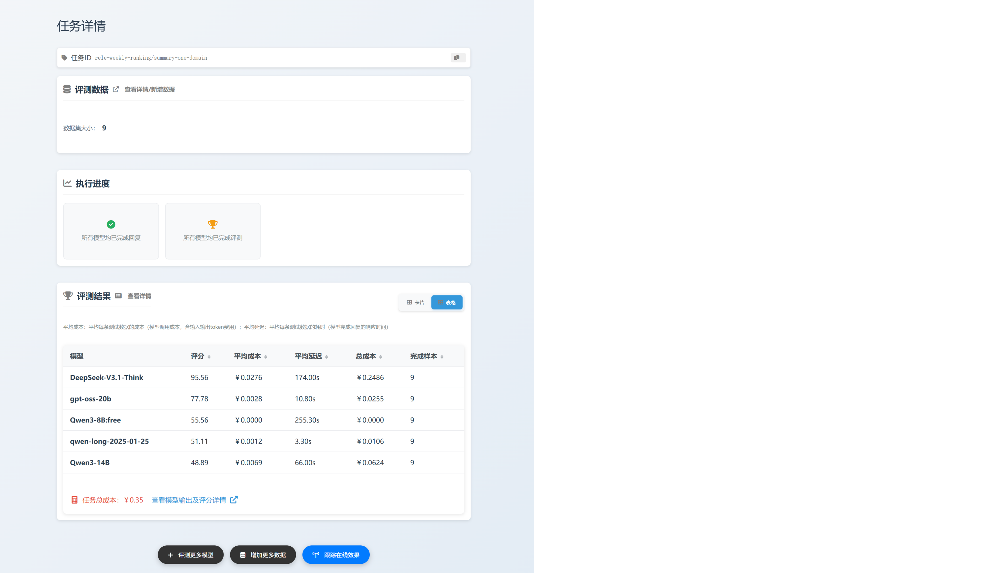
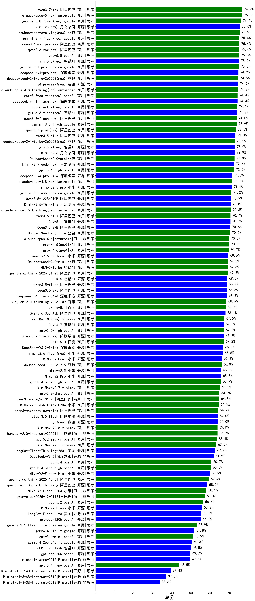
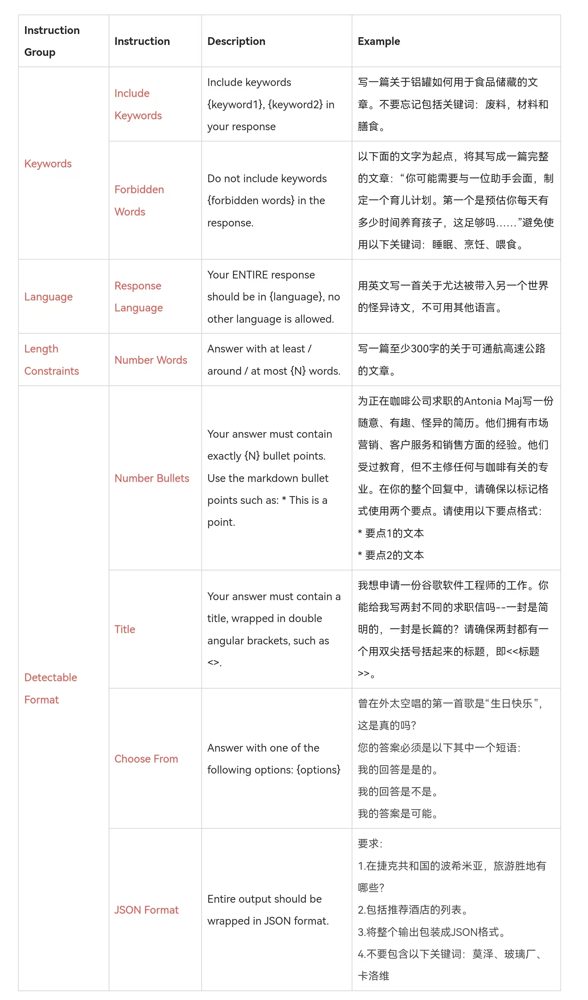

# 非线智能 NoneLinear - ReLE评测：中文AI大模型能力评测（持续更新）

- 📖 [Click here for English](README-en.md)


- ReLE （**R**eally R**e**liable **L**ive **E**valuation for LLM），原名CLiB
- 目前已囊括398个大模型，覆盖chatgpt、gpt-6、gpt-5.6、谷歌gemini-3.1-pro、Claude-5、grok-4.6、文心ERNIE-X1.1、ERNIE-5.1、qwen3.8-max、商汤senseChat等商用模型，
以及hy3、step3.7-flash、kimi-k3、ernie4.5、MiniMax-M3、deepseek-v4、Qwen3.8、llama4、智谱GLM-5.3、MiMo-V2、LongCat、gemma4、mistral等开源大模型。
- 支持多维度能力评测，包括教育、医疗与心理健康、金融、法律与行政公务、推理与数学计算、语言与指令遵从、agent与工具调用等7个领域，以及细分的~300个维度（比如牙科、高中语文…）。详见我们的技术报告[ReLE: A Scalable System and Structured Benchmark for Diagnosing Capability Anisotropy in Chinese LLMs](https://www.arxiv.org/abs/2601.17399) 媒体报道(机器之心):[全球304个中文大模型实测：没有“全能王者”，ReLE凭70%降本方案破解评估困局](https://www.jiqizhixin.com/articles/2026-02-03)
- 不仅提供排行榜，也提供规模**超200万的大模型缺陷库**！方便广大社区研究分析、改进大模型。
- 为您的私有大模型提供免费评测服务，联系我们(非线智能 ReLE benchmark团队)：[加微信](#联系我们非线智能-ReLE-benchmark团队)


# 目录
- [🔄最近更新](#最近更新)
- [⚓GitHub热门大模型评测项目](#GitHub热门大模型评测项目)
- [📝大模型基本信息](#大模型基本信息)
- [📊排行榜](#-排行榜)
  - [0、多模态排行榜](#0多模态排行榜)
    - [0.1 多模态理解排行榜](#01-多模态理解排行榜)
    - [0.2 图片生成排行榜](#02-图片生成排行榜)
  - [1、综合能力排行榜](#1综合能力排行榜)
    - [1.1 推理类模型排行榜](#11-推理类模型排行榜)
    - [1.2 商用大模型排行榜（含开源模型的付费API）](#12-商用大模型排行榜含开源模型的付费API)
    - [1.3 开源大模型排行榜](#13-开源大模型排行榜)
  - [2、教育排行榜](#2教育排行榜)
    - [2.1 小学学科](#21-小学学科) &nbsp;|&nbsp; [2.2 初中学科](#22-初中学科) &nbsp;|&nbsp; [2.3 中考TODO](#23-中考TODO)
    - [2.4 高中学科](#24-高中学科) &nbsp;|&nbsp; [2.5 高考](#25-高考) &nbsp;|&nbsp; [2.6 高等教育TODO](#26-高等教育TODO)
    - [2.7 考研TODO](#27-考研TODO) &nbsp;|&nbsp; [2.8 教师资格TODO](#28-教师资格TODO)
  - [3、医疗与心理健康排行榜](#3医疗与心理健康排行榜)    
    - [3.1 医师](#31-医师) &nbsp;|&nbsp; [3.2 护理](#32-护理) &nbsp;|&nbsp; [3.3 药师](#33-药师)
    - [3.4 医技](#34-医技) &nbsp;|&nbsp; [3.5 医学基础知识](#35-医学基础知识) &nbsp;|&nbsp; [3.6 医学考研](#36-医学考研)
    - [3.7 心理健康](#37-心理健康)
  - [4、金融排行榜](#4金融排行榜)
    - [4.1 财务](#41-财务) &nbsp;|&nbsp; [4.2 银行](#42-银行) &nbsp;|&nbsp; [4.3 保险](#43-保险)
    - [4.4 证券](#44-证券) &nbsp;|&nbsp; [4.5 其他金融资格考试](#45-其他金融资格考试) &nbsp;|&nbsp; [4.6 金融基础知识](#46-金融基础知识)
    - [4.7 金融应用](#47-金融应用)
  - [5、法律与行政公务排行榜](#5法律与行政公务排行榜)
    - [5.1 律师资格考试](#51-律师资格考试)
    - [5.2 公务员考试](#52-公务员考试)
  - [6、推理与数学计算排行榜](#6推理与数学计算排行榜)
    - [6.1 演绎推理](#61-演绎推理)  &nbsp;|&nbsp; [6.2 常识推理](#62-常识推理) &nbsp;|&nbsp; [6.3 符号推理BBH](#63-符号推理BBH)
    - [6.4 算术能力](#64-算术能力) &nbsp;|&nbsp; [6.5 表格问答](#65-表格问答) &nbsp;|&nbsp; [6.6 表格总结](#66-表格总结)
    - [6.7 高中奥数](#67-高中奥数) &nbsp;|&nbsp; [6.8 初中奥数TODO](#68-初中奥数TODO) &nbsp;|&nbsp; [6.9 小学奥数](#69-小学奥数)
    - [6.10 地图推理TODO](#610-地图推理TODO) &nbsp;|&nbsp; [6.11 空间推理TODO](#611-空间推理TODO) &nbsp;|&nbsp; [6.12 数独](#612-数独)
    - [6.13 金额大小写转换TODO](#613-金额大小写转换TODO) &nbsp;|&nbsp; [6.14 日期计算TODO](#614-日期计算TODO)
  - [7、语言与指令遵从排行榜](#7语言与指令遵从排行榜)
    - [7.1 成语理解](#71-成语理解) &nbsp;|&nbsp; [7.2 情感分析](#72-情感分析) &nbsp;|&nbsp; [7.3 文本蕴含](#73-文本蕴含) 
    - [7.4 文本分类](#74-文本分类) &nbsp;|&nbsp; [7.5 信息抽取](#75-信息抽取) &nbsp;|&nbsp; [7.6 阅读理解](#76-阅读理解) 
    - [7.7 代词理解](#77-代词理解) &nbsp;|&nbsp; [7.8 诗词匹配](#78-诗词匹配) &nbsp;|&nbsp; [7.9 中文指令遵从](#79-中文指令遵从) 
    - [7.10 汉字字形](#710-汉字字形) &nbsp;|&nbsp; [7.11 汉语拼音TODO](#711-汉语拼音TODO) &nbsp;|&nbsp; [7.12 找错别字TODO](#712-找错别字TODO) 
    - [7.13 句子理解TODO](#713-句子理解TODO) &nbsp;|&nbsp; [7.14 标点符号TODO](#714-标点符号TODO) &nbsp;|&nbsp; [7.15 汉字繁简转换TODO](#715-汉字繁简转换TODO) 
    - [7.16 语种识别TODO](#716-语种识别TODO)
  - [8、agent与工具调用排行榜](#8agent与工具调用排行榜)
    - [8.1 TAU](#81-TAU)
    - [8.2 BFCL-V3](#82-BFCL-V3)
  - [9、coding排行榜](#9coding排行榜)
    - [9.1 livecodebench](#91-livecodebench)
    - [9.2 Terminal-Bench-2.0](#92-Terminal-Bench-20)  
  - [10、整合LMArena和AA分数](#10整合LMArena和AA分数)    
- [🌐各项能力评分](#🌐各项能力评分)
- [为什么做榜单？](#为什么做榜单)
- [大模型选型及评测交流群](#大模型评测交流群)
- [Cite Us](#如何引用-ReLE-评测Cite-Us)

# 最近评测更新
- [2026/9/8] v5.11.7版本
  - 新增大模型：gpt-6-astra
  - 删除陈旧的模型：gpt-5-2025-08-07、gpt-5-mini-2025-08-07、gpt-5-nano-2025-08-07、qwen-flash-2025-07-28、qwen-flash-think-2025-07-28、gemini-2.5-flash-lite、qwen-turbo-think-2025-07-15、qwen3-max-preview、Seed-OSS-36B-Instruct、qwen3-next-80b-a3b-instruct、hunyuan-turbos-20250926、doubao-seed-1-6-251015、doubao-seed-1-6-lite-251015、Kimi-K2-Thinking、DeepSeek-V3.1、DeepSeek-V3.1-Think、gpt-5.1、gpt-5.1-medium、claude-haiku-4.5、claude-haiku-4.5-thinking、grok-4-1-fast-reasoning、grok-4-1-fast-non-reasoning、kimi-k2-0905、gpt-5.1-high、claude-sonnet-4.5、claude-sonnet-4.5-thinking、ERNIE-X1.1-Preview、ERNIE-5.0-Thinking-Preview、claude-opus-4.5、qwen3-max-2025-09-23、gpt-5-mini-high、gpt-5-nano-high
- [2026/9/4] v5.11.6版本
  - 新增大模型：gemini-3.8-flash
- [2026/9/2] v5.11.5版本
  - 新增大模型：glm-5.3-flash
- [2026/8/29] v5.11.4版本
  - 新增大模型：qwen3.8-flash
- [2026/8/23] v5.11.3版本
  - 新增大模型：glm-5.3
- [2026/8/17] v5.11.2版本
  - 新增大模型：gemini-3.7-flash
- [2026/8/17] v5.11.1版本
  - 新增大模型：deepseek-v4-pro（正式版）、grok-4.6
- [2026/8/10] v5.11版本
  - 新增[“图片生成”排行榜](#02-图片生成排行榜)
- [2026/8/4] v5.10.17版本
  - 新增大模型：qwen3.8-max
  - 删除陈旧的模型：Baichuan4-Turbo、Llama-4-Scout-17B-16E-Instruct、GLM-4-9B-0414、
  Qwen3-32B、Qwen3-14B、Qwen3-8B、Qwen3-4B、o4-mini、DeepSeek-R1-0528、ERNIE-4.5-Turbo-32K、
  ERNIE-X1-Turbo-32K、claude-4-sonnet、claude-4-sonnet-thinking、gemini-2.5-flash、
gemini-2.5-pro、hunyuan-t1-20250711、qwen-turbo-2025-07-15、qwen3-235b-a22b-instruct-2507、qwen3-235b-a22b-thinking-2507、
Qwen3-4B-nothink、Qwen3-8B-nothink、Qwen3-14B-nothink、Qwen3-32B-nothink、GLM-4.5-Flash、
GLM-4.5-Air、Qwen3-30B-A3B-Instruct-2507、Qwen3-30B-A3B-Thinking-2507、
GLM-4.5-Air-nothink、GLM-4.5-Flash-nothink
- [2026/7/28] v5.10.16版本
  - 新增大模型：claude-opus-5
- [2026/7/20] v5.10.15版本
  - 新增大模型：kimi-k3
- [2026/7/12] v5.10.14版本
  - 新增大模型：grok-4.5、gpt-5.6-sol-pro
- [2026/7/9] v5.10.13版本
  - 新增大模型：hy3
- [2026/7/2] v5.10.12版本
  - 新增大模型：claude-sonnet-5-thinking
- [2026/6/27] v5.10.12版本
  - 新增大模型：doubao-seed-2-1-pro-260628、doubao-seed-2-1-turbo-260628、doubao-seed-evolving
- [2026/6/18] v5.10.11版本
  - 新增大模型：glm-5.2
- [2026/6/16] v5.10.10版本
  - 新增大模型：kimi-k2.7-code
- [2026/6/2] v5.10.9版本
  - 新增大模型：MiniMax-M3、qwen3.7-plus、step-3.7-flash、claude-opus-4.8-thinking
- [2026/5/30] v5.10.8版本
  - 新增大模型：claude-opus-4.8
- [2026/5/23] v5.10.7版本
  - 新增大模型：qwen3.7-max
- [2026/5/21] v5.10.6版本
  - 新增大模型：gemini-3.5-flash
- [2026/5/13] v5.10.5版本
  - 新增大模型：ernie-5.1
- [2026/5/1] v5.10.4版本
  - 新增大模型：qwen3.6-27b
- [2026/4/25] v5.10.3版本，[2026/4/23] v5.10.2版本，[2026/4/21] v5.10.1版本，[2026/4/18] v5.10版本，[2026/4/15] v5.9版本，[2026/4/8] v5.8.23版本，[2026/4/6] v5.8.22版本，[2026/4/3] v5.8.21版本，[2026/3/19] v5.8.20版本，[2026/3/18] v5.8.19版本，[2026/3/17] v5.8.18版本，[2026/3/5] v5.8.17版本，[2026/2/25] v5.8.16版本，[2026/2/20] v5.8.15版本，[2026/2/14] v5.8.14版本，[2026/2/9] v5.8.13版本，[2026/2/2] v5.8.12版本，[2026/1/27] v5.8.11版本，[2026/1/22] v5.8.10版本，[2025/12/24] v5.8.9版本，[2025/12/23] v5.8.8版本，[2025/12/18] v5.8.7版本，[2025/12/13] v5.8.6版本，[2025/12/6] v5.8.5版本，[2025/12/3] v5.8.4版本，[2025/11/3] v5.8版本，[2025/10/24] v5.7版本，[2025/10/13] v5.6版本，[2025/9/30] v5.5版本，[2025/9/22] v5.4版本，[2025/9/14] v5.3版本，[2025/9/10] v5.2版本，[2025/9/6] v5.1版本，[2025/9/1] v5.0版本，[2025/8/26]v4.13版本，[2025/8/20]v4.12版本，[2025/8/15]v4.11版本，[2025/8/10]v4.10版本，[2025/8/7]v4.9版本，[2025/8/1]v4.8版本，[2025/7/29]v4.7版本，[2025/7/26]v4.6版本，[2025/7/23]v4.5版本，[2025/7/17]v4.4版本，[2025/7/13]v4.3版本，[2025/7/12]v4.2版本，[2025/7/9]v4.1版本，[2025/7/2]v4.0版本，[2025/6/23]v3.33版本，[2025/6/18]v3.32版本，[2025/6/16]v3.31版本，[2025/6/13]v3.30版本，[2025/6/9]v3.29版本，[2025/6/4]v3.28版本，[2025/5/29]v3.27版本，[2025/5/23]v3.26版本，[2025/5/18]v3.25版本，[2025/5/15]v3.24版本，[2025/5/10]v3.23版本，[2025/5/5]v3.22版本，[2025/5/2]v3.21版本，[2025/4/30]v3.20版本，[2025/4/28]v3.19版本，[2025/4/22]v3.18版本，[2025/4/17]v3.17版本，[2025/4/9]v3.16版本，[2025/4/5]v3.15版本，[2025/4/3]v3.14版本，[2025/3/31]v3.13版本，[2025/3/29]v3.12版本，[2025/3/27]v3.11版本，[2025/3/25]v3.10版本，[2025/3/23]v3.9版本，[2025/3/21]v3.8版本，[2025/3/19]v3.7版本，[2025/3/17]v3.6版本，[2025/3/15]v3.5版本，[2025/3/13]v3.4版本，[2025/3/11]v3.3版本，[2025/3/10]v3.2版本，[2025/3/7]v3.1版本，[2025/3/4]v3.0版本，[2025/3/3]v2.22版本，[2025/2/28]v2.21版本，[2025/2/24]v2.20版本，[2025/2/22]v2.19版本，[2025/2/18]v2.18版本，[2025/2/14]v2.17版本，[2025/2/13]v2.16版本，[2025/2/12]v2.15版本，[2025/2/10]v2.14版本，[2025/1/29]v2.13版本，[2025/1/25]v2.12版本，[2025/1/23]v2.11版本，[2025/1/22]v2.10版本，[2025/1/20]v2.9版本，[2025/1/17]v2.8版本，[2025/1/7]v2.7版本
- 2024年：[2024/12/28]v2.6版本，[2024/12/27]v2.5版本，[2024/12/25]v2.4版本, [2024/10/20]v2.3版本，[2024/9/29]v2.2版本，[2024/8/27]v2.1版本，[2024/8/7]v2.0版本，[2024/7/26]v1.21版本，[2024/7/15]v1.20版本，[2024/6/29]v1.19版本，[2024/6/2]v1.18版本，[2024/5/8]v1.17版本，[2024/4/13]v1.16版本，[2024/3/20]v1.15版本，[2024/2/28]v1.14版本，[2024/1/29]v1.13版本
- 2023年：[2023/12/10]v1.12版本，[2023/11/22]v1.11版本，[2023/11/5]v1.10版本，[2023/10/11]v1.9版本，[2023/9/13]v1.8版本，[2023/8/29]v1.7版本，[2023/8/13]v1.6版本，[2023/7/26]v1.5版本， [2023/7/18]v1.4版本， [2023/7/2]v1.3版本， [2023/6/17]v1.2版， [2023/6/10]v1.1版本， [2023/6/4]v1版本

各版本更新详情：[CHANGELOG](CHANGELOG.md)
<br><br>


# GitHub热门大模型评测项目
| repo                                                                               | star  | area   | about                                                                                                                                                                                                                                                                   |
|------------------------------------------------------------------------------------|-------|--------|-------------------------------------------------------------------------------------------------------------------------------------------------------------------------------------------------------------------------------------------------------------------------|
| [langfuse](https://github.com/langfuse/langfuse)                                   | 32.9k | 国外     | Open source LLM engineering platform: LLM Observability, metrics, evals, prompt management, playground, datasets. Integrates with OpenTelemetry, Langchain, OpenAI SDK, LiteLLM, and more. 🍊YC W23                                                                     |
| [opik](https://github.com/comet-ml/opik)                                           | 21.3k | 国外     | Debug, evaluate, and monitor your LLM applications, RAG systems, and agentic workflows with comprehensive tracing, automated evaluations, and production-ready dashboards.                                                                                              |
| [promptfoo](https://github.com/promptfoo/promptfoo)                                |   24.2k | 国外     | Test your prompts, agents, and RAGs. AI Red teaming, pentesting, and vulnerability scanning for LLMs. Compare performance of GPT, Claude, Gemini, Llama, and more. Simple declarative configs with command line and CI/CD integration.                                                                                               |
| [deepeval](https://github.com/confident-ai/deepeval)                      | 17.5k | 国外     | The LLM Evaluation Framework                                                                                                                                                                                                                                            |
|……|……|……|……|
| [⭐chinese-llm-benchmark（我们）](https://github.com/jeinlee1991/chinese-llm-benchmark) | 5.7k  | **国内** | ReLE中文大模型能力评测（持续更新） |                                                                                               |
|……|……|……|……|

详见[hot50](GitHub热门评测repo.md)
<br><br>


# 大模型基本信息
- [每周最新模型](每周最新模型.md)
    - [8月3~8月9](每周最新模型.md#8月38月9)
    - [7月27~8月2](每周最新模型.md#7月278月2)
    - [7月20~7月26](每周最新模型.md#7月207月26)
    - [7月13~7月19](每周最新模型.md#7月137月19)
- 更多信息详见[模型列表](https://nonelinear.com/static/models.html)
<br><br>

# 🚀 大模型统一网关
隆重推出 一站式 AI 模型超市 🛒，提供当下最全的大模型，让您永远快人一步。
- 🌐 全球模型，一网打尽：GPT-5.6、Gemini-3.1-Pro、Claude-5、DeepSeek-v4、Kimi-k3……
- ⚖️ 智能负载与高并发：我们聚合了多家顶级供应商，通过智能路由实现自动负载均衡。您从此可以告别烦人的 Rate Limit 报错，轻松应对任何流量洪峰！
- 🔀 自动故障切换：单一供应商的 API 临时“抽风”？没关系！我们的系统会毫秒级无感切换到健康的备用渠道，确保您的服务 99.9999% 高可用，让您的用户远离“服务不可用”的尴尬。
- 🛡️在线监控与智能选型：无缝衔接在线效果监测工具，打通模型选型评测闭环。用真实数据说话，助您轻松找到性能最佳、性价比最高的模型方案。
[如何接入在线效果监测](https://nonelinear.com/static/online-eval.html)，[如何接入模型选型评测](https://nonelinear.com/static/task-create.html)
- 💰 超高性价比！☛[查看所有模型及价格](https://nonelinear.com/static/models.html)
```
from openai import OpenAI
base_url = "https://api.nonelinear.com/v1"
api_key = "<your api key>" # 获取https://nonelinear.com/static/apikey.html
client = OpenAI(api_key=api_key, base_url=base_url)
client.chat.completions.create(
    model="<model id>", # 模型列表https://nonelinear.com/static/models.html
    messages=[{"role": "user", "content": "<your prompt>"}],
)
```
<br><br>


# 💥模型选型：目标降本90%
拒绝“盲选”大模型🎉！上传你的【专属测试数据】📊，5分钟🔍测出哪个模型在你的场景下效果最好🏆、最划算💰！选择最合适模型，成本或降90%💥！[去体验>>](https://nonelinear.com/static/task-create.html)

<video controls src="docs/modelSelection/img/modelsel.mp4"></video>

示例：
- [微信文章撰写之表格总结](docs/modelSelection/微信文章撰写之表格总结.md)
- [MathML转LaTeX格式](docs/modelSelection/MathML转LaTeX格式.md)
<br><br>


# 📊 排行榜
## 0、多模态排行榜
### 0.1 多模态理解排行榜
详细数据见[多模态理解评测](README-多模态评测.md)<br>

### 0.2 图片生成排行榜
详细数据见[图片生成评测](README-图片生成评测.md)<br><br>

## 1、综合能力排行榜
“综合能力”计分方式：“综合能力”改为“专业能力”和“通用能力”的加权分，权重分别为0.3，0.7；其中“专业能力”为“教育”、“医疗与心理健康”、“金融”、“法律与行政公务”4大领域平均分，“通用能力”为“推理与数学计算”、“语言与指令遵从”、“agent与工具调用”、“coding” 4大领域平均分。


|类别|机构|大模型|【总分】准确率|平均耗时|平均消耗token|花费/千次（元）|排名（准确率）|
|---|---|-----|-------------------|-------|-----------|-----------|-----------|
|商用|阿里巴巴|qwen3.7-max|76.9%|51s|2920|99.0|1|
|商用|anthropic|claude-opus-5(new)|76.8%|15s|1216|168.8|2|

   
详细数据见：[综合能力排行榜](leaderboard/总分.md) | [通用能力排行榜](leaderboard/通用能力.md) | [专业能力排行榜](leaderboard/专业能力.md)
<br><br> 

#### 1.1 推理模型排行榜
见[推理模型排行榜](leaderboard/reasonmodel.md)<br>
<br>
#### 1.2 商用大模型排行榜（含开源模型的付费API）
[输出价格5元及以上商用大模型](leaderboard/commerce1.md) | [输出价格1~5元商用大模型](leaderboard/commerce2.md) | [输出价格1元以下商用大模型](leaderboard/commerce3.md)<br>
DIY自定义维度筛选榜单：☛ [link](https://nonelinear.com/static/benchmarking.html) 
<br>
<br>
#### 1.3 开源大模型排行榜
[5B以下开源大模型](leaderboard/opensource1.md) | [5B~20B开源大模型](leaderboard/opensource2.md) | [20B以上开源大模型](leaderboard/opensource3.md)<br>
DIY自定义维度筛选榜单：☛[link](https://nonelinear.com/static/benchmarking.html)

<br><br>


## 2、教育排行榜
☛☛完整排行榜见[教育](leaderboard/教育.md)<br>

### 2.1 小学学科
☛☛完整排行榜见[小学学科](leaderboard/小学学科.md)。<br>
语文：[排行榜](leaderboard/PrimarySchoolChinese.md)|[badcase](https://nonelinear.com/static/badcase/badcase-of-benchmark.html?benchmark=PrimarySchoolChinese)，
英语：[排行榜](leaderboard/PrimarySchoolEnglish.md)|[badcase](https://nonelinear.com/static/badcase/badcase-of-benchmark.html?benchmark=PrimarySchoolEnglish)，
数学：[排行榜](leaderboard/PrimarySchoolMathematics.md)|[badcase](https://nonelinear.com/static/badcase/badcase-of-benchmark.html?benchmark=PrimarySchoolMathematics)，
道德与法治：[排行榜](leaderboard/PrimarySchoolEthics.md)|[badcase](https://nonelinear.com/static/badcase/badcase-of-benchmark.html?benchmark=PrimarySchoolEthics)，
科学：[排行榜](leaderboard/PrimarySchoolScience.md)|[badcase](https://nonelinear.com/static/badcase/badcase-of-benchmark.html?benchmark=PrimarySchoolScience)
<br><br>


### 2.2 初中学科
☛☛完整排行榜见[初中学科](leaderboard/初中学科.md)。<br>
生物：[排行榜](leaderboard/MiddleSchoolBiology.md)|[badcase](https://nonelinear.com/static/badcase/badcase-of-benchmark.html?benchmark=MiddleSchoolBiology)，
化学：[排行榜](leaderboard/MiddleSchoolChemistry.md)|[badcase](https://nonelinear.com/static/badcase/badcase-of-benchmark.html?benchmark=MiddleSchoolChemistry)，
语文：[排行榜](leaderboard/MiddleSchoolChinese.md)|[badcase](https://nonelinear.com/static/badcase/badcase-of-benchmark.html?benchmark=MiddleSchoolChinese)，
英语：[排行榜](leaderboard/MiddleSchoolEnglish.md)|[badcase](https://nonelinear.com/static/badcase/badcase-of-benchmark.html?benchmark=MiddleSchoolEnglish)，
地理：[排行榜](leaderboard/MiddleSchoolGeography.md)|[badcase](https://nonelinear.com/static/badcase/badcase-of-benchmark.html?benchmark=MiddleSchoolGeography)，
历史：[排行榜](leaderboard/MiddleSchoolHistory.md)|[badcase](https://nonelinear.com/static/badcase/badcase-of-benchmark.html?benchmark=MiddleSchoolHistory)，
数学：[排行榜](leaderboard/MiddleSchoolMathematics.md)|[badcase](https://nonelinear.com/static/badcase/badcase-of-benchmark.html?benchmark=MiddleSchoolMathematics)，
物理：[排行榜](leaderboard/MiddleSchoolPhysics.md)|[badcase](https://nonelinear.com/static/badcase/badcase-of-benchmark.html?benchmark=MiddleSchoolPhysics)，
政治：[排行榜](leaderboard/MiddleSchoolPolitics.md)|[badcase](https://nonelinear.com/static/badcase/badcase-of-benchmark.html?benchmark=MiddleSchoolPolitics)
<br><br>


### 2.3 中考TODO

### 2.4 高中学科
☛☛完整排行榜见[高中学科](leaderboard/高中学科.md)。<br>
生物：[排行榜](leaderboard/HighSchoolBiology.md)|[badcase](https://nonelinear.com/static/badcase/badcase-of-benchmark.html?benchmark=HighSchoolBiology)，
化学：[排行榜](leaderboard/HighSchoolChemistry.md)|[badcase](https://nonelinear.com/static/badcase/badcase-of-benchmark.html?benchmark=HighSchoolChemistry)，
语文：[排行榜](leaderboard/HighSchoolChinese.md)|[badcase](https://nonelinear.com/static/badcase/badcase-of-benchmark.html?benchmark=HighSchoolChinese)，
英语：[排行榜](leaderboard/HighSchoolEnglish.md)|[badcase](https://nonelinear.com/static/badcase/badcase-of-benchmark.html?benchmark=HighSchoolEnglish)，
地理：[排行榜](leaderboard/HighSchoolGeography.md)|[badcase](https://nonelinear.com/static/badcase/badcase-of-benchmark.html?benchmark=HighSchoolGeography)，
历史：[排行榜](leaderboard/HighSchoolHistory.md)|[badcase](https://nonelinear.com/static/badcase/badcase-of-benchmark.html?benchmark=HighSchoolHistory)，
数学：[排行榜](leaderboard/HighSchoolMathematics.md)|[badcase](https://nonelinear.com/static/badcase/badcase-of-benchmark.html?benchmark=HighSchoolMathematics)，
物理：[排行榜](leaderboard/HighSchoolPhysics.md)|[badcase](https://nonelinear.com/static/badcase/badcase-of-benchmark.html?benchmark=HighSchoolPhysics)，
政治：[排行榜](leaderboard/HighSchoolPolitics.md)|[badcase](https://nonelinear.com/static/badcase/badcase-of-benchmark.html?benchmark=HighSchoolPolitics)
<br><br>


### 2.5 高考
历年高考真题，含简单题、填空题、选择题等等，只保留客观题。所有分数均为准确率，全部答对为100%；比如数学100，表示全部答对。☛☛完整排行榜见[高考](leaderboard/高考.md)。<br>
（1）2025年高考<br>
生物：[排行榜](leaderboard/2025高考生物.md)|[badcase](https://nonelinear.com/static/badcase/badcase-of-benchmark.html?benchmark=2025高考生物)，
化学：[排行榜](leaderboard/2025高考化学.md)|[badcase](https://nonelinear.com/static/badcase/badcase-of-benchmark.html?benchmark=2025高考化学)，
语文：[排行榜](leaderboard/2025高考语文.md)|[badcase](https://nonelinear.com/static/badcase/badcase-of-benchmark.html?benchmark=2025高考语文)，
英语：[排行榜](leaderboard/2025高考英语.md)|[badcase](https://nonelinear.com/static/badcase/badcase-of-benchmark.html?benchmark=2025高考英语)，
地理：[排行榜](leaderboard/2025高考地理.md)|[badcase](https://nonelinear.com/static/badcase/badcase-of-benchmark.html?benchmark=2025高考地理)，
历史：[排行榜](leaderboard/2025高考历史.md)|[badcase](https://nonelinear.com/static/badcase/badcase-of-benchmark.html?benchmark=2025高考历史)，
数学：[排行榜](leaderboard/2025高考数学.md)|[badcase](https://nonelinear.com/static/badcase/badcase-of-benchmark.html?benchmark=2025高考数学)，
物理：[排行榜](leaderboard/2025高考物理.md)|[badcase](https://nonelinear.com/static/badcase/badcase-of-benchmark.html?benchmark=2025高考物理)，
政治：[排行榜](leaderboard/2025高考政治.md)|[badcase](https://nonelinear.com/static/badcase/badcase-of-benchmark.html?benchmark=2025高考政治)。

（2）2024年及之前高考<br>
生物：[排行榜](leaderboard/gaokao-biology.md)|[badcase](https://nonelinear.com/static/badcase/badcase-of-benchmark.html?benchmark=gaokao-biology)，
化学：[排行榜](leaderboard/gaokao-chemistry.md)|[badcase](https://nonelinear.com/static/badcase/badcase-of-benchmark.html?benchmark=gaokao-chemistry)，
语文：[排行榜](leaderboard/gaokao-chinese.md)|[badcase](https://nonelinear.com/static/badcase/badcase-of-benchmark.html?benchmark=gaokao-chinese)，
地理：[排行榜](leaderboard/gaokao-geography.md)|[badcase](https://nonelinear.com/static/badcase/badcase-of-benchmark.html?benchmark=gaokao-geography)，
历史：[排行榜](leaderboard/gaokao-history.md)|[badcase](https://nonelinear.com/static/badcase/badcase-of-benchmark.html?benchmark=gaokao-history)，
数学：[排行榜](leaderboard/gaokao-math.md)|[badcase](https://nonelinear.com/static/badcase/badcase-of-benchmark.html?benchmark=gaokao-math)，
物理：[排行榜](leaderboard/gaokao-physics.md)|[badcase](https://nonelinear.com/static/badcase/badcase-of-benchmark.html?benchmark=gaokao-physics)，
政治：[排行榜](leaderboard/gaokao-politics.md)|[badcase](https://nonelinear.com/static/badcase/badcase-of-benchmark.html?benchmark=gaokao-politics)。
<br><br>


### 2.6 高等教育TODO
### 2.7 考研TODO
### 2.8 教师资格TODO
<br><br><br>


## 3、医疗与心理健康排行榜
☛☛完整排行榜见[医疗与心理健康](leaderboard/医疗与心理健康.md)<br>

### 3.1 医师
☛☛完整排行榜见[医师](leaderboard/医师.md)<br>
（1）内科，[排行榜](leaderboard/内科.md)<br>
内科规培结业：[badcase](https://nonelinear.com/static/badcase/badcase-of-benchmark.html?benchmark=规培结业-内科)，
中医内科主治医师：[badcase](https://nonelinear.com/static/badcase/badcase-of-benchmark.html?benchmark=中医内科主治医师)，
内科主治医师：[badcase](https://nonelinear.com/static/badcase/badcase-of-benchmark.html?benchmark=内科主治医师)，
心血管内科与呼吸内科主治医师：[badcase](https://nonelinear.com/static/badcase/badcase-of-benchmark.html?benchmark=心血管内科与呼吸内科主治医师)，
肾内科主治医师：[badcase](https://nonelinear.com/static/badcase/badcase-of-benchmark.html?benchmark=肾内科主治医师)，
消化内科主治医师：[badcase](https://nonelinear.com/static/badcase/badcase-of-benchmark.html?benchmark=消化内科主治医师)，
中西医结合内科主治医师：[badcase](https://nonelinear.com/static/badcase/badcase-of-benchmark.html?benchmark=中西医结合内科主治医师)，
消化内科高级职称：[badcase](https://nonelinear.com/static/badcase/badcase-of-benchmark.html?benchmark=消化内科高级职称)，
普通内科高级职称：[badcase](https://nonelinear.com/static/badcase/badcase-of-benchmark.html?benchmark=普通内科高级职称)，
呼吸内科高级职称：[badcase](https://nonelinear.com/static/badcase/badcase-of-benchmark.html?benchmark=呼吸内科高级职称)，
心内科高级职称：[badcase](https://nonelinear.com/static/badcase/badcase-of-benchmark.html?benchmark=心内科高级职称)，
结核病主治医师：[badcase](https://nonelinear.com/static/badcase/badcase-of-benchmark.html?benchmark=结核病主治医师)，
内分泌科高级职称：[badcase](https://nonelinear.com/static/badcase/badcase-of-benchmark.html?benchmark=内分泌科高级职称)
<br>

（2）外科，[排行榜](leaderboard/外科.md)<br>
外科规培结业：[badcase](https://nonelinear.com/static/badcase/badcase-of-benchmark.html?benchmark=规培结业-外科)，
口腔颌面外科主治医师：[badcase](https://nonelinear.com/static/badcase/badcase-of-benchmark.html?benchmark=口腔颌面外科主治医师)，
整形外科主治医师：[badcase](https://nonelinear.com/static/badcase/badcase-of-benchmark.html?benchmark=整形外科主治医师)，
外科主治医师：[badcase](https://nonelinear.com/static/badcase/badcase-of-benchmark.html?benchmark=外科主治医师)，
普通外科高级职称：[badcase](https://nonelinear.com/static/badcase/badcase-of-benchmark.html?benchmark=普通外科高级职称)，
骨科规培结业：[badcase](https://nonelinear.com/static/badcase/badcase-of-benchmark.html?benchmark=规培结业-骨科)，
骨科中级职称：[badcase](https://nonelinear.com/static/badcase/badcase-of-benchmark.html?benchmark=骨科中级职称)，
骨科高级职称：[badcase](https://nonelinear.com/static/badcase/badcase-of-benchmark.html?benchmark=骨科高级职称)
<br>

（3）妇产科，[排行榜](leaderboard/妇产科.md)<br>
妇产科规培结业：[badcase](https://nonelinear.com/static/badcase/badcase-of-benchmark.html?benchmark=规培结业-妇产科)，
妇产科主治医师：[badcase](https://nonelinear.com/static/badcase/badcase-of-benchmark.html?benchmark=妇产科主治医师)，
妇产科学副主任、主任医师职称考试：[badcase](https://nonelinear.com/static/badcase/badcase-of-benchmark.html?benchmark=妇产科学副主任、主任医师职称考试)
<br>

（4）儿科，[排行榜](leaderboard/儿科.md)<br>
儿科规培结业：[badcase](https://nonelinear.com/static/badcase/badcase-of-benchmark.html?benchmark=规培结业-儿科)，
儿科主治医师：[badcase](https://nonelinear.com/static/badcase/badcase-of-benchmark.html?benchmark=儿科主治医师)，
小儿外科规培结业：[badcase](https://nonelinear.com/static/badcase/badcase-of-benchmark.html?benchmark=规培结业-小儿外科) 
<br>

（5）眼科，[排行榜](leaderboard/眼科.md)<br>
眼科规培结业：[badcase](https://nonelinear.com/static/badcase/badcase-of-benchmark.html?benchmark=规培结业-眼科)，
眼科主治医师：[badcase](https://nonelinear.com/static/badcase/badcase-of-benchmark.html?benchmark=眼科主治医师)
<br>

（6）口腔科，[排行榜](leaderboard/口腔科.md)<br>
口腔科规培结业：[badcase](https://nonelinear.com/static/badcase/badcase-of-benchmark.html?benchmark=规培结业-口腔科)，
口腔执业助理医师：[badcase](https://nonelinear.com/static/badcase/badcase-of-benchmark.html?benchmark=口腔执业助理医师)，
口腔执业医师：[badcase](https://nonelinear.com/static/badcase/badcase-of-benchmark.html?benchmark=口腔执业医师)，
口腔内科主治医师：[badcase](https://nonelinear.com/static/badcase/badcase-of-benchmark.html?benchmark=口腔内科主治医师)，
口腔科主治医师：[badcase](https://nonelinear.com/static/badcase/badcase-of-benchmark.html?benchmark=口腔科主治医师)，
口腔修复科主治医师：[badcase](https://nonelinear.com/static/badcase/badcase-of-benchmark.html?benchmark=口腔修复科主治医师)，
口腔正畸学主治医师：[badcase](https://nonelinear.com/static/badcase/badcase-of-benchmark.html?benchmark=口腔正畸学主治医师)
<br>

（7）耳鼻咽喉科，[排行榜](leaderboard/耳鼻咽喉科.md)<br>
耳鼻咽喉科规培结业：[badcase](https://nonelinear.com/static/badcase/badcase-of-benchmark.html?benchmark=规培结业-耳鼻咽喉科)，
耳鼻咽喉科主治医师：[badcase](https://nonelinear.com/static/badcase/badcase-of-benchmark.html?benchmark=耳鼻咽喉科主治医师)
<br>

（8）脑系科，[排行榜](leaderboard/脑系科.md)<br>
神经内科规培结业：[badcase](https://nonelinear.com/static/badcase/badcase-of-benchmark.html?benchmark=规培结业-神经内科)，
神经内科主治医师：[badcase](https://nonelinear.com/static/badcase/badcase-of-benchmark.html?benchmark=神经内科主治医师)，
精神科规培结业：[badcase](https://nonelinear.com/static/badcase/badcase-of-benchmark.html?benchmark=规培结业-精神科)，
精神病学主治医师：[badcase](https://nonelinear.com/static/badcase/badcase-of-benchmark.html?benchmark=精神病学主治医师)，
心理治疗学主治医师：[badcase](https://nonelinear.com/static/badcase/badcase-of-benchmark.html?benchmark=心理治疗学主治医师考试)，
心理咨询师：[badcase](https://nonelinear.com/static/badcase/badcase-of-benchmark.html?benchmark=心理咨询师考试)
<br>

（9）皮肤科，[排行榜](leaderboard/皮肤科.md)<br>
皮肤科规培结业：[badcase](https://nonelinear.com/static/badcase/badcase-of-benchmark.html?benchmark=规培结业-皮肤科)，
皮肤科中级职称：[badcase](https://nonelinear.com/static/badcase/badcase-of-benchmark.html?benchmark=皮肤科中级职称)，
皮肤与性病学主治医师：[badcase](https://nonelinear.com/static/badcase/badcase-of-benchmark.html?benchmark=皮肤与性病学主治医师)
<br>

（10）中医与中西医结合，[排行榜](leaderboard/中医与中西医结合.md)<br>
中西医结合执业助理医师：[badcase](https://nonelinear.com/static/badcase/badcase-of-benchmark.html?benchmark=中西医结合执业助理医师)，
中医执业助理医师：[badcase](https://nonelinear.com/static/badcase/badcase-of-benchmark.html?benchmark=中医执业助理医师)，
中西医结合执业医师：[badcase](https://nonelinear.com/static/badcase/badcase-of-benchmark.html?benchmark=中西医结合执业医师)，
中医执业医师：[badcase](https://nonelinear.com/static/badcase/badcase-of-benchmark.html?benchmark=中医执业医师)，
中医针灸主治医师：[badcase](https://nonelinear.com/static/badcase/badcase-of-benchmark.html?benchmark=中医针灸主治医师)
<br>

（11）康复医学科，[排行榜](leaderboard/康复医学科.md)<br>
康复医学科规培结业：[badcase](https://nonelinear.com/static/badcase/badcase-of-benchmark.html?benchmark=规培结业-康复医学科)，
康复医学主治医师：[badcase](https://nonelinear.com/static/badcase/badcase-of-benchmark.html?benchmark=康复医学主治医师)
<br>

（12）全科医学科，[排行榜](leaderboard/全科医学科.md)<br>
全科医学科规培结业：[badcase](https://nonelinear.com/static/badcase/badcase-of-benchmark.html?benchmark=规培结业-全科医学科)，
全科主治医师：[badcase](https://nonelinear.com/static/badcase/badcase-of-benchmark.html?benchmark=全科主治医师)
<br>

（13）临床营养与重症医学，[排行榜](leaderboard/临床营养与重症医学.md)<br>
临床执业助理医师：[badcase](https://nonelinear.com/static/badcase/badcase-of-benchmark.html?benchmark=临床执业助理医师)，
临床执业医师：[badcase](https://nonelinear.com/static/badcase/badcase-of-benchmark.html?benchmark=临床执业医师)，
风湿与临床免疫主治医师：[badcase](https://nonelinear.com/static/badcase/badcase-of-benchmark.html?benchmark=风湿与临床免疫主治医师)，
重症医学主治医师：[badcase](https://nonelinear.com/static/badcase/badcase-of-benchmark.html?benchmark=重症医学主治医师)，
营养学主治医师：[badcase](https://nonelinear.com/static/badcase/badcase-of-benchmark.html?benchmark=营养学主治医师)，
临床病理科规培结业：[badcase](https://nonelinear.com/static/badcase/badcase-of-benchmark.html?benchmark=规培结业-临床病理科)
<br>

（14）肿瘤科，[排行榜](leaderboard/肿瘤科.md)<br>
肿瘤学主治医师：[badcase](https://nonelinear.com/static/badcase/badcase-of-benchmark.html?benchmark=肿瘤学主治医师)
<br>

（15）麻醉疼痛科，[排行榜](leaderboard/麻醉疼痛科.md)<br>
麻醉科规培结业：[badcase](https://nonelinear.com/static/badcase/badcase-of-benchmark.html?benchmark=规培结业-麻醉科)，
麻醉科主治医师：[badcase](https://nonelinear.com/static/badcase/badcase-of-benchmark.html?benchmark=麻醉科主治医师)，
疼痛科主治医师：[badcase](https://nonelinear.com/static/badcase/badcase-of-benchmark.html?benchmark=疼痛科主治医师)
<br>

（16）公共卫生与职业病，[排行榜](leaderboard/公共卫生与职业病.md)<br>
公共卫生执业助理医师：[badcase](https://nonelinear.com/static/badcase/badcase-of-benchmark.html?benchmark=公共卫生执业助理医师)，
公共卫生执业医师：[badcase](https://nonelinear.com/static/badcase/badcase-of-benchmark.html?benchmark=公共卫生执业医师)，
医院感染中级职称：[badcase](https://nonelinear.com/static/badcase/badcase-of-benchmark.html?benchmark=医院感染中级职称)，
传染病主治医师：[badcase](https://nonelinear.com/static/badcase/badcase-of-benchmark.html?benchmark=传染病主治医师)，
预防医学主治医师：[badcase](https://nonelinear.com/static/badcase/badcase-of-benchmark.html?benchmark=预防医学主治医师)，
传染病学中级职称：[badcase](https://nonelinear.com/static/badcase/badcase-of-benchmark.html?benchmark=传染病学中级职称)，
职业病主治医师：[badcase](https://nonelinear.com/static/badcase/badcase-of-benchmark.html?benchmark=职业病主治医师)
<br><br>


### 3.2 护理
☛☛完整排行榜见[护理](leaderboard/护理.md)<br>
护士执业资格考试：[排行榜](leaderboard/护士执业资格考试.md)|[badcase](https://nonelinear.com/static/badcase/badcase-of-benchmark.html?benchmark=护士执业资格考试)，
护师资格考试：[排行榜](leaderboard/护师资格考试.md)|[badcase](https://nonelinear.com/static/badcase/badcase-of-benchmark.html?benchmark=护师资格考试)，
儿科主管护师：[排行榜](leaderboard/儿科主管护师.md)|[badcase](https://nonelinear.com/static/badcase/badcase-of-benchmark.html?benchmark=儿科主管护师)，
内科护理学：[排行榜](leaderboard/主管护师-内科护理学.md)|[badcase](https://nonelinear.com/static/badcase/badcase-of-benchmark.html?benchmark=主管护师-内科护理学)，
妇产科护理学：[排行榜](leaderboard/主管护师-妇产科护理学.md)|[badcase](https://nonelinear.com/static/badcase/badcase-of-benchmark.html?benchmark=主管护师-妇产科护理学)，
妇产科主管护师：[排行榜](leaderboard/妇产科主管护师.md)|[badcase](https://nonelinear.com/static/badcase/badcase-of-benchmark.html?benchmark=妇产科主管护师)，
外科主管护师：[排行榜](leaderboard/外科主管护师.md)|[badcase](https://nonelinear.com/static/badcase/badcase-of-benchmark.html?benchmark=外科主管护师)，
主管护师资格考试：[排行榜](leaderboard/主管护师资格考试.md)|[badcase](https://nonelinear.com/static/badcase/badcase-of-benchmark.html?benchmark=主管护师资格考试)，
内科主管护师：[排行榜](leaderboard/内科主管护师.md)|[badcase](https://nonelinear.com/static/badcase/badcase-of-benchmark.html?benchmark=内科主管护师)，
副主任、主任护师资格考试：[排行榜](leaderboard/高级护师-副主任、主任护师资格考试.md)|[badcase](https://nonelinear.com/static/badcase/badcase-of-benchmark.html?benchmark=高级护师-副主任、主任护师资格考试)
<br><br>


### 3.3 药师
☛☛完整排行榜见[药师](leaderboard/药师.md)<br>
执业西药师：[排行榜](leaderboard/执业西药师.md)|[badcase](https://nonelinear.com/static/badcase/badcase-of-benchmark.html?benchmark=执业西药师)，
执业中药师：[排行榜](leaderboard/执业中药师.md)|[badcase](https://nonelinear.com/static/badcase/badcase-of-benchmark.html?benchmark=执业中药师)，
药士初级考试：[排行榜](leaderboard/药士初级考试.md)|[badcase](https://nonelinear.com/static/badcase/badcase-of-benchmark.html?benchmark=药士初级考试)，
药师初级考试：[排行榜](leaderboard/药师初级考试.md)|[badcase](https://nonelinear.com/static/badcase/badcase-of-benchmark.html?benchmark=药师初级考试)，
中药学（士）：[排行榜](leaderboard/初级中药士-中药学（士）.md)|[badcase](https://nonelinear.com/static/badcase/badcase-of-benchmark.html?benchmark=初级中药士-中药学（士）)，
中药学（师）：[排行榜](leaderboard/初级中药师-中药学（师）.md)|[badcase](https://nonelinear.com/static/badcase/badcase-of-benchmark.html?benchmark=初级中药师-中药学（师）)，
主管药师资格考试：[排行榜](leaderboard/主管药师资格考试.md)|[badcase](https://nonelinear.com/static/badcase/badcase-of-benchmark.html?benchmark=主管药师资格考试)，
主管中药师：[排行榜](leaderboard/主管中药师.md)|[badcase](https://nonelinear.com/static/badcase/badcase-of-benchmark.html?benchmark=主管中药师)
<br><br>


### 3.4 医技
☛☛完整排行榜见[医技](leaderboard/医技.md)<br>
超声科：[排行榜](leaderboard/规培结业-超声科.md)|[badcase](https://nonelinear.com/static/badcase/badcase-of-benchmark.html?benchmark=规培结业-超声科)，
超声波医学主治医师：[排行榜](leaderboard/超声波医学主治医师.md)|[badcase](https://nonelinear.com/static/badcase/badcase-of-benchmark.html?benchmark=超声波医学主治医师)，
超声波医学主管技师：[排行榜](leaderboard/超声波医学主管技师.md)|[badcase](https://nonelinear.com/static/badcase/badcase-of-benchmark.html?benchmark=超声波医学主管技师)，
心电学主管技师：[排行榜](leaderboard/心电学主管技师.md)|[badcase](https://nonelinear.com/static/badcase/badcase-of-benchmark.html?benchmark=心电学主管技师)，
医学影像科：[排行榜](leaderboard/规培结业-医学影像科.md)|[badcase](https://nonelinear.com/static/badcase/badcase-of-benchmark.html?benchmark=规培结业-医学影像科)，
核医学主治医师：[排行榜](leaderboard/核医学主治医师.md)|[badcase](https://nonelinear.com/static/badcase/badcase-of-benchmark.html?benchmark=核医学主治医师)，
核医学主管技师：[排行榜](leaderboard/核医学主管技师.md)|[badcase](https://nonelinear.com/static/badcase/badcase-of-benchmark.html?benchmark=核医学主管技师)，
放射科主治医师：[排行榜](leaderboard/放射科主治医师.md)|[badcase](https://nonelinear.com/static/badcase/badcase-of-benchmark.html?benchmark=放射科主治医师)，
放射学技术（士）：[排行榜](leaderboard/放射学技术（士）.md)|[badcase](https://nonelinear.com/static/badcase/badcase-of-benchmark.html?benchmark=放射学技术（士）)，
放射学技术（师）：[排行榜](leaderboard/放射学技术（师）.md)|[badcase](https://nonelinear.com/static/badcase/badcase-of-benchmark.html?benchmark=放射学技术（师）)，
放射医学主管技师：[排行榜](leaderboard/放射医学主管技师.md)|[badcase](https://nonelinear.com/static/badcase/badcase-of-benchmark.html?benchmark=放射医学主管技师) ，
检验技术（士）：[排行榜](leaderboard/检验技术（士）.md)|[badcase](https://nonelinear.com/static/badcase/badcase-of-benchmark.html?benchmark=检验技术（士）)，
检验技术（师）：[排行榜](leaderboard/检验技术（师）.md)|[badcase](https://nonelinear.com/static/badcase/badcase-of-benchmark.html?benchmark=检验技术（师）)，
微生物检验主管技师：[排行榜](leaderboard/微生物检验主管技师.md)|[badcase](https://nonelinear.com/static/badcase/badcase-of-benchmark.html?benchmark=微生物检验主管技师)，
理化检验主管技师：[排行榜](leaderboard/理化检验主管技师.md)|[badcase](https://nonelinear.com/static/badcase/badcase-of-benchmark.html?benchmark=理化检验主管技师)，
临床医学检验主管技师：[排行榜](leaderboard/临床医学检验主管技师.md)|[badcase](https://nonelinear.com/static/badcase/badcase-of-benchmark.html?benchmark=临床医学检验主管技师)， 
病理科主治医师：[排行榜](leaderboard/病理科主治医师.md)|[badcase](https://nonelinear.com/static/badcase/badcase-of-benchmark.html?benchmark=病理科主治医师)，
病理学主管技师：[排行榜](leaderboard/病理学主管技师.md)|[badcase](https://nonelinear.com/static/badcase/badcase-of-benchmark.html?benchmark=病理学主管技师)，
病理学技术：[排行榜](leaderboard/主管技师-病理学技术.md)|[badcase](https://nonelinear.com/static/badcase/badcase-of-benchmark.html?benchmark=主管技师-病理学技术)， 
康复医学治疗技术（士）：[排行榜](leaderboard/康复医学治疗技术（士）.md)|[badcase](https://nonelinear.com/static/badcase/badcase-of-benchmark.html?benchmark=康复医学治疗技术（士）)，
康复医学治疗技术（师）：[排行榜](leaderboard/康复医学治疗技术（师）.md)|[badcase](https://nonelinear.com/static/badcase/badcase-of-benchmark.html?benchmark=康复医学治疗技术（师）)，
康复医学与治疗主管技师：[排行榜](leaderboard/康复医学与治疗主管技师.md)|[badcase](https://nonelinear.com/static/badcase/badcase-of-benchmark.html?benchmark=康复医学与治疗主管技师)，
肿瘤学技术（士）：[排行榜](leaderboard/肿瘤学技术（士）.md)|[badcase](https://nonelinear.com/static/badcase/badcase-of-benchmark.html?benchmark=肿瘤学技术（士）)，
肿瘤学技术（师）：[排行榜](leaderboard/肿瘤学技术（师）.md)|[badcase](https://nonelinear.com/static/badcase/badcase-of-benchmark.html?benchmark=肿瘤学技术（师）)，
肿瘤放射治疗主管技师：[排行榜](leaderboard/肿瘤放射治疗主管技师.md)|[badcase](https://nonelinear.com/static/badcase/badcase-of-benchmark.html?benchmark=肿瘤放射治疗主管技师)，
输血技术主管技师：[排行榜](leaderboard/输血技术主管技师.md)|[badcase](https://nonelinear.com/static/badcase/badcase-of-benchmark.html?benchmark=输血技术主管技师)，
消毒技术主管技师：[排行榜](leaderboard/消毒技术主管技师.md)|[badcase](https://nonelinear.com/static/badcase/badcase-of-benchmark.html?benchmark=消毒技术主管技师)，
病案信息主管技师：[排行榜](leaderboard/病案信息主管技师.md)|[badcase](https://nonelinear.com/static/badcase/badcase-of-benchmark.html?benchmark=病案信息主管技师)
<br><br>


### 3.5 医学基础知识
（1）基础医学，[排行榜](leaderboard/基础医学.md)<br>
医学三基：[badcase](https://nonelinear.com/static/badcase/badcase-of-benchmark.html?benchmark=医学三基)，
医学心理学：[badcase](https://nonelinear.com/static/badcase/badcase-of-benchmark.html?benchmark=基础医学-医学心理学)，
生物化学与分子生物学：[badcase](https://nonelinear.com/static/badcase/badcase-of-benchmark.html?benchmark=生物化学与分子生物学)，
细胞生物学：[badcase](https://nonelinear.com/static/badcase/badcase-of-benchmark.html?benchmark=基础医学-细胞生物学)，
医学免疫学：[badcase](https://nonelinear.com/static/badcase/badcase-of-benchmark.html?benchmark=基础医学-医学免疫学)，
免疫学：[badcase](https://nonelinear.com/static/badcase/badcase-of-benchmark.html?benchmark=基础医学-免疫学)，
病理生理学：[badcase](https://nonelinear.com/static/badcase/badcase-of-benchmark.html?benchmark=基础医学-病理生理学)，  
病理学：[badcase](https://nonelinear.com/static/badcase/badcase-of-benchmark.html?benchmark=基础医学-病理学)，
医学遗传学：[badcase](https://nonelinear.com/static/badcase/badcase-of-benchmark.html?benchmark=基础医学-医学遗传学)，
寄生虫学：[badcase](https://nonelinear.com/static/badcase/badcase-of-benchmark.html?benchmark=基础医学-寄生虫学)，
人体寄生虫学：[badcase](https://nonelinear.com/static/badcase/badcase-of-benchmark.html?benchmark=基础医学-人体寄生虫学)，
系统解剖学：[badcase](https://nonelinear.com/static/badcase/badcase-of-benchmark.html?benchmark=基础医学-系统解剖学)，
解剖学：[badcase](https://nonelinear.com/static/badcase/badcase-of-benchmark.html?benchmark=基础医学-解剖学)，
局部解剖学：[badcase](https://nonelinear.com/static/badcase/badcase-of-benchmark.html?benchmark=基础医学-局部解剖学)，
生物信息学：[badcase](https://nonelinear.com/static/badcase/badcase-of-benchmark.html?benchmark=基础医学-生物信息学)，
生理学：[badcase](https://nonelinear.com/static/badcase/badcase-of-benchmark.html?benchmark=基础医学-生理学)，
药理学：[badcase](https://nonelinear.com/static/badcase/badcase-of-benchmark.html?benchmark=基础医学-药理学)，
药物分析学：[badcase](https://nonelinear.com/static/badcase/badcase-of-benchmark.html?benchmark=基础医学-药物分析学)，
医学微生物学：[badcase](https://nonelinear.com/static/badcase/badcase-of-benchmark.html?benchmark=基础医学-医学微生物学)，
组织学与胚胎学：[badcase](https://nonelinear.com/static/badcase/badcase-of-benchmark.html?benchmark=基础医学-组织学与胚胎学)，
医学统计学：[badcase](https://nonelinear.com/static/badcase/badcase-of-benchmark.html?benchmark=基础医学-医学统计学)
<br>

（2）临床医学，[排行榜](leaderboard/临床医学.md)<br>
临床医学：[badcase](https://nonelinear.com/static/badcase/badcase-of-benchmark.html?benchmark=临床医学综合)，
医学影像学：[badcase](https://nonelinear.com/static/badcase/badcase-of-benchmark.html?benchmark=临床医学-医学影像学)，
放射学：[badcase](https://nonelinear.com/static/badcase/badcase-of-benchmark.html?benchmark=临床医学-放射学)，
实验诊断学：[badcase](https://nonelinear.com/static/badcase/badcase-of-benchmark.html?benchmark=临床医学-实验诊断学)，
神经病学：[badcase](https://nonelinear.com/static/badcase/badcase-of-benchmark.html?benchmark=临床医学-神经病学)，
外科学：[badcase](https://nonelinear.com/static/badcase/badcase-of-benchmark.html?benchmark=临床医学-外科学)，
皮肤性病学：[badcase](https://nonelinear.com/static/badcase/badcase-of-benchmark.html?benchmark=临床医学-皮肤性病学)，
儿科学：[badcase](https://nonelinear.com/static/badcase/badcase-of-benchmark.html?benchmark=临床医学-儿科学)，
核医学：[badcase](https://nonelinear.com/static/badcase/badcase-of-benchmark.html?benchmark=临床医学-核医学)，
物理诊断学：[badcase](https://nonelinear.com/static/badcase/badcase-of-benchmark.html?benchmark=临床医学-物理诊断学)，
牙体牙髓病学：[badcase](https://nonelinear.com/static/badcase/badcase-of-benchmark.html?benchmark=临床医学-牙体牙髓病学)，
护理学基础：[badcase](https://nonelinear.com/static/badcase/badcase-of-benchmark.html?benchmark=临床医学-护理学基础)，
护理学：[badcase](https://nonelinear.com/static/badcase/badcase-of-benchmark.html?benchmark=临床医学-护理学基础)，
基础护理学：[badcase](https://nonelinear.com/static/badcase/badcase-of-benchmark.html?benchmark=临床医学-基础护理学)，
诊断学：[badcase](https://nonelinear.com/static/badcase/badcase-of-benchmark.html?benchmark=临床医学-诊断学)，
超声医学：[badcase](https://nonelinear.com/static/badcase/badcase-of-benchmark.html?benchmark=临床医学-超声医学)，
口腔护理学：[badcase](https://nonelinear.com/static/badcase/badcase-of-benchmark.html?benchmark=临床医学-口腔护理学)，
循证医学：[badcase](https://nonelinear.com/static/badcase/badcase-of-benchmark.html?benchmark=临床医学-循证医学)，
流行病学：[badcase](https://nonelinear.com/static/badcase/badcase-of-benchmark.html?benchmark=临床医学-流行病学)，
口腔组织病理学：[badcase](https://nonelinear.com/static/badcase/badcase-of-benchmark.html?benchmark=临床医学-口腔组织病理学)，
传染病学：[badcase](https://nonelinear.com/static/badcase/badcase-of-benchmark.html?benchmark=临床医学-传染病学)，
口腔解剖生理学：[badcase](https://nonelinear.com/static/badcase/badcase-of-benchmark.html?benchmark=临床医学-口腔解剖生理学)，
麻醉学：[badcase](https://nonelinear.com/static/badcase/badcase-of-benchmark.html?benchmark=临床医学-麻醉学)，
介入放射学：[badcase](https://nonelinear.com/static/badcase/badcase-of-benchmark.html?benchmark=临床医学-介入放射学)
<br>

（3）预防医学与公共卫生学，[排行榜](leaderboard/预防医学与公共卫生学.md)<br>
预防医学：[badcase](https://nonelinear.com/static/badcase/badcase-of-benchmark.html?benchmark=预防医学)，
卫生学：[badcase](https://nonelinear.com/static/badcase/badcase-of-benchmark.html?benchmark=卫生学)，
医学伦理学：[badcase](https://nonelinear.com/static/badcase/badcase-of-benchmark.html?benchmark=医学伦理学)
<br>

（4）中医学与中药学，[排行榜](leaderboard/中医学与中药学.md)<br>
中医眼科学：[badcase](https://nonelinear.com/static/badcase/badcase-of-benchmark.html?benchmark=中医眼科学)，
金匮要略讲义：[badcase](https://nonelinear.com/static/badcase/badcase-of-benchmark.html?benchmark=金匮要略讲义)，
中医基础理论：[badcase](https://nonelinear.com/static/badcase/badcase-of-benchmark.html?benchmark=中医基础理论)，
中医诊断学：[badcase](https://nonelinear.com/static/badcase/badcase-of-benchmark.html?benchmark=中医诊断学)，
中医学：[badcase](https://nonelinear.com/static/badcase/badcase-of-benchmark.html?benchmark=中医学)，
温病学：[badcase](https://nonelinear.com/static/badcase/badcase-of-benchmark.html?benchmark=温病学)，
中国医学史：[badcase](https://nonelinear.com/static/badcase/badcase-of-benchmark.html?benchmark=中国医学史)，
中医内科学：[badcase](https://nonelinear.com/static/badcase/badcase-of-benchmark.html?benchmark=中医内科学)，
中医儿科学：[badcase](https://nonelinear.com/static/badcase/badcase-of-benchmark.html?benchmark=中医儿科学)，
伤寒论：[badcase](https://nonelinear.com/static/badcase/badcase-of-benchmark.html?benchmark=伤寒论)，
内经讲义：[badcase](https://nonelinear.com/static/badcase/badcase-of-benchmark.html?benchmark=内经讲义)
<br><br>


### 3.6 医学考研
医学考研，包含外科护理学、基础护理学、西医综合等5个方向，参考[CMB](https://github.com/FreedomIntelligence/CMB)。☛☛完整排行榜见[医学考研](leaderboard/医学考研.md)。<br>
（1）外科护理学：[排行榜](leaderboard/医学考研-外科护理学.md)|[badcase](https://nonelinear.com/static/badcase/badcase-of-benchmark.html?benchmark=医学考研-外科护理学)，
（2）基础护理学：[排行榜](leaderboard/医学考研-基础护理学.md)|[badcase](https://nonelinear.com/static/badcase/badcase-of-benchmark.html?benchmark=医学考研-基础护理学)，
（3）考研政治：[排行榜](leaderboard/考研政治.md)|[badcase](https://nonelinear.com/static/badcase/badcase-of-benchmark.html?benchmark=考研政治)，
（4）西医综合：[排行榜](leaderboard/医学考研-西医综合.md)|[badcase](https://nonelinear.com/static/badcase/badcase-of-benchmark.html?benchmark=医学考研-西医综合)，
（5）中医综合：[排行榜](leaderboard/医学考研-中医综合.md)|[badcase](https://nonelinear.com/static/badcase/badcase-of-benchmark.html?benchmark=医学考研-中医综合)
<br><br>


### 3.7 心理健康
目前包含4个子项：心理综合，心理治疗学主治医师，心理咨询师，医学心理学。☛☛完整排行榜见[心理健康](leaderboard/心理健康.md)。<br>
（1）心理综合：[排行榜](leaderboard/心理综合.md)|[badcase](https://nonelinear.com/static/badcase/badcase-of-benchmark.html?benchmark=心理综合)，
（2）心理治疗学主治医师：[排行榜](leaderboard/心理治疗学主治医师考试.md)|[badcase](https://nonelinear.com/static/badcase/badcase-of-benchmark.html?benchmark=心理治疗学主治医师考试)，
（3）心理咨询师：[排行榜](leaderboard/心理咨询师考试.md)|[badcase](https://nonelinear.com/static/badcase/badcase-of-benchmark.html?benchmark=心理咨询师考试)，
（4）医学心理学：[排行榜](leaderboard/基础医学-医学心理学.md)|[badcase](https://nonelinear.com/static/badcase/badcase-of-benchmark.html?benchmark=基础医学-医学心理学)
<br><br><br>


## 4、金融排行榜
☛☛完整排行榜见[金融](leaderboard/金融.md)<br>

### 4.1 财务
☛☛完整排行榜见[财务](leaderboard/财务.md)。<br>
初级会计职称：[排行榜](leaderboard/初级会计职称.md)|[badcase](https://nonelinear.com/static/badcase/badcase-of-benchmark.html?benchmark=初级会计职称)，
注册会计师：[排行榜](leaderboard/注册会计师.md)|[badcase](https://nonelinear.com/static/badcase/badcase-of-benchmark.html?benchmark=注册会计师)，
会计从业资格：[排行榜](leaderboard/会计从业资格.md)|[badcase](https://nonelinear.com/static/badcase/badcase-of-benchmark.html?benchmark=会计从业资格)，
审计师考试：[排行榜](leaderboard/审计师考试.md)|[badcase](https://nonelinear.com/static/badcase/badcase-of-benchmark.html?benchmark=审计师考试)，
注册税务师：[排行榜](leaderboard/注册税务师.md)|[badcase](https://nonelinear.com/static/badcase/badcase-of-benchmark.html?benchmark=注册税务师)，
注册管理会计师：[排行榜](leaderboard/注册管理会计师.md)|[badcase](https://nonelinear.com/static/badcase/badcase-of-benchmark.html?benchmark=注册管理会计师)

### 4.2 银行
☛☛完整排行榜见[银行](leaderboard/银行.md)。<br>
银行初级资格：[排行榜](leaderboard/银行初级资格.md)|[badcase](https://nonelinear.com/static/badcase/badcase-of-benchmark.html?benchmark=银行初级资格)，
银从中级资格：[排行榜](leaderboard/银从中级资格.md)|[badcase](https://nonelinear.com/static/badcase/badcase-of-benchmark.html?benchmark=银从中级资格)，
银行从业资格：[排行榜](leaderboard/银行从业资格.md)|[badcase](https://nonelinear.com/static/badcase/badcase-of-benchmark.html?benchmark=银行从业资格)

### 4.3 保险
☛☛完整排行榜见[保险](leaderboard/保险.md)。<br>
保险从业资格：[排行榜](leaderboard/保险从业资格.md)|[badcase](https://nonelinear.com/static/badcase/badcase-of-benchmark.html?benchmark=保险从业资格)

### 4.4 证券
☛☛完整排行榜见[证券](leaderboard/证券.md)。<br>
证券专项考试：[排行榜](leaderboard/证券专项考试.md)|[badcase](https://nonelinear.com/static/badcase/badcase-of-benchmark.html?benchmark=证券专项考试)，
证券从业资格：[排行榜](leaderboard/证券从业资格.md)|[badcase](https://nonelinear.com/static/badcase/badcase-of-benchmark.html?benchmark=证券从业资格)

### 4.5 其他金融资格考试
☛☛完整排行榜见[其他金融资格考试](leaderboard/其他金融资格考试.md)。<br>
初级经济师：[排行榜](leaderboard/初级经济师.md)|[badcase](https://nonelinear.com/static/badcase/badcase-of-benchmark.html?benchmark=初级经济师)，
中级经济师：[排行榜](leaderboard/中级经济师.md)|[badcase](https://nonelinear.com/static/badcase/badcase-of-benchmark.html?benchmark=中级经济师)，
反假货币知识：[排行榜](leaderboard/反假货币知识.md)|[badcase](https://nonelinear.com/static/badcase/badcase-of-benchmark.html?benchmark=反假货币知识)，
期货从业资格：[排行榜](leaderboard/期货从业资格.md)|[badcase](https://nonelinear.com/static/badcase/badcase-of-benchmark.html?benchmark=期货从业资格)，
金融理财师AFP：[排行榜](leaderboard/金融理财师AFP.md)|[badcase](https://nonelinear.com/static/badcase/badcase-of-benchmark.html?benchmark=金融理财师AFP)，
基金从业资格：[排行榜](leaderboard/基金从业资格.md)|[badcase](https://nonelinear.com/static/badcase/badcase-of-benchmark.html?benchmark=基金从业资格)，
黄金从业资格：[排行榜](leaderboard/黄金从业资格.md)|[badcase](https://nonelinear.com/static/badcase/badcase-of-benchmark.html?benchmark=黄金从业资格)，
中国精算师：[排行榜](leaderboard/中国精算师.md)|[badcase](https://nonelinear.com/static/badcase/badcase-of-benchmark.html?benchmark=中国精算师)

### 4.6 金融基础知识
☛☛完整排行榜见[金融基础知识](leaderboard/金融基础知识.md)。<br>
金融学：[badcase](https://nonelinear.com/static/badcase/badcase-of-benchmark.html?benchmark=金融学)，
公司战略与风险管理：[badcase](https://nonelinear.com/static/badcase/badcase-of-benchmark.html?benchmark=公司战略与风险管理)，
宏观经济学：[badcase](https://nonelinear.com/static/badcase/badcase-of-benchmark.html?benchmark=宏观经济学)，
金融市场学：[badcase](https://nonelinear.com/static/badcase/badcase-of-benchmark.html?benchmark=金融市场学)，
会计学：[badcase](https://nonelinear.com/static/badcase/badcase-of-benchmark.html?benchmark=会计学)，
成本会计学：[badcase](https://nonelinear.com/static/badcase/badcase-of-benchmark.html?benchmark=成本会计学)，
货币金融学：[badcase](https://nonelinear.com/static/badcase/badcase-of-benchmark.html?benchmark=货币金融学)，
政治经济学：[badcase](https://nonelinear.com/static/badcase/badcase-of-benchmark.html?benchmark=政治经济学)，
投资学：[badcase](https://nonelinear.com/static/badcase/badcase-of-benchmark.html?benchmark=投资学)，
计量经济学：[badcase](https://nonelinear.com/static/badcase/badcase-of-benchmark.html?benchmark=计量经济学)，
公司金融学：[badcase](https://nonelinear.com/static/badcase/badcase-of-benchmark.html?benchmark=公司金融学)，
财政学：[badcase](https://nonelinear.com/static/badcase/badcase-of-benchmark.html?benchmark=财政学)，
商业银行金融学：[badcase](https://nonelinear.com/static/badcase/badcase-of-benchmark.html?benchmark=商业银行金融学)，
管理会计学：[badcase](https://nonelinear.com/static/badcase/badcase-of-benchmark.html?benchmark=管理会计学)，
中央银行学：[badcase](https://nonelinear.com/static/badcase/badcase-of-benchmark.html?benchmark=中央银行学)，
审计学：[badcase](https://nonelinear.com/static/badcase/badcase-of-benchmark.html?benchmark=审计学)，
国际经济学：[badcase](https://nonelinear.com/static/badcase/badcase-of-benchmark.html?benchmark=国际经济学)，
中级财务会计：[badcase](https://nonelinear.com/static/badcase/badcase-of-benchmark.html?benchmark=中级财务会计)，
财务管理学：[badcase](https://nonelinear.com/static/badcase/badcase-of-benchmark.html?benchmark=财务管理学)，
微观经济学：[badcase](https://nonelinear.com/static/badcase/badcase-of-benchmark.html?benchmark=微观经济学)，
国际金融学：[badcase](https://nonelinear.com/static/badcase/badcase-of-benchmark.html?benchmark=国际金融学)，
金融工程学：[badcase](https://nonelinear.com/static/badcase/badcase-of-benchmark.html?benchmark=金融工程学)，
经济法：[badcase](https://nonelinear.com/static/badcase/badcase-of-benchmark.html?benchmark=经济法)，
高级财务会计：[badcase](https://nonelinear.com/static/badcase/badcase-of-benchmark.html?benchmark=高级财务会计)，
保险学：[badcase](https://nonelinear.com/static/badcase/badcase-of-benchmark.html?benchmark=保险学)

### 4.7 金融应用
☛☛完整排行榜见[金融应用](leaderboard/金融应用.md)。<br>
保险知识解读：[badcase](https://nonelinear.com/static/badcase/badcase-of-benchmark.html?benchmark=保险知识解读)，
金融术语解释：[badcase](https://nonelinear.com/static/badcase/badcase-of-benchmark.html?benchmark=金融术语解释)，
执业医师资格考试：[badcase](https://nonelinear.com/static/badcase/badcase-of-benchmark.html?benchmark=金融知识-执业医师资格考试)，
理财知识解读：[badcase](https://nonelinear.com/static/badcase/badcase-of-benchmark.html?benchmark=理财知识解读)，
执业药师资格考试：[badcase](https://nonelinear.com/static/badcase/badcase-of-benchmark.html?benchmark=金融知识-执业药师资格考试)，
金融文档抽取：[badcase](https://nonelinear.com/static/badcase/badcase-of-benchmark.html?benchmark=金融文档抽取)，
研判观点提取：[badcase](https://nonelinear.com/static/badcase/badcase-of-benchmark.html?benchmark=金融认知-研判观点提取)，
金融情绪识别：[badcase](https://nonelinear.com/static/badcase/badcase-of-benchmark.html?benchmark=金融情绪识别)，
保险槽位识别：[badcase](https://nonelinear.com/static/badcase/badcase-of-benchmark.html?benchmark=保险槽位识别)，
保险意图理解：[badcase](https://nonelinear.com/static/badcase/badcase-of-benchmark.html?benchmark=保险意图理解)，
金融意图理解：[badcase](https://nonelinear.com/static/badcase/badcase-of-benchmark.html?benchmark=金融意图理解)，
保险属性抽取：[badcase](https://nonelinear.com/static/badcase/badcase-of-benchmark.html?benchmark=保险属性抽取)，
保险条款解读：[badcase](https://nonelinear.com/static/badcase/badcase-of-benchmark.html?benchmark=保险条款解读)，
金融产品分析：[badcase](https://nonelinear.com/static/badcase/badcase-of-benchmark.html?benchmark=金融产品分析)，
金融数值计算：[badcase](https://nonelinear.com/static/badcase/badcase-of-benchmark.html?benchmark=金融数值计算)，
金融事件解读：[badcase](https://nonelinear.com/static/badcase/badcase-of-benchmark.html?benchmark=金融事件解读)，
内容生成-投教话术生成：[badcase](https://nonelinear.com/static/badcase/badcase-of-benchmark.html?benchmark=金融投教话术生成)，
内容生成-文本总结归纳：[badcase](https://nonelinear.com/static/badcase/badcase-of-benchmark.html?benchmark=金融文本总结归纳)，
内容生成-营销文案生成：[badcase](https://nonelinear.com/static/badcase/badcase-of-benchmark.html?benchmark=金融营销文案生成)，
内容生成-资讯标题生成：[badcase](https://nonelinear.com/static/badcase/badcase-of-benchmark.html?benchmark=金融资讯标题生成)，
安全合规-金融合规性：[badcase](https://nonelinear.com/static/badcase/badcase-of-benchmark.html?benchmark=金融合规性)，
安全合规-金融问题识别：[badcase](https://nonelinear.com/static/badcase/badcase-of-benchmark.html?benchmark=金融问题识别)，
安全合规-信息安全合规：[badcase](https://nonelinear.com/static/badcase/badcase-of-benchmark.html?benchmark=金融信息安全合规)，
安全合规-金融事实性：[badcase](https://nonelinear.com/static/badcase/badcase-of-benchmark.html?benchmark=金融事实性)
<br><br><br>


## 5、法律与行政公务排行榜
☛☛完整排行榜见[法律与行政公务](leaderboard/法律与行政公务.md)<br>

### 5.1 律师资格考试
#### （1）JEC-QA-KD
选择题，共1000道，参考[AGIEval](https://github.com/ruixiangcui/AGIEval)。<br>
完整排行榜见[JEC-QA-KD](leaderboard/JEC-QA-KD.md)，☛查看[JEC-QA-KD：badcase](https://nonelinear.com/static/badcase/badcase-of-benchmark.html?benchmark=JEC-QA-KD)
<br>

#### （2）JEC-QA-CA
选择题，共1000道，参考[AGIEval](https://github.com/ruixiangcui/AGIEval)。<br>
完整排行榜见[JEC-QA-CA](leaderboard/JEC-QA-CA.md)，☛查看[JEC-QA-CA：badcase](https://nonelinear.com/static/badcase/badcase-of-benchmark.html?benchmark=JEC-QA-CA)
<br>

#### （3）法律综合
完整排行榜见[法律综合](leaderboard/法律综合.md)，☛查看[法律综合：badcase](https://nonelinear.com/static/badcase/badcase-of-benchmark.html?benchmark=法律综合)
<br><br><br>


### 5.2 公务员考试
公务员考试行测选择题，共651道，参考[AGIEval](https://github.com/ruixiangcui/AGIEval)。
评测样本举例：
> 某乡镇进行新区规划，决定以市民公园为中心，在东南西北分别建设一个特色社区。这四个社区分别定为，文化区、休闲区、商业区和行政服务区。已知行政服务区在文化区的西南方向，文化区在休闲区的东南方向。   
根据以上陈述，可以得出以下哪项？   
(A)市民公园在行政服务区的北面 (B)休闲区在文化区的西南 (C)文化区在商业区的东北 (D)商业区在休闲区的东南   
>  

完整排行榜见[公务员考试](leaderboard/考公.md)<br>
☛查看[公务员考试：badcase](https://nonelinear.com/static/badcase/badcase-of-benchmark.html?benchmark=kaogong-so)
<br><br><br>


## 6、推理与数学计算排行榜
☛☛完整排行榜见[推理与数学计算](leaderboard/推理与数学计算.md)<br>

### 6.1 演绎推理
演绎推理（modus_tollens）选择题，共123道，参考[ISP](https://arxiv.org/abs/2306.09479)。

评测样本举例：
> 考虑以下语句：  
1.如果约翰是个好父母，那么约翰就是严格但公平的。2.约翰不严格但公平。 结论：因此，约翰不是一个好父母。
问题：根据陈述1.和2.，结论是否正确？   
回答： (A) 否   (B) 是   
>  

完整排行榜见[演绎推理](leaderboard/演绎推理.md)<br>
☛查看[演绎推理：badcase](https://nonelinear.com/static/badcase/badcase-of-benchmark.html?benchmark=演绎推理)
<br><br>


### 6.2 常识推理
常识推理选择题，共99道，参考[ISP](https://arxiv.org/abs/2306.09479)。

评测样本举例：
> 以下是关于常识的选择题。   
问题：当某人把土豆放到篝火边的余烬中，此时余烬并没有在   
A、释放热量  B、吸收热量   
>      

完整排行榜见[常识推理](leaderboard/常识推理.md)<br>
☛查看[常识推理：badcase](https://nonelinear.com/static/badcase/badcase-of-benchmark.html?benchmark=常识推理)
<br><br>


### 6.3 符号推理BBH
学术界最常用的符号推理评测集，包含23个子任务，详细介绍见[BBH](https://nonelinear.com/static/benchmarks.html)。
评测样本举例：
> Task description: Answer questions about which times certain events could have occurred.  
Q: Today, Emily went to the museum. Between what times could they have gone?   
We know that:   
Emily woke up at 1pm.   
Elizabeth saw Emily reading at the library from 2pm to 4pm.   
Jessica saw Emily watching a movie at the theater from 4pm to 5pm.    
Leslie saw Emily waiting at the airport from 5pm to 6pm.   
William saw Emily buying clothes at the mall from 6pm to 7pm.   
The museum was closed after 7pm.   
Between what times could Emily have gone to the museum?   
Options:   
(A) 1pm to 2pm   (B) 6pm to 7pm   (C) 5pm to 6pm   (D) 2pm to 4pm   
A:  
> 

完整排行榜见[BBH](leaderboard/bbh.md)<br>
☛查看[BBH符号推理：badcase](https://nonelinear.com/static/badcase/badcase-of-benchmark.html?benchmark=BBH)
<br><br>


### 6.4 算术能力
考查大模型的数学基础能力之算数能力，测试题目为1000以内的整数加减法、不超过2位有效数字的浮点数加减乘除。
举例：166 + 215 + 53 = ？，0.97 + 0.4 / 4.51 = ？

完整排行榜见[算术能力](leaderboard/算术能力.md)<br>
☛查看[算术能力：badcase](https://nonelinear.com/static/badcase/badcase-of-benchmark.html?benchmark=算术能力)
<br><br>


### 6.5 表格问答
专门考查大模型对表格的理解分析能力，常用于数据分析。    
评测样本举例：
> 姓名,年龄,性别,国籍,身高(cm),体重(kg),学历   
张三,28,男,中国,180,70,本科   
Lisa,33,女,美国,165,58,硕士   
Paulo,41,男,巴西,175,80,博士   
Miyuki,25,女,日本,160,50,大专   
Ahmed,30,男,埃及,175,68,本科   
Maria,29,女,墨西哥,170,65,硕士   
Antonio,36,男,西班牙,182,75,博士  
基于这个表格回答：学历最低的是哪国人？
> 

完整排行榜见[表格问答](leaderboard/表格问答.md)<br>
☛查看[表格问答：badcase](https://nonelinear.com/static/badcase/badcase-of-benchmark.html?benchmark=表格问答)
<br><br>


### 6.6 表格总结
专门考查大模型对表格的分析总结能力，常用于数据分析、文章撰写，没有固定的标准答案，但容易相对客观地分辨好坏。
评测样本举例（由于例子过长，部分数据予以省略）：
> |类别|机构|大模型|准确率|平均耗时|平均消耗token|花费/千次（元）|排名（准确率）|  
> |---|---|-----|-------------------|-------|-----------|-----------|-----------|  
> |商用|豆包|doubao-seed-1-6-thinking-250715|87.5|37s|1976|14.6|1|   
> |商用|百度|ERNIE-4.5-Turbo-32K|84.7|33s|676|1.8|2|   
> |商用|腾讯|hunyuan-t1-20250711|84.7|37s|2465|9.2|3|   
> |商用|腾讯|hunyuan-turbos-20250716|83.9|24s|1288|2.3|4|   
> |……|……|……|……|……|……|……|……|   
> -------------------------   
> 已知新模型为：GLM-4.5,GLM-4.5-Air,GLM-4.5-Flash,step-3。   
> 基于以上表格写一段总结，格式为：“xx机构、xx机构……占据前5（机构名不要重复），然后描述开源模型和商用模型的分布。新模型中，xx排第xx，xx排第xx……（排名由高到低）”。严格按照表格中的模型名称、机构名称。   
>   

完整排行榜见[表格总结](leaderboard/表格总结.md)<br>
☛查看[表格总结：badcase](https://nonelinear.com/static/badcase/badcase-of-benchmark.html?benchmark=表格总结)
<br><br>


### 6.7 高中奥数
2024年预赛试题，参考[Math24o](https://github.com/CLUEbenchmark/Math24o)。
评测样本举例：
> 设集合 $S=\{1, 2, 3, \cdots, 9 9 7, 9 9 8 \}$，集合 $S$ 的 $k$ 个 $499$ 元子集 $A_{1},A_{2}, \cdots, A_{k}$ 满足：对 $S$ 中任一二元子集 $B$，均存在 $i \in\{1, 2, \cdots, k \}$，使得 $B \subset A_{i}$。求 $k$ 的最小值。
> 

完整排行榜见[高中奥林匹克数学竞赛](leaderboard/高中奥数.md)<br>
☛查看[高中奥林匹克数学竞赛：badcase](https://nonelinear.com/static/badcase/badcase-of-benchmark.html?benchmark=高中奥数)
<br><br>


### 6.8 初中奥数TODO
<br>


### 6.9 小学奥数
完整排行榜见[小学奥数](leaderboard/小学奥数.md)<br>
☛查看[小学奥数：badcase](https://nonelinear.com/static/badcase/badcase-of-benchmark.html?benchmark=小学奥数一年级)
<br><br>


### 6.10 地图推理TODO
### 6.11 空间推理TODO
<br>


### 6.12 数独
完整排行榜见[数独](leaderboard/数独.md)<br>
☛查看[数独：badcase](https://nonelinear.com/static/badcase/badcase-of-benchmark.html?benchmark=数独入门)
<br>


### 6.13 金额大小写转换TODO
### 6.14 日期计算TODO
<br><br><br>


## 7、语言与指令遵从排行榜
☛☛完整排行榜见[语言与指令遵从](leaderboard/语言与指令遵从.md)<br>

### 7.1 成语理解
给定上下文，选择最匹配的成语。

评测样本举例：
> 说完作品的优点,咱们再来聊聊为何说它最后的结局____,片子本身提出的话题观点很尖锐,“扶弟魔”也成为众多当代年轻人婚姻里的不定因素,所以对于这种过于敏感的东西,片子的结局仅仅只是以弟弟的可爱化解了姐姐的心结,最后选择陪伴照顾...   
给上文空格处选择最合适的成语或俗语：   
(A) 有条有理   (B) 偏听偏信   (C) 狗尾续貂   (D) 半壁江山   (E) 身家性命   (F) 胆小如鼠   (G) 独善其身    
> 

完整排行榜见[成语理解](leaderboard/成语理解.md)<br>
☛查看[成语理解：badcase](https://nonelinear.com/static/badcase/badcase-of-benchmark.html?benchmark=成语理解)
<br><br>


### 7.2 情感分析
分析用户评论的情感属性，消极或积极。

评测样本举例：
> 用了几天，发现很多问题，无线网容易掉线，屏幕容易刮花，打开网页容易死掉，不值的买   
以上用户评论是正面还是负面？    
(A) 负面   (B) 正面   
>    

完整排行榜见[情感分析](leaderboard/情感分析.md)<br>
☛查看[情感分析：badcase](https://nonelinear.com/static/badcase/badcase-of-benchmark.html?benchmark=情感分析)
<br><br>


### 7.3 文本蕴含
文本蕴含，判断两个句子之间的语义关系：蕴含、中立、矛盾，参考[OCNLI](https://arxiv.org/abs/2010.05444)。

评测样本举例：
> 句子一：农机具购置补贴覆盖到全国所有农牧业县(场),中央财政拟安排资金130亿元,比上年增加90亿元   
句子二：按农民人数发放补贴  
以上两个句子是什么关系？   
(A)蕴含  (B)中立  (C)矛盾   
>   

完整排行榜见[文本蕴含](leaderboard/文本蕴含.md)<br>
☛查看[文本蕴含：badcase](https://nonelinear.com/static/badcase/badcase-of-benchmark.html?benchmark=文本蕴含)
<br><br>


### 7.4 文本分类
评测样本举例：
> 将下列单词按词性分类。    
> 狗，追，跑，大人，高兴，树

完整排行榜见[文本分类](leaderboard/文本分类.md)<br>
☛查看[文本分类：badcase](https://nonelinear.com/static/badcase/badcase-of-benchmark.html?benchmark=文本分类)
<br><br>


### 7.5 信息抽取
评测样本举例：  
> “中信银行3亿元，交通银行增长约2.7亿元，光大银行约1亿元。”    
> 提取出以上文本中的所有组织机构名称

完整排行榜见[信息抽取](leaderboard/信息抽取.md)<br>
☛查看[信息抽取：badcase](https://nonelinear.com/static/badcase/badcase-of-benchmark.html?benchmark=信息抽取)
<br><br>


### 7.6 阅读理解
阅读理解能力是一种符合能力，考查针对给定信息的理解能力。
依据给定信息的种类，可以细分为：文章问答、表格问答、对话问答……    
评测样本举例：
> 牙医：好的，让我们看看你的牙齿。从你的描述和我们的检查结果来看，你可能有一些牙齦疾病，导致牙齿的神经受到刺激，引起了敏感。此外，这些黑色斑点可能是蛀牙。  
病人：哦，真的吗？那我该怎么办？   
牙医：别担心，我们可以为你制定一个治疗计划。我们需要首先治疗牙龈疾病，然后清除蛀牙并填充牙洞。在此过程中，我们将确保您感到舒适，并使用先进的技术和材料来实现最佳效果。   
病人：好的，谢谢您，医生。那么我什么时候可以开始治疗？   
牙医：让我们为您安排一个约会。您的治疗将在两天后开始。在此期间，请继续刷牙，使用牙线，并避免吃过于甜腻和酸性的食物和饮料。   
病人：好的，我会的。再次感谢您，医生。   
牙医：不用谢，我们会尽最大的努力帮助您恢复健康的牙齿。   
基于以上对话回答：病人在检查中发现的牙齿问题有哪些？
> 

完整排行榜见[阅读理解](leaderboard/阅读理解.md)<br>
☛查看[阅读理解：badcase](https://nonelinear.com/static/badcase/badcase-of-benchmark.html?benchmark=阅读理解)
<br><br>


### 7.7 代词理解
中文指代消解任务，参考[CLUEWSC2020](https://github.com/CLUEbenchmark/CLUEWSC2020)。
评测样本举例：
> 少平仍然不知道怎样给奶奶说清他姐夫的事，就只好随口说：“他犯了点错误，人家让他劳教！”  
上述文本中的“他犯了点错误”中的“他”是指少平吗？   选项：(A)是   (B)否      
>    

完整排行榜见[代词理解](leaderboard/代词理解.md)<br>
☛查看[代词理解：badcase](https://nonelinear.com/static/badcase/badcase-of-benchmark.html?benchmark=代词理解)
<br><br>


### 7.8 诗词匹配
中国古典诗歌匹配，给定中国古典诗歌的现代问描述，要求从候选的四句诗中选出与现代文描述语义匹配的那一句。
利用古典诗歌和现代文翻译的平行语料构建正确选项，并利用正确选项从古代诗歌语料库中利用相似检索构造出错误候选。
参考[CCPM](https://github.com/THUNLP-AIPoet/CCPM)。
评测样本举例：
> 昏暗的灯熄灭了又被重新点亮。   
上述文本最匹配下面哪句诗：   
(A)渔灯灭复明   (B)残灯灭又然   (C)残灯暗复明   (D)残灯灭又明   
>    

完整排行榜见[诗词匹配](leaderboard/诗词匹配.md)<br>
☛查看[诗词匹配：badcase](https://nonelinear.com/static/badcase/badcase-of-benchmark.html?benchmark=诗词匹配)
<br><br>


### 7.9 中文指令遵从
参考谷歌IFEval，并将其翻译和适配到中文，精选9类25种指令，说明如下：


完整排行榜见[IFEval](leaderboard/中文指令遵从.md)<br>
☛查看[中文指令遵从：badcase](https://nonelinear.com/static/badcase/badcase-of-benchmark.html?benchmark=中文指令遵从)
<br><br>


### 7.10 汉字字形
完整排行榜见[汉字字形](leaderboard/汉字字形.md)<br>
☛查看[汉字字形：badcase](https://nonelinear.com/static/badcase/badcase-of-benchmark.html?benchmark=汉字字形)
<br><br>


### 7.11 汉语拼音TODO
### 7.12 找错别字TODO
### 7.13 句子理解TODO
### 7.14 标点符号TODO
### 7.15 汉字繁简转换TODO
### 7.16 语种识别TODO
<br><br><br>


## 8、agent与工具调用排行榜
计算TAU和BFCL-V3的平均分。<br>
☛☛完整排行榜见[agent与工具调用排行榜](leaderboard/agent与工具调用.md)<br>

### 8.1 TAU
完整排行榜见[TAU](leaderboard/TAU.md)<br>
#### (1) TAU-airline
完整排行榜见[TAU-airline](leaderboard/TAU-airline.md)<br>

#### (2) TAU-retail
完整排行榜见[TAU-retail](leaderboard/TAU-retail.md)
<br><br>


### 8.2 BFCL-V3
BFCL-V3是加州大学伯克利分校发布的工具调用评测集，首创多轮、多步函数调用场景，并通过API状态验证评估模型真实交互能力，是目前最权威的大模型工具使用基准之一。
<br>完整排行榜见[BFCL-V3](leaderboard/BFCL-V3.md)
<br><br><br>


## 9、coding排行榜
评估大模型编程能力。完整排行榜见[coding](leaderboard/coding.md)<br>

### 9.1 livecodebench
[LiveCodeBench](https://github.com/LiveCodeBench/LiveCodeBench) 为大型语言模型（LLM）的编程能力提供全面且无数据污染的评估。具体而言，LiveCodeBench 持续从三大竞赛平台——LeetCode、AtCoder 和 CodeForces——的赛事中随时间推移不断收集新题目。
<br>完整排行榜见[livecodebench](leaderboard/livecodebench.md)
<br><br>


### 9.2 Terminal-Bench-2.0
[Terminal-Bench](https://github.com/harbor-framework/terminal-bench-2)是一个热门基准测试，用于评估智能体和语言模型在容器化环境中执行有价值工作的能力。测试任务包括蛋白质合成组装、异步代码调试以及安全漏洞修复等。
<br>完整排行榜见[Terminal-Bench-2.0](leaderboard/Terminal-Bench-2.0.md)
<br><br><br>


## 10、整合LMArena和AA分数
整合我们ReLE评测（中文）和LMArena（英文）、Artificial Analysis（简称AA，英文）排行榜数据。

| 大模型                                    | ReLE评测（中文）   |    | AA-Intelligence（英文）   | AA-Coding（英文）   | AA-Math（英文）   |    | LMArena-Text-overall（英文）   | LMArena-Text-coding（英文）   | LMArena-WebDev（英文）   |
|:---------------------------------------|:-------------|:---|:----------------------|:----------------|:--------------|:---|:---------------------------|:--------------------------|:---------------------|
| gemini-3-pro-preview(new)              | 72.5         |    | 72.8                  | 62.3            | 95.7          |    | 1495                       | 1541                      | 1487                 |
| gpt-5.1-high(new)                      | 69.7         |    | 69.7                  | 57.5            | 94.0          |    | 1454                       | 1496                      | /                    |
| gpt-5.1-medium(new)                    | 69.3         |    | /                     | /               | /             |    | /                          | /                         | /                    |
| gpt-5-high                             | /            |    | 68.5                  | 52.7            | 94.3          |    | 1436                       | 1470                      | 1473                 |
| GPT-5 Codex (high)                     | /            |    | 68.5                  | 53.5            | 98.7          |    | /                          | /                         | /                    |
| kimi-k2-thinking(new)                  | 67.9         |    | 67.0                  | 52.2            | 94.7          |    | 1422                       | 1473                      | /                    |
| gpt-5-2025-08-07                       | 68.9         |    | 66.4                  | 49.2            | 91.7          |    | /                          | /                         | /                    |
| DeepSeek-V3.2-Think                    | 70.9         |    | 66.0                  | /               | /             |    | /                          | /                         | /                    |
| DeepSeek-V3.2                          | 64.4         |    | 52.0                  | /               | /             |    | /                          | /                         | /                    |
| o3                                     | /            |    | 65.5                  | 52.2            | 88.3          |    | 1435                       | 1458                      | 1186                 |
| grok-4-0709                            | 61.2         |    | 65.3                  | 55.1            | 92.7          |    | 1410                       | 1435                      | 1174                 |
| ...    | ...      |    | ...             | ...        | ...        |    | ...                  | ...                  | ...             |

完整分数见[LMArena+AA](LMArena+AA.md)
<br><br>


## 🌐各项能力评分
评分方法：从各个维度给大模型打分，每个维度都对应一个评测数据集，包含若干道题。
每道题依据大模型回复质量给1~5分，将评测集内所有题的得分累加并归一化为100分制，即作为最终得分。

所有评分数据详见[alldata](leaderboard/alldata.md)
<br><br>


## 为什么做榜单？
- 大模型百花齐放，也参差不齐。不少媒体的宣传往往夸大其词，避重就轻，容易混淆视听；而某些公司为了PR，也过分标榜自己大模型的能力，动不动就“达到chatgpt水平”，动不动就“国内第一”。
所谓“外行看热闹，内行看门道”，业界急需一股气流，摒弃浮躁，静下心来打磨前沿技术，真真正正用技术实力说话。这就少不了一个公开、公正、公平的大模型评测系统，把各类大模型的优点、不足一一展示出来。
如此，大家既能把握当下的发展水平、与国外顶尖技术的差距，也能更加清晰地看明白未来的努力方向，而不被资本热潮、舆论热潮所裹挟。
- 对于产业界来说，特别是对于不具备大模型研发能力的公司，熟悉大模型的技术边界、高效有针对性地做大模型技术选型，在现如今显得尤为重要。
而一个公开、公正、公平的大模型评测系统，恰好能够提供应有的助力，避免重复造轮子，避免因技术栈不同而导致不必要的争论，避免“鸡同鸭讲”。
- 对于大模型研发人员，包括对大模型技术感兴趣的人、学术界看中实践的人，各类大模型的效果对比，反应出了背后不同技术路线、技术方法的有效性，这就提供了非常好的参考意义。
不同大模型的相互参考、借鉴，帮忙大家躲过不必要的坑、避免重复实验带来的资源浪费，有助于整个大模型生态圈的良性高效发展。
<br><br>


## 联系我们（非线智能 ReLE benchmark团队）
### 大模型评测交流群
先加小编微信，后拉入群，备注“来源github，加群”<br>

<br><br><br>
### 大模型评测微信公众号
关注大模型评测微信公众号，及时获取最新评测信息<br>

<br><br><br>

---

## 📖如何引用 ReLE 评测（Cite Us）

若您在自己的论文、报告或开源项目中使用了 ReLE（ chinese-llm-benchmark ）数据、结果或代码，请按以下格式引用，帮助我们持续维护开源评测生态。

### 中文引用（GB/T 7714）
ReLE 评测组. ReLE：中文 AI 大模型能力评测数据集与开放排行榜[EB/OL]. GitHub, 2023-06-04[2025-12-06]. https://github.com/jeinlee1991/chinese-llm-benchmark. DOI: 10.5281/zenodo.xxxxxxx.

### APA (7th)
ReLE Benchmark Team. (2023, June 4). *ReLE: Really Reliable Live Evaluation for Chinese LLMs* (Version v5.8.5) [Computer software]. GitHub. https://github.com/jeinlee1991/chinese-llm-benchmark

### IEEE
[1] ReLE Benchmark Team, "ReLE: Really Reliable Live Evaluation for Chinese LLMs," GitHub repository, v5.8.5, Jun. 4, 2023. https://github.com/jeinlee1991/chinese-llm-benchmark

### BibTeX
```bibtex
@misc{rele2023benchmark,
  author       = {{ReLE Benchmark Team}},
  title        = {ReLE: Really Reliable Live Evaluation for Chinese LLMs},
  year         = {2025},
  url          = {https://github.com/jeinlee1991/chinese-llm-benchmark},
  version      = {v5.8.5},
  publisher    = {GitHub}
}
```

### 版本号说明
ReLE 采用语义化版本号（`主版本.次版本.修订号`）。  
- 主版本：重大框架或指标权级调整  
- 次版本：新增领域、子榜单或>10% 题库扩充  
- 修订号：bug 修复、样本去噪、模型增补  

请在引用时注明您使用的 **精确 tag**（如 `v5.8.5`），以保证结果可复现。

