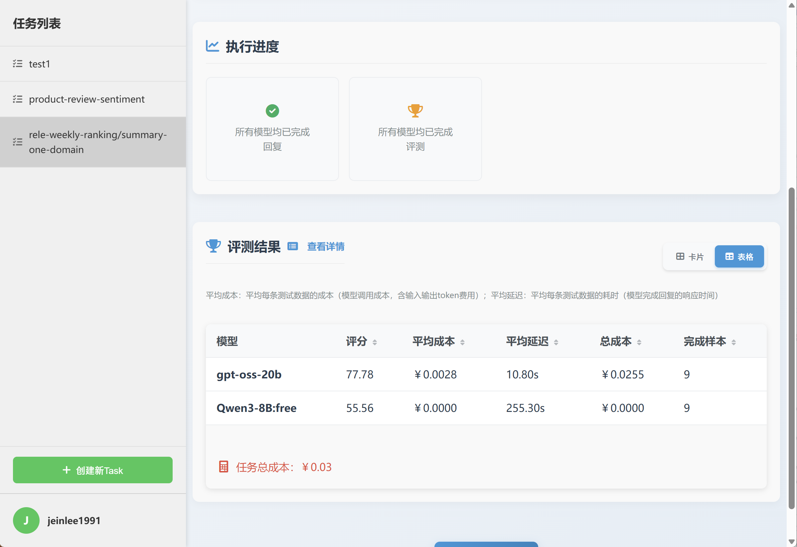
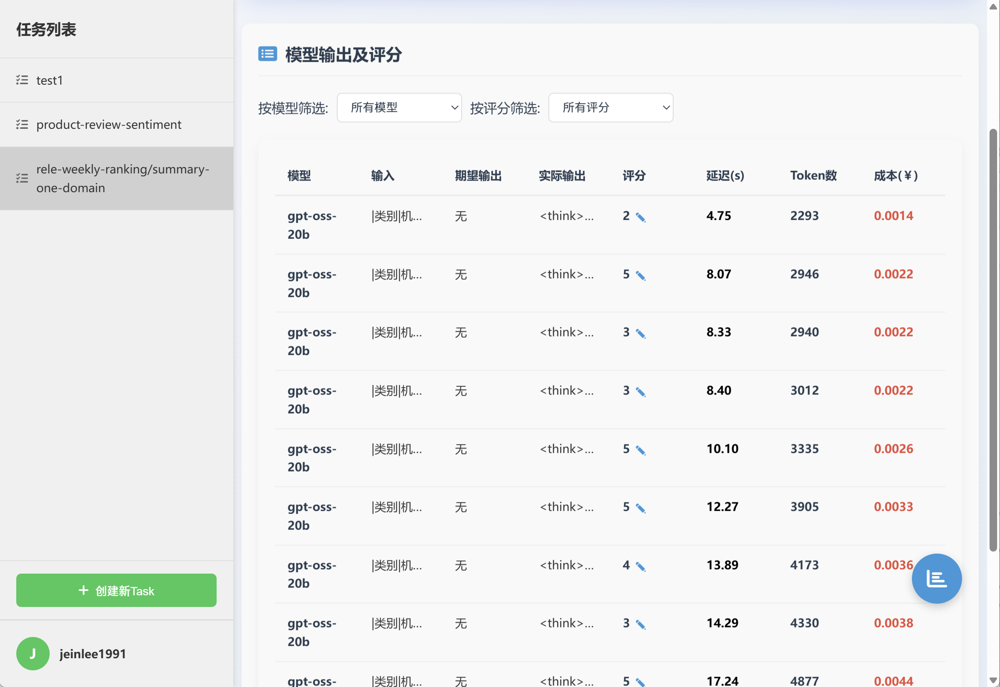

# 微信文章撰写之表格总结：如何选择最合适的大模型？
🔍🤖 想挑到最“聪明”又省钱的大模型？
别愁！我们奉上「零代码」评测全流程：从准备数据、创建任务，到实时对比准确率、耗时、花费，手把手教你把热门开源/商用模型拉通跑分。
📊✨ 5分钟搞定选型，挑出既聪明又省钱的“写手”模型，让每一分钱都花在刀刃上！（前言由kimi-k2撰写）

## 1、准备测试数据
作为样例，我们准备了9条数据如下：
【输入】表示模型输入，即prompt；【期望输出】表示参考答案。<br>
### （1）样本1
【输入】： 
``` |类别|机构|大模型|准确率|平均耗时|平均消耗token|花费/千次（元）|排名（准确率）|
|---|---|-----|-------------------|-------|-----------|-----------|-----------|
|商用|豆包|doubao-seed-1-6-thinking-250715|88.0|37s|2144|15.5|1|
|商用|腾讯|hunyuan-t1-20250711|85.5|40s|2693|9.9|2|
|开源|豆包|Seed-OSS-36B-Instruct|85.2|156s|2832|10.8|3|
|开源|深度求索|DeepSeek-R1-0528|84.4|215s|3077|48.0|4|
|开源|深度求索|DeepSeek-V3.1-Think|84.3|103s|2186|24.7|5|
|商用|阿里巴巴|*qwen-plus-think-2025-07-28|84.1|/|3452|25.9|6|
|商用|阿里巴巴|*qwen3-max-preview|84.0|16s|898|17.4|7|
|商用|百度|ERNIE-4.5-Turbo-32K|83.6|66s|713|1.8|8|
|商用|阿里巴巴|*qwen-plus-2025-07-28|83.5|24s|1054|1.8|9|
|商用|百度|ERNIE-X1-Turbo-32K|83.4|288s|2609|9.7|10|
|开源|阿里巴巴|qwen3-235b-a22b-instruct-2507|83.0|22s|1061|7.1|11|
|开源|阿里巴巴|qwen3-235b-a22b-thinking-2507|82.9|99s|3389|62.1|12|
|商用|google|gemini-2.5-pro|82.6|33s|2798|188.2|13|
|商用|腾讯|hunyuan-turbos-20250716|82.6|27s|1321|2.3|14|
|商用|openAI|gpt-5-2025-08-07|82.2|38s|600|30.0|15|
|开源|月之暗面|kimi-k2-0711-preview|81.6|62s|984|13.5|16|
|商用|XAI|grok-4-0709|80.6|293s|2379|241.5|17|
|商用|豆包|doubao-seed-1-6-250615|80.0|90s|625|3.1|18|
|开源|阿里巴巴|Qwen3-30B-A3B-Thinking-2507|79.7|74s|3285|8.7|19|
|商用|豆包|Doubao-1.5-pro-32k-250115|79.6|11s|541|0.8|20|
|开源|深度求索|DeepSeek-V3.1|79.5|27s|663|6.4|21|
|商用|阿里巴巴|qwen-flash-think-2025-07-28|78.7|32s|3271|4.6|22|
|开源|百度|ERNIE-4.5-300B-A47B|78.6|94s|588|3.3|23|
|开源|智谱AI|GLM-4.5|78.5|84s|3031|39.9|24|
|商用|豆包|doubao-seed-1-6-flash-thinking-250615|78.4|19s|1712|2.2|25|
|开源|深度求索|deepseek-chat-v3-0324|78.3|132s|861|6.1|26|
|开源|智谱AI|GLM-4.5-Air|78.3|54s|3197|17.9|27|
|开源|阶跃星辰|step-3|78.0|170s|3322|12.8|28|
|商用|科大讯飞|xunfei-spark-x1-0725|77.8|/|2060|24.6|29|
|开源|minimax|MiniMax-M1|77.8|226s|4392|32.0|30|
|……|……|……|……|……|……|……|……|
|商用|阿里巴巴|*qwen-turbo-think-2025-07-15|76.6|/|3109|8.7|36|
|商用|Mistral|*mistral-medium-2508|70.2|159s|751|7.9|60|
|开源|Mistral|*Magistral-Small-2507|66.5|197s|6663|70.6|77|
|开源|Mistral|*Mistral-Small-3.2-24B-Instruct-2506|62.0|126s|1208|2.2|84|
-------------------------
已知新模型为：mistral-medium-2508,Magistral-Small-2507,Mistral-Small-3.2-24B-Instruct-2506,qwen3-max-preview,qwen-plus-2025-07-28,qwen-plus-think-2025-07-28,qwen-turbo-think-2025-07-15。
基于以上表格写一段总结，格式为：“xx机构、xx机构……占据前5（机构名不要重复），然后描述开源模型和商用模型的分布。新模型中，xx排第xx，xx排第xx……（排名由高到低）”。严格按照表格中的模型名称、机构名称。
```
【期望输出】：<忽略，不用填写>
### （2）样本2
【输入】：
 ```|类别|机构|大模型|准确率|平均耗时|平均消耗token|花费/千次（元）|排名（准确率）|
|---|---|-----|-------------------|-------|-----------|-----------|-----------|
|商用|豆包|doubao-seed-1-6-thinking-250715|89.2|/|2660|18.8|1|
|商用|openAI|gpt-5-2025-08-07|89.0|44s|756|35.1|2|
|开源|豆包|Seed-OSS-36B-Instruct|88.1|179s|3397|12.7|3|
|开源|深度求索|DeepSeek-R1-0528|88.0|214s|3766|58.9|4|
|商用|腾讯|hunyuan-t1-20250711|88.0|51s|3504|12.8|5|
|商用|openAI|o4-mini|87.8|39s|1682|46.8|6|
|商用|openAI|gpt-5-mini-2025-08-07|87.4|63s|1625|19.7|7|
|开源|深度求索|DeepSeek-V3.1-Think|86.1|140s|3022|34.0|8|
|商用|阿里巴巴|*qwen-plus-think-2025-07-28|85.5|/|3938|29.0|9|
|商用|google|gemini-2.5-pro|85.2|34s|2987|194.5|10|
|商用|阿里巴巴|*qwen3-max-preview|85.2|19s|1142|21.2|11|
|商用|XAI|grok-4-0709|84.9|270s|2702|268.8|12|
|开源|阿里巴巴|qwen3-235b-a22b-thinking-2507|84.8|107s|3868|68.1|13|
|开源|openAI|gpt-oss-120b|84.2|73s|1313|3.4|14|
|商用|阿里巴巴|*qwen-plus-2025-07-28|84.1|28s|1308|2.2|15|
|开源|阿里巴巴|qwen3-235b-a22b-instruct-2507|83.8|27s|1333|8.6|16|
|开源|阿里巴巴|Qwen3-30B-A3B-Thinking-2507|83.7|79s|3679|9.6|17|
|商用|百度|ERNIE-X1-Turbo-32K|83.7|366s|3060|11.1|18|
|开源|智谱AI|GLM-4.5-Air|83.2|69s|4147|23.0|19|
|商用|anthropic|claude-4-sonnet-thinking|83.0|53s|1036|90.3|20|
|开源|月之暗面|kimi-k2-0711-preview|82.7|80s|1260|16.8|21|
|商用|阿里巴巴|qwen-flash-think-2025-07-28|82.6|35s|3589|4.9|22|
|商用|openAI|gpt-5-nano-2025-08-07|81.9|59s|2912|7.7|23|
|商用|智谱AI|GLM-4.5-Flash|81.8|72s|4083|0.0|24|
|开源|智谱AI|GLM-4.5|81.5|93s|3890|50.9|25|
|开源|openAI|gpt-oss-20b|81.3|134s|2261|2.3|26|
|商用|anthropic|claude-4-sonnet|81.2|47s|585|42.0|27|
|商用|百度|ERNIE-4.5-Turbo-32K|81.0|93s|792|1.7|28|
|开源|阶跃星辰|step-3|80.9|200s|3990|15.2|29|
|开源|深度求索|DeepSeek-V3.1|80.4|31s|823|7.6|30|
|……|……|……|……|……|……|……|……|
|商用|阿里巴巴|*qwen-turbo-think-2025-07-15|79.9|/|3408|9.3|31|
|开源|Mistral|*Magistral-Small-2507|74.2|248s|6845|71.7|51|
|商用|Mistral|*mistral-medium-2508|70.2|197s|873|8.3|62|
|开源|Mistral|*Mistral-Small-3.2-24B-Instruct-2506|65.7|154s|1495|2.7|81|
-------------------------
已知新模型为：mistral-medium-2508,Magistral-Small-2507,Mistral-Small-3.2-24B-Instruct-2506,qwen3-max-preview,qwen-plus-2025-07-28,qwen-plus-think-2025-07-28,qwen-turbo-think-2025-07-15。
基于以上表格写一段总结，格式为：“xx机构、xx机构……占据前5（机构名不要重复），然后描述开源模型和商用模型的分布。新模型中，xx排第xx，xx排第xx……（排名由高到低）”。严格按照表格中的模型名称、机构名称。
```
【期望输出】：<忽略，不用填写>
### （3）样本3
【输入】：
```|类别|机构|大模型|准确率|平均耗时|平均消耗token|花费/千次（元）|排名（准确率）|
|---|---|-----|-------------------|-------|-----------|-----------|-----------|
|商用|豆包|doubao-seed-1-6-thinking-250715|86.7|36s|1629|12.3|1|
|商用|百度|ERNIE-4.5-Turbo-32K|86.2|40s|635|1.8|2|
|商用|腾讯|hunyuan-turbos-20250716|85.3|24s|1181|2.2|3|
|商用|豆包|doubao-seed-1-6-250615|84.3|87s|505|3.1|4|
|商用|豆包|Doubao-1.5-pro-32k-250115|83.5|13s|460|0.8|5|
|商用|百度|ERNIE-X1-Turbo-32K|83.1|210s|2158|8.3|6|
|商用|腾讯|hunyuan-t1-20250711|83.0|29s|1883|7.0|7|
|商用|阿里巴巴|*qwen-plus-2025-07-28|83.0|20s|801|1.5|8|
|商用|阿里巴巴|*qwen3-max-preview|82.9|13s|654|13.6|9|
|商用|阿里巴巴|*qwen-plus-think-2025-07-28|82.7|/|2966|22.9|10|
|开源|深度求索|DeepSeek-V3.1-Think|82.6|66s|1351|15.4|11|
|开源|阿里巴巴|qwen3-235b-a22b-instruct-2507|82.3|18s|790|5.7|12|
|开源|豆包|Seed-OSS-36B-Instruct|82.2|133s|2267|8.8|13|
|开源|阿里巴巴|qwen3-235b-a22b-thinking-2507|81.1|92s|2910|56.1|14|
|开源|深度求索|DeepSeek-R1-0528|80.8|216s|2388|37.0|15|
|开源|月之暗面|kimi-k2-0711-preview|80.6|44s|709|10.2|16|
|商用|豆包|doubao-seed-1-6-flash-thinking-250615|80.6|14s|937|1.2|17|
|开源|百度|ERNIE-4.5-300B-A47B|80.5|113s|507|3.4|18|
|商用|google|gemini-2.5-pro|80.0|33s|2609|182.0|19|
|商用|科大讯飞|xunfei-spark-x1-0725|78.9|/|1528|18.1|20|
|开源|深度求索|DeepSeek-V3.1|78.7|24s|504|5.3|21|
|开源|阿里巴巴|Qwen3-32B|78.0|104s|2843|11.0|22|
|开源|深度求索|deepseek-chat-v3-0324|77.5|134s|747|5.4|23|
|商用|豆包|doubao-seed-1-6-flash-250615|77.0|5s|446|0.5|24|
|商用|XAI|grok-4-0709|76.3|316s|2057|214.1|25|
|商用|豆包|Doubao-1.5-lite-32k-250115|76.3|8s|324|0.2|26|
|开源|minimax|MiniMax-M1|76.1|259s|4147|30.5|27|
|开源|阿里巴巴|Qwen3-30B-A3B-Thinking-2507|75.7|70s|2892|7.9|28|
|开源|智谱AI|GLM-4.5|75.5|76s|2173|28.9|29|
|开源|阿里巴巴|Qwen3-14B|75.5|118s|4090|8.0|30|
|……|……|……|……|……|……|……|……|
|商用|阿里巴巴|*qwen-turbo-think-2025-07-15|73.4|/|2811|8.1|42|
|商用|Mistral|*mistral-medium-2508|70.1|121s|630|7.4|55|
|开源|Mistral|*Magistral-Small-2507|58.8|146s|6482|69.4|81|
|开源|Mistral|*Mistral-Small-3.2-24B-Instruct-2506|58.4|98s|922|1.8|84|
-------------------------
已知新模型为：mistral-medium-2508,Magistral-Small-2507,Mistral-Small-3.2-24B-Instruct-2506,qwen3-max-preview,qwen-plus-2025-07-28,qwen-plus-think-2025-07-28,qwen-turbo-think-2025-07-15。
基于以上表格写一段总结，格式为：“xx机构、xx机构……占据前5（机构名不要重复），然后描述开源模型和商用模型的分布。新模型中，xx排第xx，xx排第xx……（排名由高到低）”。严格按照表格中的模型名称、机构名称。
```
【期望输出】：<忽略，不用填写>
### （4）样本4
【输入】：
``` 
|类别|机构|大模型|准确率|平均耗时|平均消耗token|花费/千次（元）|排名（准确率）|
|---|---|-----|-------------------|-------|-----------|-----------|-----------|
|商用|豆包|doubao-seed-1-6-thinking-250715|89.8|22s|1472|10.9|1|
|开源|豆包|Seed-OSS-36B-Instruct|89.6|137s|2127|8.2|2|
|商用|腾讯|hunyuan-t1-20250711|89.3|31s|1996|7.3|3|
|商用|阿里巴巴|*qwen-plus-think-2025-07-28|87.8|/|2712|20.6|4|
|开源|百度|ERNIE-4.5-300B-A47B|87.4|185s|627|4.2|5|
|商用|豆包|doubao-seed-1-6-250615|87.3|107s|458|2.5|6|
|开源|阿里巴巴|qwen3-235b-a22b-thinking-2507|86.8|80s|2813|53.8|7|
|商用|阿里巴巴|*qwen3-max-preview|86.7|14s|742|15.1|8|
|商用|豆包|Doubao-1.5-pro-32k-250115|86.6|25s|535|0.9|9|
|商用|科大讯飞|xunfei-spark-x1-0725|86.5|/|1846|21.8|10|
|商用|百度|ERNIE-X1-Turbo-32K|85.8|191s|2184|8.4|11|
|商用|腾讯|hunyuan-turbos-20250716|85.8|24s|1163|2.1|12|
|商用|百度|ERNIE-4.5-Turbo-32K|85.6|89s|677|1.9|13|
|开源|阿里巴巴|qwen3-235b-a22b-instruct-2507|85.3|21s|919|6.5|14|
|开源|深度求索|DeepSeek-V3.1-Think|85.0|69s|1421|16.0|15|
|商用|豆包|doubao-seed-1-6-flash-thinking-250615|85.0|18s|1157|1.5|16|
|商用|google|gemini-2.5-pro|84.9|32s|2837|197.2|17|
|开源|阿里巴巴|Qwen3-30B-A3B-Thinking-2507|84.7|66s|2713|7.3|18|
|开源|月之暗面|kimi-k2-0711-preview|84.6|51s|765|10.8|19|
|商用|阿里巴巴|*qwen-plus-2025-07-28|84.5|22s|909|1.6|20|
|商用|阿里巴巴|qwen-flash-think-2025-07-28|83.8|25s|2683|3.8|21|
|商用|豆包|doubao-seed-1-6-flash-250615|83.6|6s|516|0.6|22|
|开源|阿里巴巴|Qwen3-32B|82.9|147s|3599|14.0|23|
|开源|深度求索|DeepSeek-R1-0528|82.6|211s|2757|42.7|24|
|开源|腾讯|Hunyuan-A13B-Instruct|82.5|145s|1385|5.2|25|
|开源|深度求索|DeepSeek-V3.1|82.4|24s|555|5.6|26|
|商用|豆包|Doubao-1.5-lite-32k-250115|81.4|20s|350|0.2|27|
|商用|openAI|gpt-5-2025-08-07|81.3|33s|507|28.0|28|
|商用|XAI|grok-4-0709|81.3|278s|2586|270.0|29|
|商用|阿里巴巴|*qwen-turbo-think-2025-07-15|81.2|/|2997|8.6|30|
|……|……|……|……|……|……|……|……|
|商用|Mistral|*mistral-medium-2508|74.8|86s|660|7.5|54|
|开源|Mistral|*Magistral-Small-2507|70.8|158s|6207|66.2|76|
|开源|Mistral|*Mistral-Small-3.2-24B-Instruct-2506|64.5|98s|961|1.8|83|
-------------------------
已知新模型为：mistral-medium-2508,Magistral-Small-2507,Mistral-Small-3.2-24B-Instruct-2506,qwen3-max-preview,qwen-plus-2025-07-28,qwen-plus-think-2025-07-28,qwen-turbo-think-2025-07-15。
基于以上表格写一段总结，格式为：“xx机构、xx机构……占据前5（机构名不要重复），然后描述开源模型和商用模型的分布。新模型中，xx排第xx，xx排第xx……（排名由高到低）”。严格按照表格中的模型名称、机构名称。
```
【期望输出】：<忽略，不用填写>
### （5）样本5
【输入】：
```|类别|机构|大模型|准确率|平均耗时|平均消耗token|花费/千次（元）|排名（准确率）|
|---|---|-----|-------------------|-------|-----------|-----------|-----------|
|商用|百度|ERNIE-4.5-Turbo-32K|91.5|21s|535|1.6|1|
|商用|腾讯|hunyuan-turbos-20250716|89.5|12s|633|1.1|2|
|商用|豆包|Doubao-1.5-pro-32k-250115|88.3|10s|378|0.7|3|
|商用|豆包|doubao-seed-1-6-thinking-250715|87.8|23s|1145|8.7|4|
|商用|豆包|doubao-seed-1-6-250615|85.5|102s|462|3.0|5|
|商用|腾讯|hunyuan-t1-20250711|82.9|27s|1656|6.2|6|
|商用|百度|ERNIE-X1-Turbo-32K|82.8|100s|1915|7.5|7|
|商用|阿里巴巴|*qwen3-max-preview|82.8|9s|456|9.5|8|
|开源|阿里巴巴|qwen3-235b-a22b-instruct-2507|82.7|11s|489|3.5|9|
|开源|百度|ERNIE-4.5-300B-A47B|82.6|21s|333|2.2|10|
|开源|豆包|Seed-OSS-36B-Instruct|82.5|102s|1790|7.0|11|
|商用|阿里巴巴|*qwen-plus-2025-07-28|82.0|12s|490|0.9|12|
|商用|豆包|doubao-seed-1-6-flash-thinking-250615|81.3|8s|620|0.8|13|
|商用|阿里巴巴|*qwen-plus-think-2025-07-28|81.2|/|2468|19.1|14|
|商用|豆包|doubao-seed-1-6-flash-250615|80.9|3s|318|0.4|15|
|商用|科大讯飞|xunfei-spark-max|80.7|3s|134|4.1|16|
|开源|深度求索|DeepSeek-R1-0528|80.6|225s|1831|28.5|17|
|商用|豆包|Doubao-1.5-lite-32k-250115|80.5|4s|196|0.1|18|
|开源|月之暗面|kimi-k2-0711-preview|80.5|30s|514|7.4|19|
|开源|深度求索|DeepSeek-V3.1-Think|80.5|51s|994|11.4|20|
|商用|科大讯飞|xunfei-spark-x1-0725|80.0|/|979|11.8|21|
|开源|深度求索|deepseek-chat-v3-0324|79.9|101s|310|2.1|22|
|开源|阿里巴巴|Qwen3-32B|79.9|56s|1622|6.3|23|
|商用|科大讯飞|xunfei-4.0Ultra|79.9|3s|135|9.5|24|
|开源|阿里巴巴|qwen3-235b-a22b-thinking-2507|79.5|91s|2424|46.8|25|
|开源|深度求索|DeepSeek-V3.1|79.1|17s|334|3.5|26|
|商用|月之暗面|kimi-latest-8k|78.5|22s|486|5.9|27|
|商用|google|gemini-2.5-pro|77.8|35s|2315|163.4|28|
|商用|科大讯飞|xunfei-spark-pro|77.2|/|/|/|29|
|开源|minimax|MiniMax-M1|77.1|168s|2807|19.2|30|
|……|……|……|……|……|……|……|……|
|商用|阿里巴巴|*qwen-turbo-think-2025-07-15|70.5|/|2153|6.2|56|
|商用|Mistral|*mistral-medium-2508|68.0|202s|482|5.9|62|
|开源|Mistral|*Magistral-Small-2507|55.3|178s|5568|59.9|83|
|开源|Mistral|*Mistral-Small-3.2-24B-Instruct-2506|54.1|157s|510|1.0|87|
-------------------------
已知新模型为：mistral-medium-2508,Magistral-Small-2507,Mistral-Small-3.2-24B-Instruct-2506,qwen3-max-preview,qwen-plus-2025-07-28,qwen-plus-think-2025-07-28,qwen-turbo-think-2025-07-15。
基于以上表格写一段总结，格式为：“xx机构、xx机构……占据前5（机构名不要重复），然后描述开源模型和商用模型的分布。新模型中，xx排第xx，xx排第xx……（排名由高到低）”。严格按照表格中的模型名称、机构名称。
```
【期望输出】：<忽略，不用填写>
### （6）样本6
【输入】：
``` |类别|机构|大模型|准确率|平均耗时|平均消耗token|花费/千次（元）|排名（准确率）|
|---|---|-----|-------------------|-------|-----------|-----------|-----------|
|商用|百度|ERNIE-4.5-Turbo-32K|85.8|22s|520|1.5|1|
|商用|阿里巴巴|*qwen3-max-preview|85.1|11s|547|11.4|2|
|商用|豆包|doubao-seed-1-6-thinking-250715|84.1|28s|1472|11.1|3|
|商用|腾讯|hunyuan-turbos-20250716|83.9|21s|1026|1.9|4|
|商用|腾讯|hunyuan-t1-20250711|83.6|28s|1806|6.8|5|
|商用|豆包|Doubao-1.5-pro-32k-250115|83.3|10s|403|0.7|6|
|商用|阿里巴巴|*qwen-plus-think-2025-07-28|83.0|/|2760|21.4|7|
|开源|深度求索|DeepSeek-V3.1-Think|82.8|61s|1230|14.1|8|
|商用|阿里巴巴|*qwen-plus-2025-07-28|82.8|18s|709|1.3|9|
|开源|华为|pangu-pro-moe|82.8|79s|1541|5.9|10|
|商用|百度|ERNIE-X1-Turbo-32K|82.5|123s|2085|8.1|11|
|商用|豆包|doubao-seed-1-6-250615|82.0|86s|417|2.4|12|
|开源|阿里巴巴|qwen3-235b-a22b-instruct-2507|81.7|14s|637|4.5|13|
|开源|阿里巴巴|Qwen3-14B|80.2|32s|1516|2.9|14|
|开源|阿里巴巴|Qwen3-32B|79.7|32s|1218|4.6|15|
|开源|阿里巴巴|qwen3-235b-a22b-thinking-2507|79.6|111s|2682|51.9|16|
|商用|豆包|doubao-seed-1-6-flash-thinking-250615|79.2|19s|1052|1.4|17|
|开源|深度求索|DeepSeek-R1-0528|79.0|240s|2222|34.5|18|
|开源|百度|ERNIE-4.5-300B-A47B|78.9|23s|507|3.5|19|
|开源|月之暗面|kimi-k2-0711-preview|78.6|26s|438|6.0|20|
|开源|深度求索|DeepSeek-V3.1|78.5|21s|405|4.2|21|
|商用|google|gemini-2.5-pro|78.5|30s|2196|153.3|22|
|开源|minimax|MiniMax-M1|78.0|211s|3469|24.4|23|
|商用|豆包|doubao-seed-1-6-flash-250615|77.2|9s|487|0.6|24|
|商用|豆包|Doubao-1.5-lite-32k-250115|77.2|6s|288|0.1|25|
|商用|阿里巴巴|qwen-long-2025-01-25|76.9|43s|377|0.6|26|
|开源|智谱AI|GLM-4.5|76.9|81s|2191|29.7|27|
|开源|深度求索|deepseek-chat-v3-0324|76.8|125s|460|3.2|28|
|开源|豆包|Seed-OSS-36B-Instruct|75.9|104s|2137|8.3|29|
|商用|科大讯飞|xunfei-4.0Ultra|75.5|7s|220|15.5|30|
|……|……|……|……|……|……|……|……|
|商用|Mistral|*mistral-medium-2508|73.1|65s|525|6.2|41|
|商用|阿里巴巴|*qwen-turbo-think-2025-07-15|71.7|/|2774|8.1|47|
|开源|Mistral|*Magistral-Small-2507|55.9|140s|5837|62.6|88|
|开源|Mistral|*Mistral-Small-3.2-24B-Instruct-2506|54.5|112s|731|1.4|90|
-------------------------
已知新模型为：mistral-medium-2508,Magistral-Small-2507,Mistral-Small-3.2-24B-Instruct-2506,qwen3-max-preview,qwen-plus-2025-07-28,qwen-plus-think-2025-07-28,qwen-turbo-think-2025-07-15。
基于以上表格写一段总结，格式为：“xx机构、xx机构……占据前5（机构名不要重复），然后描述开源模型和商用模型的分布。新模型中，xx排第xx，xx排第xx……（排名由高到低）”。严格按照表格中的模型名称、机构名称。
```
【期望输出】：<忽略，不用填写>
### （7）样本7
【输入】：
``` |类别|机构|大模型|准确率|平均耗时|平均消耗token|花费/千次（元）|排名（准确率）|
|---|---|-----|-------------------|-------|-----------|-----------|-----------|
|商用|豆包|doubao-seed-1-6-thinking-250715|85.0|72s|2430|18.4|1|
|商用|豆包|doubao-seed-1-6-250615|82.7|53s|685|4.3|2|
|商用|阿里巴巴|*qwen-plus-2025-07-28|82.7|29s|1096|2.0|3|
|商用|腾讯|hunyuan-turbos-20250716|82.2|40s|1903|3.6|4|
|开源|深度求索|DeepSeek-V3.1-Think|82.0|85s|1761|20.1|5|
|商用|百度|ERNIE-4.5-Turbo-32K|81.5|29s|808|2.3|6|
|商用|百度|ERNIE-X1-Turbo-32K|81.2|428s|2451|9.4|7|
|开源|深度求索|DeepSeek-R1-0528|81.0|189s|2743|42.4|8|
|开源|豆包|Seed-OSS-36B-Instruct|81.0|190s|3016|11.7|9|
|商用|科大讯飞|xunfei-spark-x1-0725|80.2|/|1972|23.2|10|
|开源|阿里巴巴|qwen3-235b-a22b-instruct-2507|79.3|27s|1115|8.1|11|
|商用|google|gemini-2.5-pro|78.8|35s|3088|214.1|12|
|开源|月之暗面|kimi-k2-0711-preview|78.7|72s|1119|16.4|13|
|商用|阿里巴巴|*qwen-plus-think-2025-07-28|78.7|/|3924|30.4|14|
|开源|阿里巴巴|qwen3-235b-a22b-thinking-2507|78.3|87s|3721|71.9|15|
|商用|阿里巴巴|*qwen3-max-preview|77.0|19s|873|18.4|16|
|商用|豆包|doubao-seed-1-6-flash-thinking-250615|76.8|14s|922|1.1|17|
|商用|腾讯|hunyuan-t1-20250711|76.5|33s|2077|7.8|18|
|开源|阿里巴巴|Qwen3-30B-A3B-Thinking-2507|75.7|77s|3419|9.3|19|
|商用|豆包|Doubao-1.5-pro-32k-250115|75.7|8s|524|0.9|20|
|开源|深度求索|deepseek-chat-v3-0324|75.0|188s|1564|11.8|21|
|开源|深度求索|DeepSeek-V3.1|74.7|35s|723|7.7|22|
|商用|XAI|grok-4-0709|74.0|424s|2495|258.8|23|
|商用|openAI|gpt-5-2025-08-07|73.7|34s|577|31.8|24|
|开源|百度|ERNIE-4.5-300B-A47B|73.2|224s|564|3.6|25|
|开源|阶跃星辰|step-3|73.0|165s|3255|12.7|26|
|开源|minimax|MiniMax-M1|73.0|415s|5818|44.5|27|
|商用|google|gemini-2.5-flash|73.0|15s|2991|51.7|28|
|开源|智谱AI|GLM-4.5|72.7|84s|2126|27.0|29|
|商用|阿里巴巴|qwen-flash-think-2025-07-28|72.7|39s|3762|5.5|30|
|……|……|……|……|……|……|……|……|
|商用|阿里巴巴|*qwen-turbo-think-2025-07-15|70.0|/|3323|9.6|35|
|商用|Mistral|*mistral-medium-2508|64.3|133s|853|10.1|53|
|开源|Mistral|*Mistral-Small-3.2-24B-Instruct-2506|60.3|25s|1486|2.9|64|
|开源|Mistral|*Magistral-Small-2507|53.3|111s|8317|89.0|77|
-------------------------
已知新模型为：mistral-medium-2508,Magistral-Small-2507,Mistral-Small-3.2-24B-Instruct-2506,qwen3-max-preview,qwen-plus-2025-07-28,qwen-plus-think-2025-07-28,qwen-turbo-think-2025-07-15。
基于以上表格写一段总结，格式为：“xx机构、xx机构……占据前5（机构名不要重复），然后描述开源模型和商用模型的分布。新模型中，xx排第xx，xx排第xx……（排名由高到低）”。严格按照表格中的模型名称、机构名称。
```
【期望输出】：<忽略，不用填写>
### （8）样本8
【输入】：
``` |类别|机构|大模型|准确率|平均耗时|平均消耗token|花费/千次（元）|排名（准确率）|
|---|---|-----|-------------------|-------|-----------|-----------|-----------|
|商用|openAI|o4-mini|91.1|47s|2425|66.1|1|
|开源|豆包|Seed-OSS-36B-Instruct|90.2|280s|5618|21.0|2|
|商用|豆包|doubao-seed-1-6-thinking-250715|90.0|63s|4295|30.2|3|
|商用|openAI|gpt-5-mini-2025-08-07|89.9|51s|2391|28.7|4|
|商用|openAI|gpt-5-2025-08-07|89.3|61s|1075|46.8|5|
|开源|深度求索|DeepSeek-R1-0528|88.5|288s|5887|92.9|6|
|商用|阿里巴巴|*qwen-plus-think-2025-07-28|88.0|/|5582|40.5|7|
|开源|openAI|gpt-oss-120b|87.4|74s|1961|5.0|8|
|开源|阿里巴巴|qwen3-235b-a22b-thinking-2507|87.0|157s|5455|92.9|9|
|商用|腾讯|hunyuan-t1-20250711|87.0|86s|5906|21.6|10|
|开源|深度求索|DeepSeek-V3.1-Think|86.2|234s|5113|57.7|11|
|开源|阿里巴巴|Qwen3-30B-A3B-Thinking-2507|84.9|106s|5239|13.5|12|
|商用|google|gemini-2.5-pro|84.7|42s|4095|260.2|13|
|商用|openAI|gpt-5-nano-2025-08-07|83.7|76s|4061|10.6|14|
|开源|openAI|gpt-oss-20b|83.5|195s|3254|3.3|15|
|商用|阿里巴巴|*qwen3-max-preview|83.0|31s|1881|34.9|16|
|商用|阿里巴巴|qwen-flash-think-2025-07-28|82.8|51s|5142|6.9|17|
|商用|阿里巴巴|*qwen-plus-2025-07-28|82.6|45s|2145|3.6|18|
|商用|XAI|grok-4-0709|82.3|227s|4119|408.2|19|
|开源|智谱AI|GLM-4.5-Air|82.1|110s|6636|36.6|20|
|开源|阿里巴巴|qwen3-235b-a22b-instruct-2507|81.0|46s|2199|14.2|21|
|开源|智谱AI|GLM-4.5|80.4|127s|6030|78.6|22|
|开源|阶跃星辰|step-3|80.0|319s|6341|24.2|23|
|商用|anthropic|claude-4-sonnet-thinking|80.0|60s|1209|100.1|24|
|商用|智谱AI|GLM-4.5-Flash|79.9|116s|6504|0.0|25|
|商用|百度|ERNIE-X1-Turbo-32K|79.5|433s|5043|18.3|26|
|商用|阿里巴巴|*qwen-turbo-think-2025-07-15|79.0|/|5474|14.9|27|
|开源|minimax|MiniMax-M1|78.7|297s|6679|48.3|28|
|开源|阿里巴巴|Qwen3-30B-A3B-Instruct-2507|78.4|24s|2404|5.9|29|
|商用|XAI|grok-3-mini|77.3|132s|2531|8.5|30|
|……|……|……|……|……|……|……|……|
|开源|Mistral|*Magistral-Small-2507|72.6|322s|9712|101.3|43|
|开源|Mistral|*Mistral-Small-3.2-24B-Instruct-2506|62.5|106s|2527|4.6|65|
|商用|Mistral|*mistral-medium-2508|62.3|328s|1326|12.4|67|
-------------------------
已知新模型为：mistral-medium-2508,Magistral-Small-2507,Mistral-Small-3.2-24B-Instruct-2506,qwen3-max-preview,qwen-plus-2025-07-28,qwen-plus-think-2025-07-28,qwen-turbo-think-2025-07-15。
基于以上表格写一段总结，格式为：“xx机构、xx机构……占据前5（机构名不要重复），然后描述开源模型和商用模型的分布。新模型中，xx排第xx，xx排第xx……（排名由高到低）”。严格按照表格中的模型名称、机构名称。
```
【期望输出】：<忽略，不用填写>
### （9）样本9
【输入】：
``` |类别|机构|大模型|准确率|平均耗时|平均消耗token|花费/千次（元）|排名（准确率）|
|---|---|-----|-------------------|-------|-----------|-----------|-----------|
|商用|腾讯|hunyuan-turbos-20250716|89.3|10s|546|0.9|1|
|商用|腾讯|hunyuan-t1-20250711|89.0|17s|1103|4.0|2|
|商用|openAI|gpt-5-2025-08-07|88.6|28s|437|23.3|3|
|开源|百度|ERNIE-4.5-300B-A47B|88.5|40s|236|1.2|4|
|商用|豆包|doubao-seed-1-6-thinking-250715|88.5|18s|1026|7.3|5|
|开源|月之暗面|kimi-k2-0711-preview|88.2|26s|488|6.6|6|
|商用|百度|ERNIE-X1-Turbo-32K|87.8|299s|1077|4.0|7|
|商用|anthropic|claude-4-sonnet|87.7|40s|436|34.1|8|
|开源|深度求索|DeepSeek-R1-0528|87.6|140s|1645|24.9|9|
|商用|XAI|grok-4-0709|87.5|313s|1285|129.5|10|
|商用|阿里巴巴|*qwen3-max-preview|87.2|7s|404|7.5|11|
|商用|百度|ERNIE-4.5-Turbo-32K|87.1|145s|292|0.6|12|
|开源|阿里巴巴|qwen3-235b-a22b-instruct-2507|86.6|9s|467|3.0|13|
|商用|豆包|Doubao-1.5-pro-32k-250115|86.2|5s|318|0.5|14|
|开源|豆包|Seed-OSS-36B-Instruct|86.0|79s|1176|4.4|15|
|商用|anthropic|claude-4-sonnet-thinking|86.0|47s|863|80.5|16|
|开源|深度求索|DeepSeek-V3.1-Think|85.9|46s|931|10.3|17|
|商用|阿里巴巴|*qwen-plus-2025-07-28|85.6|11s|472|0.8|18|
|商用|google|gemini-2.5-pro|85.6|27s|1880|128.7|19|
|开源|深度求索|DeepSeek-V3.1|84.9|15s|326|3.1|20|
|商用|openAI|gpt-5-mini-2025-08-07|84.8|75s|860|10.7|21|
|商用|openAI|o4-mini|84.5|32s|939|27.5|22|
|开源|智谱AI|GLM-4.5-Air|84.4|29s|1658|9.3|23|
|开源|深度求索|deepseek-chat-v3-0324|84.1|117s|420|2.9|24|
|商用|豆包|doubao-seed-1-6-250615|84.1|92s|349|1.6|25|
|商用|科大讯飞|xunfei-spark-x1-0725|83.7|/|627|7.5|26|
|商用|智谱AI|GLM-4.5-Flash|83.5|29s|1662|0.0|27|
|商用|阿里巴巴|*qwen-plus-think-2025-07-28|82.9|/|2294|17.5|28|
|开源|智谱AI|GLM-4.5|82.7|59s|1750|23.1|29|
|开源|阿里巴巴|qwen3-235b-a22b-thinking-2507|82.6|57s|2281|43.4|30|
|……|……|……|……|……|……|……|……|
|商用|阿里巴巴|*qwen-turbo-think-2025-07-15|80.7|/|1343|3.7|41|
|商用|Mistral|*mistral-medium-2508|78.2|67s|420|4.3|59|
|开源|Mistral|*Magistral-Small-2507|75.7|175s|3979|42.1|69|
|开源|Mistral|*Mistral-Small-3.2-24B-Instruct-2506|68.8|203s|464|0.8|89|
-------------------------
已知新模型为：mistral-medium-2508,Magistral-Small-2507,Mistral-Small-3.2-24B-Instruct-2506,qwen3-max-preview,qwen-plus-2025-07-28,qwen-plus-think-2025-07-28,qwen-turbo-think-2025-07-15。
基于以上表格写一段总结，格式为：“xx机构、xx机构……占据前5（机构名不要重复），然后描述开源模型和商用模型的分布。新模型中，xx排第xx，xx排第xx……（排名由高到低）”。严格按照表格中的模型名称、机构名称。
```
【期望输出】：<忽略，不用填写>


<br><br>
## 2、创建模型选型评测任务
首先打开任务创建页面 https://nonelinear.com/static/task-create.html 。 <br>
### （1）第一步：设置任务ID
输入Task ID，任务的唯一标识，一旦创建无法修改。这里我们根据具体任务设为：rele-weekly-ranking/summary-one-domain。<br>

### （2）第二步：选择模型
选择想要评测的模型，页面默认提供了“精选高性价比模型”列表（按性价比由高到低排列，排在后面的模型相对来说效果差一些但更便宜），及“旗舰模型”列表。
当然，也可以点击查看更多模型，支持按“是否思考模型”“是否开源”“国内/国外模型”来筛选。
作为示例，我们选择了2个模型：gpt-oss-20b、Qwen3-8B:free。


### （3）第三步：选择评测指标
选择评测指标，默认为“准确性”指标，适合绝大部分场景。
如果是预测打分/投票类的场景，比如让模型给学生作文打分，可以选择“评分一致性”指标。
#### 关于“准确性”指标：
- 当测试数据包含“期望输出”（参考答案）时，“准确性”指标默认为：只判断对错，即在评估模型回复的好坏时，要么算对，要么算错，没有中间分数。
- 当测试数据不包含“期望输出”（参考答案）时，“准确性”指标默认为：5分制，即在评估模型回复的好坏时，可以得1~5分；5分是满分，表示完全正确；1分是最低分，表示完全错误。

### （4）第四步：添加数据
把前面准备好的测试数据逐条添加到表单。（后续会开放上传文件功能）

### （5）第五步：评测结果
点击提交，之后页面会自动跳转到任务详情 https://nonelinear.com/static/task-result.html?task_id=rele-weekly-ranking/summary-one-domain ，
可以实时查看执行进度。最终可以看到以下的结果：包含各模型的最终得分，成本，耗时等。您可以综合评估选出最合适的模型。


### （6）第六步：评测详情
在任务详情页面的【评测结果】版块，点击【查看详情】，进入 https://nonelinear.com/static/evaldetail.html?task_id=rele-weekly-ranking/summary-one-domain ，
可以查看每个模型的每条回复及具体得分情况。您也可以筛选出哪些测试数据下、哪些模型回答的效果差。
如果您发现系统自动评分不符合您的标准，您可以自行修改评分，修改后对应模型的整体得分也会在后台自动更新。
