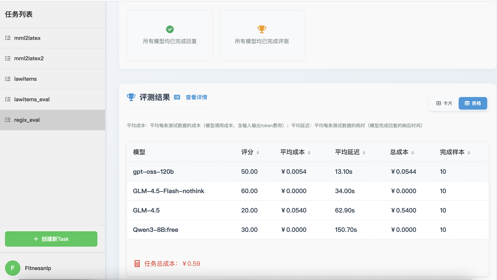

# 正则表达式生成：如何选择最合适的大模型？

## 1、准备测试数据
作为样例，我们准备了10条数据如下：【输入】表示模型输入，即prompt；【期望输出】表示参考答案。

### 样本1
●【输入】：编写正则表达式匹配中国手机号码的正则表达式（11位，1开头）。要求输出格式为纯正则表达式，不要有任何解释说明。示例：匹配字母数字可以用 [a-zA-Z0-9]表示

●【期望输出】：```^1[3-9]\d{9}$```

### 样本2
●【输入】：编写正则表达式匹配有效的邮箱地址格式。要求输出格式为纯正则表达式，不要有任何解释说明。示例：匹配字母数字可以用 [a-zA-Z0-9] 表示

●【期望输出】：```^[a-zA-Z0-9._%+-]+@[a-zA-Z0-9.-]+\.[a-zA-Z]{2,}$```

### 样本3
●【输入】：编写正则表达式匹配IPv4地址格式。要求输出格式为纯正则表达式，不要有任何解释说明。示例：匹配字母数字可以用 [a-zA-Z0-9] 表示

●【期望输出】：```^((25[0-5]|2[0-4][0-9]|[01]?[0-9][0-9]?)\.){3}(25[0-5]|2[0-4][0-9]|[01]?[0-9][0-9]?)$```

### 样本4
●【输入】：编写正则表达式匹配强密码（至少8位，包含大小写字母、数字和特殊字符）。要求输出格式为纯正则表达式，不要有任何解释说明。示例：匹配字母数字可以用 [a-zA-Z0-9] 表示

●【期望输出】：```^(?=.*[a-z])(?=.*[A-Z])(?=.*\d)(?=.*[@$!%*?&])[A-Za-z\d@$!%*?&]{8,}$```

### 样本5
●【输入】：编写正则表达式匹配URL地址（支持http和https）。要求输出格式为纯正则表达式，不要有任何解释说明。示例：匹配字母数字可以用 [a-zA-Z0-9] 表示

●【期望输出】：```^https?:\/\/(www\.)?[-a-zA-Z0-9@:%._\+~#=]{1,256}\.[a-zA-Z0-9()]{1,6}\b([-a-zA-Z0-9()@:%_\+.~#?&//=]*)$```

### 样本6
●【输入】：编写正则表达式匹配HTML标签。要求输出格式为纯正则表达式，不要有任何解释说明。示例：匹配字母数字可以用 [a-zA-Z0-9] 表示

●【期望输出】：```<[^>]+>```

### 样本7
●【输入】：编写正则表达式匹配中文字符。要求输出格式为纯正则表达式，不要有任何解释说明。示例：匹配字母数字可以用 [a-zA-Z0-9]表示

●【期望输出】：```[\u4e00-\u9fa5]+```

### 样本8
●【输入】：编写正则表达式匹配银行卡号（13-19位数字）。要求输出格式为纯正则表达式，不要有任何解释说明。示例：匹配字母数字可以用 [a-zA-Z0-9]表示

●【期望输出】：```^\d{13,19}$```

### 样本9
●【输入】：编写正则表达式匹配十六进制颜色代码。要求输出格式为纯正则表达式，不要有任何解释说明。示例：匹配字母数字可以用 [a-zA-Z0-9]表示

●【期望输出】：```^#([A-Fa-f0-9]{6}|[A-Fa-f0-9]{3})$```

### 样本10
●【输入】：编写正则表达式匹配MAC地址格式。要求输出格式为纯正则表达式，不要有任何解释说明。示例：匹配字母数字可以用 [a-zA-Z0-9]表示

●【期望输出】：```^([0-9A-Fa-f]{2}[:-]){5}([0-9A-Fa-f]{2})$```


<br><br>
## 2、创建模型选型评测任务
首先打开任务创建页面 https://nonelinear.com/static/task-create.html 。 

### （1）第一步：设置任务ID
输入Task ID，任务的唯一标识，一旦创建无法修改。这里我们根据具体任务设为：regix_eval。

### （2）第二步：选择模型
选择想要评测的模型，页面默认提供了“精选高性价比模型”列表（按性价比由高到低排列，排在后面的模型相对来说效果差一些但更便宜），及“旗舰模型”列表。当然，也可以点击查看更多模型，支持按“是否思考模型”“是否开源”“国内/国外模型”来筛选。作为示例，我们选择了四个模型：gpt-oss-120b、GLM-4.5-Flash-nothink、GLM-4.5-Flash、Qwen3-8B:free。

### （3）第三步：选择评测指标
选择评测指标，默认为“准确性”指标，适合绝大部分场景。
如果是预测打分/投票类的场景，比如让模型给学生作文打分，可以选择“评分一致性”指标。
#### 关于“准确性”指标：
- 当测试数据包含“期望输出”（参考答案）时，“准确性”指标默认为：只判断对错，即在评估模型回复的好坏时，要么算对，要么算错，没有中间分数。
- 当测试数据不包含“期望输出”（参考答案）时，“准确性”指标默认为：5分制，即在评估模型回复的好坏时，可以得1~5分；5分是满分，表示完全正确；1分是最低分，表示完全错误。

### （4）第四步：添加数据
把前面准备好的测试数据逐条添加到表单。（后续会开放上传文件功能）

### （5）第五步：评测结果
点击提交，之后页面会自动跳转到任务详情 https://nonelinear.com/static/task-result.html?task_id=regix_eval ，可以实时查看执行进度。最终可以看到以下的结果：包含各模型的最终得分，成本，耗时等。您可以综合评估选出最合适的模型。


### （6）第六步：评测详情
在任务详情页面的【评测结果】版块，点击【查看详情】，进入 https://nonelinear.com/static/evaldetail.html?task_id=regix_eval ，可以查看每个模型的每条回复及具体得分情况。您也可以筛选出哪些测试数据下、哪些模型回答的效果差。如果您发现系统自动评分不符合您的标准，您可以自行修改评分，修改后对应模型的整体得分也会在后台自动更新。


