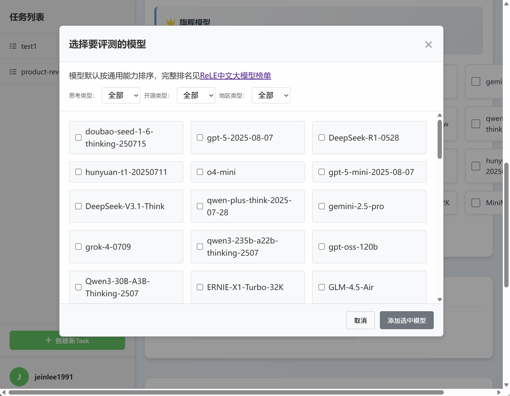
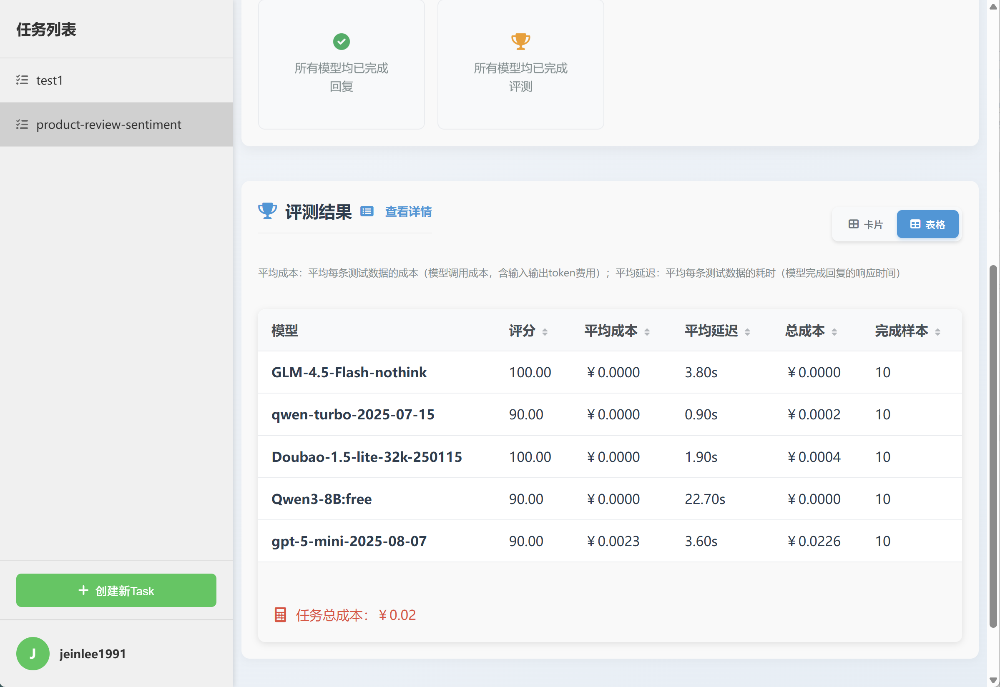
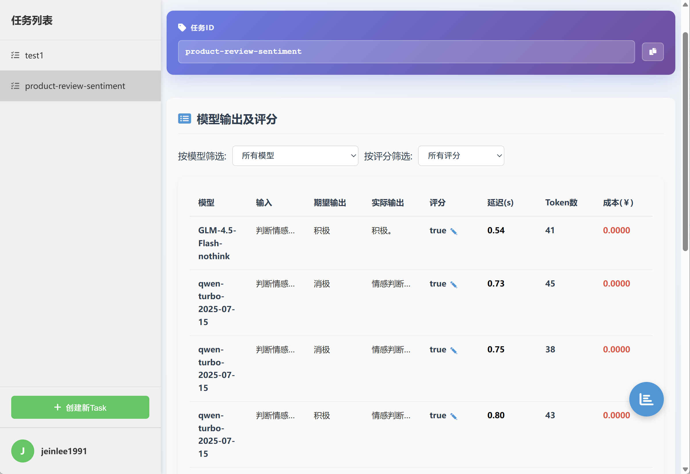

# 电商评论情感分析：如何选择最合适的大模型？

## 1、准备测试数据
作为样例，我们准备了10条数据如下：
【输入】表示模型输入，即prompt；【期望输出】表示参考答案。 
### 样本1
  - 【输入】：判断情感（积极/消极/中性）： 这个手机的拍照效果真的太惊艳了，夜景模式特别清晰，完全超出预期！
  - 【期望输出】：积极
### 样本2
  - 【输入】：判断情感（积极/消极/中性）： 质量不错，价格也算合理，但包装有点简陋，整体还行吧。
  - 【期望输出】：中性 
### 样本3
  - 【输入】：判断情感（积极/消极/中性）： 用了三天就死机两次，客服态度也不好，体验很差，不会再买了。
  - 【期望输出】：消极
### 样本4
  - 【输入】：判断情感（积极/消极/中性）： 耳机音质很棒，降噪效果明显，通勤路上用起来特别舒服，推荐！
  - 【期望输出】：积极
### 样本5
  - 【输入】：判断情感（积极/消极/中性）： 物流挺快的，商品和描述差不多，没什么特别的，也没有失望。
  - 【期望输出】：中性
### 样本6
  - 【输入】：判断情感（积极/消极/中性）： 衣服颜色和图片差太多了，材质也粗糙，感觉被骗了。
  - 【期望输出】：消极
### 样本7
  - 【输入】：判断情感（积极/消极/中性）： 这款咖啡机操作简单，做出来的咖啡香浓可口，每天早上去上班前都用它，生活幸福感提升了不少！
  - 【期望输出】：积极
### 样本8
  - 【输入】：判断情感（积极/消极/中性）： 买给妈妈的按摩仪，她说力度刚好，按完肩颈轻松多了，性价比很高。
  - 【期望输出】：积极
### 样本9
  - 【输入】：判断情感（积极/消极/中性）： 商品功能基本能用，但说明书写得不清楚，设置起来有点麻烦。
  - 【期望输出】：中性
### 样本10
  - 【输入】：判断情感（积极/消极/中性）： 充电宝充满电后只能给手机充一次就没电了，容量虚标严重，非常失望。
  - 【期望输出】：消极
 

  
## 2、创建模型选型评测任务
首先打开任务创建页面 https://nonelinear.com/static/task-create.html 。  
### （1）第一步：设置任务ID
输入Task ID，任务的唯一标识，一旦创建无法修改。这里我们根据具体任务设为：product-review-sentiment。 

### （2）第二步：选择模型
选择想要评测的模型，页面默认提供了“精选高性价比模型”列表（按性价比由高到低排列，排在后面的模型相对来说效果差一些但更便宜），及“旗舰模型”列表。
当然，也可以点击查看更多模型，支持按“是否思考模型”“是否开源”“国内/国外模型”来筛选。
作为示例，我们选择了五个模型：GLM-4.5-Flash-nothink、qwen-turbo-2025-07-15、Doubao-1.5-lite-32k-250115、Qwen3-8B:free、gpt-5-mini-2025-08-07。

### （3）第三步：选择评测指标
选择评测指标，默认为“准确性”指标，适合绝大部分场景。
如果是预测打分/投票类的场景，比如让模型给学生作文打分，可以选择“评分一致性”指标。
#### 关于“准确性”指标：
- 当测试数据包含“期望输出”（参考答案）时，“准确性”指标默认为：只判断对错，即在评估模型回复的好坏时，要么算对，要么算错，没有中间分数。
- 当测试数据不包含“期望输出”（参考答案）时，“准确性”指标默认为：5分制，即在评估模型回复的好坏时，可以得1~5分；5分是满分，表示完全正确；1分是最低分，表示完全错误。

### （4）第四步：添加数据
把前面准备好的测试数据逐条添加到表单。（后续会开放上传文件功能）

### （5）第五步：评测结果
点击提交，之后页面会自动跳转到任务详情 https://nonelinear.com/static/task-result.html?task_id=product-review-sentiment ，
可以实时查看执行进度。最终可以看到以下的结果：包含各模型的最终得分，成本，耗时等。您可以综合评估选出最合适的模型。

### （6）第六步：评测详情
在任务详情页面的【评测结果】版块，点击【查看详情】，进入 https://nonelinear.com/static/evaldetail.html?task_id=product-review-sentiment ，
可以查看每个模型的每条回复及具体得分情况。您也可以筛选出哪些测试数据下、哪些模型回答的效果差。
如果您发现系统自动评分不符合您的标准，您可以自行修改评分，修改后对应模型的整体得分也会在后台自动更新。
