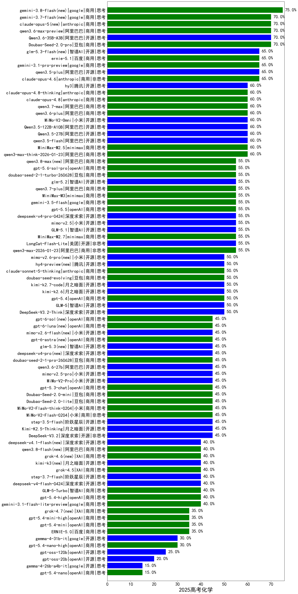

|类别|机构|大模型|【2025高考化学】准确率|平均耗时|平均消耗token|花费/千次（元）|排名（准确率）|
|---|---|-----|-------------------|-------|-----------|-----------|-----------|
|商用|google|gemini-3.8-flash(new)|75.0%|15s|2145|104.1|1|
|开源|阿里巴巴|Qwen3.6-35B-A3B|70.0%|23s|4028|41.6|2|
|商用|豆包|Doubao-Seed-2.0-pro|70.0%|292s|1649|23.2|3|
|商用|阿里巴巴|qwen3.6-max-preview|70.0%|142s|5244|273.7|4|
|商用|google|gemini-3.7-flash(new)|70.0%|7s|1391|32.2|5|
|商用|anthropic|claude-opus-5(new)|70.0%|18s|1433|205.0|6|
|开源|智谱AI|glm-5.3-flash(new)|65.0%|227s|9498|26.2|7|
|商用|anthropic|claude-opus-4.6|65.0%|17s|1109|151.1|8|
|商用|google|gemini-3.1-pro-preview|65.0%|73s|4302|344.0|9|
|开源|阿里巴巴|qwen3.5-plus|65.0%|72s|6108|28.5|10|
|商用|百度|ernie-5.1|65.0%|74s|2866|48.8|11|
|商用|阿里巴巴|qwen3.7-max|60.0%|137s|7387|260.8|12|
|开源|小米|MiMo-V2-Omni|60.0%|816s|4179|53.3|13|
|开源|阿里巴巴|Qwen3.5-122B-A10B|60.0%|768s|7946|49.7|14|
|开源|阿里巴巴|Qwen3.5-27B|60.0%|675s|8124|38.1|15|
|开源|阿里巴巴|qwen3.5-flash|60.0%|772s|7783|15.2|16|
|商用|阿里巴巴|qwen3.6-plus|60.0%|134s|5014|58.1|17|
|商用|阿里巴巴|qwen3-max-think-2026-01-23|60.0%|241s|8265|81.0|18|
|商用|anthropic|claude-opus-4.8|60.0%|10s|947|119.9|19|
|商用|minimax|MiniMax-M2.5|60.0%|109s|5803|47.3|20|
|开源|腾讯|hy3|60.0%|123s|754|2.4|21|
|商用|anthropic|claude-opus-4.8-thinking|60.0%|21s|1939|293.5|22|
|开源|小米|mimo-v2.5|55.0%|85s|4209|53.8|23|
|开源|智谱AI|GLM-5.1|55.0%|359s|7205|169.2|24|
|商用|minimax|MiniMax-M2.7|55.0%|125s|5118|41.6|25|
|开源|深度求索|deepseek-v4-pro-0424|55.0%|183s|5926|139.9|26|
|商用|openAI|gpt-5.5|55.0%|33s|1604|295.0|27|
|商用|minimax|MiniMax-M3|55.0%|295s|4715|74.7|28|
|商用|阿里巴巴|qwen3.7-plus|55.0%|229s|12033|95.0|29|
|商用|阿里巴巴|qwen3.8-max(new)|55.0%|213s|9302|328.9|30|
|开源|智谱AI|glm-5.2|55.0%|159s|7615|208.9|31|
|商用|豆包|doubao-seed-2-1-turbo-260628|55.0%|286s|16638|246.6|32|
|商用|google|gemini-3.5-flash|55.0%|15s|3464|207.5|33|
|商用|openAI|gpt-5.6-sol-pro|55.0%|37s|7324|717.9|34|
|开源|美团|LongCat-Flash-Lite|55.0%|187s|1983|0.0|35|
|商用|阿里巴巴|qwen3-max-2026-01-23|55.0%|276s|2114|19.5|36|
|商用|anthropic|claude-sonnet-5-thinking|50.0%|30s|2580|162.3|37|
|开源|智谱AI|GLM-5|50.0%|292s|7866|138.7|38|
|开源|月之暗面|kimi-k2.7-code|50.0%|95s|4012|104.2|39|
|商用|豆包|doubao-seed-evolving|50.0%|423s|19772|587.2|40|
|开源|月之暗面|kimi-k2.6|50.0%|509s|10407|276.9|41|
|开源|深度求索|DeepSeek-V3.2-Think|50.0%|310s|4132|12.2|42|
|开源|小米|mimo-v2.6-pro(new)|50.0%|311s|13815|82.2|43|
|开源|腾讯|hy4-preview(new)|50.0%|135s|8890|157.6|44|
|商用|openAI|gpt-5.4|50.0%|20s|651|47.4|45|
|商用|小米|MiMo-V2-Flash-0204|45.0%|578s|1471|2.8|46|
|商用|openAI|gpt-6-sol(new)|45.0%|126s|615|29.6|47|
|商用|豆包|doubao-seed-2-1-pro-260628|45.0%|437s|21232|631.1|48|
|开源|深度求索|DeepSeek-V3.2|45.0%|31s|1080|3.0|49|
|开源|月之暗面|Kimi-K2.5-Thinking|45.0%|898s|8345|171.8|50|
|开源|阶跃星辰|step-3.5-flash|45.0%|83s|9836|20.4|51|
|开源|小米|MiMo-V2-Pro|45.0%|823s|2878|54.0|52|
|商用|小米|MiMo-V2-Flash-think-0204|45.0%|1006s|5916|12.1|53|
|商用|豆包|Doubao-Seed-2.0-mini|45.0%|494s|5001|9.6|54|
|开源|阿里巴巴|qwen3.6-27b|45.0%|65s|4164|71.8|55|
|开源|智谱AI|glm-5.3(new)|45.0%|297s|12731|352.2|56|
|商用|openAI|gpt-5.3-chat|45.0%|12s|920|69.7|57|
|开源|深度求索|deepseek-v4-pro(new)|45.0%|92s|5757|150.6|58|
|开源|小米|mimo-v2.5-pro|45.0%|116s|5915|117.7|59|
|商用|openAI|gpt-6-luna(new)|45.0%|38s|1499|4.6|60|
|开源|小米|mimo-v2.6-flash(new)|45.0%|411s|6780|13.3|61|
|商用|openAI|gpt-6-astra(new)|45.0%|21s|640|157.2|62|
|商用|豆包|Doubao-Seed-2.0-lite|45.0%|378s|1827|5.8|63|
|开源|月之暗面|kimi-k3(new)|40.0%|128s|3517|329.4|64|
|商用|XAI|grok-4.6(new)|40.0%|623s|4280|168.4|65|
|开源|深度求索|deepseek-v4.1-flash(new)|40.0%|51s|7115|55.6|66|
|商用|XAI|grok-4.5|40.0%|103s|6878|277.5|67|
|开源|阶跃星辰|step-3.7-flash|40.0%|149s|7884|62.5|68|
|开源|深度求索|deepseek-v4-flash-0424|40.0%|91s|5072|10.0|69|
|商用|智谱AI|GLM-5-Turbo|40.0%|128s|8109|174.9|70|
|商用|openAI|gpt-5.4-high|40.0%|45s|2573|249.3|71|
|商用|google|gemini-3.1-flash-lite-preview|40.0%|3s|727|5.8|72|
|商用|阿里巴巴|qwen3.8-flash(new)|40.0%|129s|10867|28.8|73|
|商用|XAI|grok-4.7(new)|35.0%|178s|11864|458.1|74|
|商用|openAI|gpt-5.4-mini-high|35.0%|175s|2662|77.6|75|
|商用|openAI|gpt-5.4-mini|35.0%|10s|605|12.8|76|
|商用|百度|ERNIE-5.0|35.0%|516s|7477|175.9|77|
|开源|google|gemma-4-31b-it|30.0%|164s|1014|2.4|78|
|商用|openAI|gpt-5.4-nano-high|30.0%|33s|2170|17.2|79|
|开源|openAI|gpt-oss-120b|25.0%|61s|1824|5.2|80|
|开源|openAI|gpt-oss-20b|20.0%|60s|4131|4.6|81|
|开源|google|gemma-4-26b-a4b-it|15.0%|59s|1293|3.2|82|
|商用|openAI|gpt-5.4-nano|15.0%|77s|712|4.5|83|

