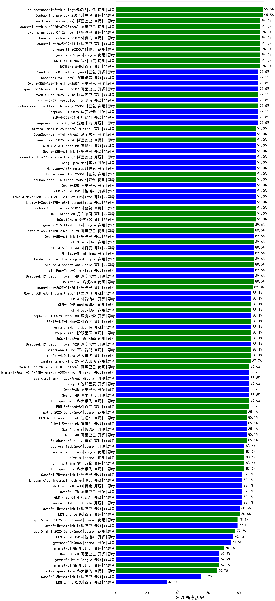

|类别|机构|大模型|【2025高考历史】准确率|平均耗时|平均消耗token|花费/千次（元）|排名（准确率）|
|---|---|-----|-------------------|-------|-----------|-----------|-----------|
|商用|豆包|Doubao-1.5-pro-32k-250115|95.5%|92s|469|0.8|1|
|商用|豆包|doubao-seed-1-6-thinking-250715|95.5%|19s|1023|7.2|2|
|商用|百度|ERNIE-3.5-8K|94.0%|247s|449|0.8|3|
|商用|腾讯|hunyuan-t1-20250711|94.0%|15s|915|3.2|4|
|商用|阿里巴巴|qwen-plus-2025-07-14|94.0%|12s|602|1.0|5|
|商用|google|gemini-2.5-pro|94.0%|27s|2261|155.3|6|
|商用|腾讯|hunyuan-turbos-20250716|94.0%|13s|689|1.2|7|
|商用|百度|ERNIE-X1-Turbo-32K|94.0%|97s|1328|5.0|8|
|开源|深度求索|deepseek-chat-v3-0324|92.5%|68s|315|1.9|9|
|开源|深度求索|DeepSeek-R1-0528|92.5%|121s|1624|24.5|10|
|开源|月之暗面|kimi-k2-0711-preview|92.5%|37s|675|9.4|11|
|开源|智谱AI|GLM-4-32B-0414|92.5%|89s|426|0.8|12|
|商用|阿里巴巴|qwen-turbo-2025-07-15|92.5%|7s|454|0.2|13|
|开源|深度求索|DeepSeek-V3.1(new)|92.5%|16s|376|3.6|14|
|商用|豆包|doubao-seed-1-6-flash-thinking-250615|92.5%|7s|594|0.6|15|
|开源|阿里巴巴|Qwen3-30B-A3B-Thinking-2507|92.5%|46s|2102|5.6|16|
|开源|阿里巴巴|qwen3-235b-a22b-thinking-2507|92.5%|50s|2028|38.0|17|
|开源|华为|pangu-pro-moe|91.0%|68s|1371|5.1|18|
|开源|腾讯|Hunyuan-A13B-Instruct|91.0%|177s|864|3.1|19|
|开源|阿里巴巴|qwen3-235b-a22b-instruct-2507|91.0%|13s|602|4.0|20|
|开源|智谱AI|GLM-Z1-32B-0414|91.0%|265s|1343|5.0|21|
|商用|月之暗面|kimi-latest-8k|91.0%|137s|547|6.6|22|
|商用|奇虎360|360gpt2-pro|91.0%|78s|291|1.0|23|
|开源|meta|Llama-4-Maverick-17B-128E-Instruct-FP8|91.0%|243s|691|2.6|24|
|开源|meta|Llama-4-Scout-17B-16E-Instruct|91.0%|175s|601|1.1|25|
|商用|豆包|Doubao-1.5-lite-32k-250115|91.0%|74s|327|0.2|26|
|商用|Mistral|mistral-medium-2508(new)|91.0%|315s|549|6.0|27|
|商用|豆包|doubao-seed-1-6-flash-250615|91.0%|4s|395|0.4|28|
|商用|豆包|doubao-seed-1-6-250615|91.0%|2s|188|0.3|29|
|开源|阿里巴巴|Qwen3-32B|91.0%|308s|2251|8.6|30|
|商用|阿里巴巴|qwen-flash-2025-07-28|91.0%|7s|590|0.7|31|
|开源|智谱AI|GLM-4.5-Air-nothink|91.0%|13s|950|4.9|32|
|开源|阿里巴巴|Qwen3-32B-nothink|91.0%|43s|580|1.9|33|
|开源|深度求索|DeepSeek-V3.1-Think(new)|91.0%|43s|855|9.3|34|
|开源|百度|ERNIE-4.5-300B-A47B|89.6%|250s|396|2.4|35|
|开源|minimax|MiniMax-M1|89.6%|140s|1945|12.0|36|
|商用|XAI|grok-3-mini|89.6%|155s|995|3.4|37|
|开源|minimax|MiniMax-Text-01|89.6%|227s|935|2.9|38|
|商用|奇虎360|360gpt2-o1|89.6%|55s|1341|62.8|39|
|开源|深度求索|DeepSeek-R1-Distill-Qwen-14B|89.6%|57s|893|0.6|40|
|开源|阿里巴巴|Qwen3-8B-nothink|89.6%|21s|567|0.0|41|
|商用|google|gemini-2.5-flash-lite|89.6%|11s|538|1.3|42|
|商用|阿里巴巴|qwen-flash-think-2025-07-28|89.6%|20s|1990|2.8|43|
|商用|anthropic|claude-4-sonnet-thinking|89.6%|35s|1370|130.6|44|
|商用|anthropic|claude-4-sonnet|89.6%|26s|752|63.4|45|
|商用|阿里巴巴|qwen-long-2025-01-25|89.0%|49s|508|0.8|46|
|商用|XAI|grok-4-0709|88.1%|316s|920|88.5|47|
|开源|深度求索|DeepSeek-R1-0528-Qwen3-8B|88.1%|129s|1344|0.0|48|
|开源|智谱AI|GLM-4.5|88.1%|29s|1724|22.4|49|
|开源|深度求索|DeepSeek-R1-Distill-Qwen-32B|88.1%|58s|682|0.9|50|
|商用|百川智能|Baichuan4-Turbo|88.1%|78s|293|4.4|51|
|商用|科大讯飞|xunfei-4.0Ultra|88.1%|/|/|/|52|
|商用|百度|ERNIE-4.5-Turbo-32K|88.1%|14s|494|1.1|53|
|商用|智谱AI|GLM-4.5-Flash|88.1%|31s|1540|0.0|54|
|开源|阿里巴巴|Qwen3-30B-A3B-Instruct-2507|88.1%|4s|606|1.5|55|
|商用|阶跃星辰|step-2-mini|88.1%|162s|431|0.7|56|
|商用|奇虎360|360zhinao2-o1|88.1%|37s|1474|13.9|57|
|开源|Google|gemma-3-27b-it|88.1%|77s|474|0.6|58|
|商用|科大讯飞|xunfei-spark-x1-0725|87.7%|/|980|11.4|59|
|开源|阿里巴巴|Qwen3-14B|86.6%|138s|3344|6.5|60|
|商用|科大讯飞|xunfei-spark-max|86.6%|34s|446|13.4|61|
|商用|百度|ERNIE-Speed-8K|86.6%|66s|223|0.0|62|
|开源|阿里巴巴|Qwen3-8B|86.6%|132s|3066|0.0|63|
|开源|阶跃星辰|step-3|86.6%|87s|1685|6.4|64|
|开源|Mistral|Magistral-Small-2507(new)|86.6%|274s|3719|39.2|65|
|开源|Mistral|Mistral-Small-3.2-24B-Instruct-2506(new)|86.6%|25s|521|0.9|66|
|商用|openAI|gpt-5-2025-08-07(new)|85.1%|24s|358|16.7|67|
|商用|百川智能|Baichuan4-Air|85.1%|83s|308|0.3|68|
|开源|智谱AI|GLM-4.5-Air|85.1%|28s|1654|9.0|69|
|开源|智谱AI|GLM-4.5-nothink|85.1%|29s|943|11.4|70|
|开源|阿里巴巴|Qwen3-4B|85.1%|129s|1728|4.8|71|
|商用|智谱AI|GLM-4.5-Flash-nothink|85.1%|19s|976|0.0|72|
|开源|openAI|gpt-oss-120b(new)|83.6%|3s|614|1.5|73|
|商用|零一万物|yi-lightning|83.6%|75s|434|0.4|74|
|商用|科大讯飞|xunfei-spark-pro|83.6%|28s|283|2.0|75|
|商用|google|gemini-2.5-flash|83.6%|14s|1861|31.6|76|
|商用|openAI|o4-mini|83.6%|57s|671|17.8|77|
|开源|阿里巴巴|Qwen3-1.7B|82.1%|125s|1981|5.6|78|
|开源|阿里巴巴|Qwen3-1.7B-nothink|82.1%|11s|531|1.2|79|
|开源|Google|gemma-3-12b-it|82.1%|99s|444|0.0|80|
|开源|智谱AI|GLM-4-9B-0414|82.1%|94s|624|0.0|81|
|开源|百度|ERNIE-4.5-21B-A3B|82.1%|140s|444|0.0|82|
|开源|腾讯|Hunyuan-A13B-Instruct-nothink|82.1%|487s|480|1.5|83|
|开源|阿里巴巴|Qwen3-14B-nothink|80.6%|11s|607|1.0|84|
|商用|百度|ERNIE-Lite-8K|80.6%|6s|290|0.0|85|
|商用|openAI|gpt-5-nano-2025-08-07(new)|79.1%|20s|1385|3.6|86|
|开源|阿里巴巴|Qwen3-4B-nothink|79.1%|11s|496|1.1|87|
|商用|openAI|gpt-5-mini-2025-08-07(new)|77.6%|21s|679|7.9|88|
|开源|智谱AI|GLM-Z1-9B-0414|76.1%|97s|1951|0.0|89|
|开源|openAI|gpt-oss-20b(new)|74.6%|154s|945|0.9|90|
|商用|Mistral|ministral-8b|70.1%|80s|363|0.3|91|
|商用|Mistral|ministral-3b|67.2%|61s|381|0.1|92|
|开源|Google|gemma-3-4b-it|67.2%|68s|459|0.0|93|
|开源|阿里巴巴|Qwen3-0.6B|67.2%|99s|1289|3.5|94|
|商用|科大讯飞|xunfei-spark-lite|65.7%|61s|310|0.0|95|
|开源|阿里巴巴|Qwen3-0.6B-nothink|55.2%|6s|320|0.6|96|
|开源|百度|ERNIE-4.5-0.3B|32.8%|140s|361|0.0|97|

