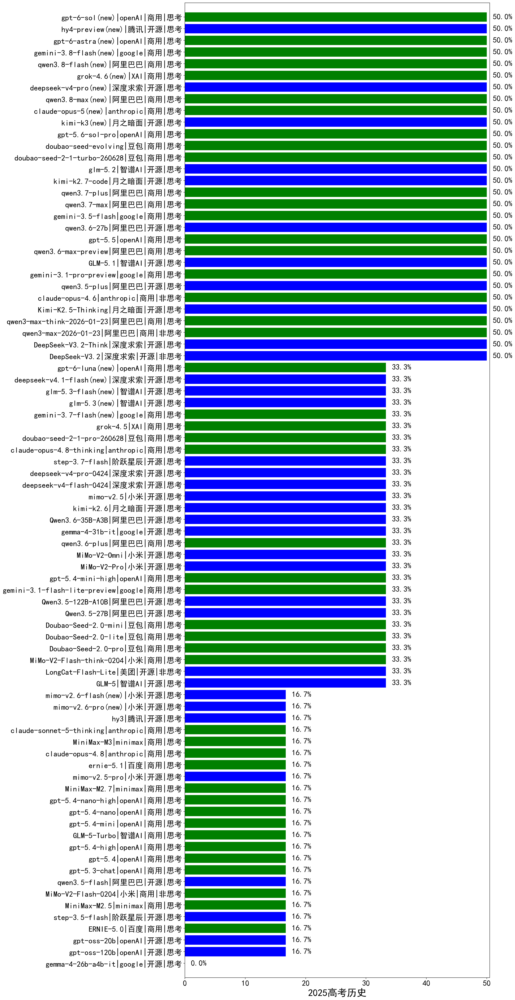

|类别|机构|大模型|【2025高考历史】准确率|平均耗时|平均消耗token|花费/千次（元）|排名（准确率）|
|---|---|-----|-------------------|-------|-----------|-----------|-----------|
|商用|openAI|gpt-6-sol(new)|50.0%|508s|334|14.5|1|
|开源|阿里巴巴|qwen3.5-plus|50.0%|44s|3351|15.5|2|
|开源|深度求索|deepseek-v4-pro(new)|50.0%|27s|994|23.2|3|
|商用|anthropic|claude-opus-5(new)|50.0%|14s|776|106.7|4|
|开源|月之暗面|kimi-k3(new)|50.0%|49s|1149|98.4|5|
|商用|openAI|gpt-5.6-sol-pro|50.0%|22s|3652|273.3|6|
|商用|豆包|doubao-seed-evolving|50.0%|254s|9925|293.2|7|
|商用|豆包|doubao-seed-2-1-turbo-260628|50.0%|177s|5851|85.5|8|
|开源|智谱AI|glm-5.2|50.0%|111s|4736|129.7|9|
|开源|月之暗面|kimi-k2.7-code|50.0%|25s|924|22.3|10|
|商用|阿里巴巴|qwen3.7-plus|50.0%|35s|1882|14.2|11|
|商用|阿里巴巴|qwen3.7-max|50.0%|31s|1678|56.8|12|
|商用|google|gemini-3.5-flash|50.0%|12s|2171|128.8|13|
|开源|阿里巴巴|qwen3.6-27b|50.0%|34s|2084|35.3|14|
|商用|openAI|gpt-5.5|50.0%|12s|719|123.2|15|
|开源|智谱AI|GLM-5.1|50.0%|224s|1851|41.9|16|
|商用|阿里巴巴|qwen3.6-max-preview|50.0%|64s|1997|101.1|17|
|商用|google|gemini-3.1-pro-preview|50.0%|39s|2029|162.0|18|
|商用|阿里巴巴|qwen3.8-max(new)|50.0%|17s|848|26.1|19|
|商用|XAI|grok-4.6(new)|50.0%|164s|3623|142.7|20|
|商用|openAI|gpt-6-astra(new)|50.0%|19s|374|86.5|21|
|开源|深度求索|DeepSeek-V3.2|50.0%|65s|455|1.2|22|
|开源|深度求索|DeepSeek-V3.2-Think|50.0%|137s|1236|3.6|23|
|商用|阿里巴巴|qwen3-max-2026-01-23|50.0%|53s|629|5.1|24|
|商用|阿里巴巴|qwen3-max-think-2026-01-23|50.0%|125s|2837|27.2|25|
|开源|月之暗面|Kimi-K2.5-Thinking|50.0%|437s|2398|48.2|26|
|开源|腾讯|hy4-preview(new)|50.0%|93s|5974|105.8|27|
|商用|anthropic|claude-opus-4.6|50.0%|14s|851|119.8|28|
|商用|google|gemini-3.8-flash(new)|50.0%|18s|1369|65.5|29|
|商用|阿里巴巴|qwen3.8-flash(new)|50.0%|123s|1135|2.7|30|
|商用|豆包|doubao-seed-2-1-pro-260628|33.3%|322s|13947|413.8|31|
|开源|深度求索|deepseek-v4.1-flash(new)|33.3%|6s|630|4.1|32|
|商用|google|gemini-3.7-flash(new)|33.3%|41s|990|22.8|33|
|商用|anthropic|claude-opus-4.8-thinking|33.3%|12s|851|119.8|34|
|开源|阶跃星辰|step-3.7-flash|33.3%|118s|2259|17.4|35|
|商用|XAI|grok-4.5|33.3%|115s|3413|133.9|36|
|开源|智谱AI|glm-5.3-flash(new)|33.3%|38s|1632|4.3|37|
|商用|openAI|gpt-6-luna(new)|33.3%|116s|765|2.2|38|
|开源|智谱AI|glm-5.3(new)|33.3%|98s|3340|90.6|39|
|开源|深度求索|deepseek-v4-pro-0424|33.3%|18s|674|14.7|40|
|开源|小米|mimo-v2.5|33.3%|20s|1589|17.8|41|
|开源|深度求索|deepseek-v4-flash-0424|33.3%|20s|791|1.5|42|
|开源|月之暗面|kimi-k2.6|33.3%|90s|1681|42.8|43|
|开源|智谱AI|GLM-5|33.3%|84s|2045|34.9|44|
|开源|小米|MiMo-V2-Pro|33.3%|49s|1286|21.4|45|
|开源|阿里巴巴|Qwen3.5-27B|33.3%|370s|4227|19.7|46|
|商用|豆包|Doubao-Seed-2.0-mini|33.3%|506s|2255|4.2|47|
|商用|豆包|Doubao-Seed-2.0-lite|33.3%|199s|1054|3.2|48|
|商用|豆包|Doubao-Seed-2.0-pro|33.3%|253s|1123|15.5|49|
|商用|小米|MiMo-V2-Flash-think-0204|33.3%|625s|1375|2.6|50|
|商用|openAI|gpt-5.4-mini-high|33.3%|39s|954|25.9|51|
|开源|美团|LongCat-Flash-Lite|33.3%|471s|735|0.0|52|
|开源|阿里巴巴|Qwen3.5-122B-A10B|33.3%|295s|4989|31.1|53|
|商用|google|gemini-3.1-flash-lite-preview|33.3%|5s|635|5.3|54|
|开源|小米|MiMo-V2-Omni|33.3%|451s|1625|18.3|55|
|商用|阿里巴巴|qwen3.6-plus|33.3%|56s|2095|23.6|56|
|开源|google|gemma-4-31b-it|33.3%|85s|761|1.8|57|
|开源|阿里巴巴|Qwen3.6-35B-A3B|33.3%|86s|2037|20.7|58|
|开源|阶跃星辰|step-3.5-flash|16.7%|13s|1159|2.2|59|
|商用|minimax|MiniMax-M2.5|16.7%|33s|1680|13.1|60|
|开源|小米|mimo-v2.6-pro(new)|16.7%|35s|1131|6.3|61|
|商用|小米|MiMo-V2-Flash-0204|16.7%|412s|805|1.4|62|
|开源|小米|mimo-v2.6-flash(new)|16.7%|56s|1423|2.7|63|
|商用|百度|ERNIE-5.0|16.7%|142s|1186|26.1|64|
|开源|阿里巴巴|qwen3.5-flash|16.7%|225s|3790|7.3|65|
|开源|小米|mimo-v2.5-pro|16.7%|18s|1298|21.6|66|
|开源|腾讯|hy3|16.7%|83s|296|0.8|67|
|商用|openAI|gpt-5.3-chat|16.7%|9s|465|32.0|68|
|商用|openAI|gpt-5.4|16.7%|19s|327|20.4|69|
|开源|openAI|gpt-oss-20b|16.7%|154s|945|0.9|70|
|商用|anthropic|claude-sonnet-5-thinking|16.7%|14s|837|47.0|71|
|商用|openAI|gpt-5.4-high|16.7%|11s|656|55.0|72|
|商用|智谱AI|GLM-5-Turbo|16.7%|98s|1630|33.5|73|
|商用|openAI|gpt-5.4-mini|16.7%|8s|345|6.7|74|
|商用|openAI|gpt-5.4-nano|16.7%|59s|281|1.3|75|
|商用|openAI|gpt-5.4-nano-high|16.7%|13s|521|3.4|76|
|商用|minimax|MiniMax-M2.7|16.7%|37s|1449|11.2|77|
|商用|minimax|MiniMax-M3|16.7%|45s|1217|16.8|78|
|商用|anthropic|claude-opus-4.8|16.7%|11s|626|80.5|79|
|商用|百度|ernie-5.1|16.7%|24s|1073|17.3|80|
|开源|openAI|gpt-oss-120b|16.7%|3s|614|1.5|81|
|开源|google|gemma-4-26b-a4b-it|0.0%|84s|769|1.8|82|

