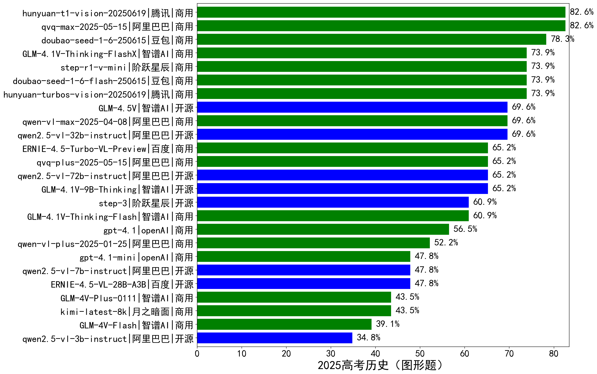

|类别|机构|大模型|【2025高考历史（图形题）】准确率|平均耗时|平均消耗token|花费/千次（元）|排名（准确率）|
|---|---|-----|-------------------|-------|-----------|-----------|-----------|
|商用|阿里巴巴|qvq-max-2025-05-15|82.6%|193s|1791|39.3|1|
|商用|腾讯|hunyuan-t1-vision-20250619|82.6%|186s|1640|/|2|
|商用|豆包|doubao-seed-1-6-250615|78.3%|/|1115|3.0|3|
|商用|腾讯|hunyuan-turbos-vision-20250619|73.9%|235s|990|5.0|4|
|商用|豆包|doubao-seed-1-6-flash-250615|73.9%|/|1033|0.5|5|
|商用|智谱AI|GLM-4.1V-Thinking-FlashX|73.9%|116s|1915|3.8|6|
|商用|阶跃星辰|step-r1-v-mini|73.9%|149s|2224|14.6|7|
|开源|阿里巴巴|qwen2.5-vl-32b-instruct|69.6%|137s|1691|3.2|8|
|商用|阿里巴巴|qwen-vl-max-2025-04-08|69.6%|129s|1215|6.4|9|
|开源|智谱AI|GLM-4.5V|69.6%|15s|1655|5.3|10|
|开源|智谱AI|GLM-4.1V-9B-Thinking|65.2%|140s|1804|1.1|11|
|商用|阿里巴巴|qvq-plus-2025-05-15|65.2%|146s|1866|7.1|12|
|开源|阿里巴巴|qwen2.5-vl-72b-instruct|65.2%|112s|1184|4.9|13|
|商用|百度|ERNIE-4.5-Turbo-VL-Preview|65.2%|130s|1722|6.8|14|
|开源|阶跃星辰|step-3|60.9%|77s|1460|5.3|15|
|商用|智谱AI|GLM-4.1V-Thinking-Flash|60.9%|99s|1746|0.0|16|
|商用|openAI|gpt-4.1|56.5%|87s|898|25.5|17|
|商用|阿里巴巴|qwen-vl-plus-2025-01-25|52.2%|105s|984|2.2|18|
|开源|阿里巴巴|qwen2.5-vl-7b-instruct|47.8%|95s|1152|0.4|19|
|开源|百度|ERNIE-4.5-VL-28B-A3B|47.8%|7s|1271|0.0|20|
|商用|openAI|gpt-4.1-mini|47.8%|108s|807|4.3|21|
|商用|智谱AI|GLM-4V-Plus-0111|43.5%|86s|1071|4.3|22|
|商用|月之暗面|kimi-latest-8k|43.5%|134s|1237|14.9|23|
|商用|智谱AI|GLM-4V-Flash|39.1%|4s|1217|0.0|24|
|开源|阿里巴巴|qwen2.5-vl-3b-instruct|34.8%|131s|910|1.4|25|

