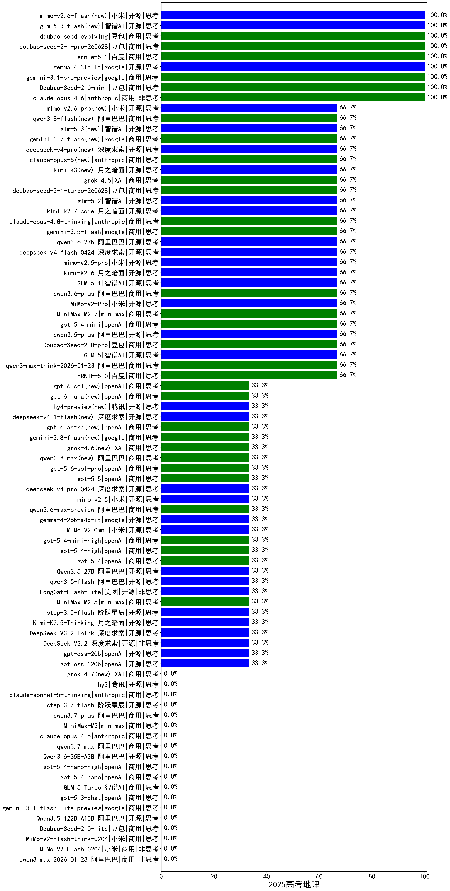

|类别|机构|大模型|【2025高考地理】准确率|平均耗时|平均消耗token|花费/千次（元）|排名（准确率）|
|---|---|-----|-------------------|-------|-----------|-----------|-----------|
|开源|智谱AI|glm-5.3-flash(new)|100.0%|187s|6412|17.7|1|
|开源|google|gemma-4-31b-it|100.0%|89s|783|2.0|2|
|商用|豆包|doubao-seed-2-1-pro-260628(new)|100.0%|354s|14014|416.8|3|
|商用|百度|ernie-5.1|100.0%|39s|1135|18.9|4|
|商用|google|gemini-3.1-pro-preview|100.0%|63s|3321|274.6|5|
|商用|腾讯|hunyuan-2.0-instruct-20251111|100.0%|20s|402|0.6|6|
|商用|豆包|doubao-seed-evolving(new)|100.0%|191s|7076|208.6|7|
|商用|豆包|Doubao-Seed-2.0-mini|100.0%|484s|2024|3.8|8|
|开源|美团|LongCat-Flash-Thinking-2601|100.0%|188s|2973|0.0|9|
|商用|anthropic|claude-opus-4.6|100.0%|29s|687|97.6|10|
|商用|百度|ERNIE-5.0|66.7%|128s|2341|54.4|11|
|开源|智谱AI|GLM-5|66.7%|263s|6089|108.1|12|
|商用|google|gemini-3.5-flash|66.7%|15s|2982|181.7|13|
|商用|阿里巴巴|qwen3-max-think-2026-01-23|66.7%|197s|5031|49.4|14|
|开源|阿里巴巴|qwen3.6-27b|66.7%|46s|2807|48.8|15|
|商用|豆包|Doubao-Seed-2.0-pro|66.7%|374s|1565|23.0|16|
|开源|深度求索|deepseek-v4-flash-0424|66.7%|76s|3184|6.3|17|
|开源|小米|mimo-v2.5-pro|66.7%|44s|2557|48.6|18|
|开源|阿里巴巴|qwen3.5-plus|66.7%|60s|4535|21.3|19|
|开源|月之暗面|kimi-k2.6|66.7%|209s|3324|87.6|20|
|开源|智谱AI|GLM-5.1|66.7%|272s|2448|56.8|21|
|商用|阿里巴巴|qwen3.6-plus|66.7%|74s|2610|30.1|22|
|开源|小米|MiMo-V2-Pro|66.7%|35s|1265|21.5|23|
|商用|minimax|MiniMax-M2.7|66.7%|64s|2367|19.0|24|
|商用|openAI|gpt-5.4-mini|66.7%|127s|306|6.1|25|
|商用|anthropic|claude-opus-4.8-thinking(new)|66.7%|21s|1347|213.3|26|
|开源|Mistral|Ministral-3-14B-Instruct-2512|66.7%|20s|1339|1.9|27|
|开源|Mistral|Ministral-3-3B-Instruct-2512|66.7%|2s|598|0.4|28|
|商用|google|gemini-3.7-flash(new)|66.7%|41s|1112|26.7|29|
|开源|月之暗面|kimi-k2.7-code(new)|66.7%|181s|6328|168.7|30|
|开源|深度求索|deepseek-v4-pro(new)|66.7%|89s|3372|87.7|31|
|商用|阿里巴巴|qwen3.8-flash(new)|66.7%|94s|4838|12.7|32|
|商用|anthropic|claude-opus-5(new)|66.7%|17s|849|126.2|33|
|开源|阿里巴巴|qwen3-next-80b-a3b-thinking|66.7%|265s|5739|22.6|34|
|开源|月之暗面|kimi-k3(new)|66.7%|107s|2991|284.6|35|
|商用|XAI|grok-4.5(new)|66.7%|105s|4015|159.7|36|
|商用|豆包|doubao-seed-2-1-turbo-260628(new)|66.7%|258s|13762|204.6|37|
|开源|智谱AI|glm-5.2(new)|66.7%|97s|4075|111.8|38|
|开源|智谱AI|glm-5.3(new)|66.7%|253s|4845|133.3|39|
|开源|小米|MiMo-V2-Omni|33.3%|11s|1671|19.3|40|
|商用|google|gemini-3.8-flash(new)|33.3%|26s|1227|59.5|41|
|开源|google|gemma-4-26b-a4b-it|33.3%|77s|685|1.7|42|
|开源|小米|mimo-v2.5|33.3%|34s|2262|27.6|43|
|商用|阿里巴巴|qwen3.6-max-preview|33.3%|95s|2751|143.2|44|
|商用|XAI|grok-4.6(new)|33.3%|64s|2755|106.8|45|
|商用|阿里巴巴|qwen3.8-max(new)|33.3%|141s|5761|203.7|46|
|开源|深度求索|deepseek-v4-pro-0424|33.3%|65s|2308|54.1|47|
|商用|openAI|gpt-5.5|33.3%|13s|820|148.8|48|
|商用|openAI|gpt-5.6-sol-pro(new)|33.3%|16s|3487|260.2|49|
|开源|openAI|gpt-oss-120b|33.3%|2s|633|1.5|50|
|商用|openAI|gpt-6-astra(new)|33.3%|13s|303|68.5|51|
|商用|阿里巴巴|qwen-plus-2025-12-01|33.3%|38s|1438|2.7|52|
|开源|阿里巴巴|qwen3.5-flash|33.3%|649s|7611|15.0|53|
|商用|minimax|MiniMax-M2.1|33.3%|129s|2131|17.1|54|
|商用|阿里巴巴|qwen3-max-preview-think|33.3%|117s|4488|105.4|55|
|商用|豆包|doubao-seed-1-8-251215|33.3%|49s|1629|11.9|56|
|商用|google|gemini-3-flash-preview|33.3%|32s|1582|31.6|57|
|商用|阿里巴巴|qwen-plus-think-2025-12-01|33.3%|126s|4710|36.8|58|
|开源|月之暗面|Kimi-K2.5-Thinking|33.3%|625s|3356|68.7|59|
|开源|阶跃星辰|step-3.5-flash|33.3%|86s|2819|5.8|60|
|商用|minimax|MiniMax-M2.5|33.3%|58s|2546|20.5|61|
|开源|美团|LongCat-Flash-Lite|33.3%|370s|1499|0.0|62|
|开源|小米|MiMo-V2-Flash|33.3%|10s|616|0.0|63|
|商用|openAI|gpt-5.4-mini-high|33.3%|35s|3294|100.3|64|
|开源|阿里巴巴|Qwen3.5-27B|33.3%|374s|5194|24.4|65|
|开源|Mistral|Ministral-3-8B-Instruct-2512|33.3%|3s|509|0.5|66|
|开源|Mistral|mistral-large-2512|33.3%|19s|844|7.9|67|
|开源|深度求索|DeepSeek-V3.2-Think|33.3%|88s|2548|7.5|68|
|开源|深度求索|DeepSeek-V3.2|33.3%|71s|685|1.9|69|
|开源|openAI|gpt-oss-20b|33.3%|72s|955|0.9|70|
|商用|openAI|gpt-5.4|33.3%|5s|303|20.1|71|
|商用|openAI|gpt-5.4-high|33.3%|75s|1926|190.5|72|
|商用|腾讯|hunyuan-2.0-thinking-20251109|0.0%|49s|2888|11.2|73|
|开源|腾讯|hy3(new)|0.0%|179s|338|1.0|74|
|商用|anthropic|claude-sonnet-5-thinking(new)|0.0%|26s|1630|105.2|75|
|商用|openAI|gpt-5.2-high|0.0%|14s|614|49.4|76|
|商用|openAI|gpt-5.2-medium|0.0%|16s|593|47.4|77|
|商用|openAI|gpt-5.2|0.0%|7s|290|17.2|78|
|开源|小米|MiMo-V2-Flash-think|0.0%|46s|3524|0.0|79|
|商用|openAI|gpt-5.4-nano|0.0%|19s|371|2.3|80|
|商用|阿里巴巴|qwen3.7-plus(new)|0.0%|95s|5259|41.4|81|
|开源|智谱AI|GLM-4.7|0.0%|82s|3451|47.1|82|
|开源|智谱AI|GLM-4.7-Flash|0.0%|1532s|4857|0.0|83|
|开源|阶跃星辰|step-3.7-flash(new)|0.0%|45s|3235|25.4|84|
|商用|openAI|gpt-5.4-nano-high|0.0%|34s|706|5.2|85|
|商用|minimax|MiniMax-M3(new)|0.0%|136s|3448|54.5|86|
|商用|anthropic|claude-opus-4.8(new)|0.0%|12s|711|102.1|87|
|商用|阿里巴巴|qwen3.7-max|0.0%|56s|2739|95.8|88|
|商用|阿里巴巴|qwen3-max-2026-01-23|0.0%|142s|1876|17.8|89|
|商用|小米|MiMo-V2-Flash-0204|0.0%|179s|766|1.4|90|
|商用|小米|MiMo-V2-Flash-think-0204|0.0%|532s|4280|8.8|91|
|商用|豆包|Doubao-Seed-2.0-lite|0.0%|403s|1872|6.3|92|
|开源|阿里巴巴|Qwen3.6-35B-A3B|0.0%|22s|2397|24.8|93|
|开源|阿里巴巴|Qwen3.5-122B-A10B|0.0%|607s|5497|34.5|94|
|商用|google|gemini-3.1-flash-lite-preview|0.0%|42s|680|6.1|95|
|商用|openAI|gpt-5.3-chat|0.0%|57s|408|28.6|96|
|商用|智谱AI|GLM-5-Turbo|0.0%|86s|5751|124.6|97|

