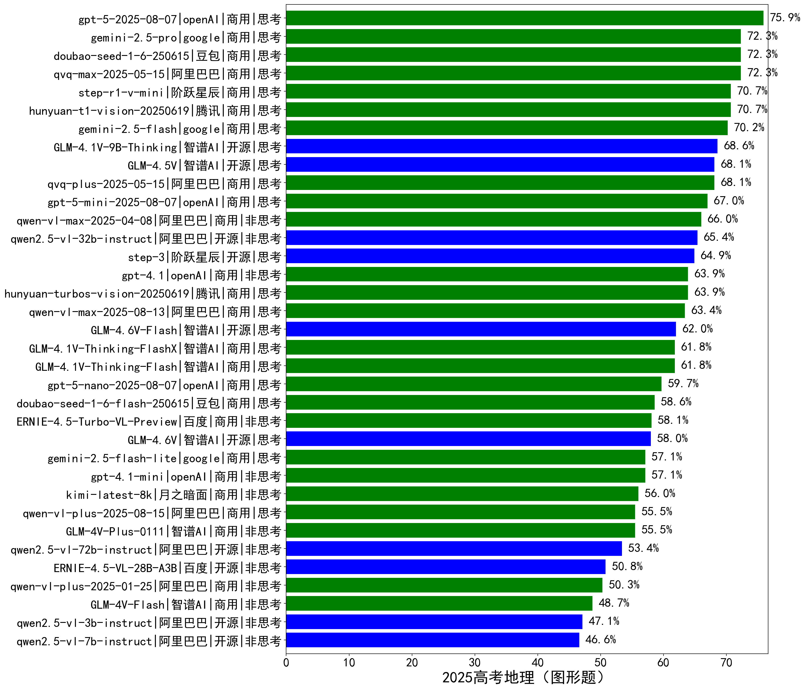

|类别|机构|大模型|【2025高考地理（图形题）】准确率|平均耗时|平均消耗token|花费/千次（元）|排名（准确率）|
|---|---|-----|-------------------|-------|-----------|-----------|-----------|
|商用|阿里巴巴|qvq-max-2025-05-15|72.3%|97s|2038|45.0|1|
|商用|豆包|doubao-seed-1-6-250615|72.3%|/|1214|3.3|2|
|商用|腾讯|hunyuan-t1-vision-20250619|70.7%|65s|1974|/|3|
|商用|阶跃星辰|step-r1-v-mini|70.7%|90s|3443|21.9|4|
|开源|智谱AI|GLM-4.1V-9B-Thinking|68.6%|114s|3186|1.7|5|
|商用|阿里巴巴|qvq-plus-2025-05-15|68.1%|124s|2499|10.0|6|
|开源|智谱AI|GLM-4.5V|68.1%|14s|2035|7.2|7|
|商用|阿里巴巴|qwen-vl-max-2025-04-08|66.0%|78s|1294|6.6|8|
|开源|阿里巴巴|qwen2.5-vl-32b-instruct|65.4%|112s|3609|6.8|9|
|开源|阶跃星辰|step-3|64.9%|126s|2484|9.1|10|
|商用|腾讯|hunyuan-turbos-vision-20250619|63.9%|54s|1034|5.1|11|
|商用|openAI|gpt-4.1|63.9%|68s|1108|29.1|12|
|商用|智谱AI|GLM-4.1V-Thinking-Flash|61.8%|88s|2868|0.0|13|
|商用|智谱AI|GLM-4.1V-Thinking-FlashX|61.8%|55s|2846|5.7|14|
|商用|豆包|doubao-seed-1-6-flash-250615|58.6%|/|1204|0.6|15|
|商用|百度|ERNIE-4.5-Turbo-VL-Preview|58.1%|68s|2198|8.6|16|
|商用|openAI|gpt-4.1-mini|57.1%|68s|989|5.2|17|
|商用|月之暗面|kimi-latest-8k|56.0%|72s|1484|17.8|18|
|商用|智谱AI|GLM-4V-Plus-0111|55.5%|53s|2260|9.0|19|
|开源|阿里巴巴|qwen2.5-vl-72b-instruct|53.4%|95s|3164|13.1|20|
|开源|百度|ERNIE-4.5-VL-28B-A3B|50.8%|7s|2397|0.0|21|
|商用|阿里巴巴|qwen-vl-plus-2025-01-25|50.3%|96s|1035|2.1|22|
|商用|智谱AI|GLM-4V-Flash|48.7%|5s|2276|0.0|23|
|开源|阿里巴巴|qwen2.5-vl-3b-instruct|47.1%|90s|941|1.3|24|
|开源|阿里巴巴|qwen2.5-vl-7b-instruct|46.6%|72s|2961|1.0|25|

