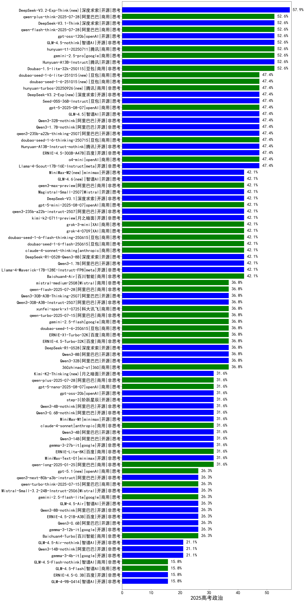

|类别|机构|大模型|【2025高考政治】准确率|平均耗时|平均消耗token|花费/千次（元）|排名（准确率）|
|---|---|-----|-------------------|-------|-----------|-----------|-----------|
|开源|深度求索|DeepSeek-V3.2(new)|63.2%|143s|613|1.7|1|
|开源|深度求索|DeepSeek-V3.2-Exp-Think(new)|57.9%|52s|1473|4.3|2|
|开源|智谱AI|GLM-4.5-nothink|52.6%|54s|1974|25.9|3|
|商用|阿里巴巴|qwen-plus-think-2025-07-28|52.6%|89s|3257|24.8|4|
|开源|深度求索|DeepSeek-V3.1-Think|52.6%|60s|1265|14.0|5|
|商用|阿里巴巴|qwen-flash-think-2025-07-28|52.6%|32s|3167|4.5|6|
|开源|openAI|gpt-oss-120b|52.6%|4s|1065|2.8|7|
|商用|google|gemini-3-pro-preview(new)|52.6%|59s|3409|278.4|8|
|商用|google|gemini-2.5-pro|52.6%|36s|3049|210.3|9|
|开源|腾讯|Hunyuan-A13B-Instruct|52.6%|177s|1263|4.5|10|
|商用|百度|ERNIE-X1.1-Preview(new)|52.6%|252s|3194|12.4|11|
|商用|腾讯|hunyuan-t1-20250711|52.6%|22s|1385|4.9|12|
|开源|Mistral|mistral-large-2512(new)|52.6%|16s|739|6.2|13|
|开源|深度求索|DeepSeek-V3.2-Think(new)|52.6%|240s|2237|6.6|14|
|商用|豆包|Doubao-1.5-lite-32k-250115|52.6%|74s|392|0.2|15|
|开源|豆包|Seed-OSS-36B-Instruct|47.4%|154s|2083|7.9|16|
|商用|豆包|doubao-seed-1-6-thinking-250715|47.4%|24s|1348|9.6|17|
|开源|腾讯|Hunyuan-A13B-Instruct-nothink|47.4%|430s|558|1.7|18|
|开源|阿里巴巴|Qwen3-1.7B-nothink|47.4%|14s|1123|2.9|19|
|开源|深度求索|DeepSeek-V3.2-Exp(new)|47.4%|17s|520|1.4|20|
|开源|月之暗面|kimi-k2-0905(new)|47.4%|129s|816|11.0|21|
|开源|阿里巴巴|Qwen3-32B-nothink|47.4%|34s|701|2.3|22|
|开源|智谱AI|GLM-4.5|47.4%|91s|2189|28.9|23|
|开源|百度|ERNIE-4.5-300B-A47B|47.4%|250s|396|2.2|24|
|商用|anthropic|claude-haiku-4.5-thinking(new)|47.4%|48s|6425|224.1|25|
|开源|meta|Llama-4-Scout-17B-16E-Instruct|47.4%|164s|648|1.2|26|
|商用|openAI|gpt-5.1-medium(new)|47.4%|282s|1557|98.4|27|
|开源|阿里巴巴|qwen3-235b-a22b-thinking-2507|47.4%|78s|3159|60.0|28|
|商用|openAI|gpt-5-2025-08-07|47.4%|26s|476|22.6|29|
|商用|豆包|doubao-seed-1-6-lite-251015(new)|47.4%|32s|1430|3.0|30|
|商用|豆包|doubao-seed-1-6-251015(new)|47.4%|16s|1057|7.1|31|
|商用|openAI|o4-mini|47.4%|51s|1273|36.0|32|
|商用|腾讯|hunyuan-turbos-20250926(new)|47.4%|13s|703|1.2|33|
|商用|腾讯|hunyuan-2.0-instruct-20251111(new)|47.4%|40s|1409|2.6|34|
|商用|腾讯|hunyuan-2.0-thinking-20251109(new)|47.4%|24s|1272|4.7|35|
|商用|百川智能|Baichuan4-Air|42.1%|56s|429|0.4|36|
|商用|openAI|gpt-5-mini-2025-08-07|42.1%|97s|1332|16.8|37|
|开源|深度求索|DeepSeek-V3.1|42.1%|28s|556|5.5|38|
|开源|Mistral|Magistral-Small-2507|42.1%|174s|6009|63.6|39|
|开源|智谱AI|GLM-4.6(new)|42.1%|65s|3302|44.5|40|
|商用|openAI|gpt-5.1-high(new)|42.1%|162s|3537|239.0|41|
|商用|阿里巴巴|qwen3-max-preview|42.1%|17s|804|15.9|42|
|开源|minimax|MiniMax-M2(new)|42.1%|58s|3629|29.4|43|
|开源|meta|Llama-4-Maverick-17B-128E-Instruct-FP8|42.1%|219s|780|2.9|44|
|开源|阿里巴巴|qwen3-235b-a22b-instruct-2507|42.1%|24s|1008|7.0|45|
|商用|XAI|grok-4-0709|42.1%|289s|1596|158.8|46|
|商用|anthropic|claude-4-sonnet-thinking|42.1%|50s|1617|149.9|47|
|商用|anthropic|claude-opus-4.5(new)|42.1%|17s|1384|209.4|48|
|开源|深度求索|DeepSeek-R1-0528-Qwen3-8B|42.1%|188s|2301|0.0|49|
|商用|豆包|doubao-seed-1-6-flash-250615|42.1%|3s|429|0.4|50|
|开源|阿里巴巴|Qwen3-1.7B|42.1%|112s|3760|10.8|51|
|商用|阿里巴巴|qwen3-max-2025-09-23(new)|42.1%|28s|1055|22.2|52|
|商用|XAI|grok-3-mini|42.1%|151s|1136|3.9|53|
|开源|阿里巴巴|qwen3-next-80b-a3b-thinking(new)|42.1%|295s|5704|22.3|54|
|开源|月之暗面|kimi-k2-0711-preview|42.1%|53s|856|11.9|55|
|商用|openAI|gpt-5-mini-high(new)|42.1%|91s|3454|47.6|56|
|商用|豆包|doubao-seed-1-6-flash-thinking-250615|42.1%|15s|831|1.0|57|
|开源|深度求索|DeepSeek-R1-0528|36.8%|357s|2376|36.2|58|
|商用|Mistral|mistral-medium-2508|36.8%|21s|723|7.8|59|
|商用|百度|ERNIE-4.5-Turbo-32K|36.8%|59s|387|0.9|60|
|商用|百度|ERNIE-X1-Turbo-32K|36.8%|364s|4597|16.6|61|
|商用|阿里巴巴|qwen-flash-2025-07-28|36.8%|10s|1048|1.3|62|
|开源|阿里巴巴|Qwen3-8B|36.8%|601s|15501|0.0|63|
|商用|360|360zhinao2-o1|36.8%|47s|2561|24.5|64|
|开源|阿里巴巴|Qwen3-32B|36.8%|364s|5093|19.8|65|
|商用|豆包|doubao-seed-1-6-250615|36.8%|161s|320|1.1|66|
|商用|百度|ERNIE-5.0-Thinking-Preview(new)|36.8%|177s|2029|46.2|67|
|商用|anthropic|claude-sonnet-4.5-thinking(new)|36.8%|56s|3764|384.3|68|
|开源|阿里巴巴|Qwen3-30B-A3B-Thinking-2507|36.8%|71s|3148|8.4|69|
|开源|阿里巴巴|Qwen3-30B-A3B-Instruct-2507|36.8%|10s|997|2.6|70|
|商用|google|gemini-2.5-flash|36.8%|18s|3362|58.2|71|
|商用|XAI|grok-4-1-fast-reasoning(new)|36.8%|27s|2362|7.7|72|
|商用|XAI|grok-4-1-fast-non-reasoning(new)|36.8%|121s|647|1.6|73|
|商用|阿里巴巴|qwen-turbo-2025-07-15|36.8%|10s|677|0.4|74|
|商用|科大讯飞|xunfei-spark-x1-0725|36.8%|/|1373|15.2|75|
|开源|月之暗面|Kimi-K2-Thinking(new)|31.6%|616s|11226|177.9|76|
|开源|Mistral|Ministral-3-8B-Instruct-2512(new)|31.6%|18s|1205|1.3|77|
|商用|anthropic|claude-sonnet-4.5(new)|31.6%|18s|854|70.2|78|
|商用|openAI|gpt-5-nano-high(new)|31.6%|585s|5236|14.7|79|
|商用|阿里巴巴|qwen-long-2025-01-25|31.6%|11s|594|0.9|80|
|开源|google|gemma-3-27b-it|31.6%|61s|528|0.6|81|
|商用|百度|ERNIE-Lite-8K|31.6%|7s|409|0.0|82|
|开源|阿里巴巴|Qwen3-4B-nothink|31.6%|20s|827|2.0|83|
|商用|anthropic|claude-4-sonnet|31.6%|24s|867|68.3|84|
|开源|阿里巴巴|Qwen3-4B|31.6%|125s|3248|9.3|85|
|开源|阿里巴巴|Qwen3-14B|31.6%|300s|6314|12.4|86|
|开源|阶跃星辰|step-3|31.6%|105s|2217|8.5|87|
|开源|minimax|MiniMax-M1|31.6%|494s|5983|44.1|88|
|开源|阿里巴巴|Qwen3-0.6B-nothink|31.6%|6s|412|0.7|89|
|开源|minimax|MiniMax-Text-01|31.6%|242s|974|3.0|90|
|开源|openAI|gpt-oss-20b|31.6%|155s|1716|1.8|91|
|商用|openAI|gpt-5-nano-2025-08-07|31.6%|90s|2645|7.2|92|
|商用|阿里巴巴|qwen-plus-2025-07-28|31.6%|25s|944|1.7|93|
|开源|google|gemma-3-12b-it|26.3%|79s|488|0.0|94|
|商用|百川智能|Baichuan4-Turbo|26.3%|75s|439|6.6|95|
|开源|阿里巴巴|Qwen3-0.6B|26.3%|81s|2617|7.4|96|
|商用|openAI|gpt-5.2(new)|26.3%|6s|409|23.6|97|
|开源|阿里巴巴|qwen3-next-80b-a3b-instruct|26.3%|15s|968|3.3|98|
|开源|百度|ERNIE-4.5-21B-A3B|26.3%|147s|500|0.0|99|
|商用|openAI|gpt-5.2(new)|26.3%|6s|409|23.6|100|
|开源|阿里巴巴|Qwen3-8B-nothink|26.3%|33s|896|0.0|101|
|开源|Mistral|Mistral-Small-3.2-24B-Instruct-2506|26.3%|215s|958|1.7|102|
|商用|google|gemini-2.5-flash-lite|26.3%|17s|1856|5.0|103|
|开源|智谱AI|GLM-4.5-Air|26.3%|43s|2278|12.9|104|
|商用|openAI|gpt-5.1(new)|26.3%|95s|433|18.6|105|
|商用|anthropic|claude-haiku-4.5(new)|26.3%|16s|873|23.7|106|
|商用|阿里巴巴|qwen-turbo-think-2025-07-15|26.3%|/|2983|8.5|107|
|开源|智谱AI|GLM-4.5-Air-nothink|21.1%|28s|1828|10.1|108|
|开源|google|gemma-3-4b-it|21.1%|67s|499|0.0|109|
|开源|阿里巴巴|Qwen3-14B-nothink|21.1%|15s|790|1.3|110|
|开源|智谱AI|GLM-4-9B-0414|15.8%|80s|665|0.0|111|
|开源|Mistral|Ministral-3-3B-Instruct-2512(new)|15.8%|34s|4348|3.1|112|
|商用|智谱AI|GLM-4.5-Flash-nothink|15.8%|43s|1813|0.0|113|
|商用|智谱AI|GLM-4.5-Flash|15.8%|36s|2344|0.0|114|
|开源|百度|ERNIE-4.5-0.3B|15.8%|160s|409|0.0|115|
|开源|Mistral|Ministral-3-14B-Instruct-2512(new)|5.3%|41s|3966|5.6|116|

