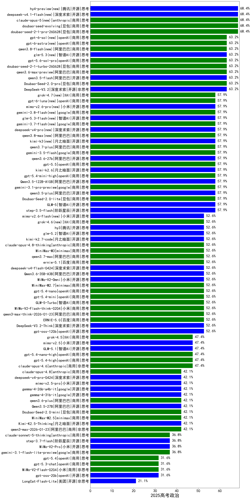

|类别|机构|大模型|【2025高考政治】准确率|平均耗时|平均消耗token|花费/千次（元）|排名（准确率）|
|---|---|-----|-------------------|-------|-----------|-----------|-----------|
|商用|anthropic|claude-opus-5(new)|68.4%|18s|1255|183.5|1|
|商用|豆包|doubao-seed-2-1-pro-260628(new)|68.4%|265s|11791|348.8|2|
|商用|豆包|doubao-seed-evolving(new)|68.4%|307s|11840|350.3|3|
|商用|豆包|Doubao-Seed-2.0-pro|63.2%|297s|1607|23.1|4|
|商用|豆包|doubao-seed-2-1-turbo-260628(new)|63.2%|254s|12045|178.2|5|
|商用|openAI|gpt-5.6-sol-pro(new)|63.2%|94s|5320|481.1|6|
|商用|阿里巴巴|qwen3.6-max-preview|63.2%|79s|2548|130.3|7|
|商用|openAI|gpt-6-astra(new)|63.2%|16s|507|122.6|8|
|开源|智谱AI|glm-5.3(new)|63.2%|271s|8909|246.2|9|
|商用|阿里巴巴|qwen3.8-flash(new)|63.2%|47s|2645|6.7|10|
|开源|阿里巴巴|qwen3.5-flash|63.2%|172s|4455|8.6|11|
|开源|深度求索|DeepSeek-V3.2|63.2%|143s|613|1.7|12|
|开源|阿里巴巴|qwen3.5-plus|57.9%|57s|4700|21.9|13|
|商用|豆包|Doubao-Seed-2.0-lite|57.9%|301s|1530|4.9|14|
|商用|google|gemini-3.1-pro-preview|57.9%|72s|3089|251.2|15|
|商用|google|gemini-3.5-flash|57.9%|17s|2223|131.2|16|
|开源|月之暗面|kimi-k2.6|57.9%|274s|4547|119.8|17|
|开源|智谱AI|GLM-5|57.9%|143s|3536|61.5|18|
|开源|阿里巴巴|Qwen3.5-122B-A10B|57.9%|210s|5331|33.2|19|
|商用|openAI|gpt-5.5|57.9%|44s|1111|199.1|20|
|开源|阶跃星辰|step-3.5-flash|57.9%|27s|3699|7.5|21|
|开源|阿里巴巴|qwen3.6-27b|57.9%|49s|2718|46.5|22|
|商用|阿里巴巴|qwen3.7-plus(new)|57.9%|80s|4415|34.3|23|
|开源|月之暗面|kimi-k3(new)|57.9%|209s|2214|203.5|24|
|商用|阿里巴巴|qwen-plus-think-2025-12-01|57.9%|120s|5175|40.1|25|
|商用|google|gemini-3.8-flash(new)|57.9%|14s|1031|47.0|26|
|开源|智谱AI|glm-5.3-flash(new)|57.9%|245s|10083|27.9|27|
|商用|google|gemini-3.7-flash(new)|57.9%|5s|886|19.7|28|
|开源|深度求索|deepseek-v4-pro(new)|57.9%|293s|5162|135.3|29|
|商用|阿里巴巴|qwen3.8-max(new)|57.9%|65s|2953|101.5|30|
|商用|openAI|gpt-5.4-mini-high|57.9%|23s|2537|74.8|31|
|开源|智谱AI|GLM-4.7|57.9%|105s|4040|54.8|32|
|开源|腾讯|hy3(new)|52.6%|51s|451|1.3|33|
|开源|深度求索|deepseek-v4-flash-0424|52.6%|69s|2053|4.0|34|
|开源|智谱AI|glm-5.2(new)|52.6%|72s|3194|86.2|35|
|商用|minimax|MiniMax-M3(new)|52.6%|98s|3204|49.9|36|
|开源|阿里巴巴|Qwen3.6-35B-A3B|52.6%|16s|2639|27.1|37|
|开源|月之暗面|kimi-k2.7-code(new)|52.6%|69s|2497|64.4|38|
|开源|小米|MiMo-V2-Omni|52.6%|880s|2461|29.8|39|
|商用|XAI|grok-4.6(new)|52.6%|137s|4209|166.4|40|
|商用|百度|ernie-5.1|52.6%|65s|1488|24.5|41|
|商用|anthropic|claude-opus-4.8-thinking(new)|52.6%|33s|2148|339.7|42|
|商用|minimax|MiniMax-M2.7|52.6%|89s|3358|27.1|43|
|商用|阿里巴巴|qwen3.7-max|52.6%|29s|1652|55.6|44|
|商用|openAI|gpt-5.4-nano|52.6%|8s|437|2.4|45|
|商用|openAI|gpt-5.4-mini|52.6%|43s|442|8.8|46|
|开源|openAI|gpt-oss-120b|52.6%|4s|1065|2.8|47|
|商用|智谱AI|GLM-5-Turbo|52.6%|45s|2215|46.1|48|
|商用|豆包|doubao-seed-1-8-251215|52.6%|38s|1015|6.6|49|
|商用|百度|ERNIE-5.0|52.6%|99s|1804|40.8|50|
|开源|美团|LongCat-Flash-Thinking-2601|52.6%|364s|5517|0.0|51|
|商用|小米|MiMo-V2-Flash-think-0204|52.6%|861s|2816|5.6|52|
|商用|阿里巴巴|qwen3-max-think-2026-01-23|52.6%|351s|5191|50.6|53|
|开源|Mistral|mistral-large-2512|52.6%|16s|739|6.2|54|
|开源|深度求索|DeepSeek-V3.2-Think|52.6%|240s|2237|6.6|55|
|商用|阿里巴巴|qwen-plus-2025-12-01|47.4%|39s|1704|3.2|56|
|商用|XAI|grok-4.5(new)|47.4%|104s|6194|249.8|57|
|商用|anthropic|claude-opus-4.6|47.4%|16s|1036|145.0|58|
|商用|腾讯|hunyuan-2.0-thinking-20251109|47.4%|24s|1272|4.7|59|
|商用|minimax|MiniMax-M2.1|47.4%|162s|2194|17.3|60|
|商用|阿里巴巴|qwen3-max-preview-think|47.4%|371s|3907|90.6|61|
|开源|智谱AI|GLM-4.7-Flash|47.4%|2991s|13457|0.0|62|
|商用|腾讯|hunyuan-2.0-instruct-20251111|47.4%|40s|1409|2.6|63|
|商用|google|gemini-3-flash-preview|47.4%|147s|2380|47.7|64|
|商用|openAI|gpt-5.4-high|47.4%|21s|1322|121.7|65|
|商用|openAI|gpt-5.4-nano-high|47.4%|54s|1256|9.6|66|
|开源|小米|mimo-v2.5|47.4%|44s|2863|35.4|67|
|开源|智谱AI|GLM-5.1|47.4%|73s|2386|54.5|68|
|商用|minimax|MiniMax-M2.5|42.1%|56s|3192|25.7|69|
|开源|google|gemma-4-31b-it|42.1%|91s|720|1.7|70|
|开源|阿里巴巴|qwen3-next-80b-a3b-thinking|42.1%|295s|5704|22.3|71|
|开源|阿里巴巴|Qwen3.5-27B|42.1%|630s|4686|21.8|72|
|商用|openAI|gpt-5.2-high|42.1%|28s|1073|89.7|73|
|开源|深度求索|deepseek-v4-pro-0424|42.1%|121s|3293|77.2|74|
|商用|阿里巴巴|qwen3.6-plus|42.1%|44s|2908|33.3|75|
|开源|小米|MiMo-V2-Flash|42.1%|15s|917|0.0|76|
|开源|小米|MiMo-V2-Flash-think|42.1%|44s|3254|0.0|77|
|商用|豆包|Doubao-Seed-2.0-mini|42.1%|668s|3664|7.0|78|
|开源|google|gemma-4-26b-a4b-it|42.1%|170s|959|2.3|79|
|商用|阿里巴巴|qwen3-max-2026-01-23|42.1%|28s|1247|11.2|80|
|开源|小米|mimo-v2.5-pro|42.1%|55s|2704|50.9|81|
|开源|月之暗面|Kimi-K2.5-Thinking|42.1%|604s|3989|81.3|82|
|商用|anthropic|claude-opus-4.8(new)|42.1%|10s|695|85.4|83|
|开源|小米|MiMo-V2-Pro|36.8%|430s|1975|35.7|84|
|商用|anthropic|claude-sonnet-5-thinking(new)|36.8%|18s|1349|80.0|85|
|开源|阶跃星辰|step-3.7-flash(new)|36.8%|78s|6259|49.6|86|
|商用|google|gemini-3.1-flash-lite-preview|36.8%|4s|564|4.4|87|
|商用|openAI|gpt-5.2-medium|31.6%|12s|720|54.6|88|
|开源|openAI|gpt-oss-20b|31.6%|155s|1716|1.8|89|
|开源|Mistral|Ministral-3-8B-Instruct-2512|31.6%|18s|1205|1.3|90|
|商用|openAI|gpt-5.3-chat|31.6%|14s|615|43.5|91|
|商用|小米|MiMo-V2-Flash-0204|31.6%|542s|1266|2.4|92|
|商用|openAI|gpt-5.4|31.6%|5s|464|31.7|93|
|商用|openAI|gpt-5.2|26.3%|6s|409|23.6|94|
|开源|美团|LongCat-Flash-Lite|21.1%|513s|1125|0.0|95|
|开源|Mistral|Ministral-3-3B-Instruct-2512|15.8%|34s|4348|3.1|96|
|开源|Mistral|Ministral-3-14B-Instruct-2512|5.3%|41s|3966|5.6|97|

