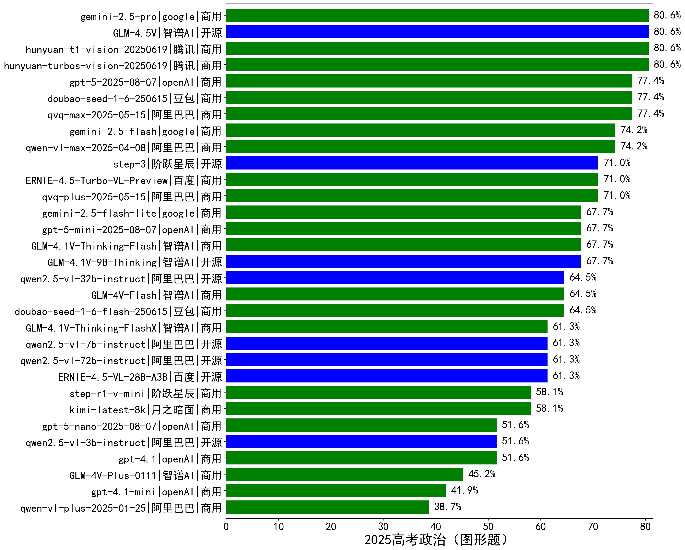

|类别|机构|大模型|【2025高考政治（图形题）】准确率|平均耗时|平均消耗token|花费/千次（元）|排名（准确率）|
|---|---|-----|-------------------|-------|-----------|-----------|-----------|
|商用|腾讯|hunyuan-turbos-vision-20250619|80.6%|100s|1053|5.2|1|
|商用|google|gemini-2.5-pro|80.6%|147s|3343|218.8|2|
|开源|智谱AI|GLM-4.5V|80.6%|19s|2110|8.7|3|
|商用|腾讯|hunyuan-t1-vision-20250619|80.6%|149s|2066|14.0|4|
|商用|阿里巴巴|qwen-vl-max-2025-08-13|77.4%|35s|1574|4.6|5|
|商用|阿里巴巴|qvq-max-2025-05-15|77.4%|170s|2109|48.8|6|
|商用|openAI|gpt-5-2025-08-07|77.4%|205s|1849|87.9|7|
|商用|豆包|doubao-seed-1-6-250615|77.4%|/|1029|2.3|8|
|开源|智谱AI|GLM-4.6V-Flash|74.2%|22s|2636|0.0|9|
|商用|google|gemini-2.5-flash|74.2%|168s|4090|68.2|10|
|商用|阿里巴巴|qwen-vl-max-2025-04-08|74.2%|95s|1290|6.9|11|
|商用|阿里巴巴|qvq-plus-2025-05-15|71.0%|134s|2940|12.3|12|
|开源|阶跃星辰|step-3|71.0%|143s|2752|9.6|13|
|商用|百度|ERNIE-4.5-Turbo-VL-Preview|71.0%|84s|1924|7.5|14|
|商用|google|gemini-2.5-flash-lite|67.7%|131s|1771|4.3|15|
|商用|openAI|gpt-5-mini-2025-08-07|67.7%|156s|1977|20.7|16|
|商用|智谱AI|GLM-4.1V-Thinking-Flash|67.7%|137s|2106|0.0|17|
|开源|智谱AI|GLM-4.1V-9B-Thinking|67.7%|140s|2999|2.2|18|
|商用|豆包|doubao-seed-1-6-flash-250615|64.5%|/|1083|0.6|19|
|商用|智谱AI|GLM-4V-Flash|64.5%|4s|1218|0.0|20|
|开源|阿里巴巴|qwen2.5-vl-32b-instruct|64.5%|107s|1639|3.1|21|
|开源|阿里巴巴|qwen2.5-vl-7b-instruct|61.3%|100s|1237|0.4|22|
|开源|阿里巴巴|qwen2.5-vl-72b-instruct|61.3%|119s|1271|5.2|23|
|商用|智谱AI|GLM-4.1V-Thinking-FlashX|61.3%|97s|2101|4.2|24|
|开源|百度|ERNIE-4.5-VL-28B-A3B|61.3%|6s|1280|0.0|25|
|开源|智谱AI|GLM-4.6V|61.3%|23s|1853|3.6|26|
|商用|阶跃星辰|step-r1-v-mini|58.1%|123s|3273|22.5|27|
|商用|月之暗面|kimi-latest-8k|58.1%|120s|1387|16.7|28|
|商用|阿里巴巴|qwen-vl-plus-2025-08-15|58.1%|9s|1283|1.7|29|
|商用|openAI|gpt-4.1|51.6%|99s|1109|35.0|30|
|开源|阿里巴巴|qwen2.5-vl-3b-instruct|51.6%|109s|990|1.7|31|
|商用|openAI|gpt-5-nano-2025-08-07|51.6%|166s|3075|7.3|32|
|商用|智谱AI|GLM-4V-Plus-0111|45.2%|62s|924|3.7|33|
|商用|openAI|gpt-4.1-mini|41.9%|90s|1078|7.0|34|
|商用|阿里巴巴|qwen-vl-plus-2025-01-25|38.7%|120s|1225|3.1|35|

