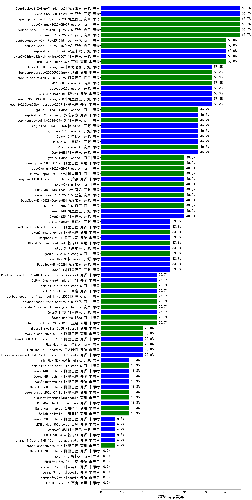

|类别|机构|大模型|【2025高考数学】准确率|平均耗时|平均消耗token|花费/千次（元）|排名（准确率）|
|---|---|-----|-------------------|-------|-----------|-----------|-----------|
|商用|豆包|doubao-seed-1-6-thinking-250715(new)|95.0%|158s|3756|29.3|1|
|商用|腾讯|hunyuan-t1-20250711(new)|94.0%|93s|5196|20.4|2|
|开源|阿里巴巴|qwen3-235b-a22b-thinking-2507(new)|94.0%|133s|4085|79.9|3|
|开源|阿里巴巴|Qwen3-30B-A3B-Thinking-2507(new)|93.0%|120s|4064|11.2|4|
|开源|openAI|gpt-oss-20b(new)|92.0%|142s|2717|3.0|5|
|商用|openAI|o4-mini|91.0%|69s|1737|52.4|6|
|开源|智谱AI|GLM-4.5-nothink|91.0%|123s|3717|51.0|7|
|商用|阶跃星辰|step-r1-v-mini|91.0%|124s|4690|36.8|8|
|开源|openAI|gpt-oss-120b(new)|91.0%|145s|1710|5.2|9|
|开源|月之暗面|kimi-k2-0711-preview(new)|90.0%|125s|1367|20.8|10|
|开源|腾讯|Hunyuan-A13B-Instruct|90.0%|272s|3015|11.8|11|
|商用|百度|ERNIE-X1-Turbo-32K|90.0%|279s|4641|18.7|12|
|开源|华为|pangu-pro-moe(new)|90.0%|166s|4531|17.8|13|
|开源|阿里巴巴|Qwen3-14B|89.0%|324s|15644|31.1|14|
|开源|阿里巴巴|qwen3-235b-a22b-instruct-2507(new)|89.0%|54s|2264|17.5|15|
|开源|深度求索|DeepSeek-R1-0528|89.0%|353s|6906|109.4|16|
|开源|智谱AI|GLM-4.5(new)|89.0%|217s|6941|96.2|17|
|商用|阿里巴巴|qwq-plus-2025-03-05|88.9%|218s|6268|24.8|18|
|开源|阿里巴巴|qwq-32b|88.9%|196s|8319|48.2|19|
|开源|智谱AI|GLM-Z1-32B-0414|88.0%|168s|5900|23.3|20|
|商用|智谱AI|GLM-Z1-Air|88.0%|207s|4728|2.4|21|
|商用|阿里巴巴|qwen-plus-2025-07-14(new)|88.0%|31s|2299|4.5|22|
|开源|深度求索|DeepSeek-R1-Distill-Qwen-32B|88.0%|84s|3851|4.6|23|
|商用|科大讯飞|xunfei-spark-x1-0725(new)|88.0%|/|5409|64.9|24|
|商用|XAI|grok-3-mini|87.0%|60s|2358|8.4|25|
|开源|智谱AI|GLM-4.5-Air(new)|87.0%|134s|7503|44.5|26|
|开源|深度求索|DeepSeek-R1-0528-Qwen3-8B|87.0%|282s|7376|0.0|27|
|开源|深度求索|deepseek-chat-v3-0324|87.0%|150s|1573|11.7|28|
|商用|阿里巴巴|qwen-turbo-think-2025-04-28|87.0%|396s|6159|18.2|29|
|商用|google|gemini-2.5-pro|86.0%|55s|5898|421.7|30|
|开源|智谱AI|GLM-Z1-9B-0414|86.0%|186s|6676|0.0|31|
|开源|阶跃星辰|step-3(new)|86.0%|459s|7630|30.3|32|
|商用|豆包|doubao-seed-1-6-250615|86.0%|157s|1051|7.5|33|
|商用|奇虎360|360gpt2-o1|85.2%|100s|4804|237.1|34|
|商用|阿里巴巴|qwen-plus-think-2025-04-28|85.0%|341s|4898|38.4|35|
|开源|阿里巴巴|Qwen3-235B-A22B|85.0%|459s|10318|102.0|36|
|开源|minimax|MiniMax-M1|85.0%|251s|5818|43.7|37|
|开源|智谱AI|GLM-4.5-Air-nothink|85.0%|32s|2358|13.6|38|
|开源|阿里巴巴|Qwen3-30B-A3B-Instruct-2507(new)|85.0%|19s|2132|6.2|39|
|商用|智谱AI|GLM-Z1-FlashX|85.0%|64s|5489|0.5|40|
|商用|智谱AI|GLM-Z1-Flash|85.0%|110s|6942|0.0|41|
|商用|anthropic|claude-4-sonnet-thinking|84.0%|219s|1826|189.6|42|
|商用|智谱AI|GLM-Z1-AirX|84.0%|60s|5809|29.0|43|
|开源|阿里巴巴|Qwen3-30B-A3B|84.0%|520s|15181|42.3|44|
|商用|腾讯|hunyuan-turbos-20250604|84.0%|93s|2056|4.0|45|
|开源|深度求索|DeepSeek-R1-Distill-Qwen-14B|83.3%|90s|4344|3.0|46|
|商用|奇虎360|360zhinao2-o1|83.3%|117s|4495|44.3|47|
|商用|智谱AI|GLM-4.5-Flash(new)|83.0%|118s|7687|0.0|48|
|开源|阿里巴巴|Qwen3-4B|83.0%|264s|7141|21.1|49|
|商用|google|gemini-2.5-flash|83.0%|21s|4856|86.5|50|
|商用|百度|ERNIE-4.5-Turbo-32K|83.0%|111s|1707|5.0|51|
|商用|豆包|Doubao-1.5-pro-32k-250115|82.7%|87s|1076|2.0|52|
|商用|XAI|grok-4-0709|82.1%|71s|2666|282.6|53|
|商用|openAI|gpt-4.1-mini|82.0%|66s|1353|14.7|54|
|商用|豆包|doubao-seed-1-6-flash-thinking-250615|82.0%|115s|3313|4.8|55|
|开源|阿里巴巴|Qwen3-32B|82.0%|327s|11910|47.2|56|
|开源|阿里巴巴|Qwen3-235B-A22B-nothink|81.1%|54s|1247|11.7|57|
|开源|阿里巴巴|Qwen3-1.7B|81.0%|154s|6654|19.7|58|
|商用|智谱AI|GLM-4.5-Flash-nothink|81.0%|88s|5136|0.0|59|
|开源|智谱AI|GLM-4-32B-0414|80.0%|112s|1542|2.9|60|
|商用|google|gemini-2.5-flash-lite-preview-06-17|79.0%|9s|2605|7.4|61|
|商用|anthropic|claude-4-sonnet|79.0%|30s|805|77.8|62|
|商用|科大讯飞|xunfei-4.0Ultra|77.8%|/|/|/|63|
|商用|openAI|chatgpt-4o-latest|77.5%|62s|1157|78.4|64|
|商用|openAI|gpt-4.1|77.0%|76s|1121|59.7|65|
|商用|阿里巴巴|qwen-turbo-2025-07-15(new)|76.8%|18s|1331|0.8|66|
|开源|阿里巴巴|Qwen3-14B-nothink|76.0%|27s|1634|3.1|67|
|商用|科大讯飞|xunfei-spark-max|75.2%|78s|977|29.5|68|
|开源|阿里巴巴|Qwen3-32B-nothink|75.0%|53s|1524|5.8|69|
|商用|豆包|doubao-seed-1-6-flash-250615|74.0%|51s|1273|1.8|70|
|开源|阿里巴巴|Qwen3-30B-A3B-nothink|74.0%|65s|1629|4.3|71|
|开源|meta|Llama-4-Maverick-17B-128E-Instruct-FP8|73.0%|87s|838|3.4|72|
|开源|阿里巴巴|Qwen3-8B|73.0%|411s|11813|0.0|73|
|开源|腾讯|Hunyuan-A13B-Instruct-nothink(new)|73.0%|324s|1173|4.4|74|
|开源|百度|ERNIE-4.5-300B-A47B|72.0%|240s|1528|11.6|75|
|开源|阿里巴巴|qwen2.5-72b-instruct|70.9%|115s|733|7.8|76|
|开源|阿里巴巴|Qwen3-4B-nothink|69.0%|24s|1188|3.3|77|
|商用|阿里巴巴|qwen-long-2025-01-25|68.9%|128s|957|1.8|78|
|开源|微软|phi-4|68.8%|113s|1063|1.0|79|
|商用|腾讯|hunyuan-standard|68.5%|58s|597|1.1|80|
|开源|阿里巴巴|Qwen3-8B-nothink|68.0%|59s|1511|0.0|81|
|开源|百度|ERNIE-4.5-21B-A3B|67.0%|86s|1807|0.0|82|
|商用|阿里巴巴|qwen2.5-max|67.0%|127s|992|8.8|83|
|开源|Google|gemma-3-12b-it|66.7%|134s|986|0.0|84|
|开源|Google|gemma-3-27b-it|66.7%|117s|937|1.3|85|
|开源|阿里巴巴|qwen2.5-32b-instruct|66.7%|104s|645|3.4|86|
|开源|腾讯|hunyuan-large|65.7%|75s|892|9.8|87|
|商用|豆包|Doubao-1.5-lite-32k-250115|64.9%|88s|892|0.5|88|
|商用|奇虎360|360gpt2-pro|64.8%|55s|793|3.6|89|
|开源|Mistral|Mistral-Small-3.1-24B-Instruct-2503|64.0%|96s|738|1.5|90|
|商用|智谱AI|GLM-4-Plus|63.0%|44s|841|4.2|91|
|商用|月之暗面|kimi-latest-8k|61.9%|98s|876|10.5|92|
|商用|Mistral|mistral-large|61.5%|86s|774|30.5|93|
|商用|奇虎360|360gpt-turbo|61.5%|66s|812|1.5|94|
|商用|百川智能|Baichuan4-Air|60.7%|82s|628|0.6|95|
|商用|零一万物|yi-lightning|60.6%|65s|821|0.8|96|
|开源|minimax|MiniMax-Text-01|59.6%|76s|1244|5.5|97|
|商用|商汤|SenseChat-5-1202|59.1%|103s|757|14.4|98|
|开源|meta|Llama-4-Scout-17B-16E-Instruct|59.0%|113s|797|1.6|99|
|商用|Mistral|mistral-small|58.0%|93s|819|1.6|100|
|商用|百度|ERNIE-3.5-8K|57.9%|84s|735|1.4|101|
|商用|百川智能|Baichuan4-Turbo|57.3%|85s|607|9.1|102|
|开源|阿里巴巴|qwen2.5-7b-instruct|56.9%|133s|759|0.7|103|
|开源|智谱AI|GLM-Z1-Rumination-32B-0414|56.0%|217s|8102|30.4|104|
|开源|阿里巴巴|qwen2.5-14b-instruct|55.4%|101s|719|1.9|105|
|开源|阿里巴巴|Qwen3-0.6B|55.0%|134s|6186|18.3|106|
|商用|阶跃星辰|step-2-mini|54.6%|72s|724|1.3|107|
|商用|OpenAI|gpt-4o-mini|53.5%|64s|828|3.3|108|
|商用|智谱AI|GLM-4-AirX|52.8%|49s|633|6.3|109|
|开源|阿里巴巴|Qwen3-1.7B-nothink|51.0%|11s|1123|3.1|110|
|开源|阿里巴巴|qwen2.5-3b-instruct|47.2%|104s|637|0.5|111|
|开源|智谱AI|GLM-4-9B-0414|47.0%|104s|994|0.0|112|
|开源|上海人工智能实验室|internlm2_5-7b-chat|43.6%|100s|894|0.0|113|
|商用|科大讯飞|xunfei-spark-pro|43.5%|64s|875|6.1|114|
|商用|智谱AI|GLM-4-Long|43.1%|78s|908|0.9|115|
|商用|智谱AI|GLM-4-FlashX|43.1%|72s|644|0.1|116|
|商用|Mistral|ministral-8b|42.6%|87s|701|0.5|117|
|开源|Google|gemma-3-4b-it|41.8%|103s|1415|0.0|118|
|商用|Mistral|ministral-3b|41.7%|113s|861|0.2|119|
|商用|百度|ERNIE-Lite-8K|37.5%|73s|510|0.0|120|
|开源|阿里巴巴|Qwen3-0.6B-nothink|36.0%|15s|817|2.2|121|
|商用|百度|ERNIE-Speed-8K|34.9%|81s|459|0.0|122|
|开源|阿里巴巴|qwen2.5-1.5b-instruct|32.4%|124s|658|0.0|123|
|开源|阿里巴巴|qwen2.5-0.5b-instruct|23.9%|132s|816|0.0|124|
|商用|科大讯飞|xunfei-spark-lite|17.1%|66s|602|0.0|125|
|开源|百度|ERNIE-4.5-0.3B|17.0%|126s|1104|0.0|126|
|商用|百度|ERNIE-Tiny-8K|14.8%|67s|408|0.0|127|

