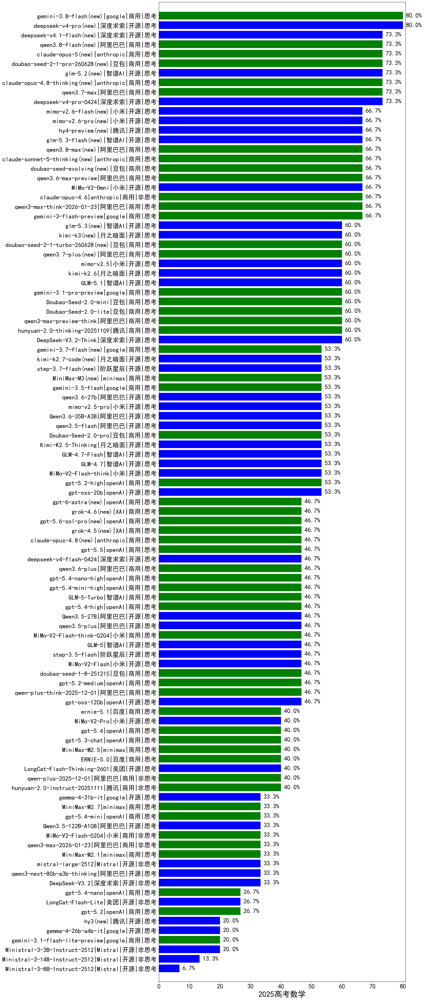

|类别|机构|大模型|【2025高考数学】准确率|平均耗时|平均消耗token|花费/千次（元）|排名（准确率）|
|---|---|-----|-------------------|-------|-----------|-----------|-----------|
|商用|google|gemini-3.8-flash(new)|80.0%|21s|3557|182.7|1|
|开源|深度求索|deepseek-v4-pro(new)|80.0%|141s|8419|224.2|2|
|商用|anthropic|claude-opus-4.8-thinking(new)|73.3%|36s|3438|582.6|3|
|商用|阿里巴巴|qwen3.8-flash(new)|73.3%|199s|10435|27.9|4|
|商用|阿里巴巴|qwen3.7-max|73.3%|163s|8612|307.5|5|
|开源|深度求索|deepseek-v4-pro-0424|73.3%|209s|7977|190.3|6|
|开源|智谱AI|glm-5.2(new)|73.3%|259s|12525|348.6|7|
|商用|豆包|doubao-seed-2-1-pro-260628(new)|73.3%|443s|26193|782.4|8|
|商用|anthropic|claude-opus-5(new)|73.3%|23s|1949|321.8|9|
|商用|阿里巴巴|qwen3-max-think-2026-01-23|66.7%|400s|8727|86.5|10|
|商用|google|gemini-3-flash-preview|66.7%|140s|14039|297.3|11|
|商用|anthropic|claude-opus-4.6|66.7%|23s|1295|208.7|12|
|开源|小米|MiMo-V2-Omni|66.7%|433s|7789|105.2|13|
|商用|豆包|doubao-seed-evolving(new)|66.7%|456s|25215|753.3|14|
|商用|anthropic|claude-sonnet-5-thinking(new)|66.7%|38s|3587|243.4|15|
|商用|阿里巴巴|qwen3.6-max-preview|66.7%|162s|6191|329.6|16|
|商用|阿里巴巴|qwen3.8-max(new)|66.7%|177s|8484|302.0|17|
|开源|智谱AI|glm-5.3-flash(new)|66.7%|342s|15420|43.0|18|
|开源|深度求索|DeepSeek-V3.2-Think|60.0%|220s|7092|21.2|19|
|开源|小米|mimo-v2.5|60.0%|107s|7455|100.5|20|
|商用|阿里巴巴|qwen3.7-plus(new)|60.0%|232s|12709|101.0|21|
|商用|豆包|Doubao-Seed-2.0-lite|60.0%|618s|3962|13.8|22|
|开源|月之暗面|kimi-k3(new)|60.0%|113s|3120|298.0|23|
|商用|阿里巴巴|qwen3-max-preview-think|60.0%|163s|7674|182.2|24|
|商用|google|gemini-3.1-pro-preview|60.0%|134s|9553|807.1|25|
|商用|豆包|doubao-seed-2-1-turbo-260628(new)|60.0%|682s|21420|319.6|26|
|开源|月之暗面|kimi-k2.6|60.0%|488s|10318|276.6|27|
|商用|腾讯|hunyuan-2.0-thinking-20251109|60.0%|93s|7190|28.5|28|
|开源|智谱AI|GLM-5.1|60.0%|650s|13067|311.8|29|
|开源|智谱AI|glm-5.3(new)|60.0%|712s|15754|439.0|30|
|商用|豆包|Doubao-Seed-2.0-mini|60.0%|101s|11105|21.9|31|
|开源|阿里巴巴|qwen3.6-27b|53.3%|314s|23470|420.9|32|
|开源|阿里巴巴|qwen3.5-flash|53.3%|185s|17377|34.6|33|
|商用|google|gemini-3.5-flash|53.3%|33s|5874|365.0|34|
|商用|豆包|Doubao-Seed-2.0-pro|53.3%|715s|3169|48.9|35|
|开源|智谱AI|GLM-4.7-Flash|53.3%|2011s|14774|0.0|36|
|商用|minimax|MiniMax-M3(new)|53.3%|356s|14420|239.0|37|
|开源|阶跃星辰|step-3.7-flash(new)|53.3%|138s|14364|115.7|38|
|开源|月之暗面|kimi-k2.7-code(new)|53.3%|145s|5606|149.4|39|
|开源|月之暗面|Kimi-K2.5-Thinking|53.3%|768s|10502|218.9|40|
|开源|小米|mimo-v2.5-pro|53.3%|206s|11539|237.5|41|
|开源|智谱AI|GLM-4.7|53.3%|250s|9733|135.2|42|
|开源|小米|MiMo-V2-Flash-think|53.3%|131s|13488|0.0|43|
|开源|阿里巴巴|Qwen3.6-35B-A3B|53.3%|71s|15318|164.5|44|
|商用|openAI|gpt-5.2-high|53.3%|80s|3837|372.1|45|
|商用|google|gemini-3.7-flash(new)|53.3%|11s|2781|71.0|46|
|开源|openAI|gpt-oss-20b|53.3%|142s|2717|3.0|47|
|开源|openAI|gpt-oss-120b|46.7%|145s|1710|5.2|48|
|开源|深度求索|deepseek-v4-flash-0424|46.7%|163s|5253|10.4|49|
|商用|openAI|gpt-5.5|46.7%|59s|1702|338.8|50|
|商用|anthropic|claude-opus-4.8(new)|46.7%|18s|1539|250.2|51|
|商用|XAI|grok-4.5(new)|46.7%|150s|6760|275.5|52|
|商用|openAI|gpt-5.6-sol-pro(new)|46.7%|39s|8003|832.1|53|
|商用|XAI|grok-4.6(new)|46.7%|170s|5593|226.5|54|
|商用|阿里巴巴|qwen3.6-plus|46.7%|225s|10393|123.7|55|
|商用|智谱AI|GLM-5-Turbo|46.7%|180s|12055|263.6|56|
|开源|智谱AI|GLM-5|46.7%|247s|9757|174.2|57|
|开源|阿里巴巴|Qwen3.5-27B|46.7%|1058s|17165|81.9|58|
|商用|阿里巴巴|qwen-plus-think-2025-12-01|46.7%|140s|6681|52.7|59|
|商用|openAI|gpt-5.2-medium|46.7%|47s|2560|245.2|60|
|商用|豆包|doubao-seed-1-8-251215|46.7%|74s|2368|17.9|61|
|开源|小米|MiMo-V2-Flash|46.7%|123s|5548|0.0|62|
|开源|阶跃星辰|step-3.5-flash|46.7%|100s|18556|38.8|63|
|商用|小米|MiMo-V2-Flash-think-0204|46.7%|946s|8793|18.3|64|
|开源|阿里巴巴|qwen3.5-plus|46.7%|188s|16769|80.1|65|
|商用|openAI|gpt-6-astra(new)|46.7%|20s|713|220.0|66|
|商用|openAI|gpt-5.4-nano-high|46.7%|198s|4766|40.9|67|
|商用|openAI|gpt-5.4-high|46.7%|82s|2462|250.3|68|
|商用|openAI|gpt-5.4-mini-high|46.7%|281s|5595|173.5|69|
|商用|openAI|gpt-5.3-chat|40.0%|38s|1675|155.0|70|
|商用|minimax|MiniMax-M2.5|40.0%|146s|8525|70.8|71|
|商用|腾讯|hunyuan-2.0-instruct-20251111|40.0%|34s|2356|4.6|72|
|商用|阿里巴巴|qwen-plus-2025-12-01|40.0%|98s|4248|8.4|73|
|开源|美团|LongCat-Flash-Thinking-2601|40.0%|176s|16639|0.0|74|
|商用|百度|ERNIE-5.0|40.0%|948s|13823|330.0|75|
|开源|小米|MiMo-V2-Pro|40.0%|65s|4435|88.3|76|
|商用|openAI|gpt-5.4|40.0%|15s|1006|96.3|77|
|商用|百度|ernie-5.1|40.0%|144s|6065|107.8|78|
|开源|google|gemma-4-31b-it|33.3%|104s|1107|2.9|79|
|开源|深度求索|DeepSeek-V3.2|33.3%|85s|2472|7.3|80|
|开源|阿里巴巴|qwen3-next-80b-a3b-thinking|33.3%|289s|7543|29.9|81|
|开源|Mistral|mistral-large-2512|33.3%|48s|2509|26.1|82|
|开源|阿里巴巴|Qwen3.5-122B-A10B|33.3%|399s|18451|117.5|83|
|商用|minimax|MiniMax-M2.7|33.3%|245s|11280|94.0|84|
|商用|minimax|MiniMax-M2.1|33.3%|350s|11947|99.6|85|
|商用|openAI|gpt-5.4-mini|33.3%|6s|800|22.4|86|
|商用|小米|MiMo-V2-Flash-0204|33.3%|573s|3604|7.4|87|
|商用|阿里巴巴|qwen3-max-2026-01-23|33.3%|97s|4463|43.8|88|
|开源|美团|LongCat-Flash-Lite|26.7%|433s|4774|0.0|89|
|商用|openAI|gpt-5.4-nano|26.7%|111s|900|7.1|90|
|商用|openAI|gpt-5.2|26.7%|15s|825|72.7|91|
|开源|腾讯|hy3(new)|20.0%|64s|1041|3.9|92|
|商用|google|gemini-3.1-flash-lite-preview|20.0%|70s|968|9.3|93|
|开源|Mistral|Ministral-3-3B-Instruct-2512|20.0%|29s|7650|5.4|94|
|开源|google|gemma-4-26b-a4b-it|20.0%|249s|1588|4.2|95|
|开源|Mistral|Ministral-3-14B-Instruct-2512|13.3%|30s|2558|3.6|96|
|开源|Mistral|Ministral-3-8B-Instruct-2512|6.7%|42s|7502|8.0|97|

