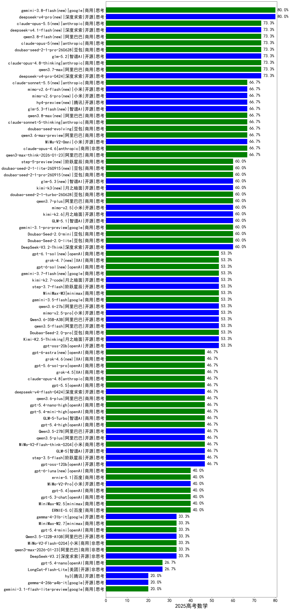

|类别|机构|大模型|【2025高考数学】准确率|平均耗时|平均消耗token|花费/千次（元）|排名（准确率）|
|---|---|-----|-------------------|-------|-----------|-----------|-----------|
|商用|google|gemini-3.8-flash(new)|80.0%|21s|3557|182.7|1|
|开源|深度求索|deepseek-v4-pro|80.0%|141s|8419|224.2|2|
|开源|深度求索|deepseek-v4.1-flash(new)|73.3%|74s|3812|29.8|3|
|商用|豆包|doubao-seed-2-1-pro-260628|73.3%|443s|26193|782.4|4|
|商用|阿里巴巴|qwen3.7-max|73.3%|163s|8612|307.5|5|
|商用|anthropic|claude-opus-5|73.3%|23s|1949|321.8|6|
|开源|深度求索|deepseek-v4-pro-0424|73.3%|209s|7977|190.3|7|
|商用|阿里巴巴|qwen3.8-flash(new)|73.3%|199s|10435|27.9|8|
|商用|anthropic|claude-opus-4.8-thinking|73.3%|36s|3438|582.6|9|
|开源|月之暗面|kimi-k3.1-pro(new)|73.3%|253s|8671|580.0|10|
|开源|智谱AI|glm-5.2|73.3%|259s|12525|348.6|11|
|商用|anthropic|claude-opus-5.5(new)|73.3%|17s|1311|168.1|12|
|商用|google|gemini-4-argon(new)|73.3%|23s|1618|212.4|13|
|开源|小米|mimo-v2.6-pro(new)|66.7%|296s|13770|82.3|14|
|商用|豆包|doubao-seed-evolving|66.7%|456s|25215|753.3|15|
|商用|anthropic|claude-sonnet-5-thinking|66.7%|38s|3587|243.4|16|
|商用|阿里巴巴|qwen3.8-max|66.7%|177s|8484|302.0|17|
|商用|anthropic|claude-sonnet-5.5(new)|66.7%|12s|1369|88.1|18|
|开源|小米|mimo-v2.6-flash(new)|66.7%|232s|12895|25.7|19|
|开源|智谱AI|glm-5.3-flash(new)|66.7%|342s|15420|43.0|20|
|商用|阿里巴巴|qwen3.6-max-preview|66.7%|162s|6191|329.6|21|
|开源|腾讯|hy4-preview(new)|66.7%|99s|7379|131.6|22|
|开源|智谱AI|glm-5.3(new)|60.0%|712s|15754|439.0|23|
|商用|豆包|doubao-seed-2-1-lite-260915(new)|60.0%|89s|4320|11.4|24|
|开源|月之暗面|kimi-k3|60.0%|113s|3120|298.0|25|
|商用|豆包|doubao-seed-2-1-pro-260915(new)|60.0%|196s|2597|74.5|26|
|商用|anthropic|claude-haiku-5.5(new)|60.0%|11s|2020|6.7|27|
|商用|minimax|MiniMax-M3.1-Flash(new)|60.0%|69s|4255|16.2|28|
|商用|阶跃星辰|step-5-preview(new)|60.0%|88s|5926|117.2|29|
|商用|豆包|doubao-seed-2-1-turbo-260628|60.0%|682s|21420|319.6|30|
|商用|阿里巴巴|qwen3.7-plus|60.0%|232s|12709|101.0|31|
|开源|深度求索|DeepSeek-V3.2-Think|60.0%|220s|7092|21.2|32|
|商用|google|gemini-3.1-pro-preview|60.0%|134s|9553|807.1|33|
|开源|智谱AI|GLM-5.1|60.0%|650s|13067|311.8|34|
|开源|月之暗面|kimi-k2.6|60.0%|488s|10318|276.6|35|
|开源|小米|mimo-v2.5|60.0%|107s|7455|100.5|36|
|开源|阶跃星辰|step-3.7-flash|53.3%|138s|14364|115.7|37|
|商用|google|gemini-3.7-flash|53.3%|11s|2781|71.0|38|
|商用|openAI|gpt-6.1-sol(new)|53.3%|31s|644|39.1|39|
|商用|XAI|grok-4.7(new)|53.3%|149s|11346|439.1|40|
|商用|openAI|gpt-6-sol(new)|53.3%|201s|730|45.1|41|
|开源|月之暗面|kimi-k2.7-code|53.3%|145s|5606|149.4|42|
|开源|小米|mimo-v2.5-pro|53.3%|206s|11539|237.5|43|
|开源|阿里巴巴|Qwen3.6-35B-A3B|53.3%|71s|15318|164.5|44|
|商用|minimax|MiniMax-M3|53.3%|356s|14420|239.0|45|
|开源|阿里巴巴|qwen3.6-27b|53.3%|314s|23470|420.9|46|
|开源|openAI|gpt-oss-20b|53.3%|142s|2717|3.0|47|
|商用|google|gemini-3.5-flash|53.3%|33s|5874|365.0|48|
|商用|XAI|grok-4.6|46.7%|170s|5593|226.5|49|
|商用|阿里巴巴|qwen3.6-plus|46.7%|225s|10393|123.7|50|
|商用|anthropic|claude-opus-4.8|46.7%|18s|1539|250.2|51|
|开源|阿里巴巴|Qwen3.5-27B|46.7%|1058s|17165|81.9|52|
|开源|深度求索|deepseek-v4-flash-0424|46.7%|163s|5253|10.4|53|
|开源|openAI|gpt-oss-120b|46.7%|145s|1710|5.2|54|
|商用|XAI|grok-4.5|46.7%|150s|6760|275.5|55|
|商用|openAI|gpt-6-astra(new)|46.7%|20s|713|220.0|56|
|商用|openAI|gpt-5.6-sol-pro|46.7%|39s|8003|832.1|57|
|商用|openAI|gpt-5.5|46.7%|59s|1702|338.8|58|
|商用|openAI|gpt-6-luna(new)|40.0%|474s|1527|5.0|59|
|商用|百度|ernie-5.1|40.0%|144s|6065|107.8|60|
|商用|百度|ERNIE-5.0|40.0%|948s|13823|330.0|61|
|开源|google|gemma-4-31b-it|33.3%|104s|1107|2.9|62|
|商用|minimax|MiniMax-M2.7|33.3%|245s|11280|94.0|63|
|开源|阿里巴巴|Qwen3.5-122B-A10B|33.3%|399s|18451|117.5|64|
|开源|深度求索|DeepSeek-V3.2|33.3%|85s|2472|7.3|65|
|开源|google|gemma-4-26b-a4b-it|20.0%|249s|1588|4.2|66|
|商用|google|gemini-3.1-flash-lite-preview|20.0%|70s|968|9.3|67|
|开源|腾讯|hy3|20.0%|64s|1041|3.9|68|

