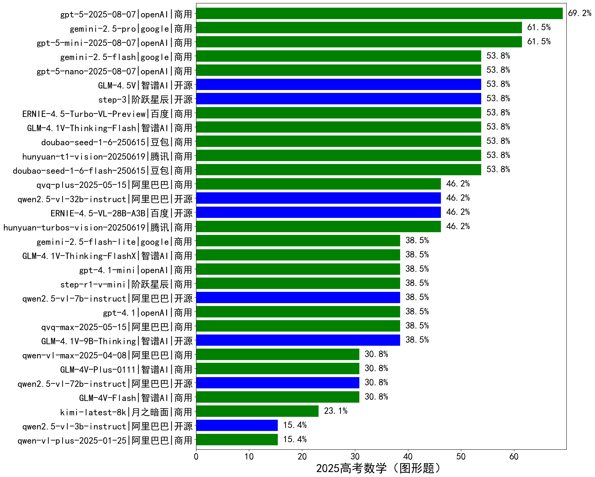

|类别|机构|大模型|【2025高考数学（图形题）】准确率|平均耗时|平均消耗token|花费/千次（元）|排名（准确率）|
|---|---|-----|-------------------|-------|-----------|-----------|-----------|
|商用|openAI|gpt-5-2025-08-07|69.2%|179s|4173|279.7|1|
|商用|google|gemini-2.5-pro|61.5%|185s|8371|582.6|2|
|商用|openAI|gpt-5-mini-2025-08-07|61.5%|101s|2490|33.8|3|
|商用|百度|ERNIE-4.5-Turbo-VL-Preview|53.8%|155s|2638|14.5|4|
|商用|豆包|doubao-seed-1-6-flash-250615|53.8%|/|948|1.2|5|
|商用|智谱AI|GLM-4.1V-Thinking-Flash|53.8%|112s|1698|0.0|6|
|商用|腾讯|hunyuan-t1-vision-20250619|53.8%|263s|4235|35.1|7|
|商用|豆包|doubao-seed-1-6-250615|53.8%|/|1594|11.2|8|
|商用|openAI|gpt-5-nano-2025-08-07|53.8%|140s|6880|19.5|9|
|商用|google|gemini-2.5-flash|53.8%|107s|5958|101.9|10|
|开源|阶跃星辰|step-3|53.8%|526s|9763|38.3|11|
|开源|智谱AI|GLM-4.5V|53.8%|42s|2933|15.6|12|
|商用|阿里巴巴|qwen-vl-max-2025-08-13|53.8%|123s|3325|12.9|13|
|商用|腾讯|hunyuan-turbos-vision-20250619|46.2%|167s|1303|9.1|14|
|商用|阿里巴巴|qvq-plus-2025-05-15|46.2%|292s|5411|26.5|15|
|开源|阿里巴巴|qwen2.5-vl-32b-instruct|46.2%|133s|1410|2.7|16|
|开源|百度|ERNIE-4.5-VL-28B-A3B|46.2%|10s|824|0.0|17|
|开源|智谱AI|GLM-4.1V-9B-Thinking|38.5%|201s|4982|4.9|18|
|商用|阿里巴巴|qvq-max-2025-05-15|38.5%|234s|3660|112.7|19|
|开源|阿里巴巴|qwen2.5-vl-7b-instruct|38.5%|105s|650|0.2|20|
|商用|openAI|gpt-4.1-mini|38.5%|73s|2016|21.8|21|
|商用|google|gemini-2.5-flash-lite|38.5%|129s|11515|32.6|22|
|商用|智谱AI|GLM-4.1V-Thinking-FlashX|38.5%|92s|1609|3.2|23|
|商用|openAI|gpt-4.1|38.5%|124s|1858|92.7|24|
|商用|阶跃星辰|step-r1-v-mini|38.5%|156s|7147|55.1|25|
|商用|阿里巴巴|qwen-vl-plus-2025-08-15|38.5%|19s|1921|3.6|26|
|商用|智谱AI|GLM-4V-Flash|30.8%|8s|624|0.0|27|
|开源|阿里巴巴|qwen2.5-vl-72b-instruct|30.8%|88s|692|2.9|28|
|商用|智谱AI|GLM-4V-Plus-0111|30.8%|81s|643|2.6|29|
|商用|阿里巴巴|qwen-vl-max-2025-04-08|30.8%|163s|1454|12.0|30|
|商用|月之暗面|kimi-latest-8k|23.1%|171s|1608|19.3|31|
|开源|阿里巴巴|qwen2.5-vl-3b-instruct|15.4%|94s|1368|4.5|32|
|商用|阿里巴巴|qwen-vl-plus-2025-01-25|15.4%|132s|547|1.9|33|

