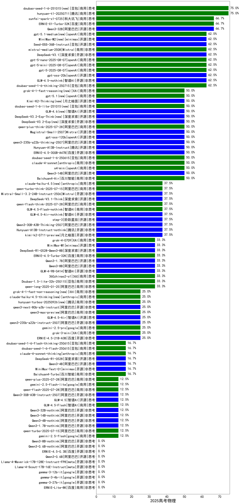

|类别|机构|大模型|【2025高考物理】准确率|平均耗时|平均消耗token|花费/千次（元）|排名（准确率）|
|---|---|-----|-------------------|-------|-----------|-----------|-----------|
|开源|华为|pangu-pro-moe|75.0%|153s|3126|12.1|1|
|商用|腾讯|hunyuan-t1-20250711|75.0%|88s|2608|9.9|2|
|开源|阿里巴巴|Qwen3-32B|66.7%|449s|7527|29.7|3|
|商用|科大讯飞|xunfei-spark-x1-0725|66.7%|/|2750|33.0|4|
|商用|百度|ERNIE-X1-Turbo-32K|66.7%|190s|2602|10.0|5|
|开源|智谱AI|GLM-Z1-32B-0414|66.7%|159s|3381|13.0|6|
|开源|openAI|gpt-oss-20b(new)|62.5%|11s|1438|1.5|7|
|开源|智谱AI|GLM-4.5-nothink|62.5%|83s|1382|17.8|8|
|商用|openAI|gpt-5-mini-2025-08-07(new)|62.5%|45s|993|12.3|9|
|商用|openAI|gpt-5-2025-08-07(new)|62.5%|35s|664|38.2|10|
|开源|深度求索|DeepSeek-V3.1|62.5%|31s|701|7.4|11|
|商用|openAI|gpt-5-nano-2025-08-07(new)|62.5%|63s|2270|6.2|12|
|开源|豆包|Seed-OSS-36B-Instruct(new)|62.5%|165s|2200|8.4|13|
|商用|Mistral|mistral-medium-2508(new)|62.5%|278s|766|9.0|14|
|商用|豆包|doubao-seed-1-6-thinking-250715|62.5%|44s|1794|13.3|15|
|开源|阿里巴巴|Qwen3-14B|50.0%|433s|10962|21.7|16|
|开源|智谱AI|GLM-Z1-9B-0414|50.0%|172s|3890|0.0|17|
|商用|Mistral|ministral-8b|50.0%|109s|1091|0.8|18|
|开源|百度|ERNIE-4.5-300B-A47B|50.0%|325s|828|5.7|19|
|开源|腾讯|Hunyuan-A13B-Instruct|50.0%|134s|1553|5.8|20|
|商用|豆包|doubao-seed-1-6-250615|50.0%|100s|805|5.2|21|
|商用|anthropic|claude-4-sonnet|50.0%|43s|696|57.8|22|
|商用|月之暗面|kimi-latest-8k|50.0%|221s|920|11.0|23|
|开源|智谱AI|GLM-4-32B-0414|50.0%|139s|1169|2.2|24|
|商用|openAI|o4-mini|50.0%|72s|830|22.6|25|
|商用|豆包|Doubao-1.5-pro-32k-250115|50.0%|102s|706|1.2|26|
|开源|阿里巴巴|qwen3-235b-a22b-thinking-2507|50.0%|95s|2582|47.5|27|
|开源|Mistral|Magistral-Small-2507|50.0%|423s|7497|80.2|28|
|开源|智谱AI|GLM-4.6(new)|50.0%|93s|4200|57.1|29|
|开源|深度求索|DeepSeek-V3.2-Exp-Think(new)|50.0%|307s|1684|4.9|30|
|开源|深度求索|DeepSeek-V3.2-Exp(new)|50.0%|283s|599|1.7|31|
|商用|阿里巴巴|qwen-plus-think-2025-07-28|50.0%|/|2555|19.3|32|
|开源|openAI|gpt-oss-120b(new)|50.0%|10s|1111|3.1|33|
|商用|腾讯|hunyuan-turbos-20250716|50.0%|46s|2156|4.1|34|
|商用|百川智能|Baichuan4-Air|50.0%|102s|656|0.6|35|
|商用|智谱AI|GLM-4.5-Flash-nothink|37.5%|38s|2557|0.0|36|
|商用|阿里巴巴|qwen-flash-think-2025-07-28|37.5%|38s|2492|3.5|37|
|开源|阶跃星辰|step-3|37.5%|303s|3837|15.0|38|
|开源|月之暗面|kimi-k2-0711-preview|37.5%|79s|1287|19.0|39|
|开源|智谱AI|GLM-4.5-Air-nothink|37.5%|83s|5742|33.7|40|
|开源|深度求索|DeepSeek-V3.1-Think|37.5%|86s|1718|19.6|41|
|开源|Mistral|Mistral-Small-3.2-24B-Instruct-2506|37.5%|390s|1652|3.3|42|
|商用|阿里巴巴|qwen-turbo-think-2025-07-15|37.5%|/|3657|10.6|43|
|开源|腾讯|Hunyuan-A13B-Instruct-nothink|37.5%|515s|693|2.3|44|
|开源|阿里巴巴|Qwen3-30B-A3B-Thinking-2507|37.5%|117s|2605|7.0|45|
|商用|阿里巴巴|qwen-long-2025-01-25|33.3%|17s|955|1.7|46|
|开源|minimax|MiniMax-M1|33.3%|247s|3299|22.6|47|
|商用|XAI|grok-4-0709|33.3%|267s|1968|201.4|48|
|开源|深度求索|DeepSeek-R1-0528-Qwen3-8B|33.3%|400s|4311|0.0|49|
|开源|智谱AI|GLM-4-9B-0414|33.3%|129s|758|0.0|50|
|商用|豆包|Doubao-1.5-lite-32k-250115|33.3%|114s|461|0.2|51|
|开源|深度求索|DeepSeek-R1-Distill-Qwen-14B|33.3%|106s|3901|2.7|52|
|商用|百度|ERNIE-4.5-Turbo-32K|33.3%|16s|384|1.0|53|
|商用|360|360zhinao2-o1|33.3%|281s|3830|37.4|54|
|开源|阿里巴巴|Qwen3-8B|33.3%|600s|18090|0.0|55|
|开源|阿里巴巴|Qwen3-1.7B|33.3%|177s|5479|16.0|56|
|开源|阿里巴巴|qwen3-next-80b-a3b-instruct(new)|25.0%|17s|1070|3.8|57|
|商用|google|gemini-2.5-pro|25.0%|56s|3780|265.0|58|
|开源|智谱AI|GLM-4.5-Air|25.0%|69s|3716|21.6|59|
|开源|百度|ERNIE-4.5-21B-A3B|25.0%|74s|1337|0.1|60|
|商用|腾讯|hunyuan-turbos-20250926(new)|25.0%|27s|1130|2.0|61|
|商用|阿里巴巴|qwen3-max-preview(new)|25.0%|20s|909|19.1|62|
|商用|XAI|grok-3-mini|25.0%|69s|1500|5.2|63|
|开源|阿里巴巴|qwen3-235b-a22b-instruct-2507|25.0%|54s|1245|9.1|64|
|商用|百度|ERNIE-Speed-8K|16.7%|20s|418|0.0|65|
|开源|minimax|MiniMax-Text-01|16.7%|190s|1160|4.4|66|
|商用|百川智能|Baichuan4-Turbo|16.7%|130s|626|9.4|67|
|商用|豆包|doubao-seed-1-6-flash-250615|16.7%|11s|644|0.8|68|
|开源|深度求索|deepseek-chat-v3-0324|16.7%|111s|1345|9.9|69|
|商用|阶跃星辰|step-2-mini|16.7%|120s|612|1.1|70|
|开源|深度求索|DeepSeek-R1-0528|16.7%|414s|3959|61.8|71|
|开源|阿里巴巴|Qwen3-4B|16.7%|206s|4294|12.5|72|
|商用|豆包|doubao-seed-1-6-flash-thinking-250615|16.7%|24s|1758|2.4|73|
|商用|anthropic|claude-4-sonnet-thinking|16.7%|45s|1287|121.6|74|
|商用|阿里巴巴|qwen-turbo-2025-07-15|12.5%|61s|728|0.4|75|
|商用|阿里巴巴|qwen-flash-2025-07-28|12.5%|63s|1271|1.7|76|
|开源|智谱AI|GLM-4.5|12.5%|96s|3804|51.7|77|
|商用|google|gemini-2.5-flash|12.5%|38s|2624|45.3|78|
|开源|阿里巴巴|Qwen3-32B-nothink|12.5%|84s|851|2.9|79|
|开源|阿里巴巴|Qwen3-14B-nothink|12.5%|49s|901|1.6|80|
|开源|阿里巴巴|Qwen3-4B-nothink|12.5%|43s|811|2.0|81|
|开源|阿里巴巴|Qwen3-1.7B-nothink|12.5%|13s|877|2.2|82|
|商用|智谱AI|GLM-4.5-Flash|12.5%|59s|3617|0.0|83|
|商用|google|gemini-2.5-flash-lite|12.5%|14s|2186|6.0|84|
|开源|阿里巴巴|Qwen3-30B-A3B-Instruct-2507|12.5%|16s|1238|3.4|85|
|商用|阿里巴巴|qwen-plus-2025-07-28|12.5%|39s|1325|2.5|86|
|开源|meta|Llama-4-Scout-17B-16E-Instruct|/%|152s|586|1.0|87|
|开源|阿里巴巴|Qwen3-0.6B|/%|159s|5409|15.8|88|
|开源|google|gemma-3-27b-it|/%|122s|581|0.7|89|
|开源|google|gemma-3-4b-it|/%|117s|1189|0.0|90|
|开源|google|gemma-3-12b-it|/%|137s|681|0.0|91|
|商用|Mistral|ministral-3b|/%|102s|744|0.2|92|
|商用|百度|ERNIE-Lite-8K|/%|93s|463|0.0|93|
|开源|meta|Llama-4-Maverick-17B-128E-Instruct-FP8|/%|78s|888|3.4|94|
|开源|深度求索|DeepSeek-R1-Distill-Qwen-32B|/%|85s|2536|3.2|95|
|商用|科大讯飞|xunfei-spark-lite|/%|75s|570|0.0|96|
|开源|阿里巴巴|Qwen3-8B-nothink|/%|37s|943|0.0|97|
|开源|百度|ERNIE-4.5-0.3B|/%|20s|917|0.0|98|
|开源|阿里巴巴|Qwen3-0.6B-nothink|/%|10s|634|1.5|99|

