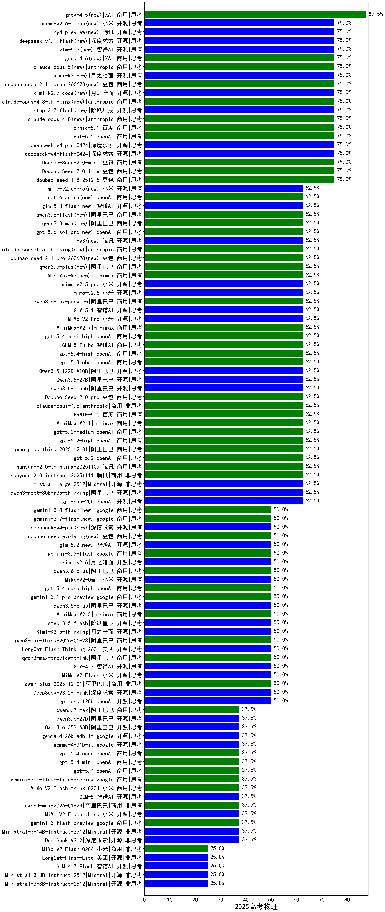

|类别|机构|大模型|【2025高考物理】准确率|平均耗时|平均消耗token|花费/千次（元）|排名（准确率）|
|---|---|-----|-------------------|-------|-----------|-----------|-----------|
|商用|XAI|grok-4.5(new)|87.5%|77s|3522|137.9|1|
|开源|小米|mimo-v2.6-flash(new)|75.0%|672s|8283|16.4|2|
|商用|豆包|Doubao-Seed-2.0-mini|75.0%|817s|4809|9.3|3|
|商用|豆包|Doubao-Seed-2.0-lite|75.0%|485s|2153|7.2|4|
|开源|深度求索|deepseek-v4-flash-0424|75.0%|106s|3189|6.2|5|
|开源|深度求索|deepseek-v4-pro-0424|75.0%|202s|6378|151.3|6|
|商用|openAI|gpt-5.5|75.0%|40s|1492|281.8|7|
|商用|百度|ernie-5.1|75.0%|49s|2034|34.5|8|
|商用|anthropic|claude-opus-4.8(new)|75.0%|8s|786|105.0|9|
|开源|阶跃星辰|step-3.7-flash(new)|75.0%|76s|5382|42.6|10|
|开源|月之暗面|kimi-k2.7-code(new)|75.0%|105s|3318|86.6|11|
|商用|豆包|doubao-seed-2-1-turbo-260628(new)|75.0%|411s|17077|253.8|12|
|商用|豆包|doubao-seed-1-8-251215|75.0%|34s|1286|8.9|13|
|商用|anthropic|claude-opus-4.8-thinking(new)|75.0%|19s|1718|268.2|14|
|开源|月之暗面|kimi-k3(new)|75.0%|79s|2170|199.2|15|
|商用|anthropic|claude-opus-5(new)|75.0%|13s|924|129.2|16|
|开源|腾讯|hy4-preview(new)|75.0%|100s|4749|83.6|17|
|商用|XAI|grok-4.6(new)|75.0%|890s|2875|110.8|18|
|开源|智谱AI|glm-5.3(new)|75.0%|-222s|10135|280.6|19|
|开源|深度求索|deepseek-v4.1-flash(new)|75.0%|19s|3104|23.8|20|
|商用|openAI|gpt-5.6-sol-pro(new)|62.5%|34s|6409|619.5|21|
|开源|小米|mimo-v2.5|62.5%|103s|5126|67.3|22|
|商用|openAI|gpt-5.4-high|62.5%|38s|2140|208.9|23|
|商用|智谱AI|GLM-5-Turbo|62.5%|62s|3359|71.3|24|
|开源|小米|mimo-v2.6-pro(new)|62.5%|184s|9233|54.9|25|
|开源|openAI|gpt-oss-20b|62.5%|11s|1438|1.5|26|
|商用|minimax|MiniMax-M2.7|62.5%|88s|3776|30.6|27|
|开源|小米|MiMo-V2-Pro|62.5%|439s|2189|40.3|28|
|开源|智谱AI|GLM-5.1|62.5%|154s|7060|166.7|29|
|商用|阿里巴巴|qwen3.6-max-preview|62.5%|102s|3238|168.0|30|
|商用|openAI|gpt-6-astra(new)|62.5%|23s|674|185.2|31|
|开源|小米|mimo-v2.5-pro|62.5%|205s|9824|200.6|32|
|开源|腾讯|hy3(new)|62.5%|57s|500|1.5|33|
|开源|智谱AI|glm-5.3-flash(new)|62.5%|311s|13835|38.4|34|
|商用|阿里巴巴|qwen3.8-flash(new)|62.5%|127s|7507|19.9|35|
|商用|minimax|MiniMax-M3(new)|62.5%|53s|1796|26.3|36|
|商用|阿里巴巴|qwen3.7-plus(new)|62.5%|227s|12489|99.0|37|
|开源|阿里巴巴|Qwen3.5-122B-A10B|62.5%|521s|7719|48.5|38|
|商用|阿里巴巴|qwen3.8-max(new)|62.5%|131s|5734|201.9|39|
|商用|豆包|doubao-seed-2-1-pro-260628(new)|62.5%|816s|26827|800.2|40|
|商用|anthropic|claude-sonnet-5-thinking(new)|62.5%|37s|1951|123.6|41|
|商用|openAI|gpt-5.3-chat|62.5%|16s|683|51.4|42|
|商用|openAI|gpt-5.4-mini-high|62.5%|52s|2582|76.6|43|
|开源|阿里巴巴|Qwen3.5-27B|62.5%|459s|7865|37.1|44|
|商用|anthropic|claude-opus-4.6|62.5%|21s|932|131.1|45|
|开源|阿里巴巴|qwen3-next-80b-a3b-thinking|62.5%|202s|7068|27.8|46|
|开源|Mistral|mistral-large-2512|62.5%|19s|1002|9.3|47|
|商用|腾讯|hunyuan-2.0-instruct-20251111|62.5%|17s|1076|1.9|48|
|商用|腾讯|hunyuan-2.0-thinking-20251109|62.5%|121s|9929|39.3|49|
|商用|openAI|gpt-5.2|62.5%|7s|495|33.5|50|
|商用|阿里巴巴|qwen-plus-think-2025-12-01|62.5%|215s|6412|50.1|51|
|商用|openAI|gpt-5.2-high|62.5%|30s|1685|151.8|52|
|商用|openAI|gpt-5.2-medium|62.5%|14s|1053|89.0|53|
|商用|minimax|MiniMax-M2.1|62.5%|100s|3679|29.8|54|
|商用|百度|ERNIE-5.0|62.5%|312s|6146|145.0|55|
|开源|阿里巴巴|qwen3.5-flash|62.5%|406s|8797|17.3|56|
|商用|豆包|Doubao-Seed-2.0-pro|62.5%|325s|1463|20.9|57|
|开源|小米|MiMo-V2-Omni|50.0%|32s|3819|48.9|58|
|商用|阿里巴巴|qwen-plus-2025-12-01|50.0%|68s|2922|5.6|59|
|开源|智谱AI|GLM-4.7|50.0%|163s|4339|59.1|60|
|商用|阿里巴巴|qwen3.6-plus|50.0%|54s|3227|37.2|61|
|开源|小米|MiMo-V2-Flash|50.0%|35s|1745|0.0|62|
|商用|豆包|doubao-seed-evolving(new)|50.0%|521s|23300|694.3|63|
|商用|openAI|gpt-5.4-nano-high|50.0%|85s|1156|8.8|64|
|开源|阿里巴巴|qwen3.5-plus|50.0%|80s|6566|30.9|65|
|开源|美团|LongCat-Flash-Thinking-2601|50.0%|217s|6481|0.0|66|
|开源|深度求索|deepseek-v4-pro(new)|50.0%|144s|5148|135.0|67|
|商用|google|gemini-3.1-pro-preview|50.0%|65s|3557|292.0|68|
|商用|google|gemini-3.7-flash(new)|50.0%|8s|1823|44.6|69|
|商用|google|gemini-3.8-flash(new)|50.0%|17s|2921|146.8|70|
|开源|深度求索|DeepSeek-V3.2-Think|50.0%|164s|5098|15.2|71|
|商用|阿里巴巴|qwen3-max-preview-think|50.0%|185s|7232|170.6|72|
|开源|智谱AI|glm-5.2(new)|50.0%|174s|8237|227.5|73|
|开源|openAI|gpt-oss-120b|50.0%|10s|1111|3.1|74|
|商用|google|gemini-3.5-flash|50.0%|25s|4919|301.7|75|
|商用|阿里巴巴|qwen3-max-think-2026-01-23|50.0%|319s|11018|108.9|76|
|开源|月之暗面|Kimi-K2.5-Thinking|50.0%|382s|11715|243.6|77|
|商用|minimax|MiniMax-M2.5|50.0%|87s|4455|36.3|78|
|开源|阶跃星辰|step-3.5-flash|50.0%|84s|10710|22.3|79|
|开源|月之暗面|kimi-k2.6|50.0%|359s|8968|239.2|80|
|开源|智谱AI|GLM-5|37.5%|441s|6972|123.3|81|
|开源|深度求索|DeepSeek-V3.2|37.5%|46s|882|2.5|82|
|开源|google|gemma-4-31b-it|37.5%|181s|797|1.9|83|
|开源|google|gemma-4-26b-a4b-it|37.5%|74s|965|2.4|84|
|商用|openAI|gpt-5.4|37.5%|6s|568|43.8|85|
|开源|Mistral|Ministral-3-14B-Instruct-2512|37.5%|21s|2049|2.9|86|
|开源|阿里巴巴|Qwen3.6-35B-A3B|37.5%|18s|3569|37.2|87|
|商用|google|gemini-3.1-flash-lite-preview|37.5%|37s|759|6.6|88|
|商用|openAI|gpt-5.4-nano|37.5%|12s|600|3.9|89|
|商用|google|gemini-3-flash-preview|37.5%|41s|4344|89.8|90|
|开源|阿里巴巴|qwen3.6-27b|37.5%|63s|3816|66.4|91|
|开源|小米|MiMo-V2-Flash-think|37.5%|224s|7857|0.0|92|
|商用|阿里巴巴|qwen3-max-2026-01-23|37.5%|410s|2283|21.6|93|
|商用|小米|MiMo-V2-Flash-think-0204|37.5%|645s|4646|9.5|94|
|商用|阿里巴巴|qwen3.7-max|37.5%|77s|4348|152.9|95|
|商用|openAI|gpt-5.4-mini|37.5%|35s|466|9.9|96|
|开源|智谱AI|GLM-4.7-Flash|25.0%|925s|7666|0.0|97|
|商用|小米|MiMo-V2-Flash-0204|25.0%|150s|1718|3.4|98|
|开源|Mistral|Ministral-3-3B-Instruct-2512|25.0%|11s|1276|0.9|99|
|开源|Mistral|Ministral-3-8B-Instruct-2512|25.0%|12s|1206|1.3|100|
|开源|美团|LongCat-Flash-Lite|25.0%|456s|2744|0.0|101|

