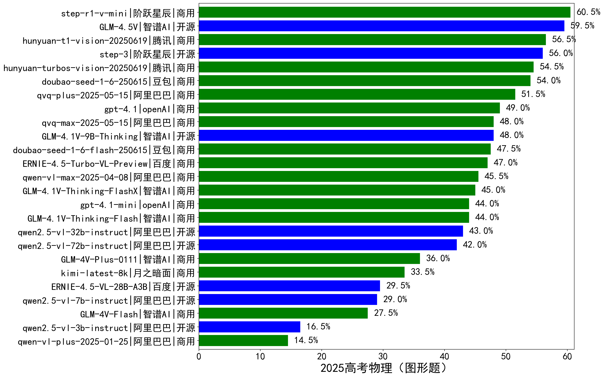

|类别|机构|大模型|【2025高考物理（图形题）】准确率|平均耗时|平均消耗token|花费/千次（元）|排名（准确率）|
|---|---|-----|-------------------|-------|-----------|-----------|-----------|
|商用|阶跃星辰|step-r1-v-mini|60.5%|149s|7965|60.1|1|
|开源|智谱AI|GLM-4.5V|59.5%|46s|3604|19.3|2|
|商用|腾讯|hunyuan-t1-vision-20250619|56.5%|123s|4988|40.9|3|
|开源|阶跃星辰|step-3|56.0%|445s|8262|32.1|4|
|商用|腾讯|hunyuan-turbos-vision-20250619|54.5%|50s|1322|8.2|5|
|商用|豆包|doubao-seed-1-6-250615|54.0%|/|1377|7.3|6|
|商用|阿里巴巴|qvq-plus-2025-05-15|51.5%|207s|5294|25.0|7|
|商用|openAI|gpt-4.1|49.0%|54s|1444|57.6|8|
|商用|阿里巴巴|qvq-max-2025-05-15|48.0%|165s|3507|100.6|9|
|开源|智谱AI|GLM-4.1V-9B-Thinking|48.0%|123s|4208|3.8|10|
|商用|豆包|doubao-seed-1-6-flash-250615|47.5%|/|1803|2.1|11|
|商用|百度|ERNIE-4.5-Turbo-VL-Preview|47.0%|85s|2589|12.9|12|
|商用|阿里巴巴|qwen-vl-max-2025-04-08|45.5%|97s|1251|8.3|13|
|商用|智谱AI|GLM-4.1V-Thinking-FlashX|45.0%|62s|1972|3.9|14|
|商用|openAI|gpt-4.1-mini|44.0%|81s|1412|12.4|15|
|商用|智谱AI|GLM-4.1V-Thinking-Flash|44.0%|75s|1998|0.0|16|
|开源|阿里巴巴|qwen2.5-vl-32b-instruct|43.0%|100s|1555|2.9|17|
|开源|阿里巴巴|qwen2.5-vl-72b-instruct|42.0%|89s|907|3.7|18|
|商用|智谱AI|GLM-4V-Plus-0111|36.0%|51s|945|3.8|19|
|商用|月之暗面|kimi-latest-8k|33.5%|83s|1747|21.0|20|
|开源|百度|ERNIE-4.5-VL-28B-A3B|29.5%|10s|1095|0.0|21|
|开源|阿里巴巴|qwen2.5-vl-7b-instruct|29.0%|79s|999|0.3|22|
|商用|智谱AI|GLM-4V-Flash|27.5%|7s|935|0.0|23|
|开源|阿里巴巴|qwen2.5-vl-3b-instruct|16.5%|90s|968|2.3|24|
|商用|阿里巴巴|qwen-vl-plus-2025-01-25|14.5%|90s|826|2.3|25|

