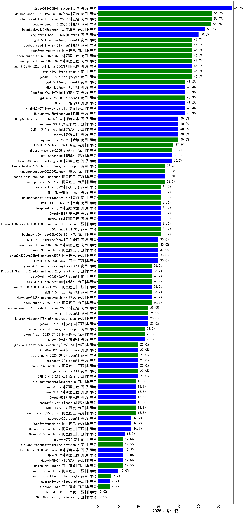

|类别|机构|大模型|【2025高考生物】准确率|平均耗时|平均消耗token|花费/千次（元）|排名（准确率）|
|---|---|-----|-------------------|-------|-----------|-----------|-----------|
|商用|豆包|doubao-seed-1-6-250615|88.8%|146s|500|2.6|1|
|商用|豆包|doubao-seed-1-6-thinking-250715|88.8%|53s|2409|18.1|2|
|开源|豆包|Seed-OSS-36B-Instruct(new)|88.0%|140s|2878|11.1|3|
|开源|月之暗面|kimi-k2-0711-preview|87.5%|80s|1001|14.2|4|
|开源|深度求索|DeepSeek-R1-0528|86.2%|254s|3088|47.6|5|
|商用|阿里巴巴|qwen3-max-preview(new)|84.0%|26s|1110|23.5|6|
|商用|腾讯|hunyuan-t1-20250711|83.8%|50s|2969|11.3|7|
|开源|阿里巴巴|qwen3-235b-a22b-thinking-2507|83.8%|78s|3434|65.5|8|
|商用|腾讯|hunyuan-turbos-20250716|83.8%|32s|1607|3.0|9|
|开源|智谱AI|GLM-4.5|83.8%|94s|3085|41.5|10|
|商用|豆包|Doubao-1.5-pro-32k-250115|83.8%|78s|591|1.0|11|
|商用|google|gemini-2.5-pro|82.5%|40s|3434|238.4|12|
|开源|腾讯|Hunyuan-A13B-Instruct|82.5%|247s|1909|7.2|13|
|商用|openAI|gpt-5-2025-08-07(new)|82.5%|40s|622|32.7|14|
|开源|阶跃星辰|step-3|82.5%|160s|3207|12.4|15|
|开源|华为|pangu-pro-moe|82.5%|142s|3095|11.9|16|
|商用|科大讯飞|xunfei-spark-x1-0725|82.5%|/|2532|30.4|17|
|开源|深度求索|DeepSeek-V3.2-Exp(new)|82.0%|168s|614|1.7|18|
|商用|XAI|grok-4-0709|82.0%|342s|2344|238.5|19|
|开源|阿里巴巴|Qwen3-32B|81.2%|232s|5594|21.9|20|
|开源|阿里巴巴|Qwen3-14B|81.2%|369s|9087|17.9|21|
|商用|anthropic|claude-4-sonnet-thinking|81.2%|55s|1600|150.1|22|
|商用|智谱AI|GLM-4.5-Flash|81.2%|54s|3439|0.0|23|
|开源|阿里巴巴|Qwen3-32B-nothink|81.2%|49s|862|2.9|24|
|商用|百度|ERNIE-X1-Turbo-32K|81.2%|376s|4604|18.0|25|
|开源|阿里巴巴|qwen3-235b-a22b-instruct-2507|80.0%|35s|1401|10.2|26|
|商用|阿里巴巴|qwen-turbo-think-2025-07-15|80.0%|/|3610|10.4|27|
|开源|智谱AI|GLM-Z1-32B-0414|80.0%|455s|6305|24.7|28|
|商用|豆包|Doubao-1.5-lite-32k-250115|80.0%|75s|393|0.2|29|
|商用|google|gemini-2.5-flash|80.0%|14s|2798|48.1|30|
|开源|深度求索|DeepSeek-V3.2-Exp-Think(new)|79.0%|185s|2015|5.9|31|
|开源|深度求索|DeepSeek-V3.1-Think(new)|79.0%|93s|1942|22.1|32|
|开源|深度求索|deepseek-chat-v3-0324|78.8%|73s|532|3.2|33|
|开源|阿里巴巴|Qwen3-30B-A3B-Instruct-2507|78.8%|11s|1346|3.6|34|
|开源|阿里巴巴|Qwen3-30B-A3B-Thinking-2507|78.8%|76s|3807|10.3|35|
|商用|阿里巴巴|qwen-plus-think-2025-07-28|78.0%|/|3804|29.2|36|
|开源|深度求索|DeepSeek-V3.1(new)|78.0%|31s|712|7.3|37|
|开源|阿里巴巴|qwen3-next-80b-a3b-instruct(new)|78.0%|18s|1418|5.2|38|
|商用|阿里巴巴|qwen-plus-2025-07-28|78.0%|40s|1436|2.7|39|
|开源|智谱AI|GLM-4.5-Air|77.5%|53s|3275|18.8|40|
|商用|anthropic|claude-4-sonnet|77.5%|38s|887|72.6|41|
|商用|豆包|doubao-seed-1-6-flash-250615|77.5%|28s|557|0.6|42|
|开源|meta|Llama-4-Scout-17B-16E-Instruct|77.5%|365s|634|1.1|43|
|商用|奇虎360|360zhinao2-o1|77.5%|131s|3733|36.3|44|
|开源|智谱AI|GLM-4.5-nothink|77.5%|30s|1069|13.2|45|
|开源|百度|ERNIE-4.5-300B-A47B|77.5%|260s|693|4.6|46|
|开源|minimax|MiniMax-M1|77.5%|246s|4510|32.1|47|
|商用|阿里巴巴|qwen-long-2025-01-25|77.3%|13s|719|1.1|48|
|商用|阿里巴巴|qwen-flash-2025-07-28|76.2%|15s|1384|1.8|49|
|商用|阿里巴巴|qwen-turbo-2025-07-15|76.2%|11s|842|0.5|50|
|商用|阿里巴巴|qwen-flash-think-2025-07-28|76.2%|37s|3911|5.6|51|
|开源|深度求索|DeepSeek-R1-0528-Qwen3-8B|76.2%|314s|2970|0.0|52|
|商用|百度|ERNIE-4.5-Turbo-32K|76.2%|82s|689|1.9|53|
|开源|智谱AI|GLM-4-32B-0414|76.2%|101s|740|1.4|54|
|商用|openAI|o4-mini|76.2%|65s|1478|42.4|55|
|开源|meta|Llama-4-Maverick-17B-128E-Instruct-FP8|76.2%|230s|793|2.9|56|
|开源|阿里巴巴|Qwen3-4B|75.0%|175s|3898|11.2|57|
|商用|豆包|doubao-seed-1-6-flash-thinking-250615|75.0%|50s|1522|2.0|58|
|开源|智谱AI|GLM-Z1-9B-0414|75.0%|163s|5791|0.0|59|
|商用|openAI|gpt-5-mini-2025-08-07(new)|73.8%|35s|1380|17.5|60|
|商用|Mistral|mistral-medium-2508(new)|73.0%|20s|732|7.9|61|
|开源|深度求索|DeepSeek-R1-Distill-Qwen-32B|72.5%|129s|4281|5.4|62|
|商用|月之暗面|kimi-latest-8k|72.5%|246s|665|8.0|63|
|开源|阿里巴巴|Qwen3-8B|72.5%|832s|18539|0.0|64|
|开源|阿里巴巴|Qwen3-8B-nothink|71.2%|46s|956|0.0|65|
|开源|openAI|gpt-oss-120b(new)|71.2%|8s|1565|4.4|66|
|开源|Mistral|Magistral-Small-2507|71.0%|111s|8812|94.2|67|
|开源|智谱AI|GLM-4.5-Air-nothink|70.0%|43s|2785|15.9|68|
|开源|阿里巴巴|Qwen3-14B-nothink|70.0%|21s|960|1.7|69|
|开源|深度求索|DeepSeek-R1-Distill-Qwen-14B|70.0%|83s|2810|2.0|70|
|商用|openAI|gpt-5-nano-2025-08-07(new)|68.8%|42s|3187|8.7|71|
|商用|百川智能|Baichuan4-Turbo|68.8%|94s|474|7.1|72|
|商用|智谱AI|GLM-4.5-Flash-nothink|68.8%|51s|2973|0.0|73|
|商用|阶跃星辰|step-2-mini|68.8%|30s|579|1.0|74|
|商用|百川智能|Baichuan4-Air|67.5%|78s|481|0.5|75|
|商用|XAI|grok-3-mini|67.5%|158s|1489|5.2|76|
|开源|腾讯|Hunyuan-A13B-Instruct-nothink|67.5%|413s|611|1.9|77|
|开源|阿里巴巴|Qwen3-4B-nothink|66.2%|17s|800|1.9|78|
|开源|百度|ERNIE-4.5-21B-A3B|65.0%|148s|752|0.0|79|
|开源|minimax|MiniMax-Text-01|65.0%|110s|1031|3.2|80|
|开源|Mistral|Mistral-Small-3.2-24B-Instruct-2506|63.0%|205s|999|1.8|81|
|商用|百度|ERNIE-Speed-8K|62.5%|9s|313|0.0|82|
|开源|智谱AI|GLM-4-9B-0414|62.5%|101s|787|0.0|83|
|商用|google|gemini-2.5-flash-lite|60.0%|21s|5894|16.7|84|
|开源|openAI|gpt-oss-20b(new)|58.8%|162s|2227|2.4|85|
|商用|百度|ERNIE-Lite-8K|57.5%|7s|373|0.0|86|
|开源|Google|gemma-3-27b-it|57.5%|85s|576|0.7|87|
|开源|Google|gemma-3-12b-it|52.5%|102s|557|0.0|88|
|开源|阿里巴巴|Qwen3-1.7B|50.0%|124s|4375|12.7|89|
|开源|阿里巴巴|Qwen3-1.7B-nothink|47.5%|9s|715|1.7|90|
|商用|Mistral|ministral-8b|42.5%|69s|579|0.4|91|
|商用|科大讯飞|xunfei-spark-lite|41.2%|55s|355|0.0|92|
|开源|阿里巴巴|Qwen3-0.6B|40.0%|88s|2707|7.7|93|
|开源|阿里巴巴|Qwen3-0.6B-nothink|40.0%|6s|435|0.8|94|
|商用|Mistral|ministral-3b|37.5%|85s|532|0.2|95|
|开源|Google|gemma-3-4b-it|36.2%|73s|549|0.0|96|
|开源|百度|ERNIE-4.5-0.3B|28.7%|154s|530|0.0|97|

