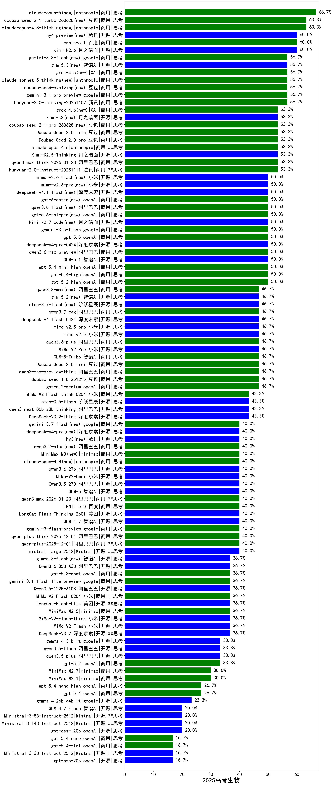

|类别|机构|大模型|【2025高考生物】准确率|平均耗时|平均消耗token|花费/千次（元）|排名（准确率）|
|---|---|-----|-------------------|-------|-----------|-----------|-----------|
|商用|anthropic|claude-opus-5(new)|66.7%|24s|1857|280.3|1|
|商用|anthropic|claude-opus-4.8-thinking(new)|63.3%|37s|2957|472.4|2|
|商用|豆包|doubao-seed-2-1-turbo-260628(new)|63.3%|336s|16322|241.9|3|
|商用|百度|ernie-5.1|60.0%|100s|4420|76.7|4|
|开源|月之暗面|kimi-k2.6|60.0%|433s|8872|235.6|5|
|商用|腾讯|hunyuan-2.0-thinking-20251109|56.7%|66s|4753|18.5|6|
|商用|豆包|doubao-seed-evolving(new)|56.7%|556s|20760|616.9|7|
|商用|anthropic|claude-sonnet-5-thinking(new)|56.7%|47s|4478|295.6|8|
|商用|XAI|grok-4.5(new)|56.7%|78s|5736|229.5|9|
|开源|智谱AI|glm-5.3(new)|56.7%|268s|9699|267.4|10|
|商用|google|gemini-3.1-pro-preview|56.7%|71s|4886|401.2|11|
|商用|google|gemini-3.8-flash(new)|56.7%|16s|2470|120.7|12|
|商用|腾讯|hunyuan-2.0-instruct-20251111|53.3%|37s|1467|2.7|13|
|开源|月之暗面|kimi-k3(new)|53.3%|182s|4682|446.5|14|
|商用|豆包|Doubao-Seed-2.0-pro|53.3%|473s|2514|37.1|15|
|商用|豆包|Doubao-Seed-2.0-lite|53.3%|392s|2388|7.9|16|
|商用|XAI|grok-4.6(new)|53.3%|243s|5203|207.1|17|
|商用|豆包|doubao-seed-2-1-pro-260628(new)|53.3%|397s|20026|594.9|18|
|商用|anthropic|claude-opus-4.6|53.3%|28s|1743|261.1|19|
|开源|月之暗面|Kimi-K2.5-Thinking|53.3%|568s|8198|168.9|20|
|商用|阿里巴巴|qwen3-max-think-2026-01-23|53.3%|265s|9608|94.4|21|
|开源|深度求索|deepseek-v4-pro-0424|50.0%|182s|7375|174.7|22|
|开源|智谱AI|GLM-5.1|50.0%|491s|8820|208.1|23|
|商用|阿里巴巴|qwen3.6-max-preview|50.0%|120s|4039|208.9|24|
|商用|openAI|gpt-6-astra(new)|50.0%|22s|698|174.0|25|
|商用|openAI|gpt-5.4-mini-high|50.0%|142s|5460|165.4|26|
|商用|openAI|gpt-5.5|50.0%|44s|1819|338.2|27|
|商用|google|gemini-3.5-flash|50.0%|28s|4355|263.2|28|
|商用|openAI|gpt-5.4-high|50.0%|47s|2639|256.2|29|
|开源|月之暗面|kimi-k2.7-code(new)|50.0%|132s|5265|138.1|30|
|商用|openAI|gpt-5.2-high|50.0%|96s|2607|237.3|31|
|商用|openAI|gpt-5.6-sol-pro(new)|50.0%|49s|7122|678.7|32|
|商用|阿里巴巴|qwen3.8-flash(new)|50.0%|174s|13600|36.2|33|
|商用|阿里巴巴|qwen3.7-max|46.7%|143s|9036|320.4|34|
|开源|深度求索|deepseek-v4-flash-0424|46.7%|102s|5454|10.7|35|
|开源|小米|mimo-v2.5-pro|46.7%|149s|8009|161.7|36|
|开源|小米|mimo-v2.5|46.7%|79s|5703|74.7|37|
|开源|智谱AI|glm-5.2(new)|46.7%|177s|8231|226.3|38|
|商用|阿里巴巴|qwen3.8-max(new)|46.7%|254s|10873|385.6|39|
|商用|阿里巴巴|qwen3.6-plus|46.7%|77s|3940|45.3|40|
|开源|小米|MiMo-V2-Pro|46.7%|93s|6124|122.2|41|
|开源|阶跃星辰|step-3.7-flash(new)|46.7%|129s|8773|69.8|42|
|商用|智谱AI|GLM-5-Turbo|46.7%|75s|6346|136.2|43|
|商用|阿里巴巴|qwen3-max-preview-think|46.7%|166s|7136|167.3|44|
|商用|openAI|gpt-5.2-medium|46.7%|43s|1760|153.1|45|
|商用|豆包|doubao-seed-1-8-251215|46.7%|55s|1801|12.6|46|
|商用|豆包|Doubao-Seed-2.0-mini|46.7%|105s|7275|14.1|47|
|开源|阿里巴巴|qwen3-next-80b-a3b-thinking|43.3%|263s|6914|27.0|48|
|开源|深度求索|DeepSeek-V3.2-Think|43.3%|189s|6110|18.1|49|
|商用|小米|MiMo-V2-Flash-think-0204|43.3%|274s|7558|15.5|50|
|开源|阶跃星辰|step-3.5-flash|43.3%|74s|11077|23.0|51|
|商用|阿里巴巴|qwen3-max-2026-01-23|40.0%|209s|2372|22.1|52|
|商用|minimax|MiniMax-M3(new)|40.0%|217s|3179|49.0|53|
|商用|百度|ERNIE-5.0|40.0%|297s|7708|181.7|54|
|开源|阿里巴巴|qwen3.6-27b|40.0%|69s|4325|74.8|55|
|开源|美团|LongCat-Flash-Thinking-2601|40.0%|333s|8026|0.0|56|
|商用|anthropic|claude-opus-4.8(new)|40.0%|13s|1063|141.4|57|
|开源|智谱AI|GLM-4.7|40.0%|156s|5976|81.5|58|
|商用|阿里巴巴|qwen3.7-plus(new)|40.0%|227s|12571|99.3|59|
|商用|google|gemini-3-flash-preview|40.0%|148s|3989|81.2|60|
|商用|阿里巴巴|qwen-plus-think-2025-12-01|40.0%|133s|5822|45.0|61|
|开源|腾讯|hy3(new)|40.0%|64s|712|2.3|62|
|商用|阿里巴巴|qwen-plus-2025-12-01|40.0%|64s|3098|5.9|63|
|商用|google|gemini-3.7-flash(new)|40.0%|7s|1670|39.4|64|
|开源|深度求索|deepseek-v4-pro(new)|40.0%|125s|7795|205.6|65|
|开源|Mistral|mistral-large-2512|40.0%|25s|1211|10.9|66|
|开源|智谱AI|GLM-5|40.0%|236s|6558|115.4|67|
|开源|小米|MiMo-V2-Omni|40.0%|39s|6176|81.3|68|
|开源|阿里巴巴|Qwen3.5-27B|40.0%|174s|7827|36.7|69|
|商用|openAI|gpt-5.3-chat|36.7%|26s|922|68.8|70|
|开源|深度求索|DeepSeek-V3.2|36.7%|137s|1285|3.7|71|
|开源|智谱AI|glm-5.3-flash(new)|36.7%|415s|17371|48.2|72|
|开源|小米|MiMo-V2-Flash|36.7%|45s|2260|0.0|73|
|商用|minimax|MiniMax-M2.5|36.7%|109s|5834|47.6|74|
|开源|小米|MiMo-V2-Flash-think|36.7%|189s|6080|0.0|75|
|开源|阿里巴巴|Qwen3.6-35B-A3B|36.7%|161s|4314|44.7|76|
|商用|google|gemini-3.1-flash-lite-preview|36.7%|4s|764|6.2|77|
|商用|小米|MiMo-V2-Flash-0204|36.7%|300s|2247|4.4|78|
|开源|美团|LongCat-Flash-Lite|36.7%|306s|2556|0.0|79|
|开源|阿里巴巴|Qwen3.5-122B-A10B|36.7%|642s|7306|45.6|80|
|开源|阿里巴巴|qwen3.5-plus|33.3%|86s|6509|30.4|81|
|开源|google|gemma-4-31b-it|33.3%|117s|1011|2.4|82|
|开源|阿里巴巴|qwen3.5-flash|33.3%|646s|7977|15.6|83|
|商用|openAI|gpt-5.2|33.3%|10s|628|40.6|84|
|商用|minimax|MiniMax-M2.1|30.0%|252s|7748|63.7|85|
|商用|minimax|MiniMax-M2.7|30.0%|182s|7728|63.5|86|
|商用|openAI|gpt-5.4-nano-high|26.7%|141s|3328|27.3|87|
|商用|openAI|gpt-5.4|26.7%|9s|665|47.9|88|
|开源|google|gemma-4-26b-a4b-it|23.3%|106s|1115|2.7|89|
|开源|智谱AI|GLM-4.7-Flash|20.0%|1311s|18947|0.0|90|
|开源|Mistral|Ministral-3-14B-Instruct-2512|20.0%|10s|1329|1.9|91|
|开源|Mistral|Ministral-3-8B-Instruct-2512|20.0%|12s|1860|2.0|92|
|开源|openAI|gpt-oss-120b|20.0%|79s|1601|4.6|93|
|开源|Mistral|Ministral-3-3B-Instruct-2512|16.7%|13s|2603|1.9|94|
|商用|openAI|gpt-5.4-nano|16.7%|20s|766|4.9|95|
|商用|openAI|gpt-5.4-mini|16.7%|42s|501|9.2|96|
|开源|openAI|gpt-oss-20b|16.7%|222s|2372|2.5|97|

