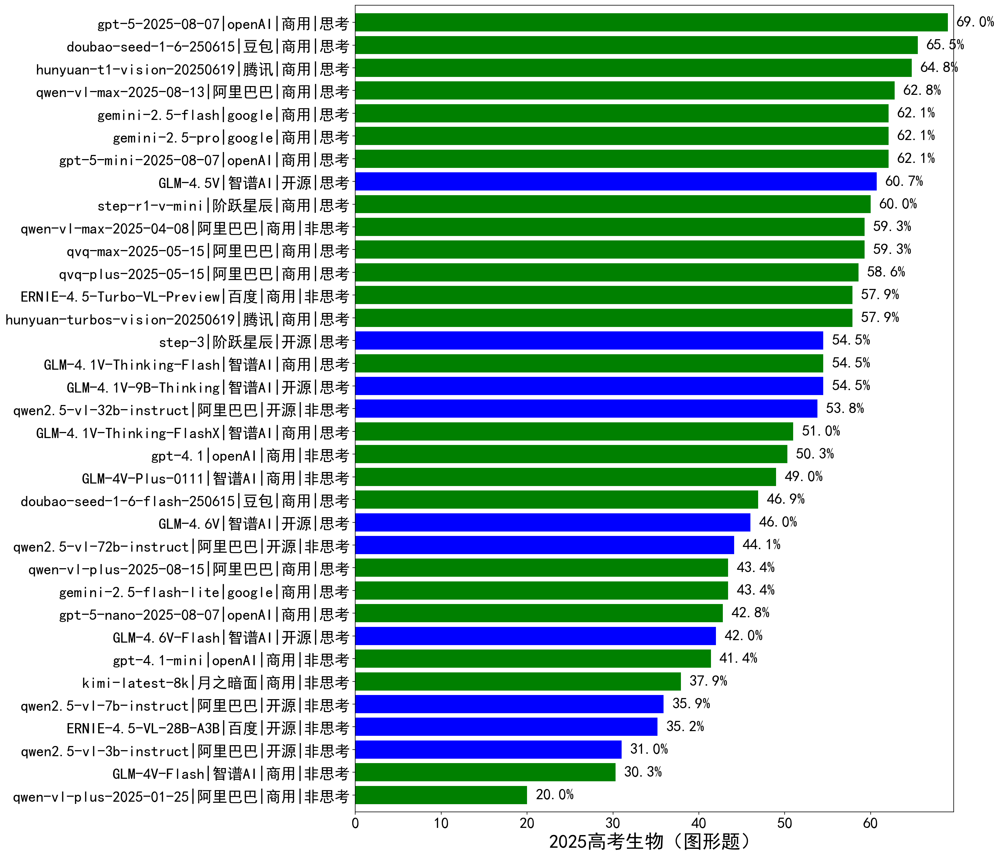

|类别|机构|大模型|【2025高考生物（图形题）】准确率|平均耗时|平均消耗token|花费/千次（元）|排名（准确率）|
|---|---|-----|-------------------|-------|-----------|-----------|-----------|
|商用|openAI|gpt-5-2025-08-07|69.0%|53s|2736|165.0|1|
|商用|豆包|doubao-seed-1-6-250615|65.5%|/|750|3.3|2|
|商用|腾讯|hunyuan-t1-vision-20250619|64.8%|88s|2314|17.1|3|
|商用|阿里巴巴|qwen-vl-max-2025-08-13|62.8%|64s|1882|6.8|4|
|商用|google|gemini-2.5-pro|62.1%|131s|4037|262.3|5|
|商用|google|gemini-2.5-flash|62.1%|116s|4581|75.4|6|
|商用|openAI|gpt-5-mini-2025-08-07|62.1%|85s|1699|20.1|7|
|开源|智谱AI|GLM-4.5V|60.7%|23s|1736|9.1|8|
|商用|阶跃星辰|step-r1-v-mini|60.0%|62s|3429|24.1|9|
|商用|阿里巴巴|qvq-max-2025-05-15|59.3%|124s|1986|55.0|10|
|商用|阿里巴巴|qwen-vl-max-2025-04-08|59.3%|100s|880|5.8|11|
|商用|阿里巴巴|qvq-plus-2025-05-15|58.6%|137s|2688|12.4|12|
|商用|腾讯|hunyuan-turbos-vision-20250619|57.9%|65s|882|4.6|13|
|商用|百度|ERNIE-4.5-Turbo-VL-Preview|57.9%|91s|2167|8.7|14|
|开源|智谱AI|GLM-4.1V-9B-Thinking|54.5%|110s|1998|1.7|15|
|商用|智谱AI|GLM-4.1V-Thinking-Flash|54.5%|84s|1279|0.0|16|
|开源|阶跃星辰|step-3|54.5%|79s|1697|5.9|17|
|开源|阿里巴巴|qwen2.5-vl-32b-instruct|53.8%|107s|1136|2.1|18|
|商用|智谱AI|GLM-4.1V-Thinking-FlashX|51.0%|72s|1317|2.6|19|
|商用|openAI|gpt-4.1|50.3%|69s|857|26.9|20|
|商用|智谱AI|GLM-4V-Plus-0111|49.0%|48s|667|2.7|21|
|商用|豆包|doubao-seed-1-6-flash-250615|46.9%|/|643|0.5|22|
|开源|阿里巴巴|qwen2.5-vl-72b-instruct|44.1%|105s|533|2.2|23|
|商用|阿里巴巴|qwen-vl-plus-2025-08-15|43.4%|9s|958|1.5|24|
|商用|google|gemini-2.5-flash-lite|43.4%|117s|3394|8.8|25|
|商用|openAI|gpt-5-nano-2025-08-07|42.8%|106s|3264|8.6|26|
|商用|openAI|gpt-4.1-mini|41.4%|77s|777|5.9|27|
|商用|月之暗面|kimi-latest-8k|37.9%|82s|1554|18.6|28|
|开源|阿里巴巴|qwen2.5-vl-7b-instruct|35.9%|86s|530|0.2|29|
|开源|百度|ERNIE-4.5-VL-28B-A3B|35.2%|7s|714|0.0|30|
|开源|阿里巴巴|qwen2.5-vl-3b-instruct|31.0%|88s|516|1.0|31|
|商用|智谱AI|GLM-4V-Flash|30.3%|5s|609|0.0|32|
|商用|阿里巴巴|qwen-vl-plus-2025-01-25|20.0%|94s|577|1.5|33|

