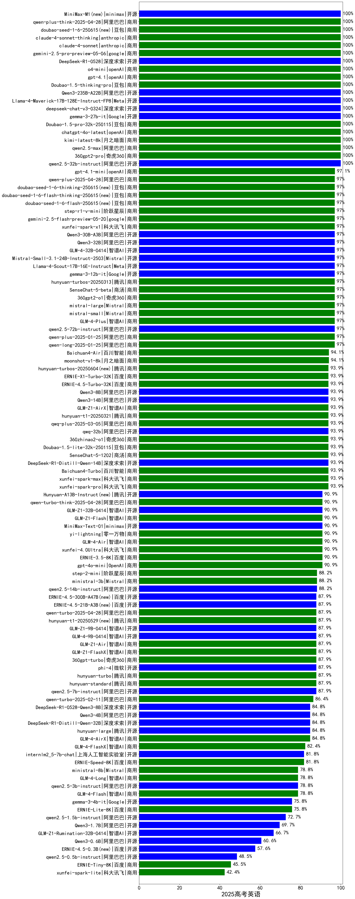

|类别|机构|大模型|【2025高考英语】准确率|平均耗时|平均消耗token|花费/千次（元）|排名（准确率）|
|---|---|-----|-------------------|-------|-----------|-----------|-----------|
|开源|阿里巴巴|qwen3-235b-a22b-thinking-2507|100.0%|28s|1668|25.2|1|
|开源|阿里巴巴|Qwen3-32B-nothink|100.0%|17s|751|1.6|2|
|商用|智谱AI|GLM-4.5-Flash-nothink|100.0%|10s|777|0.0|3|
|开源|智谱AI|GLM-4.5-nothink|100.0%|21s|1088|10.3|4|
|开源|阿里巴巴|Qwen3-30B-A3B-Thinking-2507|100.0%|33s|1577|3.5|5|
|开源|阿里巴巴|Qwen3-30B-A3B-Instruct-2507|100.0%|5s|949|1.8|6|
|开源|智谱AI|GLM-4.5|100.0%|25s|1515|16.3|7|
|开源|智谱AI|GLM-4.5-Air|100.0%|29s|1867|8.9|8|
|开源|阿里巴巴|Qwen3-14B-nothink|100.0%|13s|791|0.9|9|
|商用|openAI|gpt-5-2025-08-07|100.0%|25s|674|21.1|10|
|开源|阿里巴巴|Qwen3-8B-nothink|100.0%|14s|729|0.0|11|
|商用|科大讯飞|xunfei-spark-x1-0725|100.0%|/|1052|12.6|12|
|商用|豆包|doubao-seed-1-6-thinking-250715|100.0%|36s|1163|6.0|13|
|开源|阿里巴巴|qwen3-235b-a22b-instruct-2507|100.0%|8s|735|3.1|14|
|开源|腾讯|Hunyuan-A13B-Instruct-nothink|100.0%|79s|715|1.5|15|
|开源|月之暗面|kimi-k2-0711-preview|100.0%|14s|655|5.1|16|
|开源|openAI|gpt-oss-120b|100.0%|3s|785|1.3|17|
|商用|openAI|gpt-5-mini-2025-08-07|100.0%|35s|803|6.0|18|
|商用|XAI|grok-3-mini|100.0%|183s|1184|3.7|19|
|商用|阿里巴巴|qwen-turbo-think-2025-07-15|100.0%|/|1285|2.6|20|
|商用|豆包|doubao-seed-1-6-251015(new)|100.0%|16s|1274|6.9|21|
|开源|深度求索|DeepSeek-V3.2-Exp-Think(new)|100.0%|30s|1149|3.0|22|
|开源|深度求索|DeepSeek-V3.2-Exp(new)|100.0%|12s|645|1.5|23|
|开源|阿里巴巴|qwen3-next-80b-a3b-instruct|100.0%|6s|873|2.1|24|
|开源|豆包|Seed-OSS-36B-Instruct|100.0%|56s|1208|3.7|25|
|商用|阿里巴巴|qwen3-max-preview|100.0%|9s|775|10.4|26|
|商用|阿里巴巴|qwen-plus-think-2025-07-28|100.0%|/|1542|9.1|27|
|商用|阿里巴巴|qwen-flash-2025-07-28|100.0%|13s|946|0.8|28|
|商用|阿里巴巴|qwen-plus-2025-07-28|100.0%|8s|733|0.9|29|
|开源|Mistral|Mistral-Small-3.2-24B-Instruct-2506|100.0%|38s|599|0.6|30|
|商用|google|gemini-2.5-flash-lite|100.0%|2s|869|1.5|31|
|开源|深度求索|DeepSeek-V3.1-Think|100.0%|32s|889|7.1|32|
|开源|深度求索|DeepSeek-V3.1|100.0%|12s|619|3.9|33|
|商用|阿里巴巴|qwen-flash-think-2025-07-28|100.0%|17s|1418|1.5|34|
|商用|google|gemini-2.5-pro|100.0%|16s|1892|108.0|35|
|开源|月之暗面|Kimi-K2-Thinking(new)|100.0%|114s|2013|27.3|36|
|商用|XAI|grok-4-0709|100.0%|42s|805|49.2|37|
|商用|豆包|doubao-seed-1-6-250615|100.0%|53s|753|2.5|38|
|开源|阿里巴巴|Qwen3-8B|100.0%|69s|1538|0.0|39|
|商用|google|gemini-2.5-flash|100.0%|8s|1534|20.5|40|
|商用|openAI|o4-mini|100.0%|113s|844|16.3|41|
|开源|深度求索|DeepSeek-R1-0528|100.0%|159s|1417|17.3|42|
|开源|阿里巴巴|Qwen3-14B|100.0%|194s|1544|2.4|43|
|开源|阿里巴巴|Qwen3-32B|100.0%|194s|1476|4.5|44|
|开源|智谱AI|GLM-4-9B-0414|100.0%|151s|673|0.0|45|
|商用|百度|ERNIE-X1-Turbo-32K|100.0%|162s|1209|3.5|46|
|商用|anthropic|claude-4-sonnet|100.0%|12s|726|39.6|47|
|商用|anthropic|claude-4-sonnet-thinking|100.0%|36s|1070|76.6|48|
|开源|meta|Llama-4-Maverick-17B-128E-Instruct-FP8|100.0%|144s|762|2.0|49|
|开源|meta|Llama-4-Scout-17B-16E-Instruct|100.0%|319s|695|0.8|50|
|开源|google|gemma-3-27b-it|100.0%|147s|735|0.7|51|
|开源|minimax|MiniMax-M1|100.0%|22s|1203|3.6|52|
|开源|百度|ERNIE-4.5-21B-A3B|100.0%|55s|800|0.0|53|
|商用|百川智能|Baichuan4-Turbo|100.0%|132s|542|8.1|54|
|商用|openAI|gpt-5-nano-2025-08-07|66.7%|19s|1336|2.7|55|
|开源|google|gemma-3-12b-it|66.7%|153s|748|0.0|56|
|开源|Mistral|Magistral-Small-2507|66.7%|78s|5298|54.3|57|
|商用|360|360zhinao2-o1|66.7%|103s|1166|8.9|58|
|商用|Mistral|mistral-medium-2508|66.7%|34s|520|2.2|59|
|商用|豆包|Doubao-1.5-lite-32k-250115|66.7%|125s|667|0.3|60|
|开源|minimax|MiniMax-Text-01|66.7%|194s|1275|3.2|61|
|开源|智谱AI|GLM-4.6(new)|66.7%|48s|2859|35.5|62|
|商用|豆包|doubao-seed-1-6-lite-251015(new)|66.7%|26s|1448|2.5|63|
|开源|minimax|MiniMax-M2(new)|66.7%|17s|1458|9.5|64|
|开源|阿里巴巴|Qwen3-4B|66.7%|182s|1225|2.4|65|
|开源|openAI|gpt-oss-20b|66.7%|4s|1072|0.8|66|
|开源|阿里巴巴|Qwen3-1.7B|66.7%|178s|1504|3.3|67|
|商用|豆包|doubao-seed-1-6-flash-thinking-250615|66.7%|8s|1064|0.9|68|
|开源|腾讯|Hunyuan-A13B-Instruct|66.7%|9s|948|2.4|69|
|商用|阿里巴巴|qwen-turbo-2025-07-15|66.7%|6s|710|0.3|70|
|开源|百度|ERNIE-4.5-300B-A47B|66.7%|203s|806|3.5|71|
|开源|百度|ERNIE-4.5-0.3B|66.7%|31s|704|0.0|72|
|商用|百川智能|Baichuan4-Air|66.7%|128s|539|0.5|73|
|开源|阿里巴巴|Qwen3-4B-nothink|66.7%|12s|693|0.8|74|
|开源|阿里巴巴|Qwen3-1.7B-nothink|66.7%|9s|800|1.2|75|
|商用|豆包|doubao-seed-1-6-flash-250615|66.7%|3s|765|0.5|76|
|商用|智谱AI|GLM-4.5-Flash|66.7%|24s|1800|0.0|77|
|开源|深度求索|DeepSeek-R1-0528-Qwen3-8B|66.7%|161s|1299|0.0|78|
|开源|阶跃星辰|step-3|66.7%|63s|1625|5.4|79|
|商用|百度|ERNIE-4.5-Turbo-32K|66.7%|144s|872|1.7|80|
|开源|智谱AI|GLM-4.5-Air-nothink|66.7%|5s|822|2.6|81|
|商用|阿里巴巴|qwen-long-2025-01-25|66.7%|31s|585|0.5|82|
|开源|阿里巴巴|Qwen3-0.6B|33.3%|153s|1154|2.2|83|
|开源|阿里巴巴|Qwen3-0.6B-nothink|33.3%|7s|588|0.5|84|
|商用|百度|ERNIE-Lite-8K|33.3%|149s|632|0.0|85|
|商用|腾讯|hunyuan-t1-20250711|33.3%|10s|1630|3.2|86|
|开源|google|gemma-3-4b-it|/%|137s|698|0.0|87|
|商用|腾讯|hunyuan-turbos-20250926(new)|/%|4s|1224|1.1|88|

