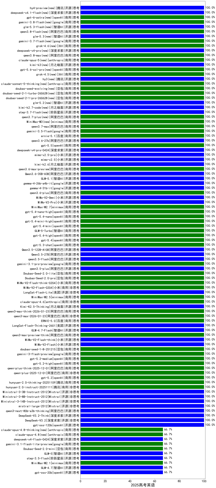

|类别|机构|大模型|【2025高考英语】准确率|平均耗时|平均消耗token|花费/千次（元）|排名（准确率）|
|---|---|-----|-------------------|-------|-----------|-----------|-----------|
|开源|openAI|gpt-oss-120b|100.0%|3s|785|1.3|1|
|商用|minimax|MiniMax-M3|100.0%|15s|877|7.5|2|
|商用|豆包|doubao-seed-evolving|100.0%|109s|5039|140.0|3|
|商用|豆包|doubao-seed-2-1-turbo-260628|100.0%|73s|3594|48.3|4|
|商用|豆包|doubao-seed-2-1-pro-260628|100.0%|84s|3674|99.1|5|
|开源|智谱AI|glm-5.2|100.0%|35s|1843|43.3|6|
|开源|月之暗面|kimi-k2.7-code|100.0%|14s|835|14.1|7|
|开源|阶跃星辰|step-3.7-flash|100.0%|16s|2118|14.4|8|
|商用|阿里巴巴|qwen3.7-plus|100.0%|18s|1299|7.8|9|
|商用|阿里巴巴|qwen3.7-max|100.0%|23s|1389|39.8|10|
|开源|阿里巴巴|Qwen3.6-35B-A3B|100.0%|171s|2448|22.6|11|
|商用|google|gemini-3.5-flash|100.0%|6s|1437|68.4|12|
|商用|百度|ernie-5.1|100.0%|18s|978|11.6|13|
|开源|阿里巴巴|qwen3.6-27b|100.0%|28s|2130|31.9|14|
|商用|openAI|gpt-5.5|100.0%|7s|566|46.9|15|
|开源|深度求索|deepseek-v4-pro-0424|100.0%|47s|1067|20.7|16|
|开源|小米|mimo-v2.5-pro|100.0%|12s|1233|16.6|17|
|开源|小米|mimo-v2.5|100.0%|12s|1783|17.6|18|
|商用|anthropic|claude-sonnet-5-thinking|100.0%|9s|774|18.6|19|
|开源|腾讯|hy3|100.0%|82s|677|1.5|20|
|商用|XAI|grok-4.5|100.0%|105s|1171|32.1|21|
|商用|openAI|gpt-5.6-sol-pro|100.0%|7s|3823|199.6|22|
|商用|openAI|gpt-6-luna(new)|100.0%|116s|560|0.8|23|
|开源|小米|mimo-v2.6-flash(new)|100.0%|40s|832|1.2|24|
|开源|腾讯|hy4-preview(new)|100.0%|53s|4263|71.6|25|
|开源|深度求索|deepseek-v4.1-flash(new)|100.0%|5s|1214|7.1|26|
|商用|openAI|gpt-6-astra(new)|100.0%|21s|554|78.8|27|
|商用|google|gemini-3.8-flash(new)|100.0%|51s|1138|42.0|28|
|开源|智谱AI|glm-5.3-flash(new)|100.0%|16s|1052|2.1|29|
|商用|阿里巴巴|qwen3.8-flash(new)|100.0%|21s|1309|2.6|30|
|开源|智谱AI|glm-5.3(new)|100.0%|33s|1327|28.8|31|
|商用|google|gemini-3.7-flash(new)|100.0%|7s|1241|23.7|32|
|商用|XAI|grok-4.6(new)|100.0%|27s|1828|59.7|33|
|开源|深度求索|deepseek-v4-pro(new)|100.0%|24s|1038|19.3|34|
|商用|阿里巴巴|qwen3.8-max(new)|100.0%|32s|1710|50.4|35|
|商用|anthropic|claude-opus-5(new)|100.0%|8s|1044|93.7|36|
|开源|月之暗面|kimi-k3(new)|100.0%|39s|860|47.0|37|
|商用|阿里巴巴|qwen3.6-max-preview|100.0%|57s|2122|95.3|38|
|开源|月之暗面|kimi-k2.6|100.0%|65s|1391|29.2|39|
|开源|智谱AI|GLM-5.1|100.0%|195s|1564|30.2|40|
|开源|美团|LongCat-Flash-Lite|100.0%|118s|531|0.0|41|
|开源|阿里巴巴|qwen3.5-flash|100.0%|194s|3268|5.8|42|
|商用|google|gemini-3.1-pro-preview|100.0%|23s|1706|115.4|43|
|开源|阿里巴巴|qwen3.5-plus|100.0%|38s|3484|15.0|44|
|商用|豆包|Doubao-Seed-2.0-lite|100.0%|242s|1432|3.8|45|
|商用|豆包|Doubao-Seed-2.0-pro|100.0%|141s|1159|12.6|46|
|商用|小米|MiMo-V2-Flash-think-0204|100.0%|200s|1710|3.0|47|
|商用|小米|MiMo-V2-Flash-0204|100.0%|92s|738|0.9|48|
|商用|minimax|MiniMax-M2.5|100.0%|16s|1342|8.5|49|
|开源|阿里巴巴|Qwen3.5-122B-A10B|100.0%|116s|3347|19.0|50|
|商用|anthropic|claude-opus-4.6|100.0%|5s|567|35.1|51|
|开源|月之暗面|Kimi-K2.5-Thinking|100.0%|226s|1693|28.6|52|
|商用|阿里巴巴|qwen3-max-think-2026-01-23|100.0%|56s|1514|12.0|53|
|商用|阿里巴巴|qwen3-max-2026-01-23|100.0%|9s|726|4.1|54|
|商用|百度|ERNIE-5.0|100.0%|110s|1186|20.9|55|
|开源|深度求索|DeepSeek-V3.2-Think|100.0%|34s|1102|2.9|56|
|开源|深度求索|DeepSeek-V3.2|100.0%|191s|501|1.1|57|
|开源|google|gemma-4-26b-a4b-it|100.0%|15s|828|1.5|58|
|开源|阿里巴巴|Qwen3.5-27B|100.0%|464s|3593|15.4|59|
|商用|openAI|gpt-5.4-nano-high|100.0%|127s|734|3.4|60|
|商用|openAI|gpt-5.4-mini-high|100.0%|131s|1104|24.0|61|
|开源|google|gemma-4-31b-it|100.0%|89s|763|1.3|62|
|商用|阿里巴巴|qwen3.6-plus|100.0%|24s|2173|21.8|63|
|开源|小米|MiMo-V2-Omni|100.0%|273s|1195|9.3|64|
|开源|小米|MiMo-V2-Pro|100.0%|479s|1976|32.2|65|
|商用|minimax|MiniMax-M2.7|100.0%|31s|1486|9.7|66|
|商用|openAI|gpt-5.3-chat|100.0%|9s|535|17.2|67|
|商用|openAI|gpt-5.4-nano|100.0%|11s|468|1.1|68|
|商用|openAI|gpt-6-sol(new)|100.0%|85s|511|12.7|69|
|商用|openAI|gpt-5.4-mini|100.0%|3s|479|4.3|70|
|商用|智谱AI|GLM-5-Turbo|100.0%|19s|1511|26.3|71|
|商用|openAI|gpt-5.4-high|100.0%|10s|728|40.5|72|
|商用|openAI|gpt-5.4|100.0%|3s|484|14.8|73|
|商用|anthropic|claude-opus-4.8|66.7%|5s|768|45.5|74|
|开源|智谱AI|GLM-5|66.7%|68s|2621|41.5|75|
|开源|阶跃星辰|step-3.5-flash|66.7%|16s|1127|1.8|76|
|商用|豆包|Doubao-Seed-2.0-mini|66.7%|86s|2463|4.1|77|
|开源|深度求索|deepseek-v4-flash-0424|66.7%|17s|820|1.2|78|
|商用|anthropic|claude-opus-4.8-thinking|66.7%|7s|872|63.6|79|
|开源|小米|mimo-v2.6-pro(new)|66.7%|35s|1515|7.8|80|
|开源|openAI|gpt-oss-20b|66.7%|4s|1072|0.8|81|
|商用|google|gemini-3.1-flash-lite-preview|66.7%|2s|671|3.4|82|

