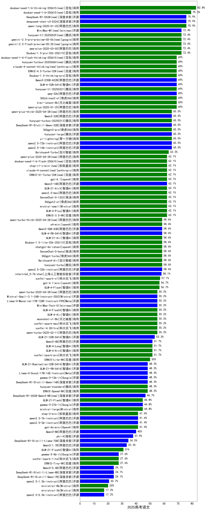

|类别|机构|大模型|【2025高考语文】准确率|平均耗时|平均消耗token|花费/千次（元）|排名（准确率）|
|---|---|-----|-------------------|-------|-----------|-----------|-----------|
|商用|豆包|doubao-seed-1-6-thinking-250715(new)|82.1%|11s|1992|9.0|1|
|商用|豆包|doubao-seed-1-6-thinking-250615|82.1%|18s|2181|10.5|2|
|开源|深度求索|deepseek-chat-v3-0324|78.6%|65s|1094|3.3|3|
|开源|月之暗面|kimi-k2-0711-preview(new)|78.6%|14s|1077|6.8|4|
|开源|深度求索|DeepSeek-R1-0528|78.6%|211s|2803|33.9|5|
|商用|豆包|doubao-seed-1-6-250615|78.6%|90s|1150|2.1|6|
|开源|阿里巴巴|Qwen3-14B-nothink|78.6%|13s|1465|1.4|7|
|商用|google|gemini-2.5-pro(new)|78.6%|30s|3526|189.7|8|
|商用|阿里巴巴|qwen-long-2025-01-25|75.9%|178s|1220|1.0|9|
|商用|腾讯|hunyuan-t1-20250711(new)|75.0%|38s|4076|10.3|10|
|开源|minimax|MiniMax-M1(new)|75.0%|94s|4461|28.7|11|
|开源|百度|ERNIE-4.5-300B-A47B(new)|75.0%|101s|1282|4.4|12|
|开源|阿里巴巴|qwen3-235b-a22b-instruct-2507(new)|75.0%|23s|1704|7.7|13|
|开源|阿里巴巴|qwen3-235b-a22b-thinking-2507(new)|75.0%|68s|3811|58.4|14|
|商用|豆包|Doubao-1.5-pro-32k-250115|72.4%|152s|1306|1.5|15|
|商用|阿里巴巴|qwq-plus-2025-03-05|72.4%|330s|5596|20.0|16|
|开源|智谱AI|GLM-4-32B-0414|71.4%|183s|1084|2.1|17|
|商用|豆包|doubao-seed-1-6-flash-thinking-250615|71.4%|9s|1550|1.0|18|
|开源|阿里巴巴|Qwen3-235B-A22B|71.4%|296s|5380|46.4|19|
|商用|anthropic|claude-4-sonnet-thinking|71.4%|26s|2752|160.7|20|
|商用|google|gemini-2.5-flash(new)|71.4%|12s|3183|41.1|21|
|商用|腾讯|hunyuan-turbos-20250604|71.4%|161s|1718|2.2|22|
|商用|XAI|grok-4-0709(new)|71.4%|87s|2384|174.6|23|
|商用|月之暗面|kimi-latest-8k|69.0%|184s|1468|17.6|24|
|开源|阿里巴巴|qwq-32b|69.0%|229s|4035|20.2|25|
|商用|奇虎360|360zhinao2-o1|69.0%|193s|3233|22.5|26|
|商用|科大讯飞|xunfei-spark-x1-0725(new)|68.0%|/|1524|18.3|27|
|商用|XAI|grok-3-mini(new)|67.9%|178s|2389|7.2|28|
|开源|华为|pangu-pro-moe(new)|67.9%|73s|2248|6.2|29|
|开源|阿里巴巴|Qwen3-30B-A3B-Instruct-2507(new)|67.9%|8s|1797|3.2|30|
|商用|智谱AI|GLM-4.5-Flash(new)|67.9%|26s|2343|0.0|31|
|商用|百度|ERNIE-4.5-Turbo-32K|67.9%|165s|1188|1.7|32|
|商用|阿里巴巴|qwen-plus-think-2025-04-28|67.9%|238s|2393|12.0|33|
|开源|智谱AI|GLM-4.5(new)|67.9%|29s|2243|21.0|34|
|商用|奇虎360|360gpt2-pro|65.5%|109s|1808|4.1|35|
|开源|阿里巴巴|qwen2.5-72b-instruct|65.5%|206s|1173|6.1|36|
|开源|腾讯|hunyuan-large|65.5%|187s|2831|13.0|37|
|开源|深度求索|DeepSeek-R1-Distill-Qwen-32B|65.5%|74s|2142|2.7|38|
|商用|零一万物|yi-lightning|65.5%|141s|1322|1.3|39|
|开源|阿里巴巴|qwen2.5-14b-instruct|65.5%|189s|1154|1.4|40|
|开源|阿里巴巴|Qwen3-14B|64.3%|250s|5040|8.6|41|
|商用|阶跃星辰|step-r1-v-mini|64.3%|199s|2840|17.6|42|
|商用|百度|ERNIE-X1-Turbo-32K|64.3%|227s|2134|5.9|43|
|商用|openAI|gpt-4.1|64.3%|137s|1462|35.9|44|
|开源|阿里巴巴|Qwen3-32B|64.3%|217s|2616|7.5|45|
|商用|智谱AI|GLM-Z1-AirX|64.3%|131s|4413|22.1|46|
|商用|阿里巴巴|qwen-plus-2025-07-14(new)|64.3%|16s|1658|2.1|47|
|商用|豆包|doubao-seed-1-6-flash-250615|64.3%|3s|1221|0.5|48|
|商用|阿里巴巴|qwen-plus-2025-04-28|64.3%|196s|1495|1.8|49|
|商用|anthropic|claude-4-sonnet|64.3%|16s|2141|94.2|50|
|商用|百川智能|Baichuan4-Turbo|63.3%|168s|1096|16.5|51|
|商用|阿里巴巴|qwen2.5-max|62.1%|155s|1320|5.5|52|
|商用|Mistral|mistral-small|62.1%|159s|1610|1.7|53|
|商用|智谱AI|GLM-4-Plus|62.1%|98s|1172|5.9|54|
|商用|奇虎360|360gpt2-o1|62.1%|140s|2744|88.1|55|
|商用|百度|ERNIE-3.5-8K|62.1%|171s|1204|1.3|56|
|商用|商汤|SenseChat-5-1202|62.1%|113s|1158|11.3|57|
|开源|阿里巴巴|Qwen3-30B-A3B-nothink|60.7%|16s|1455|2.0|58|
|开源|阿里巴巴|Qwen3-30B-A3B|60.7%|242s|4036|8.9|59|
|开源|阿里巴巴|Qwen3-235B-A22B-nothink|60.7%|25s|1549|8.0|60|
|开源|阿里巴巴|Qwen3-32B-nothink|60.7%|42s|1477|2.9|61|
|商用|智谱AI|GLM-Z1-Air|60.7%|206s|2304|1.2|62|
|开源|智谱AI|GLM-4-9B-0414|60.7%|158s|1285|0.0|63|
|商用|openAI|o4-mini|60.7%|149s|2748|60.8|64|
|商用|阿里巴巴|qwen-turbo-think-2025-04-28|60.7%|85s|3124|6.7|65|
|商用|科大讯飞|xunfei-spark-x1|59.3%|175s|2439|29.3|66|
|商用|商汤|SenseChat-5-beta|58.6%|137s|1176|11.7|67|
|商用|奇虎360|360gpt-turbo|58.6%|85s|1553|1.7|68|
|开源|阿里巴巴|qwen2.5-32b-instruct|58.6%|199s|1200|3.2|69|
|商用|百川智能|Baichuan4-Air|58.6%|157s|1120|1.1|70|
|商用|豆包|Doubao-1.5-lite-32k-250115|58.6%|173s|1194|0.4|71|
|商用|openAI|chatgpt-4o-latest|58.6%|121s|1423|42.0|72|
|开源|上海人工智能实验室|internlm2_5-7b-chat|58.1%|166s|1181|0.0|73|
|开源|Mistral|Mistral-Small-3.1-24B-Instruct-2503|57.1%|154s|1582|1.6|74|
|开源|meta|Llama-4-Maverick-17B-128E-Instruct-FP8|57.1%|172s|1543|3.8|75|
|商用|openAI|gpt-4.1-mini|57.1%|126s|1549|8.2|76|
|开源|智谱AI|GLM-Z1-32B-0414|57.1%|207s|2954|9.4|77|
|商用|阿里巴巴|qwen-turbo-2025-07-15(new)|57.1%|11s|1502|0.6|78|
|开源|阿里巴巴|Qwen3-8B-nothink|57.1%|23s|1397|0.0|79|
|商用|阿里巴巴|qwen-turbo-2025-04-28|57.1%|6s|1458|0.6|80|
|开源|智谱AI|GLM-4.5-Air(new)|57.1%|25s|2320|9.0|81|
|商用|智谱AI|GLM-4-Flash|56.7%|175s|1072|0.0|82|
|商用|科大讯飞|xunfei-4.0Ultra|55.2%|/|/|/|83|
|开源|minimax|MiniMax-Text-01|55.2%|134s|1685|3.6|84|
|商用|智谱AI|GLM-4-FlashX|55.2%|168s|1094|0.1|85|
|商用|科大讯飞|xunfei-spark-max|55.2%|57s|1171|35.1|86|
|商用|智谱AI|GLM-4-Air|55.2%|112s|1091|0.5|87|
|开源|腾讯|Hunyuan-A13B-Instruct-nothink(new)|53.6%|14s|1439|2.9|88|
|开源|阿里巴巴|Qwen3-8B|53.6%|114s|3264|0.0|89|
|开源|腾讯|Hunyuan-A13B-Instruct(new)|53.6%|85s|2861|8.6|90|
|开源|阿里巴巴|Qwen3-4B|53.6%|196s|2591|5.1|91|
|商用|科大讯飞|xunfei-spark-pro|51.7%|58s|1040|7.3|92|
|商用|智谱AI|GLM-4-Long|51.7%|139s|1083|1.1|93|
|商用|智谱AI|GLM-4-AirX|51.7%|103s|1084|10.8|94|
|开源|meta|Llama-4-Scout-17B-16E-Instruct|50.0%|159s|1428|1.6|95|
|商用|百度|ERNIE-Lite-8K|50.0%|167s|1138|0.0|96|
|开源|百度|ERNIE-4.5-21B-A3B(new)|50.0%|59s|1333|0.0|97|
|商用|google|gemini-2.5-flash-lite-preview-06-17(new)|50.0%|7s|2278|4.3|98|
|开源|深度求索|DeepSeek-R1-0528-Qwen3-8B|50.0%|151s|1674|0.0|99|
|开源|智谱AI|GLM-Z1-Rumination-32B-0414|50.0%|208s|2993|7.7|100|
|开源|智谱AI|GLM-Z1-9B-0414|50.0%|182s|4026|0.0|101|
|商用|百度|ERNIE-Speed-8K|48.3%|160s|1016|0.0|102|
|商用|腾讯|hunyuan-standard|48.3%|154s|1105|1.1|103|
|开源|深度求索|DeepSeek-R1-Distill-Qwen-14B|48.3%|63s|1948|1.4|104|
|开源|Google|gemma-3-12b-it|48.3%|185s|1281|0.0|105|
|商用|智谱AI|GLM-Z1-Flash|46.4%|169s|2419|0.0|106|
|开源|阿里巴巴|Qwen3-1.7B-nothink|46.4%|11s|1463|1.7|107|
|商用|Mistral|mistral-large|44.8%|155s|1960|40.6|108|
|开源|Google|gemma-3-27b-it|44.8%|167s|1268|1.1|109|
|开源|阿里巴巴|Qwen3-4B-nothink|42.9%|17s|1416|1.6|110|
|商用|OpenAI|gpt-4o-mini|41.4%|121s|1287|1.9|111|
|商用|阶跃星辰|step-2-mini|41.4%|83s|1133|1.3|112|
|开源|阿里巴巴|qwen2.5-3b-instruct|41.4%|191s|1238|0.5|113|
|开源|阿里巴巴|qwen2.5-7b-instruct|41.4%|185s|1191|0.7|114|
|开源|阿里巴巴|Qwen3-0.6B-nothink|39.3%|6s|1136|0.7|115|
|开源|微软|phi-4|37.9%|161s|1902|1.1|116|
|开源|阿里巴巴|Qwen3-1.7B|35.7%|209s|3166|7.0|117|
|商用|智谱AI|GLM-Z1-FlashX|28.6%|141s|7251|0.7|118|
|商用|百度|ERNIE-Tiny-8K|27.6%|149s|1114|0.0|119|
|开源|Google|gemma-3-4b-it|27.6%|171s|1293|0.0|120|
|商用|科大讯飞|xunfei-spark-lite|27.6%|62s|946|0.0|121|
|开源|阿里巴巴|Qwen3-0.6B|25.0%|178s|2156|3.8|122|
|开源|阿里巴巴|qwen2.5-1.5b-instruct|20.7%|185s|1139|0.0|123|
|商用|Mistral|ministral-8b|20.0%|151s|1960|1.4|124|
|开源|百度|ERNIE-4.5-0.3B(new)|17.9%|24s|1171|0.0|125|
|开源|阿里巴巴|qwen2.5-0.5b-instruct|17.2%|210s|1210|0.0|126|
|商用|Mistral|ministral-3b|17.2%|149s|1649|0.5|127|
|商用|商汤|SenseChat-Turbo-1202|/%|/|/|/|128|

