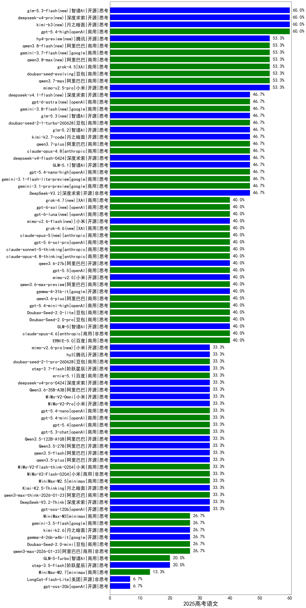

|类别|机构|大模型|【2025高考语文】准确率|平均耗时|平均消耗token|花费/千次（元）|排名（准确率）|
|---|---|-----|-------------------|-------|-----------|-----------|-----------|
|开源|月之暗面|kimi-k3(new)|60.0%|90s|2339|166.2|1|
|开源|智谱AI|glm-5.3-flash(new)|60.0%|311s|8918|23.3|2|
|开源|深度求索|deepseek-v4-pro(new)|60.0%|219s|3972|91.3|3|
|商用|openAI|gpt-5.4-high|60.0%|27s|2630|189.4|4|
|商用|google|gemini-3.7-flash(new)|53.3%|6s|1693|25.1|5|
|开源|小米|mimo-v2.5-pro|53.3%|57s|3112|49.7|6|
|商用|豆包|doubao-seed-evolving(new)|53.3%|283s|10269|285.8|7|
|商用|openAI|gpt-5.2-medium|53.3%|17s|1544|67.1|8|
|商用|阿里巴巴|qwen3.8-max(new)|53.3%|55s|3241|96.2|9|
|商用|XAI|grok-4.5(new)|53.3%|98s|6513|242.9|10|
|商用|阿里巴巴|qwen3.8-flash(new)|53.3%|69s|2345|4.7|11|
|开源|阿里巴巴|qwen3-next-80b-a3b-thinking|53.3%|224s|4301|14.6|12|
|商用|阿里巴巴|qwen3.7-max|53.3%|29s|2519|71.1|13|
|开源|月之暗面|kimi-k2.7-code(new)|46.7%|106s|4665|110.2|14|
|商用|google|gemini-3.1-pro-preview|46.7%|42s|3042|193.8|15|
|商用|豆包|doubao-seed-2-1-turbo-260628(new)|46.7%|174s|9644|133.9|16|
|商用|google|gemini-3.1-flash-lite-preview|46.7%|2s|1235|4.9|17|
|开源|深度求索|deepseek-v4-flash-0424|46.7%|41s|1407|2.0|18|
|商用|阿里巴巴|qwen3.7-plus(new)|46.7%|38s|2605|15.9|19|
|开源|智谱AI|glm-5.2(new)|46.7%|99s|3820|90.2|20|
|商用|openAI|gpt-6-astra(new)|46.7%|12s|1192|139.4|21|
|开源|小米|MiMo-V2-Flash-think|46.7%|29s|3145|0.0|22|
|商用|google|gemini-3-flash-preview|46.7%|143s|3244|52.8|23|
|商用|openAI|gpt-5.4-nano-high|46.7%|86s|2306|12.9|24|
|开源|智谱AI|glm-5.3(new)|46.7%|-87s|4472|108.4|25|
|开源|智谱AI|GLM-5.1|46.7%|359s|3156|60.7|26|
|商用|google|gemini-3.8-flash(new)|46.7%|38s|1794|55.5|27|
|开源|深度求索|DeepSeek-V3.2|46.7%|89s|1039|2.3|28|
|商用|anthropic|claude-opus-4.8(new)|46.7%|9s|1704|114.2|29|
|商用|豆包|Doubao-Seed-2.0-pro|40.0%|277s|2019|20.8|30|
|开源|小米|mimo-v2.5|40.0%|48s|2853|27.4|31|
|商用|阿里巴巴|qwen3.6-max-preview|40.0%|92s|3636|159.7|32|
|商用|openAI|gpt-5.4-mini-high|40.0%|48s|2833|63.2|33|
|商用|openAI|gpt-5.5|40.0%|11s|1602|162.9|34|
|开源|阿里巴巴|qwen3.6-27b|40.0%|49s|3690|54.2|35|
|商用|豆包|Doubao-Seed-2.0-lite|40.0%|280s|2081|4.8|36|
|开源|google|gemma-4-31b-it|40.0%|81s|1315|2.0|37|
|开源|Mistral|mistral-large-2512|40.0%|15s|1508|8.1|38|
|开源|智谱AI|GLM-5|40.0%|196s|4523|69.7|39|
|商用|anthropic|claude-opus-4.6|40.0%|17s|1899|148.8|40|
|商用|阿里巴巴|qwen3.6-plus|40.0%|52s|3535|34.0|41|
|商用|XAI|grok-4.6(new)|40.0%|128s|4240|147.4|42|
|商用|百度|ERNIE-5.0|40.0%|131s|1833|29.9|43|
|商用|anthropic|claude-sonnet-5-thinking(new)|40.0%|20s|2333|89.8|44|
|商用|anthropic|claude-opus-4.8-thinking(new)|40.0%|16s|2290|216.8|45|
|商用|openAI|gpt-5.6-sol-pro(new)|40.0%|24s|8140|543.7|46|
|商用|豆包|doubao-seed-1-8-251215|40.0%|34s|1692|7.1|47|
|商用|openAI|gpt-5.2-high|40.0%|20s|1941|106.6|48|
|商用|anthropic|claude-opus-5(new)|40.0%|16s|2016|168.9|49|
|开源|阶跃星辰|step-3.7-flash(new)|33.3%|79s|7965|59.0|50|
|开源|阿里巴巴|Qwen3.6-35B-A3B|33.3%|159s|3595|31.5|51|
|开源|腾讯|hy3(new)|33.3%|67s|1177|2.3|52|
|开源|深度求索|deepseek-v4-pro-0424|33.3%|31s|1289|21.2|53|
|商用|百度|ernie-5.1|33.3%|32s|2018|23.8|54|
|商用|豆包|doubao-seed-2-1-pro-260628(new)|33.3%|398s|9970|277.6|55|
|开源|openAI|gpt-oss-120b|33.3%|57s|2225|4.1|56|
|开源|小米|MiMo-V2-Omni|33.3%|373s|2571|23.5|57|
|开源|阿里巴巴|qwen3.5-plus|33.3%|66s|5880|25.0|58|
|开源|深度求索|DeepSeek-V3.2-Think|33.3%|34s|1733|4.4|59|
|商用|腾讯|hunyuan-2.0-thinking-20251109|33.3%|41s|1732|4.6|60|
|商用|openAI|gpt-5.2|33.3%|10s|1236|36.6|61|
|商用|阿里巴巴|qwen-plus-think-2025-12-01|33.3%|63s|3686|23.2|62|
|开源|小米|MiMo-V2-Flash|33.3%|168s|1498|0.0|63|
|开源|智谱AI|GLM-4.7|33.3%|141s|4428|52.8|64|
|商用|阿里巴巴|qwen3-max-think-2026-01-23|33.3%|129s|5187|45.3|65|
|开源|月之暗面|Kimi-K2.5-Thinking|33.3%|545s|3438|59.1|66|
|开源|小米|MiMo-V2-Pro|33.3%|27s|2696|41.0|67|
|商用|小米|MiMo-V2-Flash-0204|33.3%|462s|1558|2.0|68|
|商用|小米|MiMo-V2-Flash-think-0204|33.3%|457s|4002|7.2|69|
|商用|minimax|MiniMax-M2.5|33.3%|42s|2777|18.3|70|
|开源|阿里巴巴|qwen3.5-flash|33.3%|730s|5937|10.4|71|
|开源|阿里巴巴|Qwen3.5-27B|33.3%|196s|5275|21.9|72|
|开源|阿里巴巴|Qwen3.5-122B-A10B|33.3%|684s|5310|29.4|73|
|商用|openAI|gpt-5.3-chat|33.3%|84s|1320|44.3|74|
|商用|openAI|gpt-5.4|33.3%|5s|1225|41.8|75|
|商用|openAI|gpt-5.4-nano|33.3%|41s|1246|3.6|76|
|商用|openAI|gpt-5.4-mini|33.3%|4s|1209|12.0|77|
|商用|google|gemini-3.5-flash|26.7%|19s|2888|133.6|78|
|开源|月之暗面|kimi-k2.6|26.7%|248s|3213|71.0|79|
|开源|google|gemma-4-26b-a4b-it|26.7%|51s|1436|2.3|80|
|开源|Mistral|Ministral-3-14B-Instruct-2512|26.7%|41s|5895|8.4|81|
|开源|Mistral|Ministral-3-8B-Instruct-2512|26.7%|42s|5955|6.4|82|
|商用|腾讯|hunyuan-2.0-instruct-20251111|26.7%|25s|1137|1.3|83|
|商用|阿里巴巴|qwen3-max-preview-think|26.7%|94s|3921|78.3|84|
|商用|豆包|Doubao-Seed-2.0-mini|26.7%|428s|2942|4.3|85|
|商用|阿里巴巴|qwen3-max-2026-01-23|26.7%|196s|1401|7.4|86|
|商用|minimax|MiniMax-M3(new)|26.7%|46s|1923|21.1|87|
|开源|智谱AI|GLM-4.7-Flash|20.0%|1911s|6237|0.0|88|
|商用|阿里巴巴|qwen-plus-2025-12-01|20.0%|31s|1977|2.9|89|
|开源|美团|LongCat-Flash-Thinking-2601|20.0%|91s|3369|0.0|90|
|开源|阶跃星辰|step-3.5-flash|20.0%|33s|2646|4.4|91|
|商用|智谱AI|GLM-5-Turbo|20.0%|31s|2971|51.2|92|
|商用|minimax|MiniMax-M2.1|13.3%|199s|5524|41.4|93|
|商用|minimax|MiniMax-M2.7|13.3%|84s|4193|30.5|94|
|开源|Mistral|Ministral-3-3B-Instruct-2512|13.3%|33s|5865|4.2|95|
|开源|openAI|gpt-oss-20b|6.7%|26s|3480|3.0|96|
|开源|美团|LongCat-Flash-Lite|6.7%|334s|1290|0.0|97|

