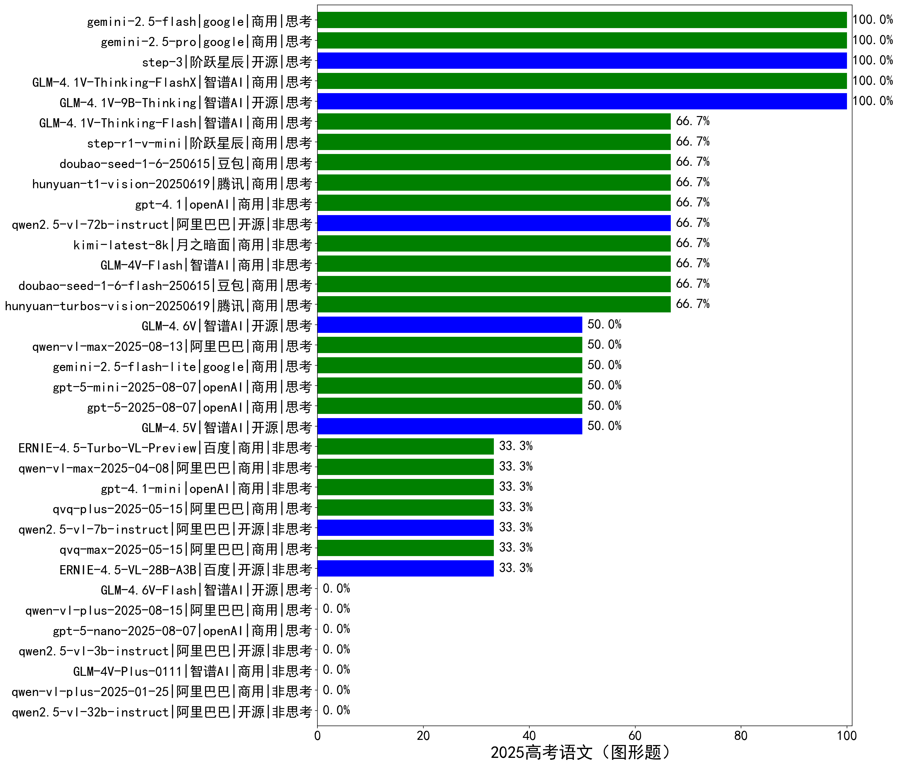

|类别|机构|大模型|【2025高考语文（图形题）】准确率|平均耗时|平均消耗token|花费/千次（元）|排名（准确率）|
|---|---|-----|-------------------|-------|-----------|-----------|-----------|
|开源|智谱AI|GLM-4.1V-9B-Thinking|100.0%|166s|2117|1.9|1|
|商用|google|gemini-2.5-flash|100.0%|138s|2558|38.1|2|
|商用|google|gemini-2.5-pro|100.0%|124s|3306|206.9|3|
|开源|阶跃星辰|step-3|100.0%|85s|1870|6.5|4|
|商用|智谱AI|GLM-4.1V-Thinking-FlashX|100.0%|101s|1609|3.2|5|
|商用|腾讯|hunyuan-turbos-vision-20250619|66.7%|109s|655|2.7|6|
|商用|豆包|doubao-seed-1-6-flash-250615|66.7%|/|469|0.3|7|
|商用|月之暗面|kimi-latest-8k|66.7%|214s|1419|17.0|8|
|商用|智谱AI|GLM-4V-Flash|66.7%|3s|469|0.0|9|
|商用|豆包|doubao-seed-1-6-250615|66.7%|/|512|1.9|10|
|商用|阶跃星辰|step-r1-v-mini|66.7%|159s|2325|15.7|11|
|商用|腾讯|hunyuan-t1-vision-20250619|66.7%|24s|1261|7.8|12|
|商用|智谱AI|GLM-4.1V-Thinking-Flash|66.7%|121s|1655|0.0|13|
|开源|阿里巴巴|qwen2.5-vl-72b-instruct|66.7%|134s|381|1.6|14|
|商用|openAI|gpt-4.1|66.7%|9s|703|19.3|15|
|商用|openAI|gpt-5-2025-08-07|50.0%|396s|2848|173.9|16|
|商用|openAI|gpt-5-mini-2025-08-07|50.0%|75s|1456|17.2|17|
|商用|阿里巴巴|qwen-vl-max-2025-08-13|50.0%|8s|469|1.2|18|
|商用|google|gemini-2.5-flash-lite|50.0%|166s|804|1.2|19|
|开源|智谱AI|GLM-4.5V|50.0%|9s|968|4.7|20|
|商用|阿里巴巴|qvq-plus-2025-05-15|33.3%|184s|1549|6.9|21|
|商用|阿里巴巴|qvq-max-2025-05-15|33.3%|171s|967|24.1|22|
|开源|百度|ERNIE-4.5-VL-28B-A3B|33.3%|4s|582|0.0|23|
|开源|阿里巴巴|qwen2.5-vl-7b-instruct|33.3%|125s|2352|0.8|24|
|商用|openAI|gpt-4.1-mini|33.3%|131s|421|2.2|25|
|商用|阿里巴巴|qwen-vl-max-2025-04-08|33.3%|72s|723|4.8|26|
|商用|百度|ERNIE-4.5-Turbo-VL-Preview|33.3%|6s|1631|5.6|27|
|商用|阿里巴巴|qwen-vl-plus-2025-01-25|/%|215s|457|1.2|28|
|开源|阿里巴巴|qwen2.5-vl-32b-instruct|/%|172s|962|1.8|29|
|开源|阿里巴巴|qwen2.5-vl-3b-instruct|/%|169s|499|1.1|30|
|商用|智谱AI|GLM-4V-Plus-0111|/%|173s|492|2.0|31|
|商用|openAI|gpt-5-nano-2025-08-07|/%|71s|2580|6.7|32|
|商用|阿里巴巴|qwen-vl-plus-2025-08-15|/%|10s|794|1.3|33|

