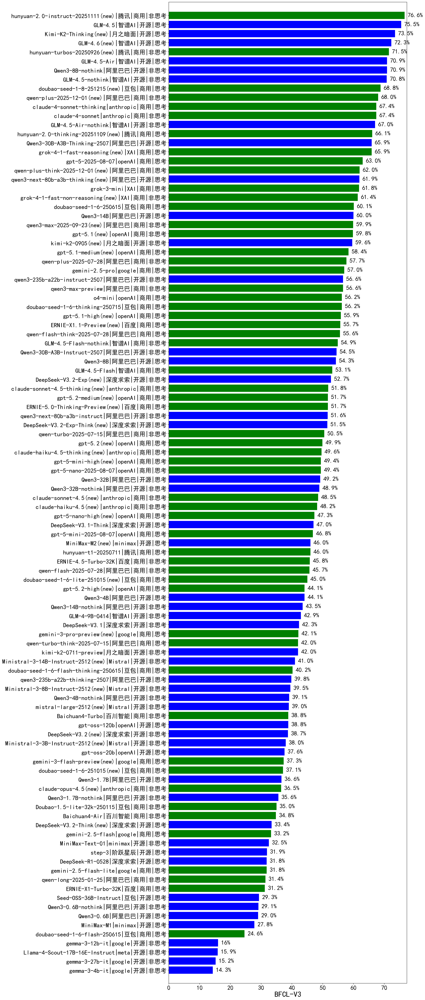

|类别|机构|大模型|【BFCL-V3】准确率|平均耗时|平均消耗token|花费/千次（元）|排名（准确率）|
|---|---|-----|-------------------|-------|-----------|-----------|-----------|
|商用|阿里巴巴|qwen-long-2025-01-25|/%|/|/|/|1|
|商用|百度|ERNIE-Speed-8K|/%|/|/|/|2|
|商用|百川智能|Baichuan4-Air|/%|/|/|/|3|
|商用|百川智能|Baichuan4-Turbo|/%|/|/|/|4|
|商用|Mistral|ministral-3b|/%|/|/|/|5|
|商用|Mistral|ministral-8b|/%|/|/|/|6|
|开源|深度求索|DeepSeek-R1-Distill-Qwen-14B|/%|/|/|/|7|
|开源|深度求索|DeepSeek-R1-Distill-Qwen-32B|/%|/|/|/|8|
|开源|minimax|MiniMax-Text-01|/%|/|/|/|9|
|商用|百度|ERNIE-Lite-8K|/%|/|/|/|10|
|商用|月之暗面|kimi-latest-8k|/%|/|/|/|11|
|商用|豆包|Doubao-1.5-pro-32k-250115|/%|/|/|/|12|
|商用|豆包|Doubao-1.5-lite-32k-250115|/%|/|/|/|13|
|商用|360|360zhinao2-o1|/%|/|/|/|14|
|商用|阶跃星辰|step-2-mini|/%|/|/|/|15|
|商用|科大讯飞|xunfei-spark-lite|/%|/|/|/|16|
|开源|google|gemma-3-27b-it|/%|/|/|/|17|
|开源|google|gemma-3-4b-it|/%|/|/|/|18|
|开源|google|gemma-3-12b-it|/%|/|/|/|19|
|开源|深度求索|deepseek-chat-v3-0324|/%|/|/|/|20|
|开源|meta|Llama-4-Scout-17B-16E-Instruct|/%|/|/|/|21|
|开源|meta|Llama-4-Maverick-17B-128E-Instruct-FP8|/%|/|/|/|22|
|开源|智谱AI|GLM-4-9B-0414|/%|/|/|/|23|
|开源|智谱AI|GLM-Z1-9B-0414|/%|/|/|/|24|
|开源|智谱AI|GLM-4-32B-0414|/%|/|/|/|25|
|开源|智谱AI|GLM-Z1-32B-0414|/%|/|/|/|26|
|开源|阿里巴巴|Qwen3-32B|/%|/|/|/|27|
|开源|阿里巴巴|Qwen3-14B|/%|/|/|/|28|
|开源|阿里巴巴|Qwen3-8B|/%|/|/|/|29|
|开源|阿里巴巴|Qwen3-4B|/%|/|/|/|30|
|开源|阿里巴巴|Qwen3-1.7B|/%|/|/|/|31|
|开源|阿里巴巴|Qwen3-0.6B|/%|/|/|/|32|
|商用|openAI|o4-mini|/%|/|/|/|33|
|开源|深度求索|DeepSeek-R1-0528|/%|/|/|/|34|
|商用|百度|ERNIE-4.5-Turbo-32K|/%|/|/|/|35|
|商用|百度|ERNIE-X1-Turbo-32K|/%|/|/|/|36|
|开源|深度求索|DeepSeek-R1-0528-Qwen3-8B|/%|/|/|/|37|
|商用|anthropic|claude-4-sonnet|/%|/|/|/|38|
|商用|anthropic|claude-4-sonnet-thinking|/%|/|/|/|39|
|商用|豆包|doubao-seed-1-6-flash-250615|/%|/|/|/|40|
|商用|豆包|doubao-seed-1-6-flash-thinking-250615|/%|/|/|/|41|
|商用|豆包|doubao-seed-1-6-250615|/%|/|/|/|42|
|开源|minimax|MiniMax-M1|/%|/|/|/|43|
|开源|百度|ERNIE-4.5-0.3B|/%|/|/|/|44|
|开源|百度|ERNIE-4.5-21B-A3B|/%|/|/|/|45|
|开源|百度|ERNIE-4.5-300B-A47B|/%|/|/|/|46|
|开源|腾讯|Hunyuan-A13B-Instruct|/%|/|/|/|47|
|商用|google|gemini-2.5-flash|/%|/|/|/|48|
|商用|XAI|grok-4-0709|/%|/|/|/|49|
|商用|XAI|grok-3-mini|/%|/|/|/|50|
|商用|google|gemini-2.5-pro|/%|/|/|/|51|
|开源|月之暗面|kimi-k2-0711-preview|/%|/|/|/|52|
|商用|腾讯|hunyuan-t1-20250711|/%|/|/|/|53|
|开源|华为|pangu-pro-moe|/%|/|/|/|54|
|商用|阿里巴巴|qwen-turbo-2025-07-15|/%|/|/|/|55|
|开源|腾讯|Hunyuan-A13B-Instruct-nothink|/%|/|/|/|56|
|开源|阿里巴巴|qwen3-235b-a22b-instruct-2507|/%|/|/|/|57|
|商用|豆包|doubao-seed-1-6-thinking-250715|/%|/|/|/|58|
|开源|阿里巴巴|qwen3-235b-a22b-thinking-2507|/%|/|/|/|59|
|商用|科大讯飞|xunfei-spark-x1-0725|/%|/|/|/|60|
|开源|阿里巴巴|Qwen3-0.6B-nothink|/%|/|/|/|61|
|开源|阿里巴巴|Qwen3-1.7B-nothink|/%|/|/|/|62|
|开源|阿里巴巴|Qwen3-4B-nothink|/%|/|/|/|63|
|开源|阿里巴巴|Qwen3-8B-nothink|/%|/|/|/|64|
|开源|阿里巴巴|Qwen3-14B-nothink|/%|/|/|/|65|
|开源|阿里巴巴|Qwen3-32B-nothink|/%|/|/|/|66|
|商用|智谱AI|GLM-4.5-Flash|/%|/|/|/|67|
|开源|智谱AI|GLM-4.5-Air|/%|/|/|/|68|
|开源|智谱AI|GLM-4.5|/%|/|/|/|69|
|开源|阿里巴巴|Qwen3-30B-A3B-Instruct-2507|/%|/|/|/|70|
|开源|阿里巴巴|Qwen3-30B-A3B-Thinking-2507|/%|/|/|/|71|
|开源|阶跃星辰|step-3|/%|/|/|/|72|
|开源|智谱AI|GLM-4.5-nothink|/%|/|/|/|73|
|开源|智谱AI|GLM-4.5-Air-nothink|/%|/|/|/|74|
|商用|智谱AI|GLM-4.5-Flash-nothink|/%|/|/|/|75|
|开源|openAI|gpt-oss-120b(new)|/%|/|/|/|76|
|开源|openAI|gpt-oss-20b(new)|/%|/|/|/|77|
|商用|openAI|gpt-5-2025-08-07(new)|/%|/|/|/|78|
|商用|openAI|gpt-5-mini-2025-08-07(new)|/%|/|/|/|79|
|商用|openAI|gpt-5-nano-2025-08-07(new)|/%|/|/|/|80|
|商用|腾讯|hunyuan-turbos-20250716|/%|/|/|/|81|
|商用|阿里巴巴|qwen-flash-2025-07-28|/%|/|/|/|82|
|商用|阿里巴巴|qwen-flash-think-2025-07-28|/%|/|/|/|83|
|开源|深度求索|DeepSeek-V3.1|/%|/|/|/|84|
|开源|深度求索|DeepSeek-V3.1-Think|/%|/|/|/|85|
|商用|google|gemini-2.5-flash-lite|/%|/|/|/|86|
|商用|Mistral|mistral-medium-2508(new)|/%|/|/|/|87|
|开源|Mistral|Magistral-Small-2507|/%|/|/|/|88|
|开源|Mistral|Mistral-Small-3.2-24B-Instruct-2506|/%|/|/|/|89|
|商用|阿里巴巴|qwen-plus-2025-07-28|/%|/|/|/|90|
|商用|阿里巴巴|qwen-plus-think-2025-07-28|/%|/|/|/|91|
|商用|阿里巴巴|qwen-turbo-think-2025-07-15|/%|/|/|/|92|
|商用|阿里巴巴|qwen3-max-preview(new)|/%|/|/|/|93|
|开源|豆包|Seed-OSS-36B-Instruct(new)|/%|/|/|/|94|
|开源|阿里巴巴|qwen3-next-80b-a3b-instruct(new)|/%|/|/|/|95|
|开源|深度求索|DeepSeek-V3.2-Exp(new)|/%|/|/|/|96|
|开源|深度求索|DeepSeek-V3.2-Exp-Think(new)|/%|/|/|/|97|
|商用|腾讯|hunyuan-turbos-20250926(new)|/%|/|/|/|98|
|开源|智谱AI|GLM-4.6(new)|/%|/|/|/|99|

