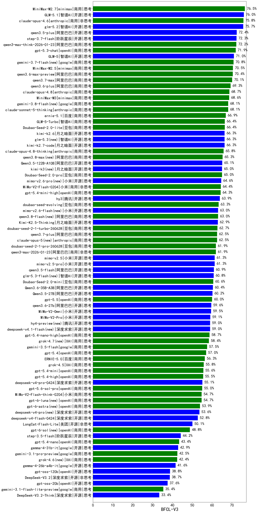

|类别|机构|大模型|【BFCL-V3】准确率|平均耗时|平均消耗token|花费/千次（元）|排名（准确率）|
|---|---|-----|-------------------|-------|-----------|-----------|-----------|
|商用|minimax|MiniMax-M2.7|76.5%|/|/|/|1|
|开源|智谱AI|GLM-5.1|76.0%|/|/|/|2|
|商用|anthropic|claude-opus-4.6|75.8%|/|/|/|3|
|开源|智谱AI|glm-5.2|75.7%|/|/|/|4|
|开源|阿里巴巴|qwen3.5-plus|72.4%|/|/|/|5|
|开源|阶跃星辰|step-3.7-flash|72.3%|/|/|/|6|
|商用|阿里巴巴|qwen3-max-think-2026-01-23|72.2%|/|/|/|7|
|商用|openAI|gpt-5.3-chat|71.9%|/|/|/|8|
|开源|智谱AI|GLM-5|71.0%|/|/|/|9|
|商用|google|gemini-3.7-flash(new)|70.8%|/|/|/|10|
|商用|minimax|MiniMax-M2.5|70.5%|/|/|/|11|
|商用|阿里巴巴|qwen3.6-max-preview|70.4%|/|/|/|12|
|商用|阿里巴巴|qwen3.7-max|70.1%|/|/|/|13|
|商用|阿里巴巴|qwen3.6-plus|69.3%|/|/|/|14|
|商用|anthropic|claude-opus-4.8|68.7%|/|/|/|15|
|商用|minimax|MiniMax-M3|68.6%|/|/|/|16|
|商用|google|gemini-3.8-flash(new)|68.1%|/|/|/|17|
|商用|anthropic|claude-sonnet-5-thinking|68.1%|/|/|/|18|
|商用|百度|ernie-5.1|66.9%|/|/|/|19|
|商用|豆包|Doubao-Seed-2.0-lite|66.4%|/|/|/|20|
|商用|智谱AI|GLM-5-Turbo|66.4%|/|/|/|21|
|开源|月之暗面|kimi-k2.6|66.3%|/|/|/|22|
|开源|智谱AI|glm-5.3(new)|66.3%|/|/|/|23|
|开源|月之暗面|kimi-k2.7-code|66.3%|/|/|/|24|
|商用|anthropic|claude-opus-4.8-thinking|65.8%|/|/|/|25|
|商用|阿里巴巴|qwen3.8-max(new)|65.3%|/|/|/|26|
|开源|阿里巴巴|Qwen3.5-122B-A10B|65.1%|/|/|/|27|
|开源|月之暗面|kimi-k3(new)|65.0%|/|/|/|28|
|商用|豆包|Doubao-Seed-2.0-pro|65.0%|/|/|/|29|
|开源|小米|mimo-v2.6-pro(new)|64.6%|/|/|/|30|
|商用|小米|MiMo-V2-Flash-0204|64.4%|/|/|/|31|
|商用|openAI|gpt-5.4-mini-high|64.3%|/|/|/|32|
|开源|腾讯|hy3|63.9%|/|/|/|33|
|商用|豆包|doubao-seed-evolving|63.3%|/|/|/|34|
|开源|小米|mimo-v2.6-flash(new)|63.0%|/|/|/|35|
|商用|阿里巴巴|qwen3.8-flash(new)|63.0%|/|/|/|36|
|开源|月之暗面|Kimi-K2.5-Thinking|62.9%|/|/|/|37|
|商用|豆包|doubao-seed-2-1-turbo-260628|62.7%|/|/|/|38|
|商用|阿里巴巴|qwen3.7-plus|62.5%|/|/|/|39|
|商用|anthropic|claude-opus-5(new)|62.5%|/|/|/|40|
|商用|豆包|doubao-seed-2-1-pro-260628|61.9%|/|/|/|41|
|商用|阿里巴巴|qwen3-max-2026-01-23|61.9%|/|/|/|42|
|开源|小米|mimo-v2.5|61.3%|/|/|/|43|
|开源|小米|mimo-v2.5-pro|61.3%|/|/|/|44|
|开源|阿里巴巴|qwen3.5-flash|60.9%|/|/|/|45|
|开源|智谱AI|glm-5.3-flash(new)|60.8%|/|/|/|46|
|商用|豆包|Doubao-Seed-2.0-mini|60.6%|/|/|/|47|
|开源|阿里巴巴|Qwen3.6-35B-A3B|60.4%|/|/|/|48|
|开源|阿里巴巴|Qwen3.5-27B|60.2%|/|/|/|49|
|商用|openAI|gpt-5.5|60.0%|/|/|/|50|
|开源|阿里巴巴|qwen3.6-27b|59.6%|/|/|/|51|
|开源|小米|MiMo-V2-Omni|59.5%|/|/|/|52|
|开源|小米|MiMo-V2-Pro|59.1%|/|/|/|53|
|开源|腾讯|hy4-preview(new)|59.0%|/|/|/|54|
|开源|深度求索|deepseek-v4.1-flash(new)|59.0%|/|/|/|55|
|商用|openAI|gpt-5.4-nano-high|58.7%|/|/|/|56|
|商用|google|gemini-3.5-flash|57.5%|/|/|/|57|
|商用|openAI|gpt-5.4|57.0%|/|/|/|58|
|商用|百度|ERNIE-5.0|56.3%|/|/|/|59|
|商用|XAI|grok-4.5|55.8%|/|/|/|60|
|商用|openAI|gpt-5.4-mini|55.6%|/|/|/|61|
|商用|openAI|gpt-5.4-high|55.5%|/|/|/|62|
|开源|深度求索|deepseek-v4-pro-0424|55.1%|/|/|/|63|
|商用|openAI|gpt-5.6-sol-pro|55.0%|/|/|/|64|
|商用|小米|MiMo-V2-Flash-think-0204|54.7%|/|/|/|65|
|商用|openAI|gpt-6-luna(new)|54.7%|/|/|/|66|
|商用|openAI|gpt-6-astra(new)|53.9%|/|/|/|67|
|开源|深度求索|deepseek-v4-pro(new)|53.6%|/|/|/|68|
|开源|深度求索|deepseek-v4-flash-0424|52.8%|/|/|/|69|
|开源|美团|LongCat-Flash-Lite|50.1%|/|/|/|70|
|商用|openAI|gpt-6-sol(new)|48.8%|/|/|/|71|
|开源|阶跃星辰|step-3.5-flash|44.2%|/|/|/|72|
|商用|openAI|gpt-5.4-nano|43.4%|/|/|/|73|
|开源|google|gemma-4-31b-it|42.9%|/|/|/|74|
|商用|google|gemini-3.1-pro-preview|42.5%|/|/|/|75|
|商用|XAI|grok-4.6(new)|42.4%|/|/|/|76|
|开源|google|gemma-4-26b-a4b-it|41.6%|/|/|/|77|
|开源|openAI|gpt-oss-120b|38.8%|/|/|/|78|
|开源|深度求索|DeepSeek-V3.2|38.7%|/|/|/|79|
|开源|openAI|gpt-oss-20b|37.6%|/|/|/|80|
|商用|google|gemini-3.1-flash-lite-preview|35.4%|/|/|/|81|
|开源|深度求索|DeepSeek-V3.2-Think|33.4%|/|/|/|82|

