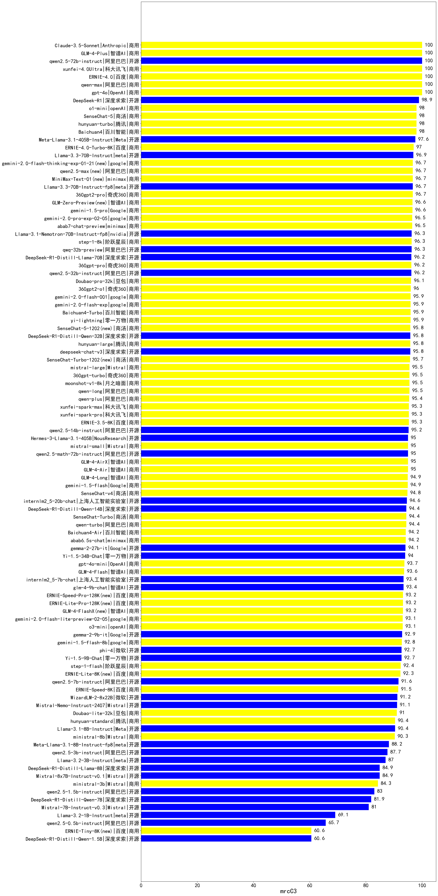

| 类别 | 大模型                         | C3中文阅读理解 | 排名 |
|-----|------------------------------|---------|----|
|商用|gpt-4o|100.0|1|
|商用|ERNIE-4.0|100.0|2|
|商用|qwen-max|100.0|3|
|开源|qwen2.5-72b-instruct|100.0|4|
|商用|xunfei-4.0Ultra|100.0|5|
|商用|Claude-3.5-Sonnet|100.0|6|
|商用|GLM-4-Plus|100.0|7|
|开源|DeepSeek-R1|98.9|8|
|商用|SenseChat-5|98.0|9|
|商用|hunyuan-turbo|98.0|10|
|商用|o1-mini|98.0|11|
|商用|Baichuan4|98.0|12|
|开源|Meta-Llama-3.1-405B-Instruct|97.6|13|
|商用|ERNIE-4.0-Turbo-8K|97.0|14|
|开源|Llama-3.3-70B-Instruct|96.9|15|
|商用|qwen2.5-max(new)|96.7|16|
|商用|360gpt2-pro|96.7|17|
|商用|MiniMax-Text-01(new)|96.7|18|
|开源|Llama-3.3-70B-Instruct-fp8|96.7|19|
|商用|gemini-2.0-flash-thinking-exp-01-21(new)|96.7|20|
|商用|gemini-1.5-pro|96.6|21|
|商用|GLM-Zero-Preview(new)|96.6|22|
|商用|abab7-chat-preview|96.5|23|
|商用|gemini-2.0-pro-exp-02-05|96.5|24|
|开源|qwq-32b-preview|96.3|25|
|开源|Llama-3.1-Nemotron-70B-Instruct-fp8|96.3|26|
|商用|step-1-8k|96.3|27|
|开源|qwen2.5-32b-instruct|96.2|28|
|商用|360gpt-pro|96.2|29|
|开源|DeepSeek-R1-Distill-Llama-70B|96.2|30|
|商用|Doubao-pro-32k|96.1|31|
|商用|360gpt2-o1|96.0|32|
|商用|gemini-2.0-flash-001|95.9|33|
|商用|yi-lightning|95.9|34|
|商用|gemini-2.0-flash-exp|95.9|35|
|商用|Baichuan4-Turbo|95.9|36|
|商用|hunyuan-large|95.8|37|
|开源|DeepSeek-R1-Distill-Qwen-32B|95.8|38|
|商用|SenseChat-5-1202(new)|95.8|39|
|开源|deepseek-chat-v3|95.8|40|
|商用|SenseChat-Turbo-1202(new)|95.7|41|
|商用|mistral-large|95.5|42|
|商用|moonshot-v1-8k|95.5|43|
|商用|qwen-long|95.5|44|
|商用|360gpt-turbo|95.5|45|
|商用|qwen-plus|95.4|46|
|商用|ERNIE-3.5-8K|95.3|47|
|商用|xunfei-spark-max|95.3|48|
|商用|xunfei-spark-pro|95.3|49|
|开源|qwen2.5-14b-instruct|95.2|50|
|开源|qwen2.5-math-72b-instruct|95.0|51|
|商用|GLM-4-Air|95.0|52|
|商用|GLM-4-AirX|95.0|53|
|开源|Hermes-3-Llama-3.1-405B|95.0|54|
|商用|mistral-small|95.0|55|
|商用|GLM-4-Long|94.9|56|
|商用|gemini-1.5-flash|94.9|57|
|商用|SenseChat-v4|94.8|58|
|开源|internlm2_5-20b-chat|94.6|59|
|商用|qwen-turbo|94.4|60|
|开源|DeepSeek-R1-Distill-Qwen-14B|94.4|61|
|商用|SenseChat-Turbo|94.4|62|
|商用|Baichuan4-Air|94.2|63|
|商用|abab6.5s-chat|94.2|64|
|开源|gemma-2-27b-it|94.1|65|
|开源|Yi-1.5-34B-Chat|94.0|66|
|商用|gpt-4o-mini|93.7|67|
|商用|GLM-4-Flash|93.6|68|
|开源|glm-4-9b-chat|93.4|69|
|开源|internlm2_5-7b-chat|93.4|70|
|商用|ERNIE-Speed-Pro-128K(new)|93.2|71|
|商用|GLM-4-FlashX(new)|93.2|72|
|商用|ERNIE-Lite-Pro-128K(new)|93.2|73|
|商用|gemini-2.0-flash-lite-preview-02-05|93.1|74|
|商用|o3-mini|93.1|75|
|开源|gemma-2-9b-it|92.9|76|
|商用|gemini-1.5-flash-8b|92.8|77|
|开源|phi-4|92.7|78|
|开源|Yi-1.5-9B-Chat|92.7|79|
|商用|step-1-flash|92.4|80|
|商用|ERNIE-Lite-8K(new)|92.3|81|
|开源|qwen2.5-7b-instruct|91.6|82|
|商用|ERNIE-Speed-8K|91.5|83|
|开源|WizardLM-2-8x22B|91.2|84|
|开源|Mistral-Nemo-Instruct-2407|91.1|85|
|商用|Doubao-lite-32k|91.0|86|
|开源|Llama-3.1-8B-Instruct|90.4|87|
|商用|hunyuan-standard|90.4|88|
|商用|ministral-8b|90.3|89|
|开源|Meta-Llama-3.1-8B-Instruct-fp8|88.2|90|
|开源|qwen2.5-3b-instruct|87.7|91|
|开源|Llama-3.2-3B-Instruct|87.0|92|
|开源|Mixtral-8x7B-Instruct-v0.1|84.9|93|
|开源|DeepSeek-R1-Distill-Llama-8B|84.9|94|
|商用|ministral-3b|84.3|95|
|开源|qwen2.5-1.5b-instruct|83.0|96|
|开源|DeepSeek-R1-Distill-Qwen-7B|81.9|97|
|开源|Mistral-7B-Instruct-v0.3|81.0|98|
|开源|Llama-3.2-1B-Instruct|69.1|99|
|开源|qwen2.5-0.5b-instruct|65.7|100|
|开源|DeepSeek-R1-Distill-Qwen-1.5B|60.6|101|
|商用|ERNIE-Tiny-8K(new)|60.6|102|
|商用|o1-preview|/|103|

