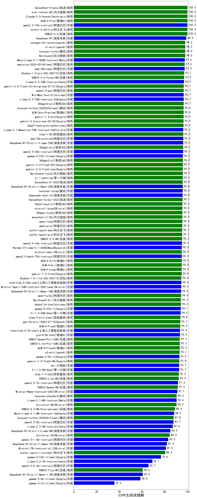

| 类别 | 大模型                         | C3中文阅读理解 | 排名 |
|-----|------------------------------|---------|----|
|商用|xunfei-4.0Ultra|100.0|1|
|商用|Claude-3.5-Sonnet|100.0|2|
|商用|GLM-4-Plus|100.0|3|
|开源|qwen2.5-72b-instruct|100.0|4|
|商用|gemini-2.5-pro-preview-03-25(new)|100.0|5|
|商用|gemini-2.5-flash-preview-04-17(new)|100.0|6|
|开源|Qwen3-235B-A22B(new)|100.0|7|
|开源|Qwen3-32B(new)|100.0|8|
|商用|SenseChat-5-beta|100.0|9|
|商用|kimi-latest-8k|100.0|10|
|开源|Qwen3-30B-A3B(new)|96.7|11|
|开源|GLM-Z1-32B-0414(new)|96.7|12|
|开源|Qwen3-8B(new)|96.7|13|
|开源|Qwen3-14B(new)|96.7|14|
|开源|DeepSeek-R1|95.9|15|
|商用|GLM-Z1-AirX(new)|93.3|16|
|商用|ERNIE-X1-32K-Preview(new)|93.3|17|
|开源|Qwen3-4B(new)|93.3|18|
|商用|hunyuan-turbo|91.7|19|
|商用|ERNIE-4.0-Turbo-8K|91.7|20|
|商用|360gpt2-o1|91.7|21|
|开源|Meta-Llama-3.1-405B-Instruct|91.5|22|
|商用|Doubao-1.5-pro-32k-250115|91.0|23|
|开源|Llama-4-Maverick-17B-128E-Instruct-FP8(new)|91.0|24|
|开源|qwq-32b|90.0|25|
|商用|qwq-plus-2025-03-05|90.0|26|
|商用|chatgpt-4o-latest|90.0|27|
|商用|gemini-2.0-flash-thinking-exp-01-21|89.4|28|
|商用|ERNIE-4.5-8K-Preview|89.0|29|
|开源|deepseek-chat-v3-0324|88.8|30|
|开源|MiniMax-Text-01|88.8|31|
|商用|gemini-1.5-pro|88.3|32|
|商用|step-1-8k|88.3|33|
|商用|qwen2.5-max|87.8|34|
|商用|hunyuan-turbos-20250313|87.8|35|
|开源|Llama-3.3-70B-Instruct|87.2|36|
|开源|Llama-3.3-70B-Instruct-fp8|87.2|37|
|开源|DeepSeek-R1-Distill-Llama-70B|86.7|38|
|商用|360gpt2-pro|86.7|39|
|商用|yi-lightning|86.7|40|
|商用|hunyuan-t1-20250321|86.2|41|
|商用|moonshot-v1-8k|86.2|42|
|商用|hunyuan-turbos-20250226|86.2|43|
|商用|mistral-large|85.6|44|
|开源|hunyuan-large|85.6|45|
|商用|gemini-2.0-flash-001|85.6|46|
|开源|qwen2.5-32b-instruct|85.6|47|
|开源|DeepSeek-R1-Distill-Qwen-32B|85.1|48|
|商用|Baichuan4-Turbo|85.1|49|
|开源|qwen2.5-14b-instruct|84.0|50|
|开源|gemma-3-27b-it|84.0|51|
|开源|Mistral-Small-24B-Instruct-2501|84.0|52|
|商用|360zhinao2-o1|84.0|53|
|商用|GLM-4-Air|83.5|54|
|商用|xunfei-spark-pro|83.5|55|
|开源|Llama-4-Scout-17B-16E-Instruct(new)|83.5|56|
|商用|SenseChat-5-1202|83.5|57|
|商用|SenseChat-Turbo-1202|83.5|58|
|商用|xunfei-spark-max|83.5|59|
|商用|GLM-4-AirX|83.5|60|
|商用|360gpt-turbo|83.5|61|
|开源|Hermes-3-Llama-3.1-405B|83.0|62|
|商用|qwen-plus|83.0|63|
|商用|qwen-long|83.0|64|
|商用|gemini-1.5-flash|82.4|65|
|商用|mistral-small|82.4|66|
|商用|Doubao-1.5-lite-32k-250115|82.4|67|
|商用|ERNIE-3.5-8K|82.4|68|
|商用|GLM-4-Long|81.9|69|
|商用|GLM-Z1-FlashX(new)|81.9|70|
|开源|Mistral-Small-3.1-24B-Instruct-2503(new)|81.4|71|
|开源|GLM-4-32B-0414(new)|81.4|72|
|商用|o3-mini|81.4|73|
|开源|internlm2_5-20b-chat|81.4|74|
|商用|abab6.5s-chat|80.9|75|
|商用|GLM-Z1-Flash(new)|80.9|76|
|开源|GLM-Z1-Rumination-32B-0414(new)|80.0|77|
|开源|DeepSeek-R1-Distill-Qwen-14B|79.8|78|
|商用|qwen-turbo|79.8|79|
|商用|GLM-Z1-Air(new)|79.0|80|
|商用|Baichuan4-Air|78.7|81|
|开源|GLM-Z1-9B-0414(new)|78.7|82|
|开源|phi-4|77.7|83|
|商用|step-2-mini|77.5|84|
|商用|gpt-4o-mini|77.1|85|
|商用|ERNIE-Lite-8K|76.6|86|
|开源|gemma-3-12b-it|76.6|87|
|开源|internlm2_5-7b-chat|76.1|88|
|商用|gemini-1.5-flash-8b|76.1|89|
|商用|ERNIE-Speed-Pro-128K|75.0|90|
|商用|ERNIE-Lite-Pro-128K|75.0|91|
|商用|GLM-4-Flash|73.9|92|
|开源|glm-4-9b-chat|73.9|93|
|商用|GLM-4-FlashX|73.4|94|
|开源|GLM-4-9B-0414(new)|73.4|95|
|开源|Llama-3.1-8B-Instruct|72.3|96|
|开源|qwen2.5-7b-instruct|71.8|97|
|商用|hunyuan-standard|71.3|98|
|商用|ministral-8b|67.0|99|
|开源|Qwen3-1.7B(new)|66.7|100|
|开源|Meta-Llama-3.1-8B-Instruct-fp8|66.5|101|
|商用|ERNIE-Speed-8K|65.4|102|
|开源|qwen2.5-3b-instruct|63.8|103|
|开源|Qwen3-0.6B(new)|63.3|104|
|开源|Llama-3.2-3B-Instruct|63.3|105|
|开源|DeepSeek-R1-Distill-Llama-8B|62.8|106|
|商用|ministral-3b|60.6|107|
|开源|gemma-3-4b-it|58.5|108|
|开源|DeepSeek-R1-Distill-Qwen-7B|58.0|109|
|开源|qwen2.5-1.5b-instruct|53.2|110|
|开源|Llama-3.2-1B-Instruct|41.5|111|
|开源|qwen2.5-0.5b-instruct|39.4|112|
|商用|ERNIE-Tiny-8K|36.2|113|
|开源|DeepSeek-R1-Distill-Qwen-1.5B|35.6|114|
|开源|gemma-3-1b-it|35.6|115|
|商用|xunfei-spark-lite|16.5|116|

