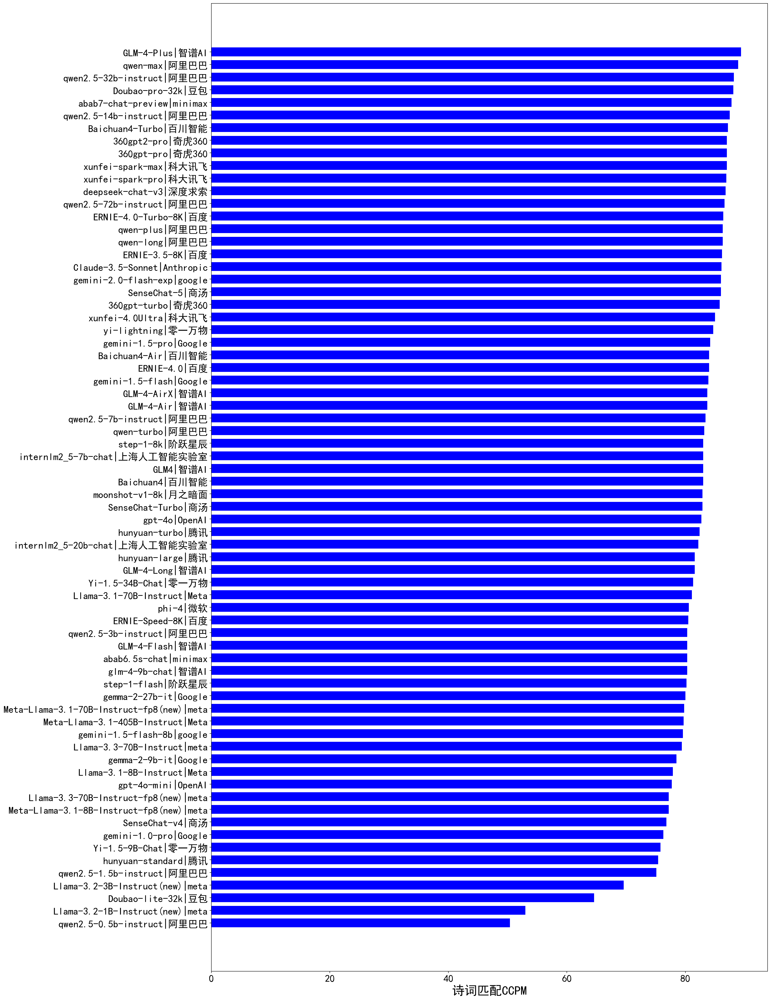

| 类别 | 大模型                         | 诗词匹配CCPM | 排名 |
|-----|------------------------------|---------|----|
|商用|SenseChat-5-1202(new)|90.0|1|
|开源|DeepSeek-R1|89.8|2|
|商用|GLM-4-Plus|89.4|3|
|商用|qwen-max|88.9|4|
|开源|DeepSeek-R1-Distill-Qwen-32B|88.6|5|
|开源|qwen2.5-32b-instruct|88.2|6|
|商用|Doubao-pro-32k|88.1|7|
|商用|abab7-chat-preview|87.8|8|
|开源|qwen2.5-14b-instruct|87.5|9|
|商用|Baichuan4-Turbo|87.2|10|
|商用|360gpt-pro|87.0|11|
|商用|360gpt2-pro|87.0|12|
|商用|xunfei-spark-max|87.0|13|
|商用|xunfei-spark-pro|86.9|14|
|开源|deepseek-chat-v3|86.8|15|
|开源|qwen2.5-72b-instruct|86.6|16|
|开源|DeepSeek-R1-Distill-Qwen-14B|86.6|17|
|商用|ERNIE-4.0-Turbo-8K|86.4|18|
|商用|qwen-plus|86.3|19|
|商用|qwen-long|86.3|20|
|商用|ERNIE-3.5-8K|86.2|21|
|商用|Claude-3.5-Sonnet|86.1|22|
|开源|DeepSeek-R1-Distill-Llama-70B|86.0|23|
|商用|gemini-2.0-flash-exp|86.0|24|
|商用|SenseChat-5|86.0|25|
|商用|360gpt-turbo|85.8|26|
|商用|MiniMax-Text-01(new)|85.0|27|
|商用|xunfei-4.0Ultra|85.0|28|
|商用|yi-lightning|84.7|29|
|商用|gemini-1.5-pro|84.2|30|
|商用|Baichuan4-Air|84.0|31|
|开源|qwq-32b-preview|84.0|32|
|商用|ERNIE-4.0|84.0|33|
|商用|gemini-1.5-flash|83.9|34|
|商用|360gpt2-o1|83.8|35|
|商用|GLM-4-Air|83.7|36|
|商用|GLM-4-AirX|83.7|37|
|商用|o1-mini|83.5|38|
|商用|o1-mini|83.5|39|
|开源|qwen2.5-7b-instruct|83.4|40|
|商用|qwen-turbo|83.2|41|
|开源|internlm2_5-7b-chat|83.0|42|
|商用|GLM4|83.0|43|
|商用|Baichuan4|83.0|44|
|商用|step-1-8k|83.0|45|
|开源|Hermes-3-Llama-3.1-405B|83.0|46|
|商用|moonshot-v1-8k|82.9|47|
|商用|SenseChat-Turbo|82.9|48|
|商用|gpt-4o|82.7|49|
|商用|mistral-large|82.6|50|
|商用|GLM-Zero-Preview(new)|82.5|51|
|商用|ERNIE-Speed-Pro-128K(new)|82.5|52|
|商用|hunyuan-turbo|82.4|53|
|开源|internlm2_5-20b-chat|82.2|54|
|商用|gemini-2.0-flash-001|82.0|55|
|商用|gemini-2.0-flash-lite-preview-02-05|82.0|56|
|商用|GLM-4-Long|81.6|57|
|商用|hunyuan-large|81.6|58|
|开源|Llama-3.1-Nemotron-70B-Instruct-fp8|81.6|59|
|开源|Yi-1.5-34B-Chat|81.3|60|
|开源|Llama-3.1-70B-Instruct|81.1|61|
|开源|phi-4|80.6|62|
|商用|SenseChat-Turbo-1202(new)|80.5|63|
|商用|ERNIE-Speed-8K|80.5|64|
|开源|glm-4-9b-chat|80.3|65|
|商用|GLM-4-Flash|80.3|66|
|开源|qwen2.5-3b-instruct|80.3|67|
|商用|abab6.5s-chat|80.3|68|
|商用|step-1-flash|80.2|69|
|商用|gemini-2.0-pro-exp-02-05|80.0|70|
|开源|gemma-2-27b-it|80.0|71|
|商用|ERNIE-Lite-8K(new)|80.0|72|
|开源|Meta-Llama-3.1-70B-Instruct-fp8|79.8|73|
|商用|mistral-small|79.7|74|
|开源|Meta-Llama-3.1-405B-Instruct|79.7|75|
|商用|gemini-1.5-flash-8b|79.6|76|
|开源|Llama-3.3-70B-Instruct|79.4|77|
|开源|gemma-2-9b-it|78.5|78|
|商用|GLM-4-FlashX(new)|78.5|79|
|开源|Llama-3.1-8B-Instruct|77.9|80|
|开源|DeepSeek-R1-Distill-Llama-8B|77.8|81|
|商用|gpt-4o-mini|77.7|82|
|开源|Llama-3.3-70B-Instruct-fp8|77.2|83|
|开源|Meta-Llama-3.1-8B-Instruct-fp8|77.2|84|
|商用|SenseChat-v4|76.8|85|
|商用|gemini-1.0-pro|76.3|86|
|开源|qwen2.5-math-72b-instruct|76.0|87|
|开源|Yi-1.5-9B-Chat|75.8|88|
|商用|hunyuan-standard|75.4|89|
|开源|Mistral-Nemo-Instruct-2407|75.2|90|
|开源|qwen2.5-1.5b-instruct|75.1|91|
|商用|ERNIE-Lite-Pro-128K(new)|75.0|92|
|开源|DeepSeek-R1-Distill-Qwen-7B|73.8|93|
|开源|WizardLM-2-8x22B|73.2|94|
|开源|Mixtral-8x7B-Instruct-v0.1|73.0|95|
|开源|Mistral-7B-Instruct-v0.3|73.0|96|
|商用|o3-mini|72.5|97|
|开源|Llama-3.2-3B-Instruct|69.6|98|
|商用|Doubao-lite-32k|64.6|99|
|开源|DeepSeek-R1-Distill-Qwen-1.5B|64.4|100|
|商用|ministral-3b|64.1|101|
|商用|ministral-8b|59.4|102|
|开源|Llama-3.2-1B-Instruct|53.0|103|
|开源|qwen2.5-0.5b-instruct|50.4|104|
|商用|ERNIE-Tiny-8K(new)|48.5|105|
|商用|o1-preview|/|106|

