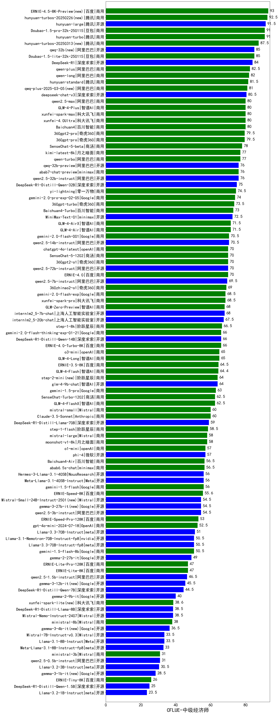

| 类别 | 大模型                         | CFLUE-中级经济师 | 排名 |
|-----|------------------------------|---------|----|
|商用|ERNIE-4.5-8K-Preview(new)|93.0|1|
|商用|hunyuan-turbos-20250226|92.5|2|
|开源|hunyuan-large|91.5|3|
|商用|Doubao-1.5-pro-32k-250115|91.0|4|
|商用|hunyuan-turbo|91.0|5|
|商用|hunyuan-turbos-20250313(new)|87.5|6|
|商用|Doubao-1.5-lite-32k-250115|85.0|7|
|开源|qwq-32b|85.0|8|
|开源|DeepSeek-R1|84.0|9|
|商用|qwen-plus|82.5|10|
|商用|qwen-long|82.0|11|
|商用|hunyuan-standard|81.5|12|
|商用|qwq-plus-2025-03-05|81.0|13|
|开源|deepseek-chat-v3|80.5|14|
|商用|hunyuan-t1-20250321(new)|80.3|15|
|商用|xunfei-4.0Ultra|80.0|16|
|商用|Baichuan4|80.0|17|
|商用|xunfei-spark-max|80.0|18|
|商用|qwen2.5-max|80.0|19|
|商用|GLM-4-Plus|80.0|20|
|商用|360gpt-pro|79.5|21|
|商用|360gpt2-pro|79.5|22|
|商用|SenseChat-5-beta|78.0|23|
|商用|qwen-turbo|77.0|24|
|商用|kimi-latest-8k|77.0|25|
|开源|qwq-32b-preview|76.0|26|
|开源|qwen2.5-32b-instruct|76.0|27|
|商用|abab7-chat-preview|76.0|28|
|开源|DeepSeek-R1-Distill-Qwen-32B|75.0|29|
|商用|yi-lightning|74.5|30|
|商用|gemini-2.0-pro-exp-02-05|74.0|31|
|商用|360gpt-turbo|73.5|32|
|商用|Baichuan4-Turbo|73.0|33|
|开源|MiniMax-Text-01|72.5|34|
|开源|deepseek-chat-v3-0324(new)|72.4|35|
|商用|GLM-4-Air|71.5|36|
|商用|GLM-4-AirX|71.5|37|
|开源|qwen2.5-14b-instruct|70.5|38|
|商用|gemini-2.0-flash-001|70.5|39|
|商用|360gpt2-o1|70.0|40|
|商用|chatgpt-4o-latest|70.0|41|
|商用|SenseChat-5-1202|70.0|42|
|商用|ERNIE-4.0|70.0|43|
|开源|qwen2.5-72b-instruct|70.0|44|
|开源|qwen2.5-7b-instruct|69.5|45|
|商用|360zhinao2-o1|69.0|46|
|商用|gemini-2.0-flash-exp|68.5|47|
|商用|xunfei-spark-pro|68.5|48|
|开源|internlm2_5-7b-chat|68.0|49|
|商用|GLM-Zero-Preview|68.0|50|
|开源|internlm2_5-20b-chat|67.5|51|
|商用|step-1-8k|66.5|52|
|商用|ERNIE-4.0-Turbo-8K|66.0|53|
|开源|DeepSeek-R1-Distill-Qwen-14B|66.0|54|
|商用|gemini-2.0-flash-thinking-exp-01-21|66.0|55|
|商用|o3-mini|65.0|56|
|商用|GLM-4-Long|65.0|57|
|商用|ERNIE-3.5-8K|64.5|58|
|商用|GLM-4-Flash|64.4|59|
|开源|glm-4-9b-chat|64.0|60|
|商用|step-2-mini|64.0|61|
|商用|gemini-1.5-pro|63.0|62|
|商用|GLM-4-FlashX|62.5|63|
|商用|SenseChat-Turbo-1202|62.5|64|
|商用|Claude-3.5-Sonnet|60.0|65|
|商用|mistral-small|60.0|66|
|开源|DeepSeek-R1-Distill-Llama-70B|59.0|67|
|商用|step-1-flash|58.5|68|
|商用|mistral-large|58.0|69|
|商用|moonshot-v1-8k|58.0|70|
|商用|o1-mini|57.0|71|
|开源|phi-4|57.0|72|
|商用|abab6.5s-chat|56.5|73|
|商用|Baichuan4-Air|56.5|74|
|商用|gemini-1.5-flash|56.0|75|
|开源|Meta-Llama-3.1-405B-Instruct|56.0|76|
|开源|Hermes-3-Llama-3.1-405B|56.0|77|
|商用|ERNIE-Speed-8K|55.6|78|
|开源|Mistral-Small-24B-Instruct-2501(new)|54.5|79|
|开源|gemma-3-27b-it(new)|54.5|80|
|开源|qwen2.5-3b-instruct|54.5|81|
|商用|ERNIE-Speed-Pro-128K|53.0|82|
|商用|gpt-4o-mini-2024-07-18|52.5|83|
|开源|Llama-3.3-70B-Instruct|51.0|84|
|开源|Llama-3.1-Nemotron-70B-Instruct-fp8|50.5|85|
|开源|Llama-3.3-70B-Instruct-fp8|50.5|86|
|商用|gemini-1.5-flash-8b|50.5|87|
|开源|gemma-2-27b-it|49.0|88|
|商用|ERNIE-Lite-Pro-128K|47.0|89|
|商用|ERNIE-Lite-8K|47.0|90|
|开源|qwen2.5-1.5b-instruct|46.5|91|
|开源|gemma-3-12b-it(new)|45.5|92|
|开源|DeepSeek-R1-Distill-Qwen-7B|44.5|93|
|开源|gemma-2-9b-it|40.0|94|
|商用|xunfei-spark-lite|38.6|95|
|开源|Mistral-Nemo-Instruct-2407|38.5|96|
|开源|DeepSeek-R1-Distill-Llama-8B|38.5|97|
|商用|ministral-8b|38.0|98|
|开源|gemma-3-4b-it(new)|36.5|99|
|开源|Mistral-7B-Instruct-v0.3|33.5|100|
|开源|Llama-3.1-8B-Instruct|33.5|101|
|开源|Meta-Llama-3.1-8B-Instruct-fp8|33.0|102|
|商用|ministral-3b|31.0|103|
|开源|qwen2.5-0.5b-instruct|31.0|104|
|开源|Llama-3.2-3B-Instruct|30.5|105|
|开源|gemma-3-1b-it(new)|28.5|106|
|商用|ERNIE-Tiny-8K|26.0|107|
|开源|DeepSeek-R1-Distill-Qwen-1.5B|25.0|108|
|开源|Llama-3.2-1B-Instruct|23.5|109|
|开源|qwen2.5-math-72b-instruct|/|110|

