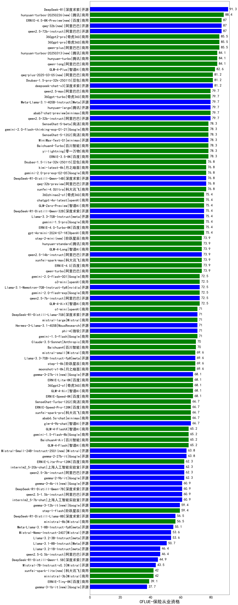

| 类别 | 大模型                         | CFLUE-保险从业资格 | 排名 |
|-----|------------------------------|---------|----|
|开源|DeepSeek-R1|91.3|1|
|商用|hunyuan-turbos-20250226(new)|88.4|2|
|开源|qwen2.5-72b-instruct|87.0|3|
|开源|qwq-32b(new)|87.0|4|
|商用|ERNIE-4.5-8K-Preview(new)|87.0|5|
|商用|qwen-plus|85.5|6|
|商用|360gpt2-pro|85.5|7|
|商用|360gpt-pro|85.5|8|
|商用|hunyuan-turbo|84.1|9|
|商用|hunyuan-turbos-20250313(new)|84.1|10|
|商用|qwen-long|84.1|11|
|商用|GLM-4-Plus|82.6|12|
|商用|qwq-plus-2025-03-05(new)|81.2|13|
|开源|deepseek-chat-v3|81.2|14|
|商用|Doubao-1.5-pro-32k-250115|81.2|15|
|开源|qwen2.5-32b-instruct|79.7|16|
|开源|hunyuan-large|79.7|17|
|商用|360gpt-turbo|79.7|18|
|商用|qwen2.5-max|79.7|19|
|商用|abab7-chat-preview|79.7|20|
|开源|Meta-Llama-3.1-405B-Instruct|79.7|21|
|商用|SenseChat-5-beta|78.3|22|
|商用|SenseChat-5-1202|78.3|23|
|商用|Baichuan4-Turbo|78.3|24|
|开源|MiniMax-Text-01|78.3|25|
|商用|gemini-2.0-flash-thinking-exp-01-21|78.3|26|
|商用|ERNIE-3.5-8K|78.3|27|
|商用|yi-lightning|78.3|28|
|商用|xunfei-4.0Ultra|76.8|29|
|开源|qwq-32b-preview|76.8|30|
|开源|DeepSeek-R1-Distill-Qwen-14B|76.8|31|
|商用|Doubao-1.5-lite-32k-250115|76.8|32|
|商用|kimi-latest-8k|76.8|33|
|商用|gemini-2.0-pro-exp-02-05|76.8|34|
|商用|gemini-1.5-pro|75.4|35|
|商用|ERNIE-4.0-Turbo-8K|75.4|36|
|开源|DeepSeek-R1-Distill-Qwen-32B|75.4|37|
|开源|Llama-3.3-70B-Instruct|75.4|38|
|商用|chatgpt-4o-latest|75.4|39|
|商用|GLM-Zero-Preview|75.4|40|
|商用|gpt-4o-mini-2024-07-18|75.4|41|
|商用|360zhinao2-o1|75.4|42|
|商用|qwen-turbo|73.9|43|
|商用|ERNIE-4.0|73.9|44|
|商用|xunfei-spark-max|73.9|45|
|商用|step-2-mini(new)|73.9|46|
|商用|GLM-4-Long|73.9|47|
|商用|hunyuan-standard|73.9|48|
|开源|qwen2.5-14b-instruct|73.9|49|
|开源|qwen2.5-7b-instruct|72.5|50|
|开源|Llama-3.1-Nemotron-70B-Instruct-fp8|72.5|51|
|商用|GLM-4-AirX|72.5|52|
|商用|o3-mini|72.5|53|
|商用|gemini-2.0-flash-001|72.5|54|
|商用|gemini-2.0-flash-exp|72.5|55|
|商用|o1-mini|71.0|56|
|商用|mistral-large|71.0|57|
|开源|phi-4|71.0|58|
|开源|Hermes-3-Llama-3.1-405B|71.0|59|
|开源|DeepSeek-R1-Distill-Llama-70B|71.0|60|
|商用|gemini-1.5-flash|71.0|61|
|商用|Claude-3.5-Sonnet|70.0|62|
|商用|Baichuan4|70.0|63|
|商用|step-1-8k|69.6|64|
|开源|Llama-3.3-70B-Instruct-fp8|69.6|65|
|商用|mistral-small|69.6|66|
|商用|moonshot-v1-8k|69.6|67|
|开源|gemma-3-27b-it(new)|68.1|68|
|商用|360gpt2-o1|68.1|69|
|商用|ERNIE-Speed-8K|68.1|70|
|商用|GLM-4-Air|68.1|71|
|商用|ERNIE-Lite-8K|68.1|72|
|商用|abab6.5s-chat|66.7|73|
|商用|ERNIE-Speed-Pro-128K|66.7|74|
|商用|xunfei-spark-pro|66.7|75|
|开源|glm-4-9b-chat|66.7|76|
|商用|SenseChat-Turbo-1202|66.7|77|
|商用|GLM-4-Flash|65.2|78|
|商用|Baichuan4-Air|65.2|79|
|商用|GLM-4-FlashX|65.2|80|
|商用|gemini-1.5-flash-8b|65.2|81|
|开源|gemma-2-27b-it|63.8|82|
|开源|Mistral-Small-24B-Instruct-2501(new)|63.8|83|
|开源|gemma-2-9b-it|62.3|84|
|开源|qwen2.5-3b-instruct|62.3|85|
|开源|internlm2_5-20b-chat|62.3|86|
|商用|ERNIE-Lite-Pro-128K|62.3|87|
|开源|DeepSeek-R1-Distill-Qwen-7B|60.9|88|
|开源|internlm2_5-7b-chat|60.9|89|
|开源|gemma-3-4b-it(new)|60.9|90|
|开源|qwen2.5-1.5b-instruct|60.9|91|
|开源|gemma-3-12b-it(new)|59.4|92|
|商用|step-1-flash|59.4|93|
|商用|ministral-8b|56.5|94|
|开源|DeepSeek-R1-Distill-Llama-8B|56.5|95|
|开源|Meta-Llama-3.1-8B-Instruct-fp8|55.1|96|
|开源|Mistral-Nemo-Instruct-2407|53.6|97|
|开源|Llama-3.2-3B-Instruct|53.6|98|
|开源|Llama-3.1-8B-Instruct|50.7|99|
|开源|qwen2.5-0.5b-instruct|46.4|100|
|开源|Llama-3.2-1B-Instruct|46.4|101|
|开源|DeepSeek-R1-Distill-Qwen-1.5B|44.9|102|
|开源|Mistral-7B-Instruct-v0.3|43.5|103|
|商用|ministral-3b|42.0|104|
|商用|xunfei-spark-lite(new)|42.0|105|
|商用|ERNIE-Tiny-8K|39.1|106|
|开源|gemma-3-1b-it(new)|37.7|107|
|开源|qwen2.5-math-72b-instruct|/|108|

