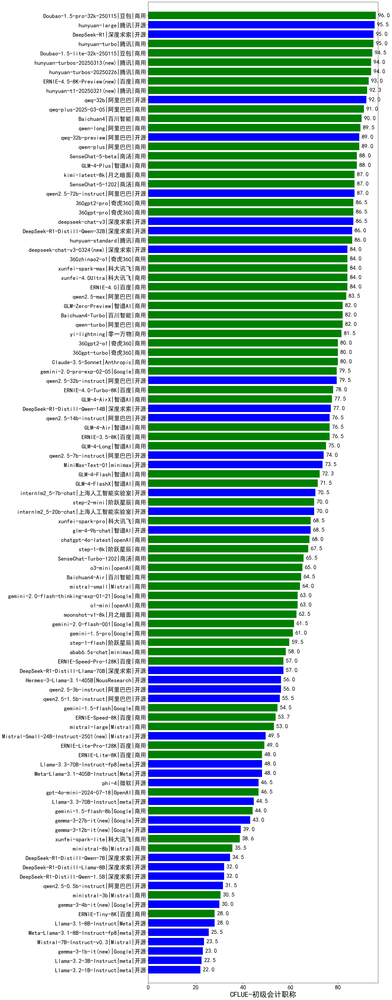

| 类别 | 大模型                         | CFLUE-初级会计职称 | 排名 |
|-----|------------------------------|---------|----|
|商用|Doubao-1.5-pro-32k-250115|96.0|1|
|开源|hunyuan-large|95.5|2|
|开源|DeepSeek-R1|95.0|3|
|商用|hunyuan-turbo|95.0|4|
|商用|Doubao-1.5-lite-32k-250115|94.5|5|
|商用|hunyuan-turbos-20250226|94.0|6|
|商用|hunyuan-turbos-20250313(new)|94.0|7|
|商用|ERNIE-4.5-8K-Preview(new)|93.0|8|
|商用|hunyuan-t1-20250321(new)|92.3|9|
|开源|qwq-32b|92.0|10|
|商用|qwq-plus-2025-03-05|91.0|11|
|商用|Baichuan4|90.0|12|
|商用|qwen-long|89.5|13|
|商用|qwen-plus|89.0|14|
|开源|qwq-32b-preview|89.0|15|
|商用|GLM-4-Plus|88.0|16|
|商用|SenseChat-5-beta|88.0|17|
|开源|qwen2.5-72b-instruct|87.0|18|
|商用|SenseChat-5-1202|87.0|19|
|商用|kimi-latest-8k|87.0|20|
|商用|360gpt-pro|86.5|21|
|商用|360gpt2-pro|86.5|22|
|开源|deepseek-chat-v3|86.5|23|
|开源|DeepSeek-R1-Distill-Qwen-32B|86.0|24|
|商用|hunyuan-standard|86.0|25|
|商用|360zhinao2-o1|84.0|26|
|商用|xunfei-spark-max|84.0|27|
|商用|ERNIE-4.0|84.0|28|
|商用|xunfei-4.0Ultra|84.0|29|
|开源|deepseek-chat-v3-0324(new)|84.0|30|
|商用|qwen2.5-max|83.5|31|
|商用|GLM-Zero-Preview|82.0|32|
|商用|Baichuan4-Turbo|82.0|33|
|商用|qwen-turbo|82.0|34|
|商用|yi-lightning|81.5|35|
|商用|360gpt-turbo|80.0|36|
|商用|Claude-3.5-Sonnet|80.0|37|
|商用|360gpt2-o1|80.0|38|
|商用|gemini-2.0-pro-exp-02-05|79.5|39|
|开源|qwen2.5-32b-instruct|79.5|40|
|商用|abab7-chat-preview|79.0|41|
|商用|ERNIE-4.0-Turbo-8K|78.0|42|
|商用|GLM-4-AirX|77.5|43|
|开源|DeepSeek-R1-Distill-Qwen-14B|77.0|44|
|商用|GLM-4-Air|76.5|45|
|商用|ERNIE-3.5-8K|76.5|46|
|开源|qwen2.5-14b-instruct|76.5|47|
|商用|GLM-4-Long|75.0|48|
|开源|qwen2.5-7b-instruct|74.0|49|
|开源|MiniMax-Text-01|73.5|50|
|商用|GLM-4-Flash|72.3|51|
|商用|GLM-4-FlashX|71.5|52|
|开源|internlm2_5-7b-chat|70.5|53|
|开源|internlm2_5-20b-chat|70.0|54|
|商用|step-2-mini|70.0|55|
|开源|glm-4-9b-chat|68.5|56|
|商用|xunfei-spark-pro|68.5|57|
|商用|chatgpt-4o-latest|68.0|58|
|商用|step-1-8k|67.5|59|
|商用|SenseChat-Turbo-1202|65.5|60|
|商用|o3-mini|65.0|61|
|商用|Baichuan4-Air|64.5|62|
|商用|mistral-small|64.0|63|
|商用|o1-mini|63.0|64|
|商用|gemini-2.0-flash-thinking-exp-01-21|63.0|65|
|商用|gemini-2.0-flash-exp|62.5|66|
|商用|moonshot-v1-8k|62.5|67|
|商用|gemini-2.0-flash-001|61.5|68|
|商用|gemini-1.5-pro|61.0|69|
|商用|step-1-flash|59.5|70|
|商用|abab6.5s-chat|58.0|71|
|商用|ERNIE-Speed-Pro-128K|57.0|72|
|开源|DeepSeek-R1-Distill-Llama-70B|57.0|73|
|开源|qwen2.5-3b-instruct|56.0|74|
|开源|Hermes-3-Llama-3.1-405B|56.0|75|
|开源|qwen2.5-1.5b-instruct|55.5|76|
|商用|gemini-1.5-flash|54.5|77|
|商用|ERNIE-Speed-8K|53.7|78|
|商用|mistral-large|53.0|79|
|开源|Mistral-Small-24B-Instruct-2501(new)|49.5|80|
|商用|ERNIE-Lite-Pro-128K|49.0|81|
|开源|Llama-3.3-70B-Instruct-fp8|48.0|82|
|开源|Meta-Llama-3.1-405B-Instruct|48.0|83|
|商用|ERNIE-Lite-8K|48.0|84|
|开源|Llama-3.1-Nemotron-70B-Instruct-fp8|47.0|85|
|商用|gpt-4o-mini-2024-07-18|46.5|86|
|开源|phi-4|46.5|87|
|开源|Llama-3.3-70B-Instruct|44.5|88|
|商用|gemini-1.5-flash-8b|44.0|89|
|开源|gemma-3-27b-it(new)|43.0|90|
|开源|gemma-2-27b-it|41.0|91|
|开源|gemma-3-12b-it(new)|39.0|92|
|商用|xunfei-spark-lite|38.6|93|
|开源|gemma-2-9b-it|35.5|94|
|商用|ministral-8b|35.5|95|
|开源|DeepSeek-R1-Distill-Qwen-7B|34.5|96|
|开源|Mistral-Nemo-Instruct-2407|32.0|97|
|开源|DeepSeek-R1-Distill-Llama-8B|32.0|98|
|开源|DeepSeek-R1-Distill-Qwen-1.5B|32.0|99|
|开源|qwen2.5-0.5b-instruct|31.5|100|
|商用|ministral-3b|30.5|101|
|开源|gemma-3-4b-it(new)|30.0|102|
|商用|ERNIE-Tiny-8K|28.0|103|
|开源|Llama-3.1-8B-Instruct|28.0|104|
|开源|Meta-Llama-3.1-8B-Instruct-fp8|25.5|105|
|开源|Mistral-7B-Instruct-v0.3|23.5|106|
|开源|gemma-3-1b-it(new)|23.0|107|
|开源|Llama-3.2-3B-Instruct|22.5|108|
|开源|Llama-3.2-1B-Instruct|22.0|109|
|开源|qwen2.5-math-72b-instruct|/|110|

