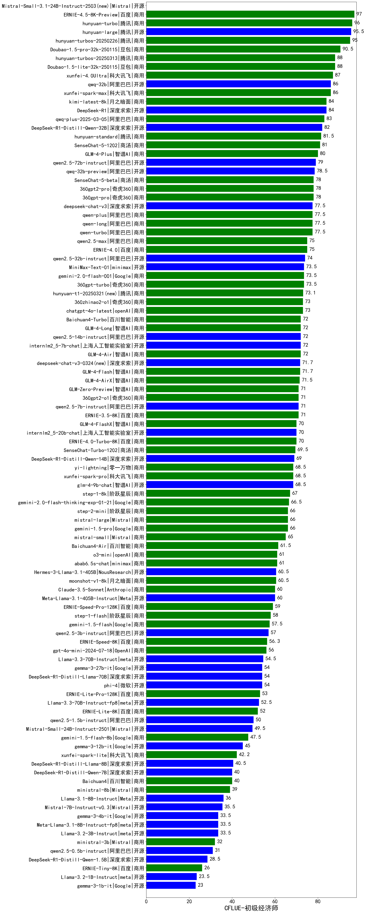

| 类别 | 大模型                         | CFLUE-初级经济师 | 排名 |
|-----|------------------------------|---------|----|
|商用|ERNIE-4.5-8K-Preview(new)|97.0|1|
|商用|hunyuan-turbo|96.0|2|
|开源|hunyuan-large|95.5|3|
|商用|hunyuan-turbos-20250226(new)|95.0|4|
|商用|Doubao-1.5-pro-32k-250115|90.5|5|
|商用|Doubao-1.5-lite-32k-250115|88.0|6|
|商用|hunyuan-turbos-20250313(new)|88.0|7|
|商用|xunfei-4.0Ultra|87.0|8|
|开源|qwq-32b(new)|86.0|9|
|商用|xunfei-spark-max|86.0|10|
|商用|kimi-latest-8k|84.0|11|
|开源|DeepSeek-R1|84.0|12|
|商用|qwq-plus-2025-03-05(new)|83.0|13|
|开源|DeepSeek-R1-Distill-Qwen-32B|82.0|14|
|商用|hunyuan-standard|81.5|15|
|商用|SenseChat-5-1202|81.0|16|
|商用|GLM-4-Plus|80.0|17|
|开源|qwen2.5-72b-instruct|79.0|18|
|开源|qwq-32b-preview|78.5|19|
|商用|360gpt2-pro|78.0|20|
|商用|360gpt-pro|78.0|21|
|商用|SenseChat-5-beta|78.0|22|
|开源|deepseek-chat-v3|77.5|23|
|商用|qwen-long|77.5|24|
|商用|qwen-turbo|77.5|25|
|商用|qwen-plus|77.5|26|
|商用|ERNIE-4.0|75.0|27|
|商用|qwen2.5-max|75.0|28|
|开源|qwen2.5-32b-instruct|74.0|29|
|商用|360gpt-turbo|73.5|30|
|商用|abab7-chat-preview|73.5|31|
|商用|gemini-2.0-flash-001|73.5|32|
|开源|MiniMax-Text-01|73.5|33|
|商用|chatgpt-4o-latest|73.0|34|
|商用|360zhinao2-o1|73.0|35|
|商用|GLM-4-Long|72.0|36|
|开源|internlm2_5-7b-chat|72.0|37|
|开源|qwen2.5-14b-instruct|72.0|38|
|商用|Baichuan4-Turbo|72.0|39|
|商用|gemini-2.0-flash-exp|72.0|40|
|商用|GLM-4-Air|72.0|41|
|商用|GLM-4-Flash|71.7|42|
|商用|GLM-4-AirX|71.5|43|
|开源|qwen2.5-7b-instruct|71.0|44|
|商用|gemini-2.0-pro-exp-02-05|71.0|45|
|商用|ERNIE-3.5-8K|71.0|46|
|商用|GLM-Zero-Preview|71.0|47|
|商用|360gpt2-o1|71.0|48|
|开源|internlm2_5-20b-chat|70.0|49|
|商用|GLM-4-FlashX|70.0|50|
|商用|ERNIE-4.0-Turbo-8K|70.0|51|
|商用|SenseChat-Turbo-1202|69.5|52|
|开源|DeepSeek-R1-Distill-Qwen-14B|69.0|53|
|商用|yi-lightning|68.5|54|
|开源|glm-4-9b-chat|68.5|55|
|商用|xunfei-spark-pro|68.5|56|
|商用|step-1-8k|67.0|57|
|商用|gemini-2.0-flash-thinking-exp-01-21|66.5|58|
|商用|mistral-large|66.0|59|
|商用|gemini-1.5-pro|66.0|60|
|商用|step-2-mini(new)|66.0|61|
|商用|mistral-small|65.0|62|
|商用|Baichuan4-Air|61.5|63|
|商用|o1-mini|61.0|64|
|商用|abab6.5s-chat|61.0|65|
|商用|o3-mini|61.0|66|
|开源|Hermes-3-Llama-3.1-405B|60.5|67|
|商用|moonshot-v1-8k|60.5|68|
|开源|Meta-Llama-3.1-405B-Instruct|60.0|69|
|商用|Claude-3.5-Sonnet|60.0|70|
|商用|ERNIE-Speed-Pro-128K|59.0|71|
|开源|Llama-3.1-Nemotron-70B-Instruct-fp8|58.5|72|
|商用|step-1-flash|58.0|73|
|商用|gemini-1.5-flash|57.5|74|
|开源|qwen2.5-3b-instruct|57.0|75|
|商用|ERNIE-Speed-8K|56.3|76|
|商用|gpt-4o-mini-2024-07-18|56.0|77|
|开源|Llama-3.3-70B-Instruct|54.5|78|
|开源|DeepSeek-R1-Distill-Llama-70B|54.0|79|
|开源|phi-4|54.0|80|
|开源|gemma-3-27b-it(new)|54.0|81|
|商用|ERNIE-Lite-Pro-128K|53.0|82|
|开源|Llama-3.3-70B-Instruct-fp8|52.5|83|
|商用|ERNIE-Lite-8K|52.0|84|
|开源|gemma-2-27b-it|51.0|85|
|开源|qwen2.5-1.5b-instruct|50.0|86|
|开源|Mistral-Small-24B-Instruct-2501(new)|49.5|87|
|商用|gemini-1.5-flash-8b|47.5|88|
|开源|gemma-2-9b-it|46.0|89|
|开源|gemma-3-12b-it(new)|45.0|90|
|商用|xunfei-spark-lite(new)|42.2|91|
|开源|Mistral-Nemo-Instruct-2407|40.5|92|
|开源|DeepSeek-R1-Distill-Llama-8B|40.5|93|
|开源|DeepSeek-R1-Distill-Qwen-7B|40.0|94|
|商用|Baichuan4|40.0|95|
|商用|ministral-8b|39.0|96|
|开源|Llama-3.1-8B-Instruct|36.0|97|
|开源|Mistral-7B-Instruct-v0.3|35.5|98|
|开源|Meta-Llama-3.1-8B-Instruct-fp8|33.5|99|
|开源|gemma-3-4b-it(new)|33.5|100|
|开源|Llama-3.2-3B-Instruct|33.5|101|
|商用|ministral-3b|32.0|102|
|开源|qwen2.5-0.5b-instruct|31.0|103|
|开源|DeepSeek-R1-Distill-Qwen-1.5B|28.5|104|
|商用|ERNIE-Tiny-8K|26.0|105|
|开源|Llama-3.2-1B-Instruct|23.5|106|
|开源|gemma-3-1b-it(new)|23.0|107|
|开源|qwen2.5-math-72b-instruct|/|108|

