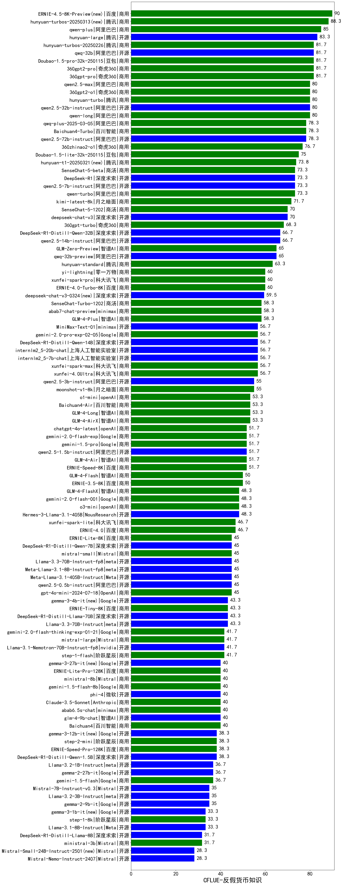

| 类别 | 大模型                         | CFLUE-反假货币知识 | 排名 |
|-----|------------------------------|---------|----|
|商用|ERNIE-4.5-8K-Preview(new)|90.0|1|
|商用|hunyuan-turbos-20250313(new)|88.3|2|
|商用|qwen-plus|85.0|3|
|开源|hunyuan-large|83.3|4|
|商用|360gpt-pro|81.7|5|
|商用|hunyuan-turbos-20250226|81.7|6|
|商用|Doubao-1.5-pro-32k-250115|81.7|7|
|商用|360gpt2-pro|81.7|8|
|开源|qwq-32b|81.7|9|
|开源|qwen2.5-32b-instruct|80.0|10|
|商用|360gpt2-o1|80.0|11|
|商用|hunyuan-turbo|80.0|12|
|商用|qwen-long|80.0|13|
|商用|qwen2.5-max|80.0|14|
|商用|Baichuan4-Turbo|78.3|15|
|开源|qwen2.5-72b-instruct|78.3|16|
|商用|qwq-plus-2025-03-05|78.3|17|
|商用|360zhinao2-o1|76.7|18|
|商用|Doubao-1.5-lite-32k-250115|75.0|19|
|商用|hunyuan-t1-20250321(new)|73.8|20|
|商用|SenseChat-5-beta|73.3|21|
|开源|DeepSeek-R1|73.3|22|
|开源|qwen2.5-7b-instruct|73.3|23|
|商用|qwen-turbo|73.3|24|
|商用|kimi-latest-8k|71.7|25|
|商用|SenseChat-5-1202|70.0|26|
|开源|deepseek-chat-v3|70.0|27|
|商用|360gpt-turbo|68.3|28|
|开源|qwen2.5-14b-instruct|66.7|29|
|开源|DeepSeek-R1-Distill-Qwen-32B|66.7|30|
|商用|GLM-Zero-Preview|65.0|31|
|开源|qwq-32b-preview|65.0|32|
|商用|hunyuan-standard|63.3|33|
|商用|yi-lightning|60.0|34|
|商用|ERNIE-4.0-Turbo-8K|60.0|35|
|商用|xunfei-spark-pro|60.0|36|
|开源|deepseek-chat-v3-0324(new)|59.5|37|
|商用|SenseChat-Turbo-1202|58.3|38|
|商用|GLM-4-Plus|58.3|39|
|商用|xunfei-4.0Ultra|56.7|40|
|开源|internlm2_5-20b-chat|56.7|41|
|开源|internlm2_5-7b-chat|56.7|42|
|商用|gemini-2.0-pro-exp-02-05|56.7|43|
|商用|xunfei-spark-max|56.7|44|
|开源|MiniMax-Text-01|56.7|45|
|开源|DeepSeek-R1-Distill-Qwen-14B|56.7|46|
|商用|moonshot-v1-8k|55.0|47|
|开源|qwen2.5-3b-instruct|55.0|48|
|商用|Baichuan4-Air|53.3|49|
|商用|GLM-4-AirX|53.3|50|
|商用|GLM-4-Long|53.3|51|
|商用|o1-mini|53.3|52|
|商用|chatgpt-4o-latest|51.7|53|
|商用|gemini-1.5-pro|51.7|54|
|商用|GLM-4-Air|51.7|55|
|开源|qwen2.5-1.5b-instruct|51.7|56|
|商用|ERNIE-Speed-8K|51.7|57|
|商用|ERNIE-3.5-8K|50.0|58|
|商用|GLM-4-Flash|50.0|59|
|商用|GLM-4-FlashX|48.3|60|
|商用|o3-mini|48.3|61|
|开源|Hermes-3-Llama-3.1-405B|48.3|62|
|商用|gemini-2.0-flash-001|48.3|63|
|商用|ERNIE-4.0|46.7|64|
|商用|xunfei-spark-lite|46.7|65|
|开源|Llama-3.3-70B-Instruct-fp8|45.0|66|
|商用|gpt-4o-mini-2024-07-18|45.0|67|
|开源|Meta-Llama-3.1-8B-Instruct-fp8|45.0|68|
|商用|ERNIE-Lite-8K|45.0|69|
|商用|mistral-small|45.0|70|
|开源|DeepSeek-R1-Distill-Qwen-7B|45.0|71|
|开源|Meta-Llama-3.1-405B-Instruct|45.0|72|
|开源|qwen2.5-0.5b-instruct|45.0|73|
|开源|DeepSeek-R1-Distill-Llama-70B|43.3|74|
|开源|Llama-3.3-70B-Instruct|43.3|75|
|商用|ERNIE-Tiny-8K|43.3|76|
|开源|gemma-3-4b-it(new)|43.3|77|
|商用|gemini-2.0-flash-thinking-exp-01-21|41.7|78|
|商用|mistral-large|41.7|79|
|商用|step-1-flash|41.7|80|
|开源|glm-4-9b-chat|40.0|81|
|商用|Baichuan4|40.0|82|
|商用|ERNIE-Lite-Pro-128K|40.0|83|
|开源|phi-4|40.0|84|
|商用|Claude-3.5-Sonnet|40.0|85|
|商用|abab6.5s-chat|40.0|86|
|商用|gemini-1.5-flash-8b|40.0|87|
|商用|ministral-8b|40.0|88|
|开源|gemma-3-27b-it(new)|40.0|89|
|商用|ERNIE-Speed-Pro-128K|38.3|90|
|开源|DeepSeek-R1-Distill-Qwen-1.5B|38.3|91|
|开源|gemma-3-12b-it(new)|38.3|92|
|商用|step-2-mini|38.3|93|
|商用|gemini-1.5-flash|36.7|94|
|开源|Llama-3.2-1B-Instruct|36.7|95|
|开源|Mistral-7B-Instruct-v0.3|35.0|96|
|开源|Llama-3.2-3B-Instruct|35.0|97|
|开源|Llama-3.1-8B-Instruct|33.3|98|
|商用|step-1-8k|33.3|99|
|开源|gemma-3-1b-it(new)|33.3|100|
|开源|DeepSeek-R1-Distill-Llama-8B|31.7|101|
|商用|ministral-3b|31.7|102|
|开源|Mistral-Small-24B-Instruct-2501(new)|28.3|103|
|开源|Llama-4-Scout-17B-16E-Instruct(new)|/|104|
|开源|Llama-4-Maverick-17B-128E-Instruct-FP8(new)|/|105|
|商用|ERNIE-X1-32K-Preview(new)|/|106|

