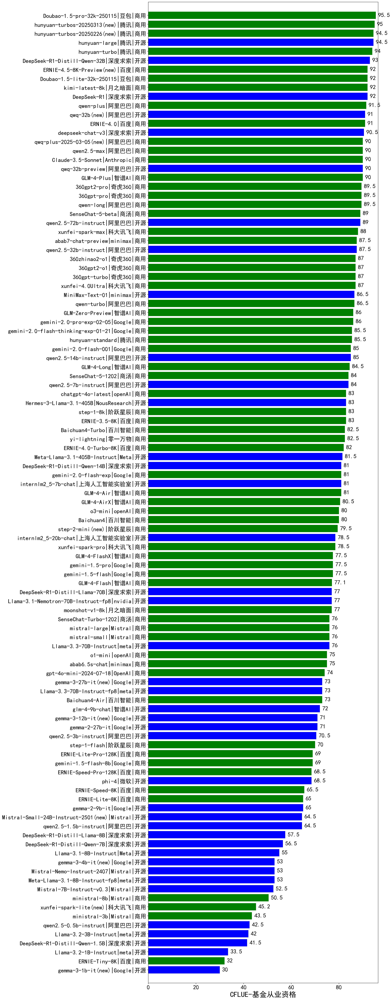

| 类别 | 大模型                         | CFLUE-基金从业资格 | 排名 |
|-----|------------------------------|---------|----|
|商用|Doubao-1.5-pro-32k-250115|95.5|1|
|商用|hunyuan-turbos-20250313(new)|95.0|2|
|开源|hunyuan-large|94.5|3|
|商用|hunyuan-turbos-20250226(new)|94.5|4|
|商用|hunyuan-turbo|94.0|5|
|开源|DeepSeek-R1-Distill-Qwen-32B|93.0|6|
|开源|DeepSeek-R1|92.0|7|
|商用|kimi-latest-8k|92.0|8|
|商用|Doubao-1.5-lite-32k-250115|92.0|9|
|商用|ERNIE-4.5-8K-Preview(new)|92.0|10|
|商用|qwen-plus|91.5|11|
|商用|ERNIE-4.0|91.0|12|
|开源|qwq-32b(new)|91.0|13|
|开源|deepseek-chat-v3|90.5|14|
|商用|Claude-3.5-Sonnet|90.0|15|
|商用|GLM-4-Plus|90.0|16|
|商用|qwen2.5-max|90.0|17|
|商用|qwq-plus-2025-03-05(new)|90.0|18|
|开源|qwq-32b-preview|90.0|19|
|商用|360gpt2-pro|89.5|20|
|商用|qwen-long|89.5|21|
|商用|360gpt-pro|89.5|22|
|商用|SenseChat-5-beta|89.0|23|
|开源|qwen2.5-72b-instruct|89.0|24|
|商用|xunfei-spark-max|88.0|25|
|开源|qwen2.5-32b-instruct|87.5|26|
|商用|abab7-chat-preview|87.5|27|
|商用|xunfei-4.0Ultra|87.0|28|
|商用|360gpt2-o1|87.0|29|
|商用|360gpt-turbo|87.0|30|
|商用|360zhinao2-o1|87.0|31|
|商用|qwen-turbo|86.5|32|
|开源|MiniMax-Text-01|86.5|33|
|商用|gemini-2.0-pro-exp-02-05|86.0|34|
|商用|GLM-Zero-Preview|86.0|35|
|商用|hunyuan-standard|85.5|36|
|商用|gemini-2.0-flash-thinking-exp-01-21|85.5|37|
|开源|qwen2.5-14b-instruct|85.0|38|
|商用|gemini-2.0-flash-001|85.0|39|
|商用|GLM-4-Long|84.5|40|
|开源|qwen2.5-7b-instruct|84.0|41|
|商用|SenseChat-5-1202|84.0|42|
|开源|Hermes-3-Llama-3.1-405B|83.0|43|
|商用|ERNIE-3.5-8K|83.0|44|
|商用|chatgpt-4o-latest|83.0|45|
|商用|step-1-8k|83.0|46|
|商用|Baichuan4-Turbo|82.5|47|
|商用|yi-lightning|82.5|48|
|商用|ERNIE-4.0-Turbo-8K|82.0|49|
|开源|Meta-Llama-3.1-405B-Instruct|81.5|50|
|商用|GLM-4-Air|81.0|51|
|开源|internlm2_5-7b-chat|81.0|52|
|开源|DeepSeek-R1-Distill-Qwen-14B|81.0|53|
|商用|gemini-2.0-flash-exp|81.0|54|
|商用|GLM-4-AirX|80.5|55|
|商用|Baichuan4|80.0|56|
|商用|o3-mini|80.0|57|
|商用|step-2-mini(new)|79.5|58|
|开源|internlm2_5-20b-chat|78.5|59|
|商用|xunfei-spark-pro|78.5|60|
|商用|gemini-1.5-flash|77.5|61|
|商用|gemini-1.5-pro|77.5|62|
|商用|GLM-4-FlashX|77.5|63|
|商用|GLM-4-Flash|77.1|64|
|开源|DeepSeek-R1-Distill-Llama-70B|77.0|65|
|开源|Llama-3.1-Nemotron-70B-Instruct-fp8|77.0|66|
|商用|moonshot-v1-8k|77.0|67|
|商用|mistral-small|76.0|68|
|商用|mistral-large|76.0|69|
|商用|SenseChat-Turbo-1202|76.0|70|
|开源|Llama-3.3-70B-Instruct|76.0|71|
|商用|abab6.5s-chat|75.0|72|
|商用|o1-mini|75.0|73|
|商用|gpt-4o-mini-2024-07-18|74.0|74|
|商用|Baichuan4-Air|73.0|75|
|开源|gemma-3-27b-it(new)|73.0|76|
|开源|Llama-3.3-70B-Instruct-fp8|73.0|77|
|开源|glm-4-9b-chat|72.0|78|
|开源|gemma-3-12b-it(new)|71.0|79|
|开源|gemma-2-27b-it|71.0|80|
|开源|qwen2.5-3b-instruct|70.5|81|
|商用|step-1-flash|70.0|82|
|商用|ERNIE-Lite-Pro-128K|69.0|83|
|商用|gemini-1.5-flash-8b|69.0|84|
|开源|phi-4|68.5|85|
|商用|ERNIE-Speed-Pro-128K|68.5|86|
|商用|ERNIE-Speed-8K|65.5|87|
|商用|ERNIE-Lite-8K|65.0|88|
|开源|gemma-2-9b-it|65.0|89|
|开源|Mistral-Small-24B-Instruct-2501(new)|64.5|90|
|开源|qwen2.5-1.5b-instruct|64.5|91|
|开源|DeepSeek-R1-Distill-Llama-8B|57.5|92|
|开源|DeepSeek-R1-Distill-Qwen-7B|56.5|93|
|开源|Llama-3.1-8B-Instruct|55.0|94|
|开源|gemma-3-4b-it(new)|53.0|95|
|开源|Mistral-Nemo-Instruct-2407|53.0|96|
|开源|Meta-Llama-3.1-8B-Instruct-fp8|53.0|97|
|开源|Mistral-7B-Instruct-v0.3|52.5|98|
|商用|ministral-8b|50.5|99|
|商用|xunfei-spark-lite(new)|45.2|100|
|商用|ministral-3b|43.5|101|
|开源|qwen2.5-0.5b-instruct|42.5|102|
|开源|Llama-3.2-3B-Instruct|42.0|103|
|开源|DeepSeek-R1-Distill-Qwen-1.5B|41.5|104|
|开源|Llama-3.2-1B-Instruct|33.5|105|
|商用|ERNIE-Tiny-8K|32.0|106|
|开源|gemma-3-1b-it(new)|30.0|107|
|开源|qwen2.5-math-72b-instruct|/|108|

