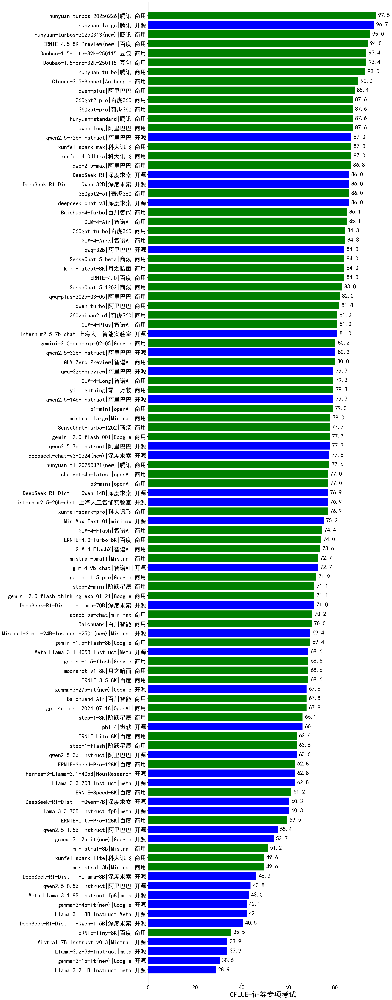

| 类别 | 大模型                         | CFLUE-证券专项考试 | 排名 |
|-----|------------------------------|---------|----|
|商用|hunyuan-turbos-20250226|97.5|1|
|开源|hunyuan-large|96.7|2|
|商用|hunyuan-turbos-20250313|95.0|3|
|商用|ERNIE-4.5-8K-Preview|94.0|4|
|商用|Doubao-1.5-pro-32k-250115|93.4|5|
|商用|Doubao-1.5-lite-32k-250115|93.4|6|
|商用|hunyuan-turbo|93.0|7|
|商用|Claude-3.5-Sonnet|90.0|8|
|商用|qwen-plus|88.4|9|
|商用|hunyuan-standard|87.6|10|
|商用|360gpt-pro|87.6|11|
|商用|360gpt2-pro|87.6|12|
|商用|qwen-long|87.6|13|
|开源|qwen2.5-72b-instruct|87.0|14|
|商用|xunfei-spark-max|87.0|15|
|商用|xunfei-4.0Ultra|87.0|16|
|商用|qwen2.5-max|86.8|17|
|开源|deepseek-chat-v3|86.0|18|
|商用|360gpt2-o1|86.0|19|
|开源|DeepSeek-R1|86.0|20|
|开源|DeepSeek-R1-Distill-Qwen-32B|86.0|21|
|商用|Baichuan4-Turbo|85.1|22|
|商用|GLM-4-Air|85.1|23|
|商用|GLM-4-AirX|84.3|24|
|商用|360gpt-turbo|84.3|25|
|开源|qwq-32b|84.0|26|
|商用|SenseChat-5-beta|84.0|27|
|商用|kimi-latest-8k|84.0|28|
|商用|ERNIE-4.0|84.0|29|
|商用|SenseChat-5-1202|83.0|30|
|商用|qwq-plus-2025-03-05|82.0|31|
|商用|qwen-turbo|81.8|32|
|开源|internlm2_5-7b-chat|81.0|33|
|商用|360zhinao2-o1|81.0|34|
|商用|GLM-4-Plus|81.0|35|
|开源|qwen2.5-32b-instruct|80.2|36|
|商用|GLM-Zero-Preview|80.0|37|
|开源|qwq-32b-preview|79.3|38|
|开源|qwen2.5-14b-instruct|79.3|39|
|商用|yi-lightning|79.3|40|
|商用|GLM-4-Long|79.3|41|
|商用|mistral-large|78.0|42|
|开源|qwen2.5-7b-instruct|77.7|43|
|商用|gemini-2.0-flash-001|77.7|44|
|商用|SenseChat-Turbo-1202|77.7|45|
|商用|hunyuan-t1-20250321(new)|77.6|46|
|开源|deepseek-chat-v3-0324(new)|77.6|47|
|商用|chatgpt-4o-latest|77.0|48|
|商用|o3-mini|77.0|49|
|开源|internlm2_5-20b-chat|76.9|50|
|商用|xunfei-spark-pro|76.9|51|
|开源|DeepSeek-R1-Distill-Qwen-14B|76.9|52|
|开源|MiniMax-Text-01|75.2|53|
|商用|GLM-4-Flash|74.4|54|
|商用|ERNIE-4.0-Turbo-8K|74.0|55|
|商用|GLM-4-FlashX|73.6|56|
|商用|mistral-small|72.7|57|
|开源|glm-4-9b-chat|72.7|58|
|商用|gemini-1.5-pro|71.9|59|
|商用|gemini-2.0-flash-thinking-exp-01-21|71.1|60|
|商用|step-2-mini|71.1|61|
|开源|DeepSeek-R1-Distill-Llama-70B|71.0|62|
|商用|abab6.5s-chat|70.2|63|
|商用|Baichuan4|70.0|64|
|商用|gemini-1.5-flash-8b|69.4|65|
|开源|Mistral-Small-24B-Instruct-2501|69.4|66|
|商用|ERNIE-3.5-8K|68.6|67|
|商用|gemini-1.5-flash|68.6|68|
|商用|moonshot-v1-8k|68.6|69|
|开源|Meta-Llama-3.1-405B-Instruct|68.6|70|
|开源|gemma-3-27b-it|67.8|71|
|商用|gpt-4o-mini-2024-07-18|67.8|72|
|商用|Baichuan4-Air|67.8|73|
|商用|step-1-8k|66.1|74|
|开源|phi-4|66.1|75|
|商用|step-1-flash|63.6|76|
|开源|qwen2.5-3b-instruct|63.6|77|
|商用|ERNIE-Lite-8K|63.6|78|
|开源|Hermes-3-Llama-3.1-405B|62.8|79|
|开源|Llama-3.3-70B-Instruct|62.8|80|
|商用|ERNIE-Speed-Pro-128K|62.8|81|
|商用|ERNIE-Speed-8K|61.2|82|
|开源|Llama-3.3-70B-Instruct-fp8|60.3|83|
|开源|DeepSeek-R1-Distill-Qwen-7B|60.3|84|
|商用|ERNIE-Lite-Pro-128K|59.5|85|
|开源|qwen2.5-1.5b-instruct|55.4|86|
|开源|gemma-3-12b-it|53.7|87|
|商用|ministral-8b|51.2|88|
|商用|ministral-3b|49.6|89|
|商用|xunfei-spark-lite|49.6|90|
|开源|DeepSeek-R1-Distill-Llama-8B|46.3|91|
|开源|qwen2.5-0.5b-instruct|43.8|92|
|开源|Meta-Llama-3.1-8B-Instruct-fp8|43.0|93|
|开源|Llama-3.1-8B-Instruct|42.1|94|
|开源|gemma-3-4b-it|42.1|95|
|开源|DeepSeek-R1-Distill-Qwen-1.5B|40.5|96|
|商用|ERNIE-Tiny-8K|35.5|97|
|开源|Llama-3.2-3B-Instruct|33.9|98|
|开源|Mistral-7B-Instruct-v0.3|33.9|99|
|开源|gemma-3-1b-it|30.6|100|
|开源|Llama-3.2-1B-Instruct|28.9|101|
|开源|Llama-4-Scout-17B-16E-Instruct(new)|/|102|
|开源|Llama-4-Maverick-17B-128E-Instruct-FP8(new)|/|103|
|商用|ERNIE-X1-32K-Preview(new)|/|104|
|开源|Mistral-Small-3.1-24B-Instruct-2503(new)|nan|105|
|商用|gemini-2.5-pro-preview-03-25(new)|nan|106|

