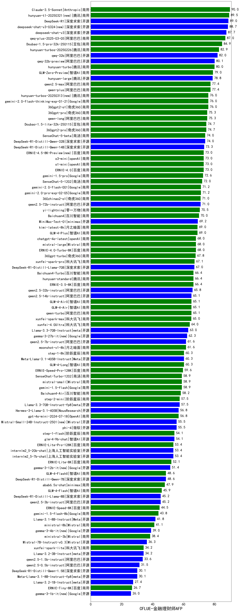

| 类别 | 大模型                         | CFLUE-金融理财师AFP | 排名 |
|-----|------------------------------|---------|----|
|商用|Claude-3.5-Sonnet|90.0|1|
|商用|hunyuan-t1-20250321(new)|89.5|2|
|开源|DeepSeek-R1|89.0|3|
|开源|deepseek-chat-v3-0324(new)|88.7|4|
|开源|deepseek-chat-v3|87.7|5|
|商用|qwq-plus-2025-03-05|87.0|6|
|商用|Doubao-1.5-pro-32k-250115|84.9|7|
|商用|hunyuan-turbos-20250226|82.9|8|
|开源|qwq-32b|82.0|9|
|开源|qwq-32b-preview|80.1|10|
|商用|hunyuan-turbo|80.0|11|
|商用|GLM-Zero-Preview|79.0|12|
|开源|hunyuan-large|78.8|13|
|商用|qwen-plus|77.4|14|
|商用|qwen2.5-max|77.4|15|
|商用|gemini-2.0-flash-thinking-exp-01-21|76.0|16|
|商用|hunyuan-turbos-20250313|76.0|17|
|商用|360gpt2-o1|76.0|18|
|商用|qwen-long|75.3|19|
|商用|360gpt-pro|75.3|20|
|商用|360gpt2-pro|74.7|21|
|商用|Doubao-1.5-lite-32k-250115|74.7|22|
|开源|DeepSeek-R1-Distill-Qwen-32B|74.0|23|
|商用|SenseChat-5-beta|74.0|24|
|开源|DeepSeek-R1-Distill-Qwen-14B|73.3|25|
|商用|ERNIE-4.5-8K-Preview|73.0|26|
|商用|o3-mini|73.0|27|
|商用|ERNIE-4.0|73.0|28|
|商用|gemini-1.5-pro|72.6|29|
|商用|SenseChat-5-1202|72.0|30|
|商用|gemini-2.0-flash-001|71.2|31|
|开源|qwen2.5-72b-instruct|71.0|32|
|商用|360zhinao2-o1|71.0|33|
|商用|yi-lightning|70.5|34|
|商用|Baichuan4|70.0|35|
|开源|MiniMax-Text-01|69.2|36|
|商用|GLM-4-Plus|69.0|37|
|商用|kimi-latest-8k|69.0|38|
|商用|mistral-large|68.0|39|
|商用|ERNIE-4.0-Turbo-8K|68.0|40|
|商用|chatgpt-4o-latest|68.0|41|
|商用|360gpt-turbo|67.8|42|
|商用|xunfei-spark-pro|67.1|43|
|开源|DeepSeek-R1-Distill-Llama-70B|67.0|44|
|商用|ERNIE-3.5-8K|66.4|45|
|商用|Baichuan4-Turbo|66.4|46|
|商用|hunyuan-standard|66.4|47|
|开源|qwen2.5-32b-instruct|65.8|48|
|商用|qwen-turbo|65.1|49|
|商用|GLM-4-AirX|65.1|50|
|商用|GLM-4-Air|65.1|51|
|开源|qwen2.5-14b-instruct|65.1|52|
|商用|xunfei-spark-max|65.0|53|
|商用|xunfei-4.0Ultra|64.0|54|
|开源|Llama-3.3-70B-Instruct|63.0|55|
|开源|gemma-3-27b-it|62.3|56|
|商用|moonshot-v1-8k|61.6|57|
|开源|qwen2.5-7b-instruct|61.6|58|
|商用|step-1-8k|60.3|59|
|开源|Meta-Llama-3.1-405B-Instruct|60.3|60|
|商用|GLM-4-Long|60.3|61|
|商用|ERNIE-Speed-Pro-128K|59.6|62|
|商用|mistral-small|58.9|63|
|商用|SenseChat-Turbo-1202|58.9|64|
|商用|gemini-1.5-flash|58.9|65|
|商用|Baichuan4-Air|58.2|66|
|开源|Llama-3.3-70B-Instruct-fp8|57.5|67|
|商用|step-2-mini|57.5|68|
|商用|gpt-4o-mini-2024-07-18|56.8|69|
|开源|Hermes-3-Llama-3.1-405B|56.8|70|
|开源|phi-4|55.5|71|
|开源|Mistral-Small-24B-Instruct-2501|55.5|72|
|商用|step-1-flash|54.1|73|
|开源|glm-4-9b-chat|54.1|74|
|开源|internlm2_5-7b-chat|53.4|75|
|商用|ERNIE-Lite-Pro-128K|53.4|76|
|开源|internlm2_5-20b-chat|53.4|77|
|商用|ERNIE-Lite-8K|52.1|78|
|开源|gemma-3-12b-it|51.4|79|
|开源|DeepSeek-R1-Distill-Qwen-7B|48.6|80|
|商用|GLM-4-FlashX|48.6|81|
|商用|abab6.5s-chat|47.9|82|
|商用|GLM-4-Flash|45.9|83|
|开源|DeepSeek-R1-Distill-Llama-8B|45.2|84|
|开源|qwen2.5-3b-instruct|45.2|85|
|商用|ERNIE-Speed-8K|44.5|86|
|商用|gemini-1.5-flash-8b|43.8|87|
|开源|Llama-3.1-8B-Instruct|41.8|88|
|商用|ministral-8b|41.1|89|
|开源|gemma-3-4b-it|39.0|90|
|商用|ministral-3b|38.4|91|
|开源|Mistral-7B-Instruct-v0.3|36.3|92|
|商用|xunfei-spark-lite|34.2|93|
|开源|Llama-3.2-3B-Instruct|34.2|94|
|开源|qwen2.5-1.5b-instruct|33.6|95|
|开源|qwen2.5-0.5b-instruct|31.5|96|
|开源|Meta-Llama-3.1-8B-Instruct-fp8|30.1|97|
|开源|DeepSeek-R1-Distill-Qwen-1.5B|30.1|98|
|开源|Llama-3.2-1B-Instruct|27.4|99|
|商用|ERNIE-Tiny-8K|26.7|100|
|开源|gemma-3-1b-it|26.0|101|
|开源|Llama-4-Scout-17B-16E-Instruct(new)|/|102|
|开源|Llama-4-Maverick-17B-128E-Instruct-FP8(new)|/|103|
|商用|ERNIE-X1-32K-Preview(new)|/|104|
|开源|Mistral-Small-3.1-24B-Instruct-2503(new)|nan|105|
|商用|gemini-2.5-pro-preview-03-25(new)|nan|106|

