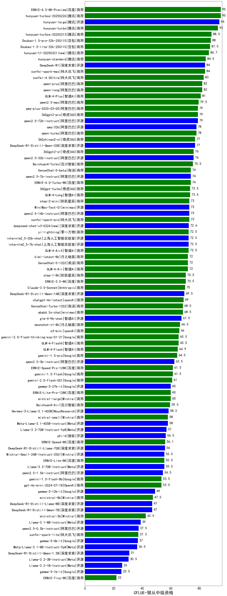

| 类别 | 大模型                         | CFLUE-银从中级资格 | 排名 |
|-----|------------------------------|---------|----|
|商用|ERNIE-4.5-8K-Preview(new)|95.0|1|
|商用|hunyuan-turbos-20250226|95.0|2|
|开源|hunyuan-large|94.0|3|
|商用|hunyuan-turbo|93.0|4|
|商用|hunyuan-turbos-20250313(new)|88.5|5|
|商用|Doubao-1.5-pro-32k-250115|88.0|6|
|商用|Doubao-1.5-lite-32k-250115|87.5|7|
|商用|hunyuan-t1-20250321(new)|86.7|8|
|商用|hunyuan-standard|84.5|9|
|商用|xunfei-spark-max|84.0|10|
|开源|DeepSeek-R1|84.0|11|
|商用|xunfei-4.0Ultra|83.0|12|
|商用|qwen-long|82.0|13|
|商用|qwen-plus|82.0|14|
|商用|GLM-4-Plus|81.0|15|
|商用|qwen2.5-max|79.5|16|
|商用|360gpt2-pro|79.0|17|
|商用|qwq-plus-2025-03-05|79.0|18|
|开源|deepseek-chat-v3|79.0|19|
|商用|360gpt-pro|79.0|20|
|开源|qwen2.5-72b-instruct|79.0|21|
|商用|qwen-turbo|78.0|22|
|开源|qwq-32b|78.0|23|
|商用|360zhinao2-o1|77.0|24|
|开源|DeepSeek-R1-Distill-Qwen-32B|77.0|25|
|开源|qwq-32b-preview|76.5|26|
|开源|qwen2.5-32b-instruct|76.0|27|
|商用|360gpt2-o1|76.0|28|
|商用|Baichuan4-Turbo|75.5|29|
|商用|GLM-Zero-Preview|75.0|30|
|商用|ERNIE-4.0|75.0|31|
|开源|qwen2.5-7b-instruct|74.0|32|
|商用|ERNIE-4.0-Turbo-8K|74.0|33|
|商用|SenseChat-5-beta|74.0|34|
|商用|360gpt-turbo|73.5|35|
|商用|GLM-4-Long|73.5|36|
|商用|xunfei-spark-pro|73.0|37|
|开源|qwen2.5-14b-instruct|73.0|38|
|开源|MiniMax-Text-01|73.0|39|
|商用|step-2-mini|73.0|40|
|商用|gemini-2.0-pro-exp-02-05|73.0|41|
|开源|deepseek-chat-v3-0324(new)|72.6|42|
|开源|internlm2_5-20b-chat|72.5|43|
|商用|GLM-4-AirX|72.5|44|
|开源|internlm2_5-7b-chat|72.5|45|
|商用|yi-lightning|72.5|46|
|商用|SenseChat-5-1202|72.0|47|
|商用|GLM-4-Air|72.0|48|
|商用|kimi-latest-8k|72.0|49|
|商用|ERNIE-3.5-8K|70.5|50|
|商用|step-1-8k|70.5|51|
|商用|Claude-3.5-Sonnet|70.0|52|
|开源|DeepSeek-R1-Distill-Qwen-14B|69.5|53|
|商用|chatgpt-4o-latest|69.0|54|
|商用|abab6.5s-chat|68.5|55|
|商用|SenseChat-Turbo-1202|68.5|56|
|开源|glm-4-9b-chat|67.5|57|
|商用|moonshot-v1-8k|66.5|58|
|商用|o3-mini|66.0|59|
|商用|gemini-2.0-flash-thinking-exp-01-21|65.5|60|
|商用|GLM-4-FlashX|65.5|61|
|商用|GLM-4-Flash|64.9|62|
|商用|gemini-1.5-pro|64.5|63|
|开源|qwen2.5-3b-instruct|62.5|64|
|商用|gemini-1.5-flash|61.5|65|
|商用|ERNIE-Speed-Pro-128K|61.5|66|
|商用|gemini-2.0-flash-001|61.0|67|
|商用|o1-mini|61.0|68|
|商用|step-1-flash|61.0|69|
|商用|mistral-large|60.0|70|
|商用|ERNIE-Lite-Pro-128K|60.0|71|
|开源|gemma-3-27b-it(new)|60.0|72|
|商用|Baichuan4|60.0|73|
|商用|Baichuan4-Air|59.5|74|
|开源|Hermes-3-Llama-3.1-405B|58.5|75|
|开源|Meta-Llama-3.1-405B-Instruct|58.0|76|
|商用|mistral-small|58.0|77|
|开源|Llama-3.3-70B-Instruct-fp8|57.0|78|
|开源|phi-4|56.5|79|
|商用|ERNIE-Speed-8K|56.1|80|
|开源|DeepSeek-R1-Distill-Llama-70B|56.0|81|
|开源|Llama-3.3-70B-Instruct|55.5|82|
|开源|Mistral-Small-24B-Instruct-2501(new)|55.5|83|
|商用|ERNIE-Lite-8K|55.5|84|
|开源|qwen2.5-1.5b-instruct|54.5|85|
|商用|gpt-4o-mini-2024-07-18|53.5|86|
|商用|gemini-1.5-flash-8b|53.5|87|
|开源|gemma-3-12b-it(new)|49.0|88|
|商用|ministral-8b|47.5|89|
|开源|DeepSeek-R1-Distill-Qwen-7B|47.0|90|
|开源|DeepSeek-R1-Distill-Llama-8B|47.0|91|
|商用|ministral-3b|42.5|92|
|开源|Llama-3.1-8B-Instruct|39.0|93|
|开源|qwen2.5-0.5b-instruct|37.5|94|
|商用|xunfei-spark-lite|37.3|95|
|开源|gemma-3-4b-it(new)|37.0|96|
|开源|Meta-Llama-3.1-8B-Instruct-fp8|36.5|97|
|开源|Mistral-7B-Instruct-v0.3|36.0|98|
|开源|DeepSeek-R1-Distill-Qwen-1.5B|31.0|99|
|开源|Llama-3.2-3B-Instruct|30.5|100|
|开源|Llama-3.2-1B-Instruct|26.0|101|
|开源|gemma-3-1b-it(new)|25.5|102|
|商用|ERNIE-Tiny-8K|22.0|103|
|开源|Llama-4-Scout-17B-16E-Instruct(new)|/|104|
|开源|Llama-4-Maverick-17B-128E-Instruct-FP8(new)|/|105|
|商用|ERNIE-X1-32K-Preview(new)|/|106|

