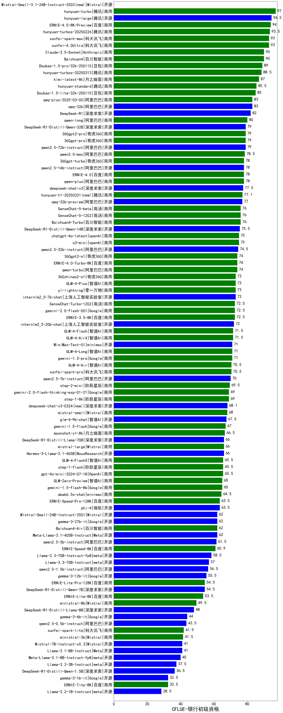

| 类别 | 大模型                         | CFLUE-银行初级资格 | 排名 |
|-----|------------------------------|---------|----|
|商用|hunyuan-turbo|97.0|1|
|开源|hunyuan-large|94.5|2|
|商用|ERNIE-4.5-8K-Preview(new)|94.0|3|
|商用|hunyuan-turbos-20250226|93.5|4|
|商用|xunfei-spark-max|93.0|5|
|商用|xunfei-4.0Ultra|93.0|6|
|商用|Baichuan4|90.0|7|
|商用|Claude-3.5-Sonnet|90.0|8|
|商用|Doubao-1.5-pro-32k-250115|89.0|9|
|商用|hunyuan-turbos-20250313(new)|88.5|10|
|商用|kimi-latest-8k|87.0|11|
|商用|hunyuan-standard|85.5|12|
|商用|Doubao-1.5-lite-32k-250115|85.0|13|
|开源|qwq-32b|83.0|14|
|商用|qwq-plus-2025-03-05|83.0|15|
|开源|DeepSeek-R1|82.0|16|
|商用|qwen-long|80.0|17|
|开源|qwen2.5-72b-instruct|79.0|18|
|商用|360gpt2-pro|79.0|19|
|商用|360gpt-pro|79.0|20|
|开源|DeepSeek-R1-Distill-Qwen-32B|79.0|21|
|商用|qwen2.5-max|78.5|22|
|商用|qwen-plus|78.0|23|
|商用|ERNIE-4.0|78.0|24|
|商用|360gpt-turbo|78.0|25|
|开源|qwen2.5-14b-instruct|78.0|26|
|开源|deepseek-chat-v3|77.5|27|
|商用|hunyuan-t1-20250321(new)|77.1|28|
|开源|qwq-32b-preview|77.0|29|
|商用|SenseChat-5-beta|76.0|30|
|商用|SenseChat-5-1202|76.0|31|
|商用|Baichuan4-Turbo|76.0|32|
|开源|DeepSeek-R1-Distill-Qwen-14B|75.5|33|
|商用|chatgpt-4o-latest|75.0|34|
|商用|o3-mini|75.0|35|
|开源|qwen2.5-32b-instruct|74.5|36|
|商用|360gpt2-o1|74.0|37|
|商用|ERNIE-4.0-Turbo-8K|74.0|38|
|商用|qwen-turbo|74.0|39|
|商用|gemini-2.0-pro-exp-02-05|73.0|40|
|商用|GLM-4-Plus|73.0|41|
|开源|internlm2_5-7b-chat|73.0|42|
|商用|360zhinao2-o1|73.0|43|
|商用|yi-lightning|73.0|44|
|商用|gemini-2.0-flash-001|72.5|45|
|商用|SenseChat-Turbo-1202|72.5|46|
|商用|ERNIE-3.5-8K|72.5|47|
|开源|internlm2_5-20b-chat|72.0|48|
|商用|GLM-4-Flash|71.5|49|
|商用|GLM-4-AirX|71.5|50|
|开源|MiniMax-Text-01|71.0|51|
|商用|gemini-1.5-pro|71.0|52|
|商用|GLM-4-Long|71.0|53|
|商用|xunfei-spark-pro|70.5|54|
|商用|GLM-4-Air|70.5|55|
|开源|qwen2.5-7b-instruct|70.0|56|
|商用|step-2-mini|69.5|57|
|商用|step-1-8k|69.0|58|
|商用|gemini-2.0-flash-thinking-exp-01-21|69.0|59|
|开源|deepseek-chat-v3-0324(new)|68.1|60|
|商用|mistral-small|68.0|61|
|开源|glm-4-9b-chat|67.5|62|
|商用|o1-mini|67.0|63|
|商用|gemini-1.5-flash|67.0|64|
|商用|moonshot-v1-8k|66.5|65|
|开源|Hermes-3-Llama-3.1-405B|66.0|66|
|商用|mistral-large|66.0|67|
|开源|DeepSeek-R1-Distill-Llama-70B|66.0|68|
|商用|GLM-4-FlashX|65.5|69|
|商用|step-1-flash|65.5|70|
|商用|gpt-4o-mini-2024-07-18|65.5|71|
|商用|gemini-1.5-flash-8b|65.0|72|
|商用|GLM-Zero-Preview|65.0|73|
|商用|abab6.5s-chat|64.5|74|
|开源|phi-4|63.5|75|
|商用|ERNIE-Speed-Pro-128K|63.5|76|
|开源|Meta-Llama-3.1-405B-Instruct|62.0|77|
|开源|gemma-3-27b-it(new)|62.0|78|
|商用|Baichuan4-Air|62.0|79|
|开源|Mistral-Small-24B-Instruct-2501(new)|62.0|80|
|开源|qwen2.5-3b-instruct|61.5|81|
|商用|ERNIE-Speed-8K|60.9|82|
|开源|Llama-3.3-70B-Instruct-fp8|58.5|83|
|开源|Llama-3.3-70B-Instruct|57.0|84|
|开源|qwen2.5-1.5b-instruct|56.5|85|
|开源|gemma-3-12b-it(new)|55.5|86|
|开源|DeepSeek-R1-Distill-Qwen-7B|54.5|87|
|商用|ERNIE-Lite-Pro-128K|54.5|88|
|商用|ERNIE-Lite-8K|53.5|89|
|商用|ministral-8b|49.5|90|
|开源|DeepSeek-R1-Distill-Llama-8B|48.0|91|
|开源|gemma-3-4b-it(new)|44.0|92|
|开源|qwen2.5-0.5b-instruct|43.5|93|
|商用|xunfei-spark-lite|41.9|94|
|商用|ministral-3b|41.5|95|
|开源|Llama-3.1-8B-Instruct|41.0|96|
|开源|Mistral-7B-Instruct-v0.3|41.0|97|
|开源|Meta-Llama-3.1-8B-Instruct-fp8|40.0|98|
|开源|Llama-3.2-3B-Instruct|37.5|99|
|开源|DeepSeek-R1-Distill-Qwen-1.5B|36.5|100|
|商用|ERNIE-Tiny-8K|32.5|101|
|开源|gemma-3-1b-it(new)|32.5|102|
|开源|Llama-3.2-1B-Instruct|28.5|103|

