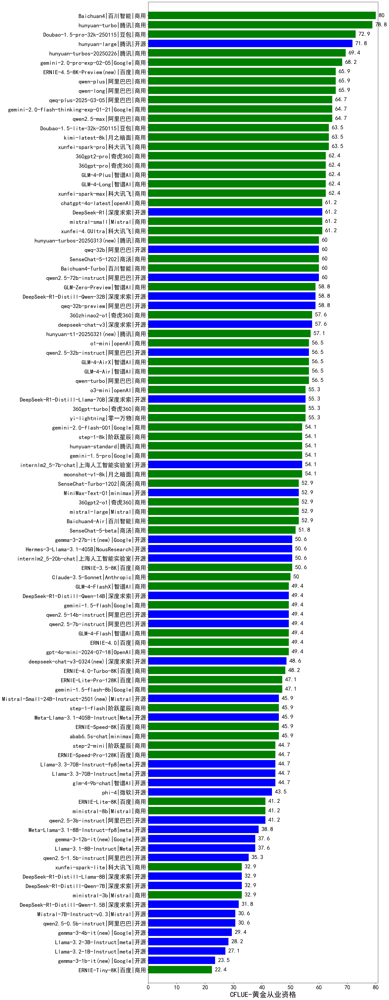

| 类别 | 大模型                         | CFLUE-黄金从业资格 | 排名 |
|-----|------------------------------|---------|----|
|商用|Baichuan4|80.0|1|
|商用|hunyuan-turbo|78.8|2|
|商用|Doubao-1.5-pro-32k-250115|72.9|3|
|开源|hunyuan-large|71.8|4|
|商用|hunyuan-turbos-20250226|69.4|5|
|商用|ERNIE-4.5-8K-Preview|65.9|6|
|商用|qwen-plus|65.9|7|
|商用|qwen-long|65.9|8|
|商用|qwen2.5-max|64.7|9|
|商用|qwq-plus-2025-03-05|64.7|10|
|商用|gemini-2.0-flash-thinking-exp-01-21|64.7|11|
|商用|Doubao-1.5-lite-32k-250115|63.5|12|
|商用|kimi-latest-8k|63.5|13|
|商用|xunfei-spark-pro|63.5|14|
|商用|360gpt2-pro|62.4|15|
|商用|360gpt-pro|62.4|16|
|商用|GLM-4-Long|62.4|17|
|商用|GLM-4-Plus|62.4|18|
|商用|xunfei-spark-max|62.4|19|
|商用|xunfei-4.0Ultra|61.2|20|
|商用|mistral-small|61.2|21|
|开源|DeepSeek-R1|61.2|22|
|商用|chatgpt-4o-latest|61.2|23|
|开源|qwen2.5-72b-instruct|60.0|24|
|开源|qwq-32b|60.0|25|
|商用|hunyuan-turbos-20250313|60.0|26|
|商用|Baichuan4-Turbo|60.0|27|
|商用|SenseChat-5-1202|60.0|28|
|开源|DeepSeek-R1-Distill-Qwen-32B|58.8|29|
|商用|GLM-Zero-Preview|58.8|30|
|开源|qwq-32b-preview|58.8|31|
|开源|deepseek-chat-v3|57.6|32|
|商用|360zhinao2-o1|57.6|33|
|商用|hunyuan-t1-20250321(new)|57.1|34|
|开源|qwen2.5-32b-instruct|56.5|35|
|商用|qwen-turbo|56.5|36|
|商用|GLM-4-AirX|56.5|37|
|商用|GLM-4-Air|56.5|38|
|开源|DeepSeek-R1-Distill-Llama-70B|55.3|39|
|商用|yi-lightning|55.3|40|
|商用|o3-mini|55.3|41|
|商用|360gpt-turbo|55.3|42|
|商用|step-1-8k|54.1|43|
|商用|gemini-2.0-flash-001|54.1|44|
|商用|moonshot-v1-8k|54.1|45|
|开源|internlm2_5-7b-chat|54.1|46|
|商用|hunyuan-standard|54.1|47|
|商用|gemini-1.5-pro|54.1|48|
|商用|mistral-large|52.9|49|
|商用|Baichuan4-Air|52.9|50|
|开源|MiniMax-Text-01|52.9|51|
|商用|SenseChat-Turbo-1202|52.9|52|
|商用|360gpt2-o1|52.9|53|
|商用|SenseChat-5-beta|51.8|54|
|开源|Hermes-3-Llama-3.1-405B|50.6|55|
|开源|gemma-3-27b-it|50.6|56|
|商用|ERNIE-3.5-8K|50.6|57|
|开源|internlm2_5-20b-chat|50.6|58|
|商用|Claude-3.5-Sonnet|50.0|59|
|商用|GLM-4-FlashX|49.4|60|
|开源|qwen2.5-14b-instruct|49.4|61|
|商用|gpt-4o-mini-2024-07-18|49.4|62|
|商用|gemini-1.5-flash|49.4|63|
|开源|DeepSeek-R1-Distill-Qwen-14B|49.4|64|
|商用|GLM-4-Flash|49.4|65|
|开源|qwen2.5-7b-instruct|49.4|66|
|商用|ERNIE-4.0|49.4|67|
|开源|deepseek-chat-v3-0324(new)|48.6|68|
|商用|ERNIE-4.0-Turbo-8K|48.2|69|
|商用|gemini-1.5-flash-8b|47.1|70|
|商用|ERNIE-Lite-Pro-128K|47.1|71|
|商用|ERNIE-Speed-8K|45.9|72|
|商用|step-1-flash|45.9|73|
|开源|Meta-Llama-3.1-405B-Instruct|45.9|74|
|商用|abab6.5s-chat|45.9|75|
|开源|Mistral-Small-24B-Instruct-2501|45.9|76|
|开源|glm-4-9b-chat|44.7|77|
|商用|step-2-mini|44.7|78|
|开源|Llama-3.3-70B-Instruct-fp8|44.7|79|
|开源|Llama-3.3-70B-Instruct|44.7|80|
|商用|ERNIE-Speed-Pro-128K|44.7|81|
|开源|phi-4|43.5|82|
|商用|ministral-8b|41.2|83|
|开源|qwen2.5-3b-instruct|41.2|84|
|商用|ERNIE-Lite-8K|41.2|85|
|开源|Meta-Llama-3.1-8B-Instruct-fp8|38.8|86|
|开源|Llama-3.1-8B-Instruct|37.6|87|
|开源|gemma-3-12b-it|37.6|88|
|开源|qwen2.5-1.5b-instruct|35.3|89|
|商用|ministral-3b|32.9|90|
|开源|DeepSeek-R1-Distill-Qwen-7B|32.9|91|
|商用|xunfei-spark-lite|32.9|92|
|开源|DeepSeek-R1-Distill-Llama-8B|32.9|93|
|开源|DeepSeek-R1-Distill-Qwen-1.5B|31.8|94|
|开源|qwen2.5-0.5b-instruct|30.6|95|
|开源|Mistral-7B-Instruct-v0.3|30.6|96|
|开源|gemma-3-4b-it|29.4|97|
|开源|Llama-3.2-3B-Instruct|28.2|98|
|开源|Llama-3.2-1B-Instruct|27.1|99|
|开源|gemma-3-1b-it|23.5|100|
|商用|ERNIE-Tiny-8K|22.4|101|
|开源|Llama-4-Scout-17B-16E-Instruct(new)|/|102|
|开源|Llama-4-Maverick-17B-128E-Instruct-FP8(new)|/|103|
|商用|ERNIE-X1-32K-Preview(new)|/|104|
|开源|Mistral-Small-3.1-24B-Instruct-2503(new)|nan|105|
|商用|gemini-2.5-pro-preview-03-25(new)|nan|106|

