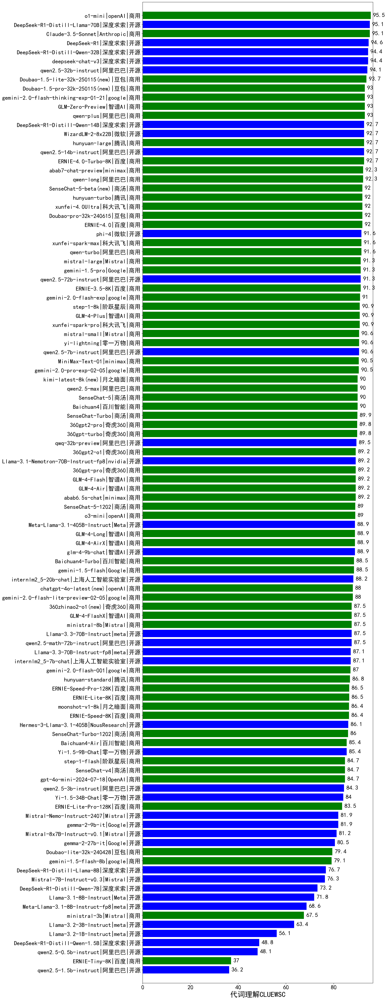

| 类别 | 大模型                         | 代词理解CLUEWSC | 排名 |
|-----|------------------------------|---------|----|
|商用|Claude-3.5-Sonnet|95.1|1|
|开源|deepseek-chat-v3|94.4|2|
|开源|qwen2.5-32b-instruct|94.1|3|
|商用|qwen-max|93.0|4|
|商用|qwen-plus|93.0|5|
|商用|GLM4|93.0|6|
|开源|WizardLM-2-8x22B(new)|92.7|7|
|开源|qwen2.5-14b-instruct|92.7|8|
|商用|hunyuan-large|92.7|9|
|商用|ERNIE-4.0-Turbo-8K|92.7|10|
|商用|abab7-chat-preview|92.3|11|
|商用|qwen-long|92.3|12|
|商用|hunyuan-turbo|92.0|13|
|商用|ERNIE-4.0|92.0|14|
|商用|xunfei-4.0Ultra|92.0|15|
|商用|Doubao-pro-32k|92.0|16|
|商用|qwen-turbo|91.6|17|
|开源|phi-4|91.6|18|
|商用|xunfei-spark-max|91.6|19|
|商用|gemini-1.5-pro|91.3|20|
|商用|ERNIE-3.5-8K|91.3|21|
|商用|mistral-large(new)|91.3|22|
|开源|qwen2.5-72b-instruct|91.3|23|
|商用|gemini-2.0-flash-exp|91.0|24|
|商用|xunfei-spark-pro|90.9|25|
|商用|step-1-8k|90.9|26|
|商用|GLM-4-Plus|90.9|27|
|开源|qwen2.5-7b-instruct|90.6|28|
|商用|mistral-small(new)|90.6|29|
|商用|yi-lightning|90.6|30|
|商用|SenseChat-5|90.0|31|
|商用|Baichuan4|90.0|32|
|商用|SenseChat-Turbo|89.9|33|
|商用|360gpt2-pro|89.8|34|
|商用|360gpt-turbo|89.8|35|
|商用|abab6.5s-chat|89.2|36|
|开源|Llama-3.1-Nemotron-70B-Instruct-fp8(new)|89.2|37|
|商用|360gpt2-o1(new)|89.2|38|
|商用|360gpt-pro|89.2|39|
|商用|GLM-4-Flash|89.2|40|
|商用|GLM-4-Air|89.2|41|
|商用|GLM-4-AirX|88.9|42|
|商用|GLM-4-Long|88.9|43|
|开源|Llama-3.1-70B-Instruct|88.9|44|
|开源|glm-4-9b-chat|88.9|45|
|开源|Meta-Llama-3.1-405B-Instruct|88.9|46|
|开源|Meta-Llama-3.1-70B-Instruct-fp8|88.9|47|
|商用|Baichuan4-Turbo|88.5|48|
|商用|gemini-1.5-flash|88.5|49|
|开源|internlm2_5-20b-chat|88.2|50|
|商用|ministral-8b|87.5|51|
|开源|Llama-3.3-70B-Instruct|87.5|52|
|商用|gpt-4o|87.1|53|
|开源|internlm2_5-7b-chat|87.1|54|
|开源|Llama-3.3-70B-Instruct-fp8|87.1|55|
|商用|hunyuan-standard|86.8|56|
|商用|moonshot-v1-8k|86.4|57|
|商用|ERNIE-Speed-8K|86.4|58|
|开源|Hermes-3-Llama-3.1-405B(new)|86.1|59|
|开源|Yi-1.5-9B-Chat|85.4|60|
|商用|Baichuan4-Air|85.4|61|
|商用|step-1-flash|84.7|62|
|商用|gpt-4o-mini|84.7|63|
|商用|SenseChat-v4|84.7|64|
|开源|qwen2.5-3b-instruct|84.3|65|
|开源|Yi-1.5-34B-Chat|84.0|66|
|开源|gemma-2-9b-it|81.9|67|
|开源|Mistral-Nemo-Instruct-2407|81.9|68|
|开源|Mixtral-8x7B-Instruct-v0.1|81.2|69|
|开源|gemma-2-27b-it|80.5|70|
|商用|Doubao-lite-32k|79.4|71|
|商用|gemini-1.5-flash-8b|79.1|72|
|开源|Mistral-7B-Instruct-v0.3|76.3|73|
|开源|Llama-3.1-8B-Instruct|71.8|74|
|开源|Meta-Llama-3.1-8B-Instruct-fp8|68.6|75|
|商用|gemini-1.0-pro|67.6|76|
|商用|ministral-3b|67.5|77|
|开源|Llama-3.2-3B-Instruct|63.4|78|
|开源|Llama-3.2-1B-Instruct|56.1|79|
|开源|qwen2.5-0.5b-instruct|48.1|80|
|开源|qwen2.5-1.5b-instruct|36.2|81|
|开源|qwen2.5-math-72b-instruct|/|82|
|开源|qwq-32b-preview|/|83|
|商用|o1-mini|/|84|
|商用|o1-preview|/|85|

